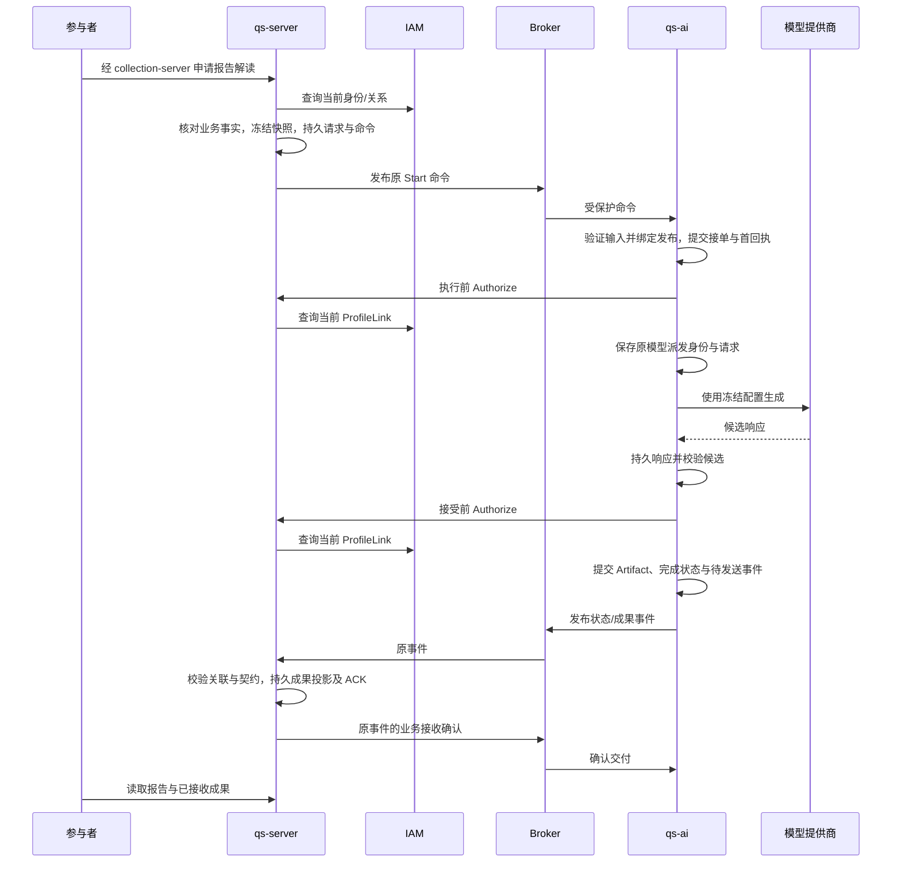

# 系统定位与跨服务边界

qs-ai 把一份已经由 qs-server 生成的标准报告，转换成受配置约束、可追溯的 AI 解读。它还提供方案编辑、评测、审核和发布能力，决定参与者解读采用哪一套经过验证的配置。

理解这个系统，先区分三个问题：**谁能看这份报告，由 QS 结合 IAM 的身份和关系判断；报告的分数、等级和类型是什么，由 QS 的测评与报告链确定；怎样用模型解释这些事实、采用什么配置、保存哪次模型结果，由 AI 负责。** 模型提供商返回候选内容，AI 验证并持久形成成果，QS 接收后供业务页面读取。

本文用一次参与者报告解读说明这些边界。源码核对基线为 qs-ai `bd5e18e`、qs-server `2ccc2de`、IAM `c8fc1fe`；这些基线用于定位实现，当前生产采用的发布配置和用户展示效果需要另外核验。

## qs-ai 现在提供哪些能力

参与者解读以**一份标准报告**为输入。底层 Session 对象可以记录多个 assessment，但当前实现的标准报告生成路径要求 EvidenceSet 中只有一份报告，不能据此推断已经支持跨报告综合分析。

| 场景 | QS 已经确定的事实 | AI 产生的内容与适用边界 |
| --- | --- | --- |
| 量表报告解读 | `scale / score_range` 报告中的分数、维度、等级、标准描述与建议 | 按已发布 Profile 选择可解释维度，生成解释与建议。模型不能重新计分、改变等级或创造输入不存在的维度。并非任意量表报告都能解读，还要通过配置选择和输入适用性检查。 |
| MBTI 单篇解读 | `MBTI_OEJTS@v64-report-202608-v1`、四轴结果与既定类型 | 使用 `mbti-single-assessment/v1` 场景解释 QS 已确定的类型。AI 不重新判断受测者属于哪一种类型。 |
| MBTI 三主题解读 | 基础版 `MBTI_OEJTS@v64-report-202608-v1` 或探索版 `MBTI_FC_93@v55-report-202608-v1` 的类型、轴信息和标准事实 | 使用 `mbti-single-assessment/v2` 按 `personality / career / relationships` 生成性格、职业和人际关系三主题内容；参考材料由冻结资产按类型选取，与模型生成内容分别绑定。 |

MBTI 单篇和三主题共用精确的报告 selector，具体走哪种场景由命中的发布配置决定，不能把它们理解成同一 selector 下两个互不影响的线上开关。版本矩阵与细节分别见 [MBTI 报告契约](../02-业务模块/interpretation/02-MBTI报告事实与版本契约.md) 和 [三主题契约](../02-业务模块/interpretation/03-MBTI三主题与参考材料契约.md)。

支撑这些解读的是治理能力：运营人员在 QS 的管理入口编辑 Solution，准备固定版本的 Profile、Prompt、Route、Schema 和 Suite，运行评测、检查候选并审核，再发布为可供新请求选取的 Publication。保存一个方案不会直接使它上线；一次模型调用成功也不会直接使一套配置获得发布资格。

当前对外装配没有用户登录、浏览器业务 API、通用聊天或长期记忆入口。领域中的问题、回答和 Session 状态是执行协议与模型的一部分，不能单凭这些对象宣称产品已经提供开放式会话。已支持场景的具体准入规则见 [业务模块](../02-业务模块/README.md)。

## 先看一个真实形态的请求

假设一位家长为受测者查看某份量表报告，并点击“生成 AI 解读”。下列标识采用仓库测试中的合成值，只用于说明关联，不是一份完整的可发送消息：

| 字段 | 示例 | 说明 |
| --- | --- | --- |
| `actor.org_id` | `1` | 请求所属组织。 |
| `actor.subject_id` | `parent` | 经 QS 确定的请求主体；不是受测者 ID，也不是模型提供商的账户。 |
| `testee_id` | `7` | 报告所属受测者；能否访问它取决于当前业务关系。 |
| `assessment_ids` | `["42"]` | 本次采用的测评。 |
| `evidence[0].report_id` | `99` | 采用的标准报告，须与快照内部的来源一致。 |
| `evidence[0].source_version` | `standard-v1:101` | 内容 Schema 版本与 Outcome ID 的组合，标识这份事实的来源。 |
| `request_id` | `11111111-1111-4111-8111-111111111111` | QS 原请求的稳定身份；AI 将它与自己的 Session 绑定。 |

`EvidenceItem` 同时带有 assessment、Testee、report 和 source version。其 `facts` 中的 `standard_report` 是序列化标准报告快照。AI 在准备输入时核对外层关联、快照内的 `source.report_id` 以及 `content_schema_version:outcome_id`，防止把其他报告的内容拼到这次请求中。

例如合成快照中 `primary_score.value=24`、`level.code=stable`、某维度 `raw_score=12`，它们已是 QS 产生的事实。AI 可以解释这些结果，也可以在允许范围内给出建议；它不能让模型把 24 改成另一分数、把既定等级改成新的风险级别。标准描述与 AI 推断的出处也必须分别保留。完整的合成输入可查 [报告快照 fixture](../../tests/fixtures/report_snapshot.json)。

### 四方各自拥有什么

| 主体 | 持有的事实或规则 | 在本例中具体做什么 |
| --- | --- | --- |
| IAM | 身份、凭证与权限基础，以及 Profile 与当前 ProfileLink 关系 | 为 QS 提供可信主体及权限能力；QS 查询当前主体与 Profile 是否仍有关联。IAM 不计算测评分数，也不选择 AI Prompt。 |
| qs-server | Testee、Assessment、Outcome、标准报告、业务请求和成果投影；结合 IAM 关系作最终业务授权 | 判断家长是否能看受测者 7 的测评 42，读取报告 99 并构造快照，保存 AI 请求，接收并校验 AI 状态与成果。 |
| qs-ai | 方案及版本资产、评测和发布证据、冻结输入、Session/Run、模型调用记录、Artifact 与交付状态 | 确定解读适用性和发布配置，执行模型调用，校验候选，保存可追溯成果，可靠投递给 QS。 |
| 模型提供商 | 此次调用的外部响应与提供商请求身份 | 根据 AI 组装的 Prompt 和输入返回候选内容。它不掌握用户授权决定，也不能决定 Session 完成或发布配置生效。 |

这里有两种不同的 Profile：IAM 的 Profile 参与身份与访问关系；**AI Profile 是解读策略的版本资产**，定义适用场景、维度选择、输入与输出规则。两者同名，但没有共享的生命周期或数据所有权。

AI 保存的是 QS 发来的报告事实副本，用于复现这次执行；标准报告的权威记录仍在 QS。QS 保存的是已经接收的 AI 成果投影；生成资产、原模型响应及发布资格仍由 AI 持有。双方都不会直接读取对方数据库来完成主链路。

## 权限委托与通信边界

### 参与者请求：QS 决定资源权限，AI 在执行时回查

参与者入口经过 collection-server 向 QS apiserver 发起可信委托。QS 校验委托主体，解析参与者身份，核对 Testee、Assessment、报告与当前访问关系，再为 AI 构造请求。调用 AI 的工作负载证书证明“这条服务调用来自 QS”，不等于“任意主体都能访问任意报告”。执行 MQ 另行验证受保护消息的签名、目标与正文，不使用这条 gRPC 证书冒充消息身份。

AI 接收受保护的 Start 消息时验证消息身份、正文与报告关联，选择发布配置，并形成持久受理决定；**这一步不会同步再调用一次 QS 授权接口**。进入后台生成后，`ExecuteNext` 才通过 `QSAccessSource.authorize` 两次调用 QS 的 `AIWorkflowAccessService.Authorize`：

1. 使用冻结证据并开始生成之前，检查当前访问权。
2. 模型流程返回、接受业务结果之前，再检查一次。

QS 的 `CurrentAccess` 先核对 Testee 7 属于组织 1，取得它绑定的 IAM `ProfileID`，再用请求主体与这个 Profile 查询当前有效的 ProfileLink，最后检查测评 42 确实属于受测者 7。家长与孩子的访问关系由这座 Testee → Profile → ProfileLink 的桥建立。因此完整复核方向是 **AI → QS → IAM**，AI 本身没有把 IAM 用户 Token 转交模型或直接查询 IAM 来决定报告权限。

报告事实冻结下来，访问关系仍会变化。这两次查询正是为了处理“接单时有权，生成期间关系被撤销”的情况。两次复核的精确错误语义在下文展开。

### 治理请求：QS 授权操作者，AI 验证委托来源与对象规则

运营人员编辑、评测或发布方案，走的是另一条链。QS 的受保护 REST 入口验证 IAM 身份、解析当前有效的 operator 机构关系并加载授权快照，然后按操作检查治理能力。QS 从这个上下文构造组织、操作者 scope；AI 治理 gRPC 要求 mTLS，且工作负载 Common Name 必须为 `qs-apiserver.svc`，再使用 QS 委托的 scope 检查本组织的方案、版本及状态。

例如运营人员对一个 Solution 执行 Prepare：QS 先检查该操作所需的机构管理能力，再用受保护上下文构造组织与操作者 scope，通过 mTLS 调用 AI 的 `SolutionManagement.Prepare`。AI 检查方案修订、命令身份和资产冻结规则。具体路由与权限资源由 QS 拥有，接入方式见 [治理接口与可信委托](../04-接口与运维/03-治理接口与可信委托.md)。

AI 不在每个治理 RPC 中向 IAM 重新查询操作者权限。操作者能否执行 QS 管理操作由 QS 入口授权；操作者能否把某个评测结果发布，是否满足版本、资产一致性和审核门槛，则由 AI 的规则决定。一个“管理员”身份不能绕过 AI 发布资格检查。

所以信任的是**经认证的 QS 委托**，并非浏览器自行填入的 `organization_id` 或 `operator_user_id`。若开放浏览器直连 AI，就必须另行设计认证、权限与可信 scope，当前接口不能直接当公共 API 使用。

### 通道要按实际操作区分

| 方向与通道 | 当前承载的操作 | 此通道的完成意味着什么 |
| --- | --- | --- |
| 产品/运营入口 → QS | 参与者经 collection-server 的业务委托，以及运营治理 REST 请求 | QS 完成对应鉴权及本地业务处理。 |
| QS → AI，内部 mTLS gRPC | 方案/资产/评测/发布管理、查询和预检 | 相应 RPC 的处理结果；不代表异步模型已完成。治理服务是否装配受 `grpc.governance_enabled` 控制。 |
| QS → AI，受保护 MQ 命令 | Start、Change、参与者 Retry、评测 Start/Cancel | AI 形成可重放的 `ACCEPTED / REJECTED / HELD` 接单决定。 |
| AI → QS，内部 mTLS gRPC | 执行授权复核；部分流程使用报告探针等查询 | 本次查询成立；不能永久冻结访问权。 |
| AI ↔ 模型提供商，模型协议 | 以固定 Route、Prompt、Schema 发起外部调用 | 得到候选响应或调用失败/未知证据。 |
| AI → QS，受保护 MQ 事件；QS → AI，业务 ACK | 命令回执、执行状态、Artifact 与原事件确认 | `STORED` 表示 QS 已持久处理对应事件，AI 才能确认该事件交付；`TECHNICALLY_HELD` 表示技术挂起，不能视为处理成功。 |
| 运维 → AI，HTTP | 健康检查与指标 | 组件与观测状态，不是报告业务入口。 |

旧执行 gRPC 的 `Commands.Start/Change`、`ParticipantManagement.Retry`、`EvaluationManagement.Start/Cancel` 在当前装配中被明确拒绝，返回 `FAILED_PRECONDITION`；看到 proto 中仍有方法，不等于仍可用于执行接单。治理 gRPC 与执行 MQ 的分工可继续查 [接口地图](../04-接口与运维/01-接口地图与契约所有权.md)。

## 这份请求怎样变成可读取的成果

图中每次箭头都是独立调用，跨服务没有一笔覆盖全流程的大事务。正常路径依次形成以下事实。

**QS 冻结请求。** QS 使用自己持有的标准报告投影输入，将请求主体、报告关联和原请求身份一起记录。页面重试或消息传输重投应关联原请求，不能悄悄换成另一份当前报告。

**AI 受理并绑定配置。** `CommandReceiver` 打开接单事务，预留 Inbox 身份，再让 `WorkflowCommandAdmission` 借用这笔事务调用 `InterpretationService.start_external`。AI 创建 Session、EvidenceSet、Run/Job，保存请求映射、配置绑定和回执；接单业务、Inbox 与首回执 Outbox 成功提交后，消费端才可以完成消息。这里不会调用模型。

“冻结配置”也有具体内容：AI 根据报告 selector 选择当时生效的 Publication，绑定 `publication_id`、发布摘要、`pointer_version`、`selector_query` 和 EvidenceSet 身份/摘要。执行时读取这个原发布并核对资产与评测证据，不是每次都重新查“当前默认配置”。

| 资产 | 对这次执行的作用 |
| --- | --- |
| AI Profile | 决定报告适用性、可用事实、输入构造和输出策略。 |
| Prompt | 把输入与约束组织成固定版本的模型消息。 |
| Route | 决定提供商、模型及具体调用配置。 |
| Schema | 约束输入与输出结构；合法结构仍需经过领域与安全校验。 |
| Suite 与评测/审核证据 | 说明这套资产按哪些输入和门槛接受过评测，并支撑发布资格。它们不是每次参与者请求都重新执行的评测任务。 |
| Publication | 把这些固定版本及资格证据绑定为可执行的发布身份。 |

因此运营人员在本次接单之后发布新 Prompt，新请求可能命中新发布；这次已接单任务仍使用原绑定。若原发布或资产损坏，AI 会阻断执行，而不是回退到一套未绑定的新配置。

**后台执行形成模型证据。** Worker 领取 Job 并持有租约，使用冻结 EvidenceSet，先回查当前授权。模型外发之前，AI 提交原 Invocation 和请求记录；返回后保存原响应。输入构造、模型响应身份、输出结构、事实引用和安全规则均通过，才生成 Artifact 候选。模型输出的 JSON 不会直接作为正式成果交给 QS。

**AI 接受并持久化成果。** Worker 再回查授权，`MySQLExecutionStore.finish` 核对当前租约、Session/Run、EvidenceSet、Invocation、内容摘要及冻结配置，并从原响应重建预期 Artifact 作比较。通过后，在同一结算事务内保存 Artifact、完成状态和待投递状态事件。Artifact 带有 report/source、Profile/Prompt/Route 等身份，能够回答“这篇内容从哪份事实、哪套配置、哪次响应而来”。

**QS 接收成果。** AI Relay 发布原事件；QS 不重新调用模型，但也不是原样保存任意 JSON。接收器核对原请求主体、受测者、Session、事件版本和报告来源，检查 Artifact 的运行标识格式、内容摘要及接收契约；MBTI 三主题还包含对应内容和参考材料检查。QS 不持有 AI 的 active Run，不能把运行标识格式校验理解成双方共享 Run 状态。QS 持久处理投影及业务 ACK 后，AI 收到并验证 `STORED` 才能按原事件确认交付。

参与者从 QS 读取的是业务投影。事件接收本身不会再调用一次 `CurrentAccess`；参与者查询入口仍要检查当前访问权。因此“QS 收到 completed 事件”与“当前用户可以查看这份成果”是两个不同条件。

### 分别在哪一侧提交

| 提交边界 | 需要一起成立的本地事实 | 未跨越的边界 |
| --- | --- | --- |
| QS 请求与命令 | QS 原业务请求及待发送命令记录 | QS 可以返回 `submitted`，尚未证明 AI 已接单。 |
| AI 命令受理 | Inbox 决定、AI 业务状态和首回执 Outbox | `ACCEPTED / REJECTED / HELD` 是受理结果，尚未证明成果完成。 |
| AI 执行结算 | 经校验的 Artifact/失败、Session/Run/Job 状态和原状态事件 | `completed` 尚未证明 QS 已接收。 |
| QS 事件接收 | 原事件的业务处理结果、成果/状态投影及业务 ACK Outbox | 后续发布 ACK 仍是独立动作；AI 要收到并核对 `STORED`，才能确认交付。 |

这个划分解释了为何“API 已返回”“Broker 已确认”“AI completed”“QS 已接收”不能合并成一个成功状态。更详细的版本、重放和事务流程由 [治理链与执行链](03-治理链与执行链.md) 与 [消息设计](../03-基础设施/messaging/README.md) 维护。

## 失败时，边界怎样起作用

### 接单时没有可用发布

报告已成立、用户也有访问权，但没有符合报告 selector 的生效 Publication。AI 将 Session 持久阻断，记录 `configuration_unavailable`，产生可重放的拒绝回执，不创建可执行 Job，也不调用模型。

后来运营发布了合适配置，重投**同一原命令**仍复用原拒绝，不能把它重新解释成一次新请求。这类拒绝没有已接受的配置绑定，也不能用 Participant Retry 在原 Session 下换绑新发布；需要以新 `request_id` 发起请求，重新经过 QS 授权、快照与 AI 接单。

只有已有接受配置、且状态等条件满足规则的 blocked 执行，才可受控 Retry；它创建新命令与 Run，保留原 Session、请求和配置绑定。原受理已创建 Run/拒绝记录，不应把“没有执行 Job”误读为“没有持久业务记录”。准入和 Retry 的具体语义见 [解读设计](../02-业务模块/interpretation/01-解读冻结输入与成果设计.md)。

### 接单之后，家长关系被撤销

冻结快照仍能复现报告，但不能证明家长现在仍有权。如果执行前复核失败，AI 不进入模型流程；如果模型返回后第二次复核失败，AI 不接受这次候选为正式成果。Worker 将业务结果记为 `access_revoked`。

如果授权服务不可用，结果是 `dependency_unavailable`，同样阻断接受。AI 不将这类故障包装成模型质量问题，也不因为快照曾经有权就继续交付。已经被 QS 接收的历史成果还受 QS 当前读取权限控制。

### 模型可能已收到请求，但 AI 没有持久响应

AI 先提交 `dispatched` 再进行外部 HTTP 调用。若外发后进程退出、响应丢失或响应提交失败，恢复任务可能只能看到派发记录，看不到原响应；它无法由此判断提供商究竟有没有执行。

这时系统按 `provider_result_unknown` 阻断，不自动再次外发。代价是“标记已提交、实际外发之前崩溃”也可能保守阻断，但这样不会因恢复机制重复生成、重复计费或混用两次响应。MQ 命令重投不会授权它重调模型；人工受控 Retry 是另一个明确承担未知结果风险的操作。详见 [执行恢复](../03-基础设施/execution-recovery/README.md)。

### 模型返回了内容，但不满足事实或输出契约

例如候选引用了输入不存在的维度、类型与冻结 MBTI 结果不符，或缺少必需结构。AI 的确定性/领域/安全校验拒绝候选，不能形成正常完成的 Artifact。即便 JSON 能解析，也不代表可以持久接受。

这些检查有明确覆盖范围：结构、引用、数量、维度关系，以及有限的 MBTI 类型标签冲突等。它们不能识别自然语言中的每一种事实误述；“不得改分数或等级”是契约要求，不能被解释为程序已证明全文不会出现错误。自然语言是否有帮助、推断是否恰当，还需要评测和审核来判断。治理评测通过与某次参与者解读的业务接收，分别回答不同问题。

### AI 已完成，QS 尚未确认接收

此时 Artifact 已在 AI 库中，Session 可以是 `completed`，交付仍未闭环。Broker 的发布确认只证明传输层接收；AI 要等 QS 对原事件给出 `STORED` 业务 ACK，才能确认它已被业务侧处理。

可以重投原事件及原 wire，保持 event ID、内容和关联不变；不需要重新生成 Artifact，也不应再调用模型。QS 按事件身份与版本防重复处理；用户页面应读取 QS 已持久接收的投影，而不是根据 AI 的完成状态猜测内容已经到达。缺 ACK 的定位与恢复见 [排障与受控恢复](../04-接口与运维/06-排障与受控恢复.md)。

## 为什么按这个边界组织系统

一份标准报告的成立依赖 QS 的测评结果、报告生成和当前访问关系。让 AI 自行计分或另存一套关系规则，会产生两套“谁能看什么、报告事实是什么”的答案。AI 因此接受版本化报告快照，并回调 QS 查询当前授权。

一份 AI 解读的成立则依赖固定生成资产、模型调用证据、输出校验和发布资格。如果把这些规则搬进 QS，QS 就要理解模型响应恢复、资产版本与评测门槛，并复制 AI 的持久状态。当前设计让 AI 持有这些规则，QS 负责自己业务的接收与展示。

这种拆分需要额外维护跨语言契约、受保护消息、稳定身份、业务 ACK 和明确失败状态，也引入两个服务及 IAM 的可用性依赖。它没有消除跨服务失败；它让每一方能通过本地持久事实说明自己已经做到哪一步，并使传输恢复与模型重试保持各自的规则。这是基于当前实现约束的设计分析，不能据此推断所有能力已经完成生产验收。

## 代码与测试怎么查证

正文应足以解释主线；下列入口用于复核具体判断和定位下一层实现。

| 要复核的问题 | 实现入口 | 对应证据 |
| --- | --- | --- |
| AI 对外实际开放什么 | [`create_grpc_server`](../../src/qs_ai/bootstrap/grpc_server.py)、[`create_app`](../../src/qs_ai/bootstrap/api.py)、[执行 gRPC 拒绝集合](../../src/qs_ai/transport/grpc/mq_cutover.py) | [`test_grpc_mq_cutover.py`](../../tests/test_grpc_mq_cutover.py) 检查旧执行 RPC 不能绕过 MQ。 |
| 委托来自谁 | [`require_qs_workload`](../../src/qs_ai/transport/grpc/identity.py)、[`SolutionManagement`](../../src/qs_ai/transport/grpc/solutions.py) | 证书身份与 scope 是不同检查；管理权限链还需查 QS。 |
| 接单冻结什么、何时提交 | [`start_external`](../../src/qs_ai/application/interpretation/service.py)、[接单原事务](../../src/qs_ai/infrastructure/workflow_transport/mq_receiver.py)、[借用事务的命令适配](../../src/qs_ai/infrastructure/workflow_transport/command_admission.py) | [`test_mq_admission.py`](../../tests/integration/test_mq_admission.py) 覆盖重放、持久拒绝及首回执失败的原子回滚。 |
| 发布变更为什么不影响已接单请求 | [`bind_configuration / read_configuration`](../../src/qs_ai/infrastructure/persistence/mysql/execution_configurations.py) | 绑定中记录原发布、指针版本、查询和证据摘要；执行读原绑定并校验，不读新的默认值。 |
| 授权如何回查、错误怎样区分 | [`ExecuteNext._execute`](../../src/qs_ai/application/execution/worker.py)、[`QSAccessSource.authorize`](../../src/qs_ai/infrastructure/qs_server/access.py) | [`test_qs_access.py`](../../tests/test_qs_access.py) 覆盖真实本地 mTLS、授权拒绝及依赖故障；[`test_worker_frozen_evidence.py`](../../tests/test_worker_frozen_evidence.py) 覆盖缺冻结证据不补读新事实。 |
| 报告关联、候选与成果如何验证 | [`prepare_report_input`](../../src/qs_ai/application/interpretation/preparation.py)、[`build_artifact`](../../src/qs_ai/application/execution/artifact.py)、[`MySQLExecutionStore.finish`](../../src/qs_ai/infrastructure/persistence/mysql/execution.py) | [`test_input_binding.py`](../../tests/test_input_binding.py)、[`test_artifact.py`](../../tests/test_artifact.py)、[`test_artifact_acceptance.py`](../../tests/integration/test_artifact_acceptance.py) 覆盖输入来源与持久成果关联。 |
| 原模型调用未知为何不重发 | [`DurableGeneration`](../../src/qs_ai/application/execution/generation.py) 与 [执行存储](../../src/qs_ai/infrastructure/persistence/mysql/execution.py) | [`test_model_receipt_identity.py`](../../tests/test_model_receipt_identity.py) 核对调用回执身份；恢复机制见 [执行恢复](../03-基础设施/execution-recovery/README.md)。 |

跨仓事实按固定基线回查：

- QS [参与者请求与读取](https://github.com/FangcunMount/qs-server/blob/2ccc2de44bbd45e26d29e7e130da518cc32426f0/internal/apiserver/application/aibridge/participant.go)、[标准快照投影](https://github.com/FangcunMount/qs-server/blob/2ccc2de44bbd45e26d29e7e130da518cc32426f0/internal/apiserver/application/aibridge/snapshot.go)、[当前业务授权](https://github.com/FangcunMount/qs-server/blob/2ccc2de44bbd45e26d29e7e130da518cc32426f0/internal/apiserver/application/aibridge/access.go)。
- QS [治理路由能力](https://github.com/FangcunMount/qs-server/blob/2ccc2de44bbd45e26d29e7e130da518cc32426f0/internal/apiserver/transport/rest/routes_interpretation.go)、[治理能力判断](https://github.com/FangcunMount/qs-server/blob/2ccc2de44bbd45e26d29e7e130da518cc32426f0/internal/apiserver/application/authz/capability.go)、[权限快照的管理员判定](https://github.com/FangcunMount/qs-server/blob/2ccc2de44bbd45e26d29e7e130da518cc32426f0/internal/apiserver/application/authz/snapshot.go)。
- QS [请求与命令原事务](https://github.com/FangcunMount/qs-server/blob/2ccc2de44bbd45e26d29e7e130da518cc32426f0/internal/apiserver/infra/mysql/aibridge/messaging_commands.go)、[事件接收原事务](https://github.com/FangcunMount/qs-server/blob/2ccc2de44bbd45e26d29e7e130da518cc32426f0/internal/apiserver/infra/mysql/aibridge/messaging_receiver.go)、[Artifact 接收验证](https://github.com/FangcunMount/qs-server/blob/2ccc2de44bbd45e26d29e7e130da518cc32426f0/internal/apiserver/application/aibridge/artifact.go)。
- QS [ProfileLink 适配](https://github.com/FangcunMount/qs-server/blob/2ccc2de44bbd45e26d29e7e130da518cc32426f0/internal/apiserver/infra/iam/profile_link.go) 与 IAM [当前关联查询](https://github.com/FangcunMount/iam/blob/c8fc1fe61a32056368148e232e96d32763c15ba5/internal/apiserver/application/identity/profilelink/service_query.go)。

这些测试文件说明相应行为有仓库断言，不表示本次已经执行全部测试或完成线上业务验收。

下一篇 [核心概念与对象关系](02-核心概念与对象关系.md) 将进一步展开 Session、Run、Invocation、Artifact 与治理资产之间的身份关系；具体状态机、事务与恢复流程分别由各自模块拥有。
