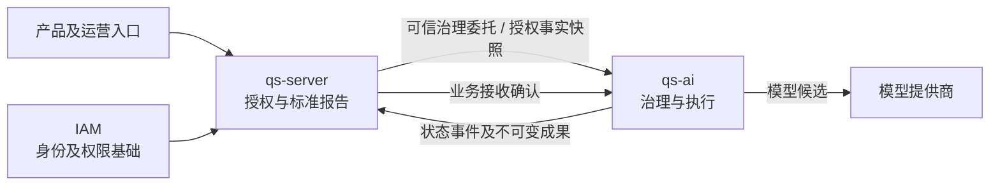

# 系统定位与跨服务边界

## 本文回答

qs-ai 持有什么事实和规则？IAM、qs-server、模型提供商与它之间怎样协作？

## 结论

qs-ai 是 AI 能力后台：拥有方案资产、评测审核、发布配置、解读执行和成果；qs-server 持有业务授权与标准测评事实；IAM 持有身份与权限基础。业务入口经 QS 进入 AI，qs-ai 不自建用户登录或直接浏览器业务入口。本文按源码基线 `c977cb9` 核对，不声明当前生产配置或验收状态。

## 责任与信任

| 主体 | 权威所有权 | 不能由下游代替 |
| --- | --- | --- |
| IAM | 凭证、身份、角色/权限基础 | AI 不能解释证书为用户已获资源权限 |
| qs-server | Testee、测评、标准报告、关系和资源授权、请求与成果投影 | AI 不直接读 QS 数据库，不重新计分或覆盖等级 |
| qs-ai | Solution、资产、评测、发布、Session、执行回执、Artifact | QS 不重跑 AI 输出和发布资格规则 |
| 模型提供商 | 返回候选响应及协议结果 | 不决定权限、业务状态、事实来源和发布资格 |

服务证书证明工作负载，不证明操作者具备业务权限。治理 RPC 验证受信 QS 工作负载，组织和操作者来自可信委托；执行 MQ 还验证受保护消息身份及正文。AI 对主体关联、输入适用范围和资产发布状态独立校验。

## 输入、成果与授权

报告快照属于 QS 的标准事实投影。AI 保存不可变 EvidenceSet 和发布配置，不能在恢复时用新的当前报告或默认资产替换原请求。AI 产物将标准事实与推断分开；源报告、Profile、Prompt、Route、Schema 和发布身份可追溯。

冻结事实不冻结访问关系。生成在执行前和接受成果前调用授权端口复核；授权撤销或依赖不可用按现有失败语义阻断结果接受。授权错误不能改写为模型错误，也不能靠旧快照永久绕过授权。

## 为什么保持这个边界

按当前约束分析，业务授权依赖 QS 的当前关系与报告，而资产版本、评测和模型回执依赖 AI 的持久状态。将这些职责集中在一方会扩大数据和故障权限；保持原本地事务可以让各方分别对受理、执行和接收负责。代价是必须维护消息身份、版本、跨语言契约和业务确认，不能把 Broker 确认当成整条业务成功。

若未来开放直接用户入口、多报告推理或长期记忆，应先明确身份委托、数据可见性与新的发布规则，再形成独立设计；现有骨架或目标稿不证明这些产品能力已完成。

## 实现依据与验证

- [外部请求与冻结接单](../../src/qs_ai/application/interpretation/service.py)
- [执行前后授权复核](../../src/qs_ai/application/execution/worker.py)
- [可信QS工作负载](../../src/qs_ai/transport/grpc/identity.py)
- [受保护MQ接单](../../src/qs_ai/infrastructure/workflow_transport/mq_receiver.py)
- [跨语言报告快照契约](../../integrations/qs_server/report-snapshot.md)
- QS 责任实现：[固定基线的快照投影](https://github.com/FangcunMount/qs-server/blob/2ccc2de44bbd45e26d29e7e130da518cc32426f0/internal/apiserver/application/aibridge/snapshot.go)。

核验时沿输入身份→绑定→事务→执行授权→输出规则→QS接收检查，不以一张架构图代替责任链。进一步阅读 [治理与执行主链](03-治理链与执行链.md)。
