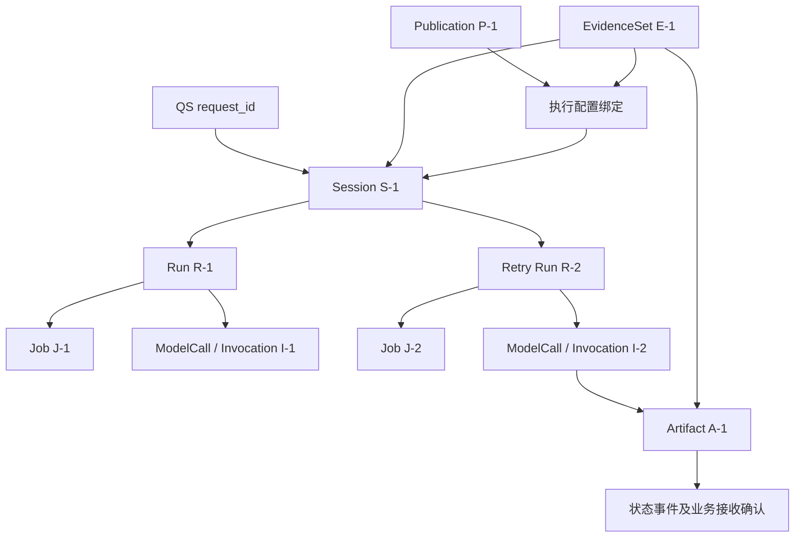

# 核心概念与对象关系

一次报告解读包含三组相互关联的对象：**治理对象固定“用哪套定义”，评测对象保存“这套定义经过哪些检查”，执行对象记录“这次报告请求怎样使用它”。** 配置发布、请求生成和消息交付各自有身份与状态，不能用一个“任务 ID”或“已完成”字段代替。

读完本文，应能从一份记录回答：它属于哪份报告、哪个 Session、哪次 Run、哪次模型调用、哪套发布，以及哪个状态事件。以下按对象产生的顺序解释，源码基线为 `766b2aa`；示例中的 `S-1 / R-1 / P-1` 等是可读别名，真实执行标识使用相应 UUID 或契约身份。

## 先把治理定义固定下来

假设运营人员希望修改 MBTI 三主题的提示词与模型参数。它首先创建一个 Solution，选择已有发布、当前组织的评测 Run 或精确模板作为来源，然后保存编辑，再执行 Prepare。三个阶段产生的东西不同。

| 阶段 | 保存或产生什么 | 此时还没有什么 |
| --- | --- | --- |
| 创建 Solution | `solution_id`、当前 `revision=1`、来源 release、关联 PromptDraft、可编辑模型选择 | 没有新的正式生成资产、模型响应或发布。 |
| Save | 校验 `expected_revision`，更新草稿与模型参数，Solution 和 Draft 修订推进 | 保存不创建新 Publication，也不启动评测。 |
| Prepare | 同一事务冻结 Prompt、注册生成和语义 Route、Profile 与派生 Suite，创建 `requested` Evaluation Run，保存 `prepared` 引用 | Run 尚未开始执行，Publication 与生效指针尚未产生。 |

### Solution 是编辑入口，资产是固定定义

Solution 的 `target_version` 由自身身份导出，例如 `solution-S-1`。多次保存推进的是编辑修订，目标资产版本不随每次 Save 改成新字符串。Prepare 成功后，该 Solution 禁止继续 Save/Prepare；下一轮改版需要从发布、Run 或模板创建新的 Solution。同一命令的幂等回放仍可以读取原回执。

这里有一个容易被表名误导的细节：`solution_revisions` 以 `solution_id` 为主键，保存每个 Solution 的**当前状态行**，并不是每个修订都新增一行。历史写命令的请求与原回执保存在 `solution_commands`。因此应分别查看“当前编辑状态”和“原命令做成了什么”。

Prepare 得到的生成资产分别回答以下问题：

| 对象 | 内容与身份 | 为什么必须单独存在 |
| --- | --- | --- |
| AI Profile | 解读 selector、输入适用性、维度选择、洞察/建议/安全及生成策略；身份为 `profile_id + version + fingerprint` | 解释规则可以变更，但不能反向改变已评测、已接单任务的规则。它与 IAM 的身份 Profile 无关。 |
| Prompt | System/Task/Data 等提示词包、允许占位符和来源；身份为 Prompt 名称与版本 | 可执行 Prompt 不仅是一段 Markdown；Prompt fingerprint、package SHA256 与来源记录分别核对。导入 Prompt 可绑定 QS Git blob，native Prompt 使用带 Origin 的规范化包。 |
| Route | provider/model/protocol、参数、超时、输出模式及调用能力；身份为 Route 名称与具体 revision | 同一个 Route 名称可以有多个模型/参数修订，Profile 中的名称不足以确定一次调用。凭证和 endpoint 仍由宿主配置提供。 |
| Schema | 输入或输出 JSON Schema 的固定字节；身份为 `schema_id + version` | 输入、生成输出、语义输出属于不同契约。输出结构合法还须经过领域与安全规则。 |
| Suite | 测试 case、输入构造、断言、质量义务与相关固定契约 | 同一 Prompt 在不同测试条件下不能共用一份模糊的“通过”结论。 |

名称相同不代表对象相同。仓库 MBTI 三主题模板中的 Profile、Prompt 和 Suite 恰好都使用 `participant-mbti-single@three-topic-v1`，只是资产约定；它们分别存储、分别计算摘要，修改其中一项不会自动修改另外两项。

### Manifest 与 Release Identity 固定的范围不同

`GenerationManifest` 把**五项生成资产**精确绑定在一起：Profile、Prompt、generation Route、input Schema、output Schema。每项都有 `identity / version / fingerprint / content_sha256`；清单自己的 fingerprint 标识这五项的组合。

`EvidenceReleaseIdentity` 则记录**一次评测使用的整套定义**。除了上述五项，还包含 Suite、semantic Prompt、semantic output Schema、semantic Route、execution policy 和 gate policy，共十一项固定引用。它的存在不等于这些定义已经获准发布。

| 变化 | generation manifest | evaluation release identity |
| --- | --- | --- |
| 改生成 Prompt 或生成 Route 修订 | 变化 | 变化 |
| 只改 semantic judge Route | 可以保持不变 | 变化 |
| 只改评测执行或门槛策略 | 可以保持不变 | 变化 |

所以“生成配置没变”不代表“评测条件没变”。发布时服务端要核对整套评测证据，也要确认最终发布的五项生成资产恰好是评测采用的字节。

Schema 版本的表达还有一处适配差异：manifest 中可写 `identity=ai-explanation-input, version=v3`，release 的 Schema Ref 则使用 `id=ai-explanation-input, version=ai-explanation-input/v3`。这不是两套输入协议；发布验证明确处理这种表示差异。

新注册的 native Suite 内嵌 generation manifest，并另行保存执行、门槛、semantic Prompt/Schema 等契约；semantic Route 由完整 release 绑定。保留的根 Suite 可以没有 manifest，不能拿一份历史 Suite 推断它已经绑定了所有现行生成资产。具体准备规则见 [方案资产与原子准备](../02-业务模块/governance/01-方案资产与原子准备设计.md)。

## 评测对象：一次批次不等于一次模型调用

Prepare 得到的 `Evaluation Run` 是一套冻结定义下的评测批次。Run 创建时保存完整 release、Suite、执行/门槛策略、semantic 契约、预检与计划 slot。后续执行和审核推进它的进度，但不会换成最新 Suite 或新 Prompt。

假设一个 case 需要生成五份样本，它形成五个 slot。执行失败后，一个 slot 可以经受控恢复产生新的 execution attempt；一次成功生成才产生 Candidate。以下身份需要分开：

| 对象 | 标识及含义 | 能推出什么 |
| --- | --- | --- |
| Evaluation Run | `run_id`；本批次固定定义和全部进展 | 可以追踪该批次；不能从 Run 存在推出执行已开始。 |
| Slot | `(case_id, slot_ordinal)`；计划要求完成的一个样本位置 | 可以计算覆盖率；不能当成一条响应或一个候选。 |
| Generation execution | `execution_id / invocation_id / execution_ordinal`；某 slot 的一次生成执行身份 | `prepared` 阶段尚未派发；持久 dispatch 标记才表明进入派发边界。失败或 unknown 可以只有完成记录、没有 Candidate。 |
| Candidate | 服务端生成 `candidate_id`，关联 generation execution、规范化输出及断言 | 有候选不等于断言通过，也不等于可审核或已批准。 |
| Semantic execution / completion | 某 Candidate 的语义执行身份及接受的结果 | 语义派发也有自己的 checkpoint 和 invocation；不是新生成 Candidate，也不替代人工质量复核。 |
| Quality review / Final review | 按 Candidate、Run 版本、角色与门槛接受的审核证据 | 最终批准仍需服务端重算；不自动移动线上发布指针。 |

例如候选 JSON 符合结构但断言未通过，Candidate 仍然存在，供问题定位；模型调用未知则不能凭空生成一个“空 Candidate”补齐覆盖。数量门槛、执行完成、断言、语义判断和人的审核分别回答不同问题。

持久化也不是一张候选主表：`evaluation_generation_completions` 保存原输出、规范化输出、调用证据和可选 `candidate_id/candidate_json`；语义完成另在 `evaluation_semantic_completions`。Run 固定定义与进展存于 `evaluation_runs`；用于并发控制的 Run 版本来自 `evaluation_checkpoints.version`，不是 `evaluation_runs` 的独立 version 列。

## Publication 是固定证据，Pointer 是生效引用

审核通过后，发布用例重新读取评测 Run、最终审核、release 和不可变资产，生成 `Publication(P-1)`。它保存发布身份、评测 `run_id + run_version`、生成 manifest、Profile、审核和发布审计。客户端传来的“通过”声明不能替代这些服务端证据。

`PublicationPointer` 回答的是另一个问题：**某个报告 selector 现在应该采用哪个 Publication？** 它保存 selector、当前 version、可为空的 active publication 和变更时间。

| 操作 | Publication 内容 | Pointer 变化 |
| --- | --- | --- |
| 发布 P-1 | 新建并保存固定发布证据 | `version=0 → 1, active=null → P-1` |
| 后来发布 P-2 | P-1 保留，新增 P-2 | `version=1 → 2, active=P-1 → P-2` |
| 回退到 P-1 | 复核保留的 P-1，内容不改写 | `version=2 → 3, active=P-2 → P-1` |
| 停用当前 slot | 发布历史继续保留 | `version=3 → 4, active=P-1 → null` |

这些数值是演示一次连续操作的例子。每次写都要符合实际 `expected_version / expected_active_id`，并保存原命令回执；有其他操作者先改了 Pointer，就不能按这张示意表继续提交。

Pointer 的主键是报告 selector 的 canonical hash，**当前 slot 是全局的，主键不含 organization_id**。Publication 保留评测与操作者组织，但并没有因此获得每组织独立的生效 slot。新请求匹配这条 selector 时会采用当前可用发布；不能把“治理对象按组织隔离”扩大成“上线配置按组织隔离”。

量表可以有精确版本、模型级和通用 selector 的候选；停用一条精确 slot，仍可能命中更宽的可用发布。MBTI 则要求精确模型/版本，单篇与三主题共享这个 slot。选择、回退和停用规则详见 [发布设计](../02-业务模块/publication/01-发布证据与生效指针设计.md)。

## 执行对象：用同一份报告贯穿身份关系

沿用首篇的合成场景：组织 1 的主体为 Testee 7、Assessment 42、Report 99 发起请求。QS 的 `request_id` 为这次业务请求提供稳定身份；AI 创建 `Session S-1`，冻结 `EvidenceSet E-1`，并绑定 `Publication P-1`。

图中 R-2 是首次执行阻断后的一种受控 Retry 分支，不是每个请求都会产生。当前一个 Session 最多接受一份最终 Artifact；已经 completed 的 Session 不能通过 Retry 原地再生成第二份成果。

### Session 保存业务关联与当前推进状态

Session 的稳定字段包括 actor、Testee、assessment 列表、goal、EvidenceSet 和 workflow version。`status / version / active_run_id / failure_code` 则随业务推进改变。

一次顺利执行中的版本变化如下，未考虑重领任务、取消或其他分支：

| 时刻 | Session | 当前 Run | Job / ModelCall |
| --- | --- | --- | --- |
| 构造对象 | `created, version=1` | 尚无 active Run | 尚无 Job/调用 |
| Start 接单 queue | `queued, version=2, active_run_id=R-1` | `queued` | 创建 J-1，`queued`；尚无调用 |
| Worker claim | `running, version=3` | `running` | J-1 `leased`，获得 fence；模型尚可未派发 |
| 派发并保存响应 | Session 仍为 `running, version=3` | 同一个 R-1 | I-1 从 `dispatched` 到 `response_received` |
| 接受成果 | `completed, version=4` | `completed` | J-1 `done`，保存 A-1；交付可以仍在等待 QS |

Session version 是业务并发与事件版本，fence 是 Worker 的租约所有权代次，二者不能替代。任务重新领取会更新所有权，当前实现还会再次调用 `running()` 推进 Session version；不能把 version 固定解释成“模型尝试次数”。

### EvidenceSet 是冻结报告全文，不是授权票据

E-1 保存报告事实项与摘要。在本例中包含 assessment 42、Testee 7、Report 99、`source_version=standard-v1:101` 和唯一的 `standard_report` JSON fact。准备输入时会再核对其摘要、Session 关联与快照内部来源。

当前报告生成只接受一个 EvidenceItem。冻结保留的是接单采用的事实，恢复时不补读另一份最新报告；当前访问权仍通过 QS 复核。它不能被用作“曾经授权，所以永久有权”的凭据。

执行配置绑定是另一条记录：`execution_configurations` 按 Session 保存 EvidenceSet ID/hash、Publication ID/hash、Pointer version 和 selector query。`ExecutionConfiguration` 是从原发布与不可变资产编译出的运行值；`FrozenGeneration` 则是模型请求值，连同具体输入、Prompt、Route、Schema 与发布身份序列化进 ModelCall 的 `request_json`。它们不是三张都叫“配置”的可变表。

### Run、Job、Claim 与 Invocation 各自负责什么

| 对象 | 本例中的责任 | 当前持久约束 |
| --- | --- | --- |
| 业务 Run R-1 | 一次参与者执行尝试，记录与 Session 的关联和结果 | 一个 Session 可保留多个 Run；与 Evaluation Run 不属于同一个批次模型。 |
| Job J-1 | 让后台知道何时执行、谁已领取、租约到何时、领取了几次 | `execution_jobs.run_id` 唯一，一 Run 最多一 Job。准入拒绝可以有 Run 而没有 Job。 |
| Claim | Worker 当前拿到的 job/run/session/fence 等值 | 是应用返回值，不是独立历史表；提交时须与当前持久租约和 Session 再比较。 |
| ModelCall / Invocation I-1 | 一次外部模型派发的稳定身份、原请求与响应/失败证据 | `model_calls.run_id` 为主键，一业务 Run 最多一条调用记录；Invocation 是该记录中的唯一派发身份。 |
| Artifact A-1 | 从冻结事实、配置与已持久响应重建并验证的最终内容 | `interpretation_artifacts` 对 Session 和 Run 分别唯一；不存在 completed 后反复覆盖成果的正常用例。 |

Job 的 `attempt` 增加表示后台领取次数，不证明外部模型又调用了一次。恢复时如果 I-1 已有 `response_received`，复用原响应；如果只有 `dispatched / unknown`，按未知调用阻断，不能因租约过期生成 I-2。

### 阻断后的参与者 Retry 创建新的 Run

若 R-1 已完成一次模型响应但输出未通过，Session 可以变成 `blocked, version=4`，J-1 为 `done`，ModelCall 仍保留 `response_received`，且没有 Artifact。审核过恢复条件的 Retry 使用新 command ID，在同一 S-1 中创建 R-2/J-2，Session 到 `queued, version=5`；领取后到 version 6，成功结算后到 version 7。

R-2 后续新建 I-2；保留的是原 Session、QS request、EvidenceSet、已接受配置，以及已有原模型请求的冻结字节。新的 Invocation/响应仍单独记录，不能把 I-1 的历史改写成 I-2。

若 R-1 是“没有匹配发布”而被准入拒绝，则没有已接受的执行配置；Participant Retry 不允许后来换绑发布。满足新条件后要使用新 request_id 重新发起请求。对于已派发但结果未知的执行，还要确认此次 Retry 预计发起一次新调用，并显式接受原调用结果未知的风险；旧调用状态由服务端读取原记录，不由客户端提交一份替代证据。

新 Run 也可由其他允许的业务迁移产生，例如已有澄清问题的 Answer/Continue。当前报告生成没有主动追问产品入口；本文的 Retry 示例仅说明 blocked 的参与者报告执行，不能据此改写整个 Session 模型的所有迁移。

## Artifact 为什么不是模型返回的 JSON

模型返回值首先属于 ModelCall 的响应证据。AI 用原事实与原配置校验这份响应，然后形成 `ArtifactCandidate`；最终结算再次从原响应重建并比对，才能保存到 Artifact 表。

Artifact 的身份和内容至少关联以下四组信息：

| 关联 | 重要字段 | 能回答的问题 |
| --- | --- | --- |
| 业务执行 | `session_id / run_id / invocation_id / provider_request_id` | 哪次请求的哪次外部调用产生了内容？ |
| 标准事实 | `evidence_set_id / evidence_fingerprint / assessment_id / report_id / source_version` | 使用了哪份报告事实？ |
| 固定策略 | Profile 名称/版本/摘要、Prompt 和 Route 摘要、输入摘要、校验器版本 | 采用了哪套定义与检查？ |
| 成果 | `content_json / content_fingerprint`，三主题另有参考材料 JSON/hash | 接受的原内容是什么，传输后是否完整？ |

Artifact ID 由 Run 与 Invocation 的稳定组合生成，因此同一已接受响应的重建得到相同成果身份。这个稳定性帮助恢复与交付核对，不授权修改成果内容。

`qs-ai-artifact/v1` 与 `/v2` 是成果 envelope 契约；`ai-explanation-output/v1` 与 `/v2` 是里面的模型内容契约。三主题 Artifact v2 另外保存按类型选中的原参考材料；这些来源信息不能让模型自己生成。

QS 接收后保存其业务投影，校验原请求/Session、报告来源及内容契约；QS 不共享 AI 的 active Run。原模型调用与资产证据继续由 AI 持有。

## 业务状态、模型状态和交付状态要一起读

以下组合都可以成立，排障时要定位对应对象，不能仅凭其中一个字段宣告整条链成功或失败。

| 组合 | 解释与下一步 |
| --- | --- |
| Session `running`，ModelCall 尚不存在 | Worker 可能尚在授权、输入准备或容量等待；不能判断模型已经调用。 |
| Session `running`，ModelCall `response_received` | 原响应已持久保存，仍可能等待输出验证和成果结算。 |
| Session `blocked`，ModelCall `response_received` | 响应有证据，但输出/接受门槛未通过；应读取具体 failure code。 |
| Session `blocked`，ModelCall `dispatched / unknown` | 外部结果不确定，自动恢复不能重发模型请求。 |
| Session `completed`，成果事件尚未业务确认 | AI 成果成立；QS 接收与交付仍未闭环，重投原事件即可，无须再生成。 |
| QS 已 `STORED`，参与者当前访问被撤销 | 原事件已持久处理，当前用户仍可能无法读取；关系与读取权限独立变化。 |

消息身份也有各自的用途：Start 的 MQ `message_id` 等于原 `request_id`；后续 Change/Retry 等写操作使用自己的 command ID。业务状态事件使用 event ID，并携带原请求关联与 Session version；业务 ACK 绑定原 event ID、kind、aggregate key 和 body hash。消息重投复用原身份和字节，不能用新 ID 把同一业务动作伪装成新操作。

## 不同的 version 名字分别控制什么

| 名称或字段 | 控制的内容 | 不应混用的对象 |
| --- | --- | --- |
| Solution `revision` / Draft `revision` | 当前编辑状态的冲突检查 | 不等于发布资产 version。 |
| Profile/Prompt version、Route revision | 不可变资产身份 | 同名资产可以有不同修订；不能只记模型名称。 |
| Evaluation Run checkpoint version | 评测推进、审核和终审并发控制 | 不等于参与者 Session version。 |
| Pointer `version` | 某 selector 的生效引用变更 | 回退也推进 version，不倒退到旧数值。 |
| Session `version` | 业务状态、命令 CAS 和状态事件关联 | 不等于 Job attempt 或租约 fence。 |
| `qs-report-snapshot/v1/v2` | QS 报告快照结构 | 不等于标准报告 content schema 或 Profile 版本。 |
| `ai-explanation-input/v1/v2/v3` | 模型输入结构 | 不等于生成输出或成果 envelope 版本。 |
| `ai-explanation-output/v1/v2` 与 `qs-ai-artifact/v1/v2` | 模型内容与 AI 成果 envelope 的两个契约 | 两个名字中相同的数字不意味着同一个对象。 |

版本矩阵的精确组合由 [场景契约](../02-业务模块/interpretation/README.md) 维护；本文说明身份归属，不维护第二套机器 Schema。

## 实现依据与继续阅读

| 要查证的关系 | 直接实现与测试入口 |
| --- | --- |
| Session 状态和版本 | [领域对象与迁移方法](../../src/qs_ai/domain/interpretation/model.py)、[领域状态测试](../../tests/test_interpretation_domain.py)。 |
| 每个对象究竟存在哪里、是否唯一 | [MySQL 表定义](../../src/qs_ai/infrastructure/persistence/mysql/schema.py)；字段约束见 [持久化设计](../03-基础设施/persistence/README.md)。 |
| Solution 当前行、Prepare 原子资产与 Run | [Solution 存储](../../src/qs_ai/infrastructure/persistence/mysql/solutions.py)、[资产准备](../../src/qs_ai/infrastructure/persistence/mysql/solution_assets.py)、[方案集成测试](../../tests/integration/test_solutions.py)。 |
| manifest 与完整 release 的差别 | [GenerationManifest](../../src/qs_ai/domain/governance/manifest.py)、[EvidenceReleaseIdentity](../../src/qs_ai/domain/evaluation/identity.py)、[Suite 固定契约](../../src/qs_ai/domain/evaluation/suite_contracts.py)。 |
| slot / execution / candidate | [评测 Run 冻结](../../src/qs_ai/infrastructure/persistence/mysql/evaluation_runs.py)、[生成完成接受](../../src/qs_ai/infrastructure/persistence/mysql/evaluation_completions.py)、[候选查询](../../src/qs_ai/application/evaluation/candidates.py)。 |
| Publication 与 Pointer | [发布领域](../../src/qs_ai/domain/governance/publication.py)、[发布事务](../../src/qs_ai/infrastructure/persistence/mysql/publications.py)、[发布测试](../../tests/test_publication.py)。 |
| 原配置和原请求怎样复用 | [执行配置绑定与读取](../../src/qs_ai/infrastructure/persistence/mysql/execution_configurations.py)、[持久生成](../../src/qs_ai/application/execution/generation.py)、[恢复测试](../../tests/integration/test_generation.py)。 |
| Retry 到底保留/新建什么 | [重试存储](../../src/qs_ai/infrastructure/persistence/mysql/participant_retries.py)、[Retry 集成测试](../../tests/integration/test_participant_retries.py)。 |
| Artifact 的字段与生成身份 | [ArtifactCandidate](../../src/qs_ai/domain/interpretation/artifact.py)、[成果构建](../../src/qs_ai/application/execution/artifact.py)、[成果测试](../../tests/test_artifact.py)。 |

这些测试是行为核查入口，不意味着本文修改执行了所有集成环境。下一篇 [治理链与执行链](03-治理链与执行链.md) 按一次完整操作展开这些对象怎样产生、检查、发布、执行和交付。
