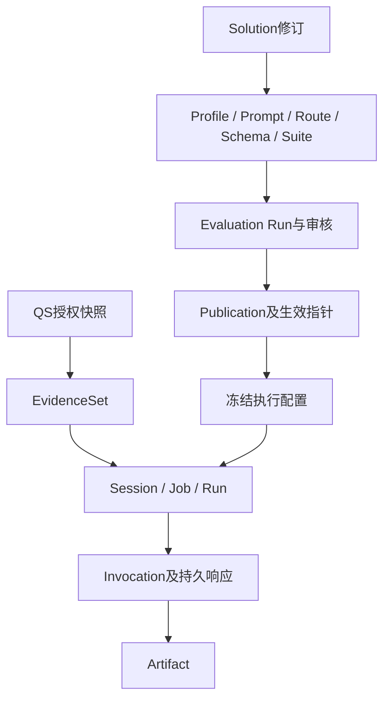

# 核心概念与对象关系

## 结论

治理对象决定“采用什么固定定义”，执行对象记录“哪次请求怎样运行”，评测对象证明“固定定义经过什么检查”。三者有不同身份和生命周期，不能合并为一张可变配置或一个“任务状态”。源码核对基线为 `c977cb9`。

| 对象 | 语义 | 重要边界 |
| --- | --- | --- |
| Solution | 可编辑方案及其修订，组织化管理与准备入口 | 保存不等于冻结、评测、审批或发布 |
| AI Profile | 解读范围、场景和输出策略的版本定义 | 与 IAM 身份 Profile 无关，适用性由 AI 校验 |
| Prompt / Route / Schema | 可版本化生成资产、模型配置和结构契约 | 草稿不直接变为生效配置；完整资产身份必须绑定 |
| Suite | 评测输入、断言与质量策略的冻结集合 | 修改输入/规则不能原地改变已运行评测依据 |
| Manifest | 把资产、适用范围与版本绑定的清单及摘要 | fingerprint 用于一致性校验，不等于质量批准 |
| Publication | 经发布规则接受的固定证据与配置 | 生效 pointer 是可版本化引用，publication 内容保持不可变 |
| Session | 某主体针对 Testee 和目标的一次解读业务过程 | 状态、版本、当前 Run 和证据引用由聚合约束 |
| EvidenceSet | 本请求采用的不可变报告事实集合 | assessment、Testee、report 和 source version 必须一致 |
| 业务 Run / Job | 解读的一次执行及持久调度 | 重试使用受控新 Run，不得借租约过期重发未知模型调用 |
| Invocation / ModelCall | 某次提供商派发的稳定身份、冻结请求和结果回执 | dispatched/unknown 不等于可安全重试 |
| Evaluation Run / Candidate | 固定定义下的评测批次与候选结果 | 不等同于参与者 Session 的业务 Run |
| Artifact | 经过验证并持久接受的解读成果 | 绑定来源和配置，QS 做关联与完整性投影 |
| command_id / request_id / event_id | 命令、原请求、事件的不可变关联身份 | 传输重投和同命令重放保留原身份，同身份不同内容冲突；业务Retry创建新命令与Run |

## 状态不是同一维度

Session 的 queued/running/blocked/completed 描述业务推进；Job 租约决定谁能提交；ModelCall 的 dispatched/response_received/unknown 描述外部调用结果；Outbox 的发布及确认状态描述交付。一个 Session completed 仍可能等待 QS 接收。一次消息确认不能改变模型调用是否未知。

评测还需要区分执行完成、确定性断言、语义评测、质量复核和最终批准。JSON 合法不证明自然语言结论正确，自动评测通过不自动成为人的质量认可。

## 版本和事实

不同名字中的 v1/v2/v3 属于不同契约命名空间：标准报告快照、解读输入、模型输出、Artifact envelope、Profile 和模板版本不能互相代替。量表与 MBTI 场景的精确模型/版本、selector 和契约矩阵由 [业务模块](../02-业务模块/README.md) 维护。

## 来源与继续阅读

- [解读领域对象](../../src/qs_ai/domain/interpretation/model.py)
- [冻结执行配置](../../src/qs_ai/application/execution/configuration.py)
- [生成调用回执规则](../../src/qs_ai/application/execution/generation.py)
- [方案应用端口](../../src/qs_ai/application/governance/solutions.py)
- [发布规则](../../src/qs_ai/domain/governance/publication.py)
- 具体来源由下方实际文件链接给出；治理规则见 [业务模块](../02-业务模块/README.md)，技术状态与恢复见 [基础设施](../03-基础设施/README.md)。
