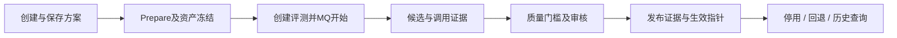
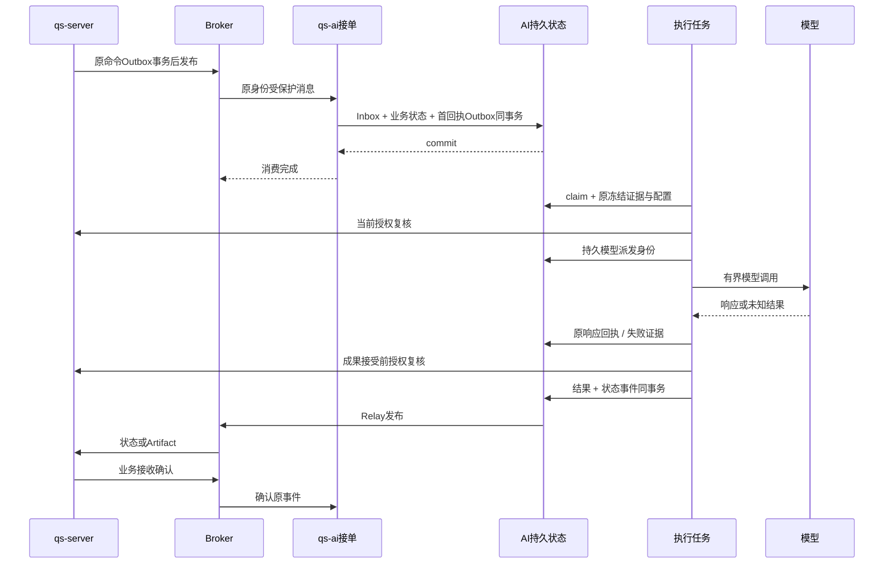

# 治理链与执行链

## 结论

治理链产生可追溯的发布定义，执行链使用接单时冻结的定义完成业务。发布更新只影响符合准入条件的新请求，不能使已接单或恢复中的任务换用最新配置。两条链共同依赖持久身份和有限失败语义。本文核对基线 `c977cb9`。

## 治理链

| 环节 | 持久责任 | 失败和完成边界 |
| --- | --- | --- |
| 保存 | 方案修订和原命令回执 | 不产生评测、批准或生效配置 |
| 准备 | 绑定、校验并冻结资产，复用原命令 | 事务失败不能留下半套可执行依赖 |
| 评测创建与开始 | 冻结输入、执行策略及稳定身份 | 接单与外部模型执行分离，消息受理不等于候选完成 |
| 候选与质量审核 | 原响应、确定性断言、语义判断和审核记录 | 结果未知保留原证据；取消、废弃和复审是不同用例 |
| 发布 | 从冻结 Run 和全部门槛重算资格，原子修改 selector 指针 | 外部上传的“已批准”声明不能代替服务端验证 |
| 停用与回退 | 新版本指针及不可变审计 | 指针回退不重写既有任务冻结定义，不承诺旧镜像兼容 |

模块规则见 [业务模块](../02-业务模块/README.md)。

## 执行链

## 六个不同完成点

1. QS 原请求与 Outbox 提交：请求已被 QS 持久受理。
2. Broker 确认：只证明发布边界。
3. AI Inbox、业务记录和首回执提交：AI 已形成可重放接单决定。
4. 模型响应持久化：该 Invocation 的外部结果有确定证据。
5. Artifact/失败与状态事件提交：AI 业务结果已持久形成。
6. QS 业务接收确认：原事件已按关联规则持久接收，AI 可以确认交付。

重复、迟到和乱序必须按身份、哈希、会话版本和原请求关联处理，不能依靠 Broker 顺序或事件时间排序替代业务规则。模型已派发而响应未知时保留 dispatched/unknown，禁止再次外发。MQ PUB 结果未知时有界退避并重投原 wire；Broker 确认后仍等待业务 ACK，缺 ACK 不把模型结果改成 unknown。传输重投和同命令重放保留原 ID；受控业务重试是新命令与新 Run，保留原 Session、request_id 和冻结输入。

## 恢复和限制

LangGraph 编排有限步骤，没有独立持久 checkpointer。任务恢复重新进入当前有限图，由冻结配置、租约/fence、CAS 和模型回执决定是否复用响应或阻断。模型事务提交之外执行；缺失持久响应不能证明提供商未收到请求。

该链路图解释源码行为，不证明生产的真实模型、审核账号、自然业务消息、回滚和小程序显示均已验收。验收缺口见 [规划与验收](../_plans/README.md)，具体机制见 [基础设施](../03-基础设施/README.md)。

## 实现依据

下方按真实源码列出各环节，并由文档闭包摘要约束基线。

- [方案准备](../../src/qs_ai/infrastructure/persistence/mysql/solutions.py)
- [评测管理](../../src/qs_ai/infrastructure/persistence/mysql/evaluation_management.py)
- [评测模型图](../../src/qs_ai/infrastructure/workflows/evaluation.py)
- [发布事务](../../src/qs_ai/infrastructure/persistence/mysql/publications.py)
- [接单原事务](../../src/qs_ai/infrastructure/workflow_transport/mq_receiver.py)
- [冻结生成流程](../../src/qs_ai/infrastructure/workflows/report.py)
- [模型回执与unknown](../../src/qs_ai/application/execution/generation.py)
- [MQ Relay](../../src/qs_ai/infrastructure/workflow_transport/mq_relay.py)
