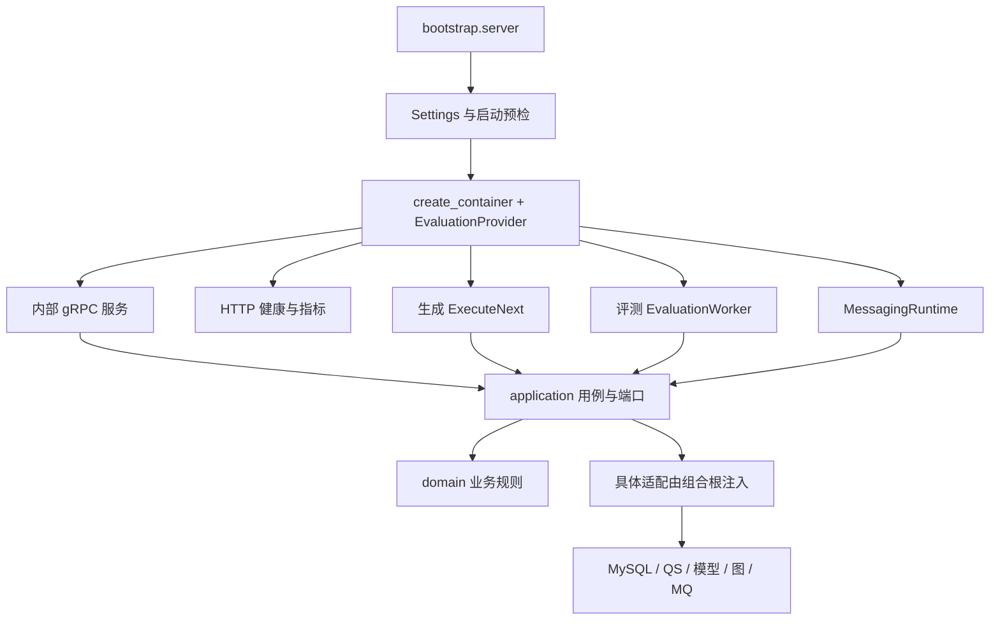

# 代码地图与能力状态

维护 qs-ai，先找到**运行装配、实际用例、持久实现和机器契约**，再决定应该修改哪一层。目录名只是定位线索：一个 proto 方法可能已被运行时拒绝，一个配置值可能没有被当前适配器采用，一个领域状态也可能没有产品入口。

本文按 `766b2aa` 的源码说明“从哪里开始追踪、哪些边界有测试、还缺哪层证据”。它不登记生产现场状态。系统职责见 [系统边界](01-系统定位与跨服务边界.md)，对象含义见 [核心概念](02-核心概念与对象关系.md)。

## 先沿实际装配确定哪些实现会运行

正式服务从 `qs_ai.bootstrap.server.run` 进入 `serve`。它解析 Settings，创建一套 Dishka 容器与数据库池，检查数据库迁移版本，装配消息、HTTP、gRPC 和已启用的后台执行组件，再交给统一监督器。



图中箭头表示装配和调用关系，不能直接当 Python import 依赖方向。例如应用用例调用 ExecutionStore 协议，但具体 MySQLExecutionStore 由组合根注入，application 不导入它。

以下装配入口决定当前服务行为：

| 要确认的事情 | 首先读哪里 | 在这里能确定什么 |
| --- | --- | --- |
| 进程包含哪些组件、启动失败在哪里退出 | [`bootstrap/server.py`](../../src/qs_ai/bootstrap/server.py) | MQ 是正式运行前提；generation/evaluation 按开关装配，任意必需组件退出影响整个服务。 |
| 一个应用协议最终绑定哪个适配器 | [`bootstrap/container.py`](../../src/qs_ai/bootstrap/container.py)、[`providers/`](../../src/qs_ai/bootstrap/providers/) | 七个基础 Provider 及显式 override 的组成，APP/REQUEST 对象与真实工厂。 |
| proto 服务是否真的注册 | [`bootstrap/grpc_server.py`](../../src/qs_ai/bootstrap/grpc_server.py) | Commands 的注册、治理服务开关、mTLS 和退休执行方法 interceptor。 |
| HTTP 有没有浏览器业务入口 | [`bootstrap/api.py`](../../src/qs_ai/bootstrap/api.py) | 实际只注册 health 与 metrics router。 |
| 模型与发布是否接入当前生成路径 | [`providers/generation.py`](../../src/qs_ai/bootstrap/providers/generation.py) | REQUEST AsyncClient、ModelGatewayRouter、DurableGeneration、PublishedReportWorkflow 的真实组合。 |
| 消息是否借用当前数据库池 | [`bootstrap/messaging.py`](../../src/qs_ai/bootstrap/messaging.py) | key/schema 预检、APP pool 借用、原接单事务与 publisher/subscriber gate。 |

例如 `Commands.Start` 仍在机器契约和 servicer 中，但正式 gRPC 入口先经过 `MQExecutionCutover`，认证 QS 后返回 `FAILED_PRECONDITION`。仅阅读方法体就修改接单语义，会绕过已经生效的通信边界；应从 MQ 的实际 admission 进入。

## 各层的责任用一次请求串起来

以“QS 发 Start，AI 生成报告并回传”为例，主要代码落点如下。每一层拥有不同决策，无法通过调整最外层 DTO 完成整个行为变更。

| 层 | 这次请求的具体工作 | 典型落点 |
| --- | --- | --- |
| transport / workflow transport | 认证服务或消息、映射协议字段、分类可返回错误与技术失败 | gRPC `identity.py`；MQ `mq_receiver.py`、`command_admission.py`。当前 MQ 接单属于 infrastructure adapter，不能简单假设所有入站都在 transport 目录。 |
| application/interpretation | 用原请求身份受理，创建 Session/EvidenceSet，绑定固定配置，保存回执 | `InterpretationService.start_external`。 |
| domain/interpretation | 限制主体关联、Session 状态、业务版本与允许迁移 | `Session.queue/running/block/complete/retry`、`EvidenceSet.validate`。 |
| application/execution | 授权复核、原模型回执恢复、输入输出与成果关联 | `ExecuteNext`、`DurableGeneration`、`build_artifact`。 |
| infrastructure/workflows | 用图组织有限步骤，调用上述应用机制 | `ReportWorkflow` 的 prepare → generate → validate；`evaluation.execute_step` 的 prepare_dispatch → invoke_model → commit_receipt。 |
| infrastructure/persistence/mysql | 具体表、锁、租约、CAS、事务与消息原子性 | interpretation、execution、execution_configurations、messaging、result_outbox。 |
| infrastructure/models 与 qs_server | 外部协议适配与防腐映射 | ModelGatewayRouter、提供商 adapter、QSAccessSource、输入/输出与资产 loader。 |
| bootstrap | 把上述协议、适配器、资源与生命周期组成当前服务 | 容器、Provider、server 与 MessagingRuntime。 |

治理路径也遵循这个分工：transport 把可信 org/operator 映射成 scope；application 定义 Prepare、Review、Publish 等用例；domain 约束资产身份与发布资格；MySQL adapter 读取实际证据并完成原子修改。

`domain/interpretation`、`domain/governance`、`domain/evaluation` 是代码组织。评测与发布共同服务生成配置治理，execution 是应用支持；不能从目录数量直接宣称它们是独立服务或互不依赖的领域上下文。

## 需要修改某种行为时，先追踪哪条线

| 需求或故障 | 顺序阅读的实现 | 必须一起核对的契约与测试 |
| --- | --- | --- |
| 原 Start 重投创建了新业务效果 | receiver reserve Inbox → borrowed admission → start_external reserve/receipt → 原根事务 commit | `messaging.proto` 的稳定身份；[`test_mq_admission.py`](../../tests/integration/test_mq_admission.py) 的原拒绝、重复回执、回滚。不能只在 handler 加一次内存去重。 |
| 要调整量表/MBTI 输入 | selector 与 binding → `prepare_report_input` → 对应 assemble → input Schema | [报告快照契约](../../integrations/qs_server/report-snapshot.md)、[`test_input_binding.py`](../../tests/test_input_binding.py)、场景 interop；QS 仍拥有标准事实。 |
| 要调整 Prompt 或模型参数 | Solution 保存/准备 → native asset 注册 → Suite/release →评测/发布 → 新请求 binding | [`solutions.py`](../../src/qs_ai/infrastructure/persistence/mysql/solutions.py)、[`solution_assets.py`](../../src/qs_ai/infrastructure/persistence/mysql/solution_assets.py)、[Solution 测试](../../tests/integration/test_solutions.py)。编辑宿主配置不是替换已接单任务的资产版本。 |
| 已派发模型调用恢复 | `begin_model_call` → request/response codec → DurableGeneration →原租约 finish | [生成恢复测试](../../tests/integration/test_generation.py) 覆盖 commit failure、取消与进程退出。先确认原响应，不添加未经证据支持的自动重发。 |
| AI completed 但 QS 看不到成果 | Artifact/result_outbox 原提交 → StateEventRecorder → MQRelay → QS receiver → STORED ACK | [消息设计](../03-基础设施/messaging/README.md)、[`test_mq_admission.py`](../../tests/integration/test_mq_admission.py) 的 `test_legacy_result_settles_only_with_atomic_original_business_ack`，以及 [storage](../../tests/integration/test_mq_storage.py) / [observations](../../tests/integration/test_mq_observations.py) 的原事件 ACK 断言提供分段证据；[worker events](../../tests/integration/test_mq_worker_events.py) 只覆盖评测状态事件。排查应追原成果交付。 |
| 要增加新公开入口 | 实际 listener 装配 →可信身份来源 →应用 scope/授权 → DTO/机器契约 | [接口地图](../04-接口与运维/01-接口地图与契约所有权.md)。不能把已有内部管理 RPC 原样开放给浏览器。 |

这张表用于确定检查范围，不授权修改生产或绕过现有版本规则。读完一条线后，应能指出调用者、被调用实现、提交点、失败结果与相应断言。

## 机器契约、生成文件和运行配置在哪里

| 文件群 | 所有权与维护方式 |
| --- | --- |
| `integrations/workflow/proto/` | qs-ai 持有的 workflow/messaging 机器契约。生成 Python 位于 `src/qs_ai/contracts/workflow/`，通过生成脚本检查。 |
| `integrations/qs_server/manifest.json` 与相关 proto | 固定版本的 QS 上游接入契约与摘要；`src/qs_ai/infrastructure/qs_server/generated/` 是生成产物。 |
| `integrations/qs_server/schemas/` | 输入、输出等 Schema 及固定来源/保留资产。具体版本矩阵由场景契约说明，不能将目录中的文件都认作当前生效。 |
| `integrations/qs_server/prompts/`、`integrations/qs_server/routes/`、`integrations/qs_server/evaluation/` | 固定 Prompt、Route、Suite 与测试资产；新治理对象还会注册到数据库的不可变资产表。 |
| `configs/`、[`src/qs_ai/config.py`](../../src/qs_ai/config.py)、[`src/qs_ai/model_configuration.py`](../../src/qs_ai/model_configuration.py) | 默认值、环境覆盖、宿主连接/模型绑定及解析约束。配置可解析不等于相应能力已启用。 |
| `migrations/versions/`、[`src/qs_ai/infrastructure/persistence/mysql/schema.py`](../../src/qs_ai/infrastructure/persistence/mysql/schema.py) | 迁移历史与当前持久化映射。启动检查 heads 一致，启动本身不迁移。 |
| `.github/workflows/`、`scripts/ci/`、`deploy/` | CI 执行范围、镜像与部署规则。文档中记录机制，实际运行结论另绑定 run/revision/环境。 |

生成代码中的字段存在、仓库资产文件存在、配置目录包含模型名称，都不足以证明正式服务走到了该实现。需要回到前面的装配和调用链确认。

## 架构测试实际保护了哪些边界

[`test_architecture.py`](../../tests/test_architecture.py) 解析源码 import，要求绝对导入并检查循环，当前禁止：

- domain/application 导入 FastAPI、Dishka、SQLAlchemy、LangChain、LangGraph、gRPC、Pydantic、Settings、生成契约、bootstrap、transport 或 infrastructure。
- domain 导入 application；transport 导入 infrastructure/bootstrap；infrastructure 导入 transport/bootstrap。
- 上述非组合根层使用 `dishka_container` 或 `make_async_container` 属性来临时建容器。

因此业务与应用规则依赖普通值及协议，具体框架由适配器与组合根承担。这里的“禁止导入”有自动保护；“事务是否原子、错误码是否准确、结果能否接收”仍需要行为测试。架构测试不会因为通过就证明所有业务规则都实现完整。

## 能力状态按什么证据判断

仓库当前已有单进程监督、MQ 原事务接单与业务 ACK、固定配置治理、评测/审核/发布、有限量表与 MBTI 生成路径。下一步判断某个现场能力是否可用，需要依次绑定以下证据。

| 问题 | 有效证据 | 常见误判 |
| --- | --- | --- |
| 有没有这条实现路径 | 当前装配、调用者、用例、机器契约与持久实现 | 只看目录或类名。 |
| 指定分支行为是否受保护 | 对应测试确实驱动该分支并有断言；必要时使用隔离 MySQL/NSQ 与跨语言探针 | 把 skip、收集成功或纯替身测试叫成真实存储通过。 |
| 完整仓库门禁是否通过 | 具体 revision 的 CI run 和完整分片覆盖 manifest | 把几项本地测试外推成全量 CI。 |
| 现场是不是这个版本与配置 | 镜像/release SHA、迁移 heads、实际开关与 readiness | 把构建成功或默认 production.yaml 当实际部署配置。 |
| 真正请求有没有闭环 | 原 request/command/session/event 关联、Artifact、QS STORED/投影与当前授权 | 把 Broker PUB 或 AI completed 当用户已经拿到结果。 |
| 解读质量与展示是否认可 | 相应样本、账号、审核及设备/人工结果，标明时间与范围 | 把 JSON 合法、健康正常当语义正确或用户验收。 |

当前文档没有为本机之外的生产状态补造结论。多报告综合、主动追问、长期记忆等能力缺完整现行产品入口；已有的多个 assessment 字段、Question 模型或图依赖不足以证明它们已开放。

### CI 比本地几项测试多检查什么

主 `checks` 在 MySQL 8.0.36 和 8.4 上分别执行四个分片。它安装锁定依赖，执行静态、生成契约、文档与迁移检查，创建隔离数据库和 NSQ，构建固定 QS 跨语言探针，再运行全部收集到的测试。

[`scripts/ci/run_tests.py`](../../scripts/ci/run_tests.py) 用测试 node ID 的 SHA256 做确定性分片，记录本 revision 的 collected/selected/passed/skipped；只要分片存在 skip 或选中的项未全部通过，就不能以成功退出结束。汇总任务还要在两种 MySQL 版本上证明完整覆盖。固定 QS 快照探针、MQ 探针和当前手工分析使用的 QS HEAD 可能不同，应按各自用途记录，不能统称为“已验证最新 QS”。

这描述的是 CI 的规则，不是本次文档分支的远端检查结果。

## 可重复的源码核验入口

完成锁定开发依赖准备后，可从廉价检查开始：

```sh
uv run python scripts/check_docs.py
uv run pytest -q tests/test_architecture.py tests/test_docs.py
uv run python scripts/generate_qs_proto.py --check
uv run python scripts/generate_workflow_proto.py --check
uv run python scripts/generate_messaging_proto.py --check
```

行为修改再选择上文具体链路的测试；集成测试需要一次性 MySQL/NSQ 与指定跨语言 fixture，不能指向生产来“补齐验证”。完整入口由 [CI workflow](../../.github/workflows/ci.yml) 与 [本地开发](../04-接口与运维/04-配置与本地开发.md) 维护。

下一层 [运行时](../01-运行时/README.md) 会展开资源如何创建、后台怎样调度、组件失败怎样撤回 readiness，以及停机后持久状态如何恢复。
