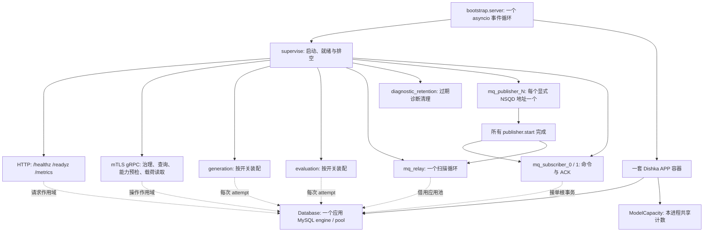
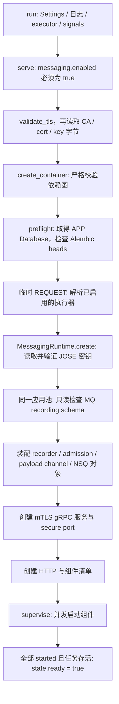

# 单进程架构与启动装配

qs-ai 的常驻服务由 `bootstrap.server` 启动：**HTTP、内部 mTLS gRPC、生成、评测和消息运行在同一个进程、同一个 asyncio 事件循环中，共用一套 Dishka 容器和一个应用数据库池。** 监督器把已装配的组件作为一个整体启动和关闭；其中任何组件提前结束，服务都要撤销就绪并排空其它组件。

启动顺序有实际业务含义。证书、数据库迁移和 MQ 观测前提未通过时，服务不会启动执行循环；进入监督器后，已启用的生成、评测循环就可能领取持久任务，不能把“尚未 ready”理解为“尚未发生业务执行”。`/readyz` 表示本次启动的组件和数据库检查通过，模型质量、QS 业务接收与参与者展示仍需各自核验。

本文按 qs-ai `bd5e18e` 中的实现核对。下面的地址、开关和预算是仓库配置与代码行为，不是对当前生产容器配置的声明。

## 先看一个常驻进程里有什么

[生产 Compose](../../deploy/serverA/compose.yaml) 定义一个 `qs-ai` 服务。[镜像入口](../../Dockerfile) 以 `python -m qs_ai.bootstrap.server` 启动；后台工作没有在这份部署中拆成第二个 worker、evaluation 或 delivery 服务。

生成和评测是可选的执行组件：开关关闭时不装配相应循环，运行状态查询将其显示为 `disabled`。MQ 是统一服务的强制前提，关闭它会使 `serve` 直接失败；服务不会因此启用旧 gRPC 接单或结果投递。

HTTP 只有健康与指标路由。gRPC 始终装配 Commands 和消息载荷服务，治理服务是否注册由 `grpc.governance_enabled` 决定。Commands 中的旧执行方法即使仍在 proto 中，也会被 `MQExecutionCutover` 拒绝。端口存在、方法定义存在与实际开放某条业务链是不同事实，具体方法见 [接口地图](../04-接口与运维/01-接口地图与契约所有权.md)。

图中的“共池”不表示共用一个数据库 Session。生成、评测和接口操作分别进入自己的作用域，存储操作再开短事务；模型 I/O 不持有启动预检事务。资源与事务边界由下一篇 [Dishka 作用域与资源所有权](02-Dishka作用域与资源所有权.md) 解释。

## 配置决定装配，但默认值不等于生产启用状态

`server.run` 首先创建 `Settings()`。配置优先级是显式构造参数、`QS_AI_` 环境变量，最后是 `default.yaml` 与相应环境 YAML 的递归合并。`QS_AI_ENVIRONMENT` 默认为 `local`；Compose 设为 `production`，因此采用 production 覆盖。设置不会隐式加载 `.env`。

以下是启动与装配直接使用的主要值，来源为 [默认配置](../../configs/default.yaml)、[本地配置](../../configs/local.yaml)、[生产配置](../../configs/production.yaml) 和 [配置模型](../../src/qs_ai/config.py)：

| 配置或代码预算 | local 有效默认 | production YAML 覆盖后的值 | 怎样影响本次启动 |
| --- | --- | --- | --- |
| `http.host` / `http.port` | `127.0.0.1:8000` | `0.0.0.0:8000` | HTTP 监听位置；Compose 另映射宿主 `127.0.0.1:18080`。 |
| `grpc.bind_address` | `127.0.0.1:50061` | `0.0.0.0:50061` | 内部 mTLS 服务监听位置。 |
| `database.pool_size` / `max_overflow` | `5 / 5` | 相同 | 所有组件共用，最多 10 个池连接。 |
| `database.pool_timeout` / `connect_timeout` | `3s / 3s` | 相同 | 获取池连接与建立连接的边界。 |
| `generation.enabled` / `evaluation.enabled` | `false / false` | 相同 | 是否启动生成、评测循环；production YAML 本身没有开启执行。 |
| `messaging.enabled` | `false` | 相同 | 必须通过有效配置开启，否则统一服务拒绝启动。 |
| `grpc.governance_enabled` | `false` | 相同 | 是否注册治理 servicer；不等于开启生成或评测。 |
| `grpc.access_address` | `null` | 相同 | MQ 载荷读取和授权适配器需要明确的 QS 地址。 |
| `grpc.ca_file` / `cert_file` / `key_file` | `null` | `/run/qs-ai-tls` 下的三份文件 | 创建 TLS context、gRPC 凭证和出站 QS 通道。 |
| `evaluation.daily_provider_calls` / `max_active_runs` | `1024 / 1` | `2048 / 1` | UTC 每日新任务准入预算；保留已用预留，组织独立额度按原版本生效。 |
| `participant_capacity.daily_org` / `daily_user` | `500 / 5` | `1024 / 10` | UTC 每日参与者解读额度；已有预留继续计数，无组织策略时采用部署默认及同值上限。 |
| `worker.concurrency` / `evaluation.concurrency` | `1 / 1` | 相同 | 各自循环的 consumer 数量。 |
| worker `lease_seconds` | `30s` | 相同 | 后续生成 attempt 的执行租约，启动预检不领取租约。 |
| worker / evaluation `shutdown_seconds` | `130s / 130s` | `130s / 190s` | 已领取工作的排空预算；关闭计算见 [生命周期](04-生命周期与优雅关闭.md)。 |
| MQ `max_in_flight` | `1` | 相同 | 每个订阅器的在途接收上限。 |
| 迁移检查 / MQ schema 检查 | 代码限定 `10s / 5s` | 相同 | 依赖检查不能无限挂起。 |
| 监督器启动预算 | 代码默认 `30s` | 相同 | 从启动组件到全部 `started()` 的预算，发生在前置检查之后。 |

生产 YAML 定义了模型 binding 和 catalog，也没有把 generation、evaluation 或 messaging 自动打开。部署注入的环境变量可以覆盖这些值，因此必须结合实际容器配置判断现场开放状态。模型凭证、数据库 URL 和消息密钥不能因为 YAML 里存在一个非秘密 binding 就视为已经供给。

## 从入口到监听器，启动到底经过哪些步骤

下面按 [server.py](../../src/qs_ai/bootstrap/server.py) 的实际调用顺序展开。前三类前置检查发生在 `supervise` 创建业务循环之前。

### 1. 设置日志、线程与唯一的信号处理

`run` 在配置有效后建立 `StructuredHandler`，日志 release 取自 `QS_AI_RELEASE_SHA`，缺失则为 `unknown`。它注册日志指标，并把默认 executor 限定为 4 个 `qs-ai-io` 线程，供证书文件读取等阻塞 I/O 使用。

SIGTERM 和 SIGINT 只由 `run` 安装，动作是设置共享 stop Event。HTTPServer 覆盖 Uvicorn 的 `capture_signals`，避免 HTTP 又拥有一套独立关闭入口。此时还没有服务监听器和业务循环。

### 2. 在创建应用依赖前拒绝无 MQ 或坏 TLS

`serve` 先检查 `messaging.enabled`。默认 Settings 未开启 MQ，因此仅运行统一入口并不会得到一个“只有 HTTP 的开发服务”，而是明确拒绝启动。

MQ 开启后，`validate_tls` 检查三份 TLS 路径齐全，用 CA 建立 SSL context，再加载服务证书与私钥。只有校验成功，才并行读取三份文件字节用于后续装配。缺文件、坏证书、私钥无法加载等错误发生在 `create_container` 之前，不会创建数据库池或模型客户端。

这一步校验的是本地 TLS 材料是否可加载。它没有连接 QS 来证明对端证书被信任，也没有证明 QS 认可当前 workload，后续真实 mTLS 调用仍可能失败。

### 3. 建容器，用应用池核对迁移版本

`create_container` 汇总 Runtime、Persistence、Operations、Interpretation、Generation、Integration 和 Asset Provider，并把 `EvaluationProvider` 显式加进统一服务容器。Dishka `STRICT_VALIDATION` 先验证依赖图，防止缺失工厂或较长作用域持有较短作用域对象。

`preflight` 从这套容器取得 APP `Database`；无数据库 engine 直接失败。它从镜像中的 `alembic.ini` 读取迁移脚本，再用**该应用 engine** 查询数据库 `get_current_heads()`。数据库 heads 与镜像脚本 heads 排序后必须完全相同。多 head 情况也逐项比较，并非只看某个最大版本号。

连接与 heads 查询受 10 秒 timeout 约束。检查不构造第二个 engine，不执行 `alembic upgrade`，也不因为版本不符就替现场补表。数据库迁移应由 [部署迁移流程](../04-接口与运维/05-部署迁移与兼容回滚.md) 先完成。

### 4. 解析已启用的执行器，提前暴露配置缺口

迁移核对后，`preflight` 进入一个临时 REQUEST scope：generation 开启才解析 `ExecuteNext`，evaluation 开启才解析 `EvaluationWorker`。这个 scope 随预检结束释放，后续每次 attempt 再建立自己的对象。

生成解析会要求 QS 授权地址，以及可用形态的 legacy HTTPS 配置或显式 provider bindings。评测解析会要求数据库，以及同样的模型配置条件。其 `httpx.AsyncClient` 禁用环境代理继承和自动重定向；scope 结束会关闭客户端。

这里“可用形态”只是本地装配条件。显式 bindings 可以让工作流完成构造，预检不会逐一向模型提供商发验证请求；它也不会调用 `once()`，不会领取 Job、创建 dispatch marker 或消耗模型调用预算。某个 binding 的凭证缺失、远端余额或模型协议错误仍可能在后续执行中暴露。

### 5. 先验证消息密钥和 recording 前提，再创建消息传输

`MessagingRuntime.create` 再检查开启状态和明确的 `grpc.access_address`。配置模型要求显式 NSQD 地址映射、AI 签名私钥、AI 解密私钥、QS 信任签名公钥和 QS 加密接收公钥；运行时不猜 NSQD HTTP 端口，也没有隐式 discovery 入口。

**真实顺序是先密钥，后 schema。** 它读取全部 JOSE 文件，限制文件大小为 65536 bytes，验证 `kid`、公私钥角色以及 EC/P-256 曲线；字典中的 key ID 还必须与文件 `kid` 相同。错误只报告配置密钥无效，不把私钥正文或 JOSE 异常内容放入诊断。

接着它从容器取得同一个 APP Database，创建借用这个池的 Transactions，在 5 秒 timeout 内打开 REPEATABLE READ 的一致性只读快照，读取 `messaging_observations`。检查要求以下 8 个固定类别都有已安装记录：

- `duplicate_command`、`duplicate_ack`；
- `payload_fetch_unavailable`、`payload_fetch_reference_mismatch`、`payload_fetch_workload_denied`；
- `payload_serve_reference_mismatch`、`payload_serve_workload_denied`、`payload_serve_storage_unavailable`。

缺表或缺少类别均产生 `MQ required technical observation schema unavailable`。不能将缺类别解释成“历史计数为零”，也不能在启动时补造观测历史。这个检查针对必需 recording 前提，不是扫描全部消息正文和 Outbox 来做业务验收。

检查 Session 退出时 rollback，并在构造 NSQ 传输对象之前归还连接。通过后才安装 `database.state_events`，装配接单 admission，建立自有 QS payload mTLS 通道、Tornado HTTP client、FailureTopology、Publisher 和 Subscriber。消息 runtime 部分构造失败时清理其已拥有的资源；外层 `serve` 继续负责关闭容器与应用池。

每个显式 NSQD TCP 地址对应一个 Publisher，两个 Subscriber 分别处理受保护命令与业务 ACK，`max_attempts=8`，默认 `max_in_flight=1`。此阶段创建对象，尚未调用它们的 `start()`。消息 schema 安装失败因此不会留下正在订阅的半套接收器。

### 6. 装配监听器，再交给监督器并发启动

gRPC 服务使用前面读取的 CA、证书和私钥，设置 `require_client_auth=True`。它装配 Diagnostics 和 MQExecutionCutover interceptor，注册允许的服务，并建立 secure port；端口不能绑定时明确失败。

HTTP 借用同一容器，只注册健康与指标路由。`serve` 随后将 grpc、可选执行循环、mq_relay、消息 transport、诊断保留和 http 组成 Component 清单，交给 `supervise`。这些 run Task 并发启动，并非依次等待每个循环完成一次业务工作。

消息内部保留一个顺序约束：全部 Publisher 的 `start()` 完成后，才设置 `publisher_ready`；Subscriber 先等待该 Event，再开始订阅。MQ Relay 在 Event 未设置时返回空操作，不会把尚未启动的 Publisher 当成业务消息投递失败。任何 Publisher 提前退出，仍会使统一监督器失败。

此时生成和评测循环已经能够调用各自的 `once()`。如果另一组件启动较慢，或 HTTP 绑定随后失败，某个后台 attempt 可能已经提交状态甚至外发模型；监督器撤销就绪不能撤销已提交的业务事实。后续根据 Claim、dispatch 和 response 恢复，规则见 [后台调度](03-后台执行与调度.md) 与 [执行恢复](../03-基础设施/execution-recovery/README.md)。

## 哪一个时刻可以说服务 ready

`supervise` 从创建组件 Task 开始计算 30 秒预算。它循环检查两个条件：所有 Task 仍存活，且所有 Component 的 `started()` 都为真。成立时才设 `RuntimeState.ready=True` 并记录 `service_ready`。

各组件的 started 具有具体含义：

| 组件 | 本次启动怎样报告 started | 这个条件没有要求什么 |
| --- | --- | --- |
| gRPC | `await grpc_server.start()` 返回 | 没有执行一次完整治理操作。 |
| HTTP | Uvicorn `http.started=True` | 没有参与者业务路由或报告页面验收。 |
| generation / evaluation / mq_relay / retention | 进入对应 `run_loop` | 不要求已经完成 attempt，也不要求某个模型已响应。 |
| 各 Publisher | 对应 `publisher.start()` 返回并记入集合 | 不要求每条消息已获 Broker 或 QS 确认。 |
| 两个 Subscriber | publisher gate 通过，`subscriber.start()` 返回 | 不要求自然业务命令已接单或 ACK 已消费。 |

`RuntimeState.healthy` 还要求没有 service failure，且没有任何 mandatory Task 已结束。哪怕组件没有抛异常而是正常提前返回，也会使服务失败；统一服务不允许 HTTP 健康而 MQ 循环已经停掉的状态长期存在。

HTTP 探针将运行状态与数据库状态分开表达：

- `/healthz`：被监督组件健康则 200，失败则 503；它不查询模型余额或生成内容。
- `/readyz`：本次数据库探测 `SELECT 1` 成功，且 runtime 已 ready、仍 healthy，才返回 200。数据库状态为 `not_configured` 或 `unavailable`，或服务尚未 ready，均为 503。
- 关闭开始时，监督器先把 ready 清为 false；HTTP 留到其它组件排空之后退出，便于观察关闭期间的 503。

成功响应示例形态为 `{"status":"ready","database":"connected"}`。这表示当前探测成功和组件启动条件成立，不表示当前 selector 已发布、授权关系有效、模型调用成功、Outbox 已被 QS 业务确认，或用户已看到正确解读。那些结论分别需要治理、执行、消息和端侧证据。

## 同一条启动链，正常和失败分别能观察到什么

### 正常启动：先做无模型外发的前置检查，再进入执行

假设部署已经完成迁移，供给了有效 TLS/JOSE 材料、QS endpoint 与显式 NSQD 映射，并开启 messaging。若生成和评测都关闭，仍会启动 gRPC、MQ Relay、Publisher、命令/ACK Subscriber、HTTP 和诊断清理；其执行状态分别显示为 `disabled`，并不阻止整体 ready。

日志会在监督阶段出现各组件的 `component_starting`，全部 started 后出现 `service_ready`。HTTP `readyz` 随后可以结合数据库探测返回 200。若还开启了生成或评测，对应 Component 加入同一就绪条件，后台任务按持久状态推进。启动不会为验证连通性而另造一条真实用户解读。

### 坏证书：停在资源创建之前

例如 cert 文件不是合法 PEM，或证书与 key 无法一同加载，`validate_tls` 抛错。不会调用 `create_container`，没有应用 engine、HTTP/gRPC 监听器或 NSQ 接收器，因此现场通常观察到连接无法建立，而不是 `/readyz` 返回一个业务错误码。

`run` 记录 `startup_or_runtime_failure`，仅含错误类型；`main` 以状态码 1 退出。这里没有 `service_ready` 和组件启动事件，密钥与证书正文不会成为日志内容。需要修正实际挂载与证书材料后重新启动，不能用关闭 mTLS 或开启旧通道绕过。

### 旧数据库迁移：池已经创建，执行循环尚未启动

例如数据库仍是镜像之前的 Alembic heads，`preflight` 比较失败，抛 `Database migration version does not match the image`。这时已取得应用 Database，但尚未调用 `MessagingRuntime.create`，也未进入监督器。

外层 finally 关闭容器，APP Database dispose engine；服务没有自动升级、没有接单 Subscriber，也没有领取生成/评测任务。日志只将失败类型安全记录为 `ValueError`，不能靠日志正文取得 heads 差异；部署检查应另行核对镜像迁移与数据库版本，再执行授权的迁移流程。

### MQ recording 不完整：应用迁移通过，消息传输尚未创建

例如 Alembic heads 匹配，但 `messaging_observations` 表不存在，或丢失某个已安装类别。消息密钥此时已经读过，recording 只读事务检查失败；退出会 rollback 并释放 Session。

NSQ Publisher、Subscriber 和 payload channel 尚未构造，state-event recorder 尚未安装。MessagingRuntime 清理部分装配，`serve` 再关闭应用容器和池；监督器没有创建组件 Task，也不会出现 `service_ready`。顶层记录 `RuntimeError` 类型并以失败退出，不能把缺失观测当作零计数继续运行。

这三类失败都在业务循环启动前结束。与之不同，HTTP 绑定失败或组件在监督阶段提前结束会触发 `service_failed`、`service_draining` 和组件停止记录；已经提交的状态继续保留。gRPC secure port 的绑定失败则可发生在监督器之前。按真实阶段排障，才能判断是否还需查阅持久执行证据。

## 这个装配选择承担什么代价

共享进程提供一个清晰的资源与生命周期所有者。启动、后台容量、MQ 接单、数据库池预算和关闭顺序可以从同一入口查证，不需要凭不同服务是否“都活着”猜测整体可用性。

它也使这些组件共享故障域：一个必需消息组件退出会带来进程级失败，生成、评测与治理会一起排空。REQUEST 隔离保护对象和事务，不能隔离进程故障；APP 的 ModelCapacity 只约束本事件循环，增加副本后提供方并发上限会随副本累加。

若将生成或 Relay 拆到独立进程，需要重新定义 readiness、池预算、分布式模型容量、任务所有权与传输排空。当前仓库中 worker/evaluation 的 probe 和 `--once` 维护入口不构成这套分拆设计；退休的 `bootstrap.integration` 也不能作为第二条结果投递链。决策背景见 [单进程与共享生命周期](../05-决策记录/01-单进程与共享生命周期.md)。

## 代码与测试怎么查证

| 要核对的结论 | 直接源码入口 | 现有测试入口 |
| --- | --- | --- |
| MQ/TLS 在容器之前检查，显式装配执行器 | [server.py](../../src/qs_ai/bootstrap/server.py) 的 `serve / preflight / run` | [test_single_server.py](../../tests/test_single_server.py)：坏证书、禁用 MQ、四种执行开关组合。 |
| 启动要求数据库 heads 与镜像完全一致，检查使用 APP engine | [server.py](../../src/qs_ai/bootstrap/server.py) 的 `preflight` | 上述监听器测试替换了 `preflight`，不能验证 heads 比对；此处以源码为据，实际数据库版本需现场核对。 |
| 严格依赖图与一个 APP Database，不跨 REQUEST 共用用例 | [container.py](../../src/qs_ai/bootstrap/container.py)、[core.py](../../src/qs_ai/bootstrap/providers/core.py) | [test_container.py](../../tests/test_container.py)：对象隔离、异常清理与非法依赖。 |
| 执行器预检只装配，不执行模型 | [generation.py](../../src/qs_ai/bootstrap/providers/generation.py)、[evaluation.py](../../src/qs_ai/bootstrap/providers/evaluation.py) | [test_generation_container.py](../../tests/test_generation_container.py)、[test_evaluation_container.py](../../tests/test_evaluation_container.py)：配置缺口、客户端清理与无网络装配。 |
| 密钥校验、schema 先于传输，先启 Publisher 再启 Subscriber | [messaging.py](../../src/qs_ai/bootstrap/messaging.py)、[messaging_observations.py](../../src/qs_ai/infrastructure/persistence/mysql/messaging_observations.py) | [test_messaging_runtime.py](../../tests/test_messaging_runtime.py)：大小/角色/kid、missing/incomplete/complete/canceled recording、启动与停止次序。 |
| 全部 started 才 ready，必需组件提前结束导致整体失败 | [lifecycle.py](../../src/qs_ai/bootstrap/lifecycle.py)、[health.py](../../src/qs_ai/transport/http/health.py) | [test_runtime_lifecycle.py](../../tests/test_runtime_lifecycle.py)、[test_health.py](../../tests/test_health.py)：就绪次序、超时、正常与异常提前退出、数据库失败。 |
| 真正 HTTP/mTLS 监听器共用容器，端口冲突关闭资源 | [server.py](../../src/qs_ai/bootstrap/server.py)、[grpc_server.py](../../src/qs_ai/bootstrap/grpc_server.py) | [test_single_server.py](../../tests/test_single_server.py)：真实本地监听器和占用端口。 |

这些测试使用用例或传输替身验证装配与生命周期，真实监听器测试也不运行模型或完整业务写入。[共享池集成测试](../../tests/integration/test_shared_runtime_pool.py) 另外检查隔离 MySQL 上多职责共池而不共事务。测试通过能证明对应边界；生产镜像、挂载文件、实际 NSQ/QS 通路和用户行为仍需绑定现场版本及时间取证。
