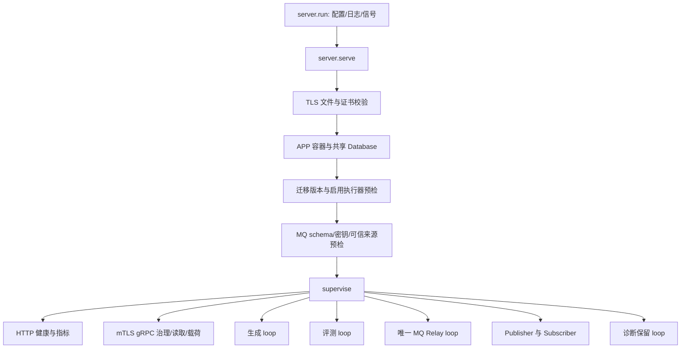

# 单进程架构与启动装配

## 本文回答

服务有哪些必需组件，启动时如何建立资源和前置条件，以及“进程启动”“就绪”“业务完成”之间的区别。

## 结论与边界

qs-ai 的统一服务由一个 asyncio 事件循环、一套 Dishka 容器、一个应用数据库池和一个生命周期监督器组成。HTTP、mTLS gRPC、生成、评测、MQ Relay、Publisher、Subscriber 和诊断保留任务作为同一进程中的组件运行。生成与评测可单独关闭；MQ 不能关闭后回退到旧 gRPC 执行、投递链路。

## 装配责任与顺序

[`server.run`](../../src/qs_ai/bootstrap/server.py) 读取 `Settings`，创建有界结构化日志适配器、注册 SIGTERM/SIGINT，并建立线程执行器。`serve` 按以下顺序装配：

1. 拒绝未启用 MQ 的配置，在创建应用依赖前验证 TLS 文件；TLS 文件读取通过线程执行器完成。
2. 创建开启严格依赖校验的容器，并从容器取得 `Database`。预检复用应用池，比较数据库 Alembic heads 和镜像中的 heads，不在启动时自动迁移数据库。
3. 对启用的生成、评测解析真实执行器，提前发现缺失模型绑定、授权地址或数据库依赖。
4. 创建 `MessagingRuntime`。先用共享池检查消息观测 schema，再建立可信密钥、QS mTLS 载荷通道、NSQ 连接及接收器。装配失败会清理已经拥有的资源。
5. 创建 gRPC 与 HTTP 服务并交给 `supervise`。所有 Publisher 启动后 Subscriber 才开始订阅；Relay 仅在 Publisher ready 后发布。

`EvaluationProvider` 显式加入统一容器，避免仅因为 HTTP 或普通生成装配就隐式启用评测。HTTP 本身只提供健康与指标入口；业务与治理接口的分布见 [接口与运维](../04-接口与运维/README.md)。

## 就绪不变量

- 所有已装配组件都被视为必需组件；任意组件异常退出或正常提前退出，都使监督器失败并排空其他组件。
- `RuntimeState.ready` 只在所有组件报告 started 后设为真；关闭时先清除 ready。
- `/readyz` 同时依赖数据库检查和运行状态；`/healthz` 反映被监督组件的存活状态。
- ready 说明当前启动与依赖检查通过，并不证明每个模型绑定、Broker 路径、QS 业务投影或真实用户请求已经验收。

## 失败窗口

| 失败位置 | 服务行为 | 持久业务影响 |
|---|---|---|
| MQ 未启用、证书错误 | 创建应用资源前失败 | 不产生执行任务 |
| 迁移版本不符 | 预检失败，关闭容器 | 不自动修补 schema |
| MQ schema 或密钥不满足 | 清理部分装配，服务失败 | 不自动建立消息表或猜测历史状态 |
| HTTP/gRPC 端口占用、组件提前退出 | 监督器失败、撤销 ready、排空其他组件 | 已提交状态保留，未提交事务回滚 |
| 已发送模型调用期间退出 | 当前 attempt 排空或取消 | 恢复依据已存调用回执；缺少响应不允许重发 |

## 选择、代价与限制

共享进程让容量计数、连接池和关闭顺序有一个明确所有者，减少多进程重复扫描和额外池的风险。代价是必需组件共享故障域；组件失败需要进程级重启。单循环容量是本地容量，增加服务副本不会自动形成全局提供方限流。

进程分拆是可选演进方向，但必须同时重新设计分布式模型容量、组件就绪、租约和消息扫描所有权；仅把同一 loop 移到第二个命令中不能保持这些约束。取舍分析见 [决策记录](../05-决策记录/01-单进程与共享生命周期.md)。

## 实现与验证

- 装配：[`server.py`](../../src/qs_ai/bootstrap/server.py)、[`container.py`](../../src/qs_ai/bootstrap/container.py)、[`messaging.py`](../../src/qs_ai/bootstrap/messaging.py)。
- HTTP 状态：[`health.py`](../../src/qs_ai/transport/http/health.py)。
- 可重复验证：[`test_single_server.py`](../../tests/test_single_server.py) 覆盖真实监听器、独立执行开关、端口冲突和 MQ 强制；[`test_messaging_runtime.py`](../../tests/test_messaging_runtime.py) 覆盖预检先于传输与 Publisher/Subscriber 顺序。
- 这些测试使用隔离替身或本地资源，不能据此宣称生产 MQ 或模型已接通。部署与现场证据另行记录。
