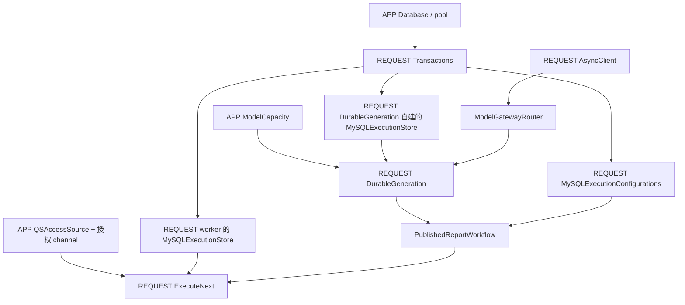
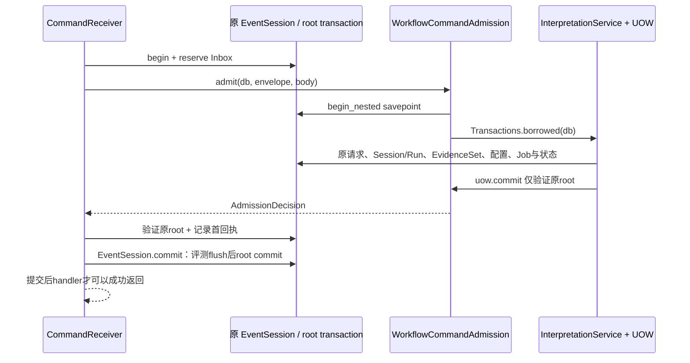

# Dishka 作用域与资源所有权

一次生成 attempt 会解析执行用例、使用数据库、回查 QS 并调用模型，但这四种动作并不共享一个生命周期。**Dishka 作用域决定对象何时创建和复用；`Transactions.open()` 决定数据库 Session 的生命；业务宿主决定哪次修改可以提交。** 理解这三个边界，才能避免把“同一个 REQUEST”当成“同一笔事务”，或在释放借用资源时关闭整个服务的连接池。

本文沿一次后台生成和一条 MQ Start 两个例子解释当前装配。核对源码基线为 `766b2aa`；APP/REQUEST 是 Dishka 的对象作用域名，本文中的数据库 Session 指 SQLAlchemy `AsyncSession`，不是业务解释 Session。

## 先确定谁实际创建对象

`create_container` 组成七个基础 Provider：Runtime、Persistence、Operations、Interpretation、Generation、Integration、Asset。正式 `serve` 再显式加入 EvaluationProvider，HTTP 或维护入口不会因为基础容器存在，就自动取得评测执行器。

容器启用 `STRICT_VALIDATION`：缺失工厂、APP 对象依赖只能在 REQUEST 取得的对象，会在构建时暴露。它保护依赖图与生命周期方向，不会替存储代码决定事务，也不会自动证明任意共享对象并发安全。

核心对象的实际创建、复用和关闭关系如下：

| 对象 | 谁创建、何时复用 | 谁结束它 |
| --- | --- | --- |
| `Settings` | 组合根传入 APP context，同一容器使用同一份配置 | 普通配置值，没有连接关闭动作 |
| `Database` 与 engine/pool | RuntimeProvider 的 APP 异步生成器，首次解析时创建；HTTP、gRPC、worker、MQ 共用该 Database | 顶层容器关闭时生成器调用 `Database.close()`，dispose engine |
| `ModelCapacity`、容量策略、QuotaBaseline、ExecutionMode/RuntimeLimits、EditableModelPolicy | APP 工厂，共享进程容量计数或固定策略 | 随容器释放；它们不拥有数据库连接或模型客户端 |
| `RecoveryCursor` | EvaluationProvider APP，评测 attempt 共用扫描游标 | 普通过程内对象，不能作为持久恢复证据 |
| `QSAccessSource` 与授权 mTLS channel | InterpretationProvider APP，一次建好，供多个用例回查 QS | 容器关闭时退出 `mtls_channel` 上下文 |
| `Transactions`、MySQL 存储适配器、用例 | REQUEST 解析，同一操作内复用，下一个操作得到新对象 | REQUEST 结束释放对象；Transactions 本身不持有一个长期 Session |
| 生成/评测 `httpx.AsyncClient` | 各自 REQUEST 异步生成器，随 Workflow 或 EvaluationWorker 解析创建 | REQUEST 正常结束或异常退出时关闭 client |
| `EventSession` | 每次自有 `Transactions.open()` 都通过 sessionmaker 新建 | open 的退出路径回滚未提交工作，再由 Session 上下文关闭 |
| Publisher、Subscriber、载荷 mTLS channel、Tornado HTTP client | MessagingRuntime 自己创建，不由 REQUEST Provider 创建 | 顶层 `serve` 在组件排空后调用 runtime.close |
| `BorrowedTransactions` | MQ 接单把已经活动的原 Session 包装成借用视图 | 不提交、不回滚、不关闭原 Session，也不 dispose pool |

工厂按需解析。未配置数据库 URL 时 `Database.engine=None`；未配置 QS access address 时使用 UnconfiguredEvidenceSource，不创建对应连接。正式服务的预检拒绝无数据库，启用生成也要求明确授权地址。

其中有**两种分别拥有的 QS channel**：APP 的 QSAccessSource channel 承载执行授权；MessagingRuntime 的 channel 承载 MQ 大载荷读取。它们都使用宿主的 mTLS 配置，但没有合并成“全进程唯一 QS 通道”。资源属于谁，取决于创建的上下文，而不是它们指向同一服务地址。

## 一次生成 attempt 使用了哪些作用域

正式生成 loop 每次执行的组合根形态是：

```python
async def generate() -> bool:
    async with container() as operation:
        worker = await operation.get(ExecuteNext)
        return await worker.once(settings.worker.lease_seconds)
```

这个子容器就是一次 REQUEST。`ExecuteNext`、执行存储和 Workflow 在其中复用；另外一个并发 attempt 或下一轮调用进入自己的子容器，不共享这些 REQUEST 对象。HTTP 由 `setup_dishka` 的请求集成建立作用域，`DishkaRoute/FromDishka` 在其中解析依赖；治理 gRPC 的 `SolutionManagement.write` 等入口用显式 `async with self.container()` 建立操作作用域。

生成依赖实际这样串接：



图中两个 MySQLExecutionStore 分别来自 InterpretationProvider 和 GenerationProvider 内的构造；它们共享同一 REQUEST Transactions，不是同一个 store 实例。GenerationProvider 在启用时创建 `AsyncClient(follow_redirects=False, trust_env=False)`，把它交给 ModelGatewayRouter，再组合 DurableGeneration 与 PublishedReportWorkflow。模型 endpoint、凭证和协议适配由网关读取宿主配置；这份客户端不是 Session 的业务资产。未启用生成时提供 UnconfiguredWorkflow，不创建可用模型执行路径；缺少授权地址或可用模型绑定等必要配置时，在解析 Workflow 时失败。

评测使用另一份 REQUEST AsyncClient。EvaluationProvider 为本次 EvaluationWorker 分配新的 `owner="evaluation:" + UUID`，但沿用 APP RecoveryCursor 与 ModelCapacity。因此两个评测 attempt 有不同 owner/client，扫描公平性与进程供应商容量仍共享。`ModelCapacity` 的计数只适用于同一 event loop；多进程不会因此共享一个供应商限额，数据库中的配额、Claim 与预算仍需独立检查。

REQUEST 退出会关闭模型客户端，无论 once 得到任务、没有任务或执行异常。它不会关闭 APP Database 或授权 channel。若试图为减少客户端创建而把它提升为 APP，必须重新证明并发使用和关闭顺序；当前实现的明确边界是“一个 attempt 一份客户端”。

### 同一 REQUEST 内仍然可以有多笔数据库事务

Transactions 工厂只接受 APP Database。每次 `open()` 都创建新的 EventSession，不在 REQUEST 开始时预先借出连接，也不把 Session 缓存在 Transactions 中。第一次 SQL/connection 访问或显式 begin 才形成相应数据库事务。

例如一个生成 attempt 的几个持久操作分别打开 Session：

| 阶段 | 需要持久的内容 | 与下一阶段的关系 |
| --- | --- | --- |
| claim/renew | Job、租约和当前 fence | 领取或续租分别提交短事务，不能把锁一直持有到模型返回 |
| 读取冻结输入/配置 | EvidenceSet、原 Publication、原资产 | 使用独立读取上下文，结束后回滚读取事务并关闭 Session |
| `begin_model_call` | 原 Invocation、冻结请求与派发状态 | 提交之后再执行外部模型调用 |
| `record_model_response` | 原响应或明确失败/unknown | 用新的事务提交响应证据 |
| `finish` | 经核验的 Artifact、Session/Run/Job 状态和待投递事件 | 结算在另一笔事务中核验 Claim 与原调用 |

整个 REQUEST 包住一次 attempt，并不包住一笔从 claim 到 Artifact 的数据库事务。两个存储方法即使用同一个 Transactions 对象，先后 `open()` 得到的也是两个 Session；调用方需要多步原子修改时，必须明确传递同一个 Session 或专用 UOW，不能只依赖“都从容器解析了”。

这个拆分使模型等待期间不占用业务锁。代价是每次结算必须重新核对持久身份、租约与版本，不能靠进程内对象仍存在就认定自己仍有权提交。具体派发和恢复窗口由[后台执行与调度](03-后台执行与调度.md)与[执行恢复](../03-基础设施/execution-recovery/README.md)展开。

## `Transactions.open` 拥有 Session，调用方拥有接受决定

自有 `Transactions.open` 的退出语义十分具体：创建新 EventSession；若 Database 已安装 state-event recorder，把它放入本 Session 的 info；交给调用方操作；最终执行 rollback，随后关闭 Session。**正常退出本身也不提交。**

如果存储方法要接受修改，它必须显式调用 `db.commit()` 或 `transactions.commit(db)`。成功提交后，退出时的 rollback 不会撤销已提交事实；尚未提交的读写、异常或取消路径，则不能被正常退出悄悄接受。打开一个读取 Session 后执行查询也可能 autobegin，清理这份读取事务是其所有者的责任。

共享 engine/pool 与共享 Session 的区别在这里体现：多个职责可以竞争同一个连接池，却分别拥有自己的事务。默认池预算为 pool_size 5、max_overflow 5，实际值以 Settings 为准；并发 REQUEST 数可以超过池容量，但超时、Claim 和持久业务预算不会因“容器已经解析成功”而消失。

`EventSession.commit()` 还多做一步：当本 Session 有 recorder 和活动事务时，先 `recorder.flush(self)`，把标记的评测 Run 状态写进原事务，再执行底层 root commit。`changed_evaluation` 只标记本 Session 的 Run ID；rollback 会清除标记。这样“评测状态变了、状态事件没写入”不会变成两次独立提交。

参与者结果事件并不是都由这个 flush 自动补写。`stage_state` 在保存解释状态时，就通过 `db.info["state_events"]` 调用 recorder，把原 interpretation_result_outbox 与 MQ 记录放进当前事务；评测标记则在根提交前 flush。两条路径都借用同一原 Session，不能先提交业务再在另一个事务补事件。

## MQ Start 为什么必须借用原根事务

MQ 接单需要把 Inbox 决定、原业务效果和首回执同时接受。它没有通过 Dishka REQUEST 自动得到这笔大事务：MessagingRuntime 从 APP Database 构造自己的 Transactions，CommandReceiver 对每条消息明确 `open()` 并 `db.begin()`。

Runtime 创建 admission 时短暂打开容器子作用域，取出 EvidenceSource、容量/配额策略、EditableModelPolicy 和 RuntimeLimits。这些依赖都是 APP 对象；它没有把某个 REQUEST 的 MySQL Session 或模型 AsyncClient 留给所有消息复用。接单本身也不调用模型。

一条正常 Start 的事务顺序是：



`BorrowedTransactions` 保存的是 `session.get_transaction()` 的原活动对象。它的 open 返回这个同一 Session，进入和正常返回时验证原事务仍活动且身份未改变；它的 commit 只核对 Session 与原事务，**没有调用原 `session.commit()`**。它也没有创建 Session、退出 rollback 或关闭连接池的职责。

`MySQLUnitOfWorkFactory` 把 `transactions.commit` 作为回调交给 UOW。因此同一个 `uow.commit()` 在普通自有调用中完成提交，在 MQ 借用调用中仅检查边界，由 receiver 保留最终提交权。SDK 的 `bind(db).validate()` 还会在业务处理前后核对原事务边界；业务适配器不能绕过回调直接提交或替换 root。

这里的 savepoint 有独立用途：若 Change 因旧 expected_version 等确定业务规则拒绝，先撤销 savepoint 内的局部预留/修改，再在原 root 中保存 REJECTED 的 Inbox 和回执。它不是另一笔独立数据库事务，不能由内层成功就证明外层已提交。

### 两种异常，最终接受的内容不同

| 情况 | 原事务怎样结束 | 后续允许的动作 |
| --- | --- | --- |
| 合法命令被确定拒绝，例如版本冲突 | savepoint 内局部业务写入回滚；原 root 可以提交拒绝决定与首回执 | 重投同命令复用原拒绝，不能默默换版本 |
| Start 本身形成持久准入拒绝，例如没有可用发布 | 原业务规则返回 blocked 记录；receiver 连同 REJECTED 回执、Inbox、原状态提交 | 后来发布不改变这份原决定 |
| 首回执或状态事件保存失败 | 原 root 无法提交，Transactions 退出回滚业务、Inbox、状态/首回执 | 在独立失败记录事务保存技术尝试；未决结果按原身份恢复 |
| 执行协程被取消、数据库异常 | 没有由 borrowed wrapper 接受的提交；Session 所有者负责退出清理 | 不把异常伪装成新的业务拒绝，也不在清理中调用模型 |

借用协议避免“业务先单独提交，之后 Inbox/回执失败”的窗口。它不是允许任意代码提前 `db.commit()` 后还能神奇撤销的机制：一旦绕过宿主提交协议，事后检查只能报告破坏，不能回滚已经提交的数据。维护时需要保留回调、原 Session、原 root 和锁顺序，而不只是让方法签名看起来一致。

读取已经触发 SQLAlchemy autobegin 时，也不能顺手再 `begin()` 或替换原 root。进入 MQ 的事务是 receiver 已经创建并持有的那个；需要在其中回滚局部写入时，由 admission 明确创建 savepoint，而不是借用包装器暗中接管事务。

## 服务停止时，谁先释放什么

`serve` 拥有顶层容器，也拥有 MessagingRuntime。HTTP `create_app` 接受统一服务传入的容器时，`owns_container=False`，HTTP lifespan 不关闭它；独立 HTTP app 自建容器时才由自己的 lifespan 关闭。这避免 HTTP 停止先 dispose pool，使仍在排空的 gRPC/MQ/worker 无法结算。

统一监督器先撤销 readiness、停止接单并排空组件；attempt 的 REQUEST 随退出关闭模型客户端。`serve` 最后先停止 gRPC、关闭 MessagingRuntime，再关闭容器。Runtime 关闭自有 subscribers/publishers、Tornado client 与载荷 channel，移除 `database.state_events`；它不 dispose APP engine。容器负责 APP QSAccessSource channel 与 Database 的最终释放，具体 APP finalizer 次序由依赖图管理，不能从这两个对象的表格顺序推断。

具体 APP 工厂的收尾顺序由依赖容器管理，不能在业务 adapter 内再把 Database/channel 手动关闭一次。共享资源存在，不表示所有职责都拥有它；自有资源的清理也不能代替 Artifact、Inbox 或状态事件的业务提交。进程停止与租约恢复的完整流程见[生命周期与优雅关闭](04-生命周期与优雅关闭.md)。

## 修改资源或事务代码前，怎样查证

| 需要核对的事实 | 源码入口 | 测试断言及范围 |
| --- | --- | --- |
| APP 资源只建一次，REQUEST 对象不跨操作复用；较短生命周期依赖不能被 APP 捕获 | [容器](../../src/qs_ai/bootstrap/container.py)、[核心 Provider](../../src/qs_ai/bootstrap/providers/core.py) | [test_container.py](../../tests/test_container.py)：跨操作 Transactions/Readiness 不同，Database 相同；异常与 HTTP 自建容器资源关闭一次；缺依赖/短作用域被拒绝 |
| 生成与评测客户端属于哪个 attempt | [GenerationProvider](../../src/qs_ai/bootstrap/providers/generation.py)、[EvaluationProvider](../../src/qs_ai/bootstrap/providers/evaluation.py) | [生成装配测试](../../tests/test_generation_container.py) 检查禁用/缺配置和无网络组合；[评测装配测试](../../tests/test_evaluation_container.py) 检查 REQUEST client 关闭、owner 更新、APP cursor 复用 |
| 授权 channel 是 APP；HTTP 何时关闭容器 | [InterpretationProvider](../../src/qs_ai/bootstrap/providers/interpretation.py)、[create_app](../../src/qs_ai/bootstrap/api.py)、[serve](../../src/qs_ai/bootstrap/server.py) | [单进程测试](../../tests/test_single_server.py) 检查共享容器和实际 listener；[容器测试](../../tests/test_container.py) 检查自建 HTTP 容器关闭；授权行为另见 [test_qs_access.py](../../tests/test_qs_access.py) |
| 共享 pool 不共享 Session，也能在连接失效后继续使用 | [Database / Transactions / EventSession](../../src/qs_ai/infrastructure/persistence/mysql/database.py) | [test_shared_runtime_pool.py](../../tests/integration/test_shared_runtime_pool.py)：五种职责模拟共池，100 个不同 Session，退出后连接归还、失效连接后继续查询；需要隔离 MySQL，不是实际五种 listener 的业务压力测试 |
| MQ runtime 借用 APP pool，自有载荷通道和传输资源 | [MessagingRuntime](../../src/qs_ai/bootstrap/messaging.py) | [test_messaging_runtime.py](../../tests/test_messaging_runtime.py)：替身断言预检先 rollback/close 再建传输、runtime 关闭 channel/移除 recorder，未 dispose engine；[真实预检测试](../../tests/integration/test_messaging_preflight.py) 另验证隔离 MySQL 的只读预检 |
| UOW commit 如何从自有切到借用 | [事务包装器](../../src/qs_ai/infrastructure/persistence/mysql/database.py)、[UOW 工厂](../../src/qs_ai/infrastructure/persistence/mysql/interpretation.py)、[命令适配](../../src/qs_ai/infrastructure/workflow_transport/command_admission.py) | [test_mq_admission.py](../../tests/integration/test_mq_admission.py)：版本拒绝撤销局部预留但持久 Inbox；首回执失败撤销业务与 Inbox；成功/拒绝原命令重放 |
| 状态事件与原业务是否共同接受 | [interpretation_result_outbox](../../src/qs_ai/infrastructure/persistence/mysql/result_outbox.py)、[StateEventRecorder](../../src/qs_ai/infrastructure/workflow_transport/state_events.py)、[CommandReceiver](../../src/qs_ai/infrastructure/workflow_transport/mq_receiver.py) | 同一 [MQ 接单测试](../../tests/integration/test_mq_admission.py) 的 `test_failed_evaluation_event_rolls_back_projection_and_sequence` 验证状态、序号、Inbox/Outbox 一起回滚，再以原消息成功提交 |

这些入口分别证明对象装配、替身清理断言和数据库事务行为。只运行容器单元测试不能证明 MySQL 原子性；集成测试 skip 也不能当成已验证。所有连接类验证需要一次性环境，不应为了补文档证据连接生产。
