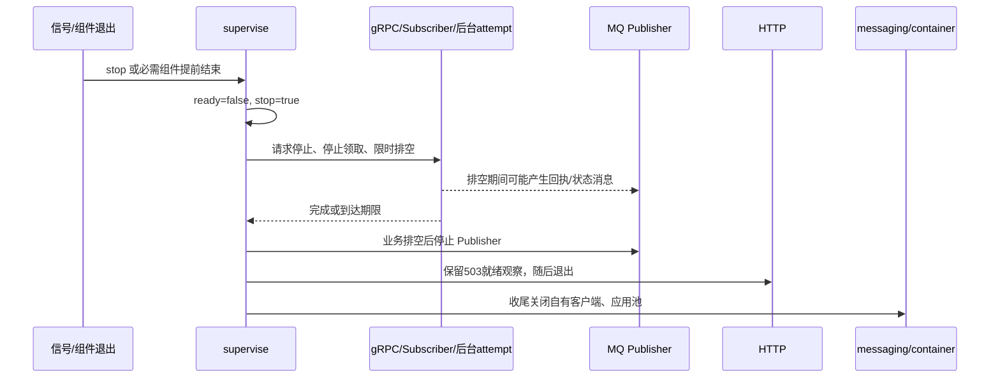

# 生命周期与优雅关闭

## 本文回答

谁处理信号，如何撤销就绪、停止接入和排空工作，以及排空失败后如何保证可恢复。

## 结论

`server.run` 是唯一信号所有者，`supervise` 是统一组件生命周期所有者。组件管理进程存活，数据库管理业务进度；关闭不会把未提交的执行推断成成功，也不会把缺少模型响应推断成未发送。

## 监督器不变量

每个 `Component` 明确声明 `run`、`stop`、`started` 和 `shutdown_seconds`。启动默认有 30 秒预算。所有 started 才置 ready；任意必需组件提前完成都会使 `state.failed` 为真。finally 先撤销 ready、设置共享 stop，再并发 drain。

drain 在组件预算内调用 stop 并等待运行 Task。超时产生 `drain_timeout`；无论成功或失败，最后取消仍存活的 Task 并等待清理。停止时异常不输出驱动文本，避免凭证和业务载荷混入日志。`HTTPServer.capture_signals` 不安装 Uvicorn 的独立信号处理。

## 组件关闭责任

- 后台 loop：先停止新 attempt，保留已有工作及其 heartbeat，达到关闭预算后取消未结束工作。
- gRPC：使用配置的 grace 关闭监听器和正在运行的调用。
- Subscriber：在预算内完成已接收消息处理；持久业务接单必须先提交再完成处理，存储失败保持可重投。
- Publisher：等待非 HTTP、非 Publisher 的组件排空，再停传输。业务排空可能仍需首回执或失败交接 PUB，不能先断 Publisher。
- HTTP：等待其他组件排空后退出，使关闭期间 `/readyz` 仍能报告 503。
- `serve` finally：兜底停止 gRPC，先关闭消息 runtime，再关闭容器；最终收尾使用 5 秒超时。
- `run` finally：限时排空日志写入线程，并移除 SIGTERM/SIGINT 处理器。

## 取消与持久业务状态

| 关闭发生点 | 保留下来的事实 | 下一次执行依据 |
|---|---|---|
| Job 领取前 | 仍 queued | 下次数据库领取 |
| 已领取、尚未 dispatch | Lease 与 Job 所有权 | 过期后新 fence 领取，重新验证配置和授权 |
| dispatch marker 已提交 | 调用可能已经发送 | 按 unknown 处理，不能再次发送 |
| 模型响应已提交、Artifact 未接受 | durable response | 重放本地准备/验证和接受逻辑，无第二次模型调用 |
| 状态与 Outbox 已提交、PUB 未完成 | 原始 wire 和消息身份 | Relay 继续传输并等待业务确认 |
| 接单事务未提交 | 无完整业务受理 | 回滚并重投，不生成伪拒绝 |

进程 shutdown 和业务 cancel 是两套语义。shutdown 终止本地工作；业务取消由 Session 或评测生命周期命令及其持久状态表达。不能仅因 Task 被取消就将业务标为 canceled。

## 选择、代价与限制

统一排空让 Publisher、Subscriber、工作和池的依赖顺序可核查。代价是总体预算要容纳最慢业务组件与后续传输清理；编排平台的 termination grace 需要与这些预算匹配。预算耗尽会取消本地 I/O，而安全恢复依赖数据库证据，无法保证所有外部调用在退出前拿到回执。

逐组件“自动重启”是另一方案，但可能在资源尚未清理时产生新消费者或新池，并掩盖部分失败的 readiness。当前选择进程级失败，由部署层重启；其操作含义见 [接口与运维](../04-接口与运维/README.md)。

## 实现与验证

- [`lifecycle.py`](../../src/qs_ai/bootstrap/lifecycle.py)、[`server.py`](../../src/qs_ai/bootstrap/server.py)、[`messaging.py`](../../src/qs_ai/bootstrap/messaging.py)、[`daemon.py`](../../src/qs_ai/bootstrap/daemon.py)。
- [`test_runtime_lifecycle.py`](../../tests/test_runtime_lifecycle.py) 覆盖 readiness 顺序、必需组件退出、启动超时与 drain 超时；[`test_server_signals.py`](../../tests/test_server_signals.py) 覆盖信号；[`test_messaging_runtime.py`](../../tests/test_messaging_runtime.py) 覆盖 Publisher 后于业务排空停止。
- [`test_generation.py`](../../tests/integration/test_generation.py) 包含 dispatch/response 边界的进程终止恢复验证。真实部署的 grace 与重启行为需独立现场证据。
