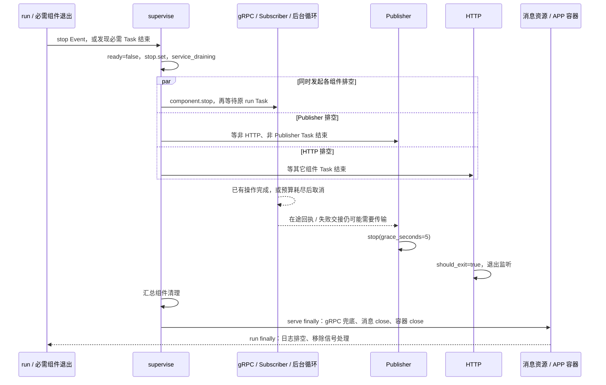

# 生命周期与优雅关闭

qs-ai 收到 SIGTERM/SIGINT，或任何必需组件提前结束时，会先撤销就绪，再停止接新工作、限时等待已有操作，最后关闭消息资源和应用容器。**关闭保证的核心是保留已经提交的事实，让下一次启动据此恢复；它不保证退出前生成完所有报告、清空 Outbox 或拿到全部 QS 业务 ACK。**

本文按 `766b2aa` 的业务源码核对，以一个正在生成 MBTI 报告的进程为例。预算取仓库默认和 production YAML，不能据此推断当前容器开关、已部署版本或实际退出耗时。启动前检查另见 [启动装配](01-单进程架构与启动装配.md)，事务所有权见 [Dishka 作用域](02-Dishka作用域与资源所有权.md)。

## 谁可以开始关闭，谁负责执行

[server.run](../../src/qs_ai/bootstrap/server.py) 是 SIGTERM/SIGINT 的唯一处理者。它安装的回调只设置一个共享 `asyncio.Event`，不直接取消生成 Task、不关闭池、不修改 Session 状态。HTTPServer 的 `capture_signals` 被覆盖，因此 Uvicorn 不再安装另一套信号处理。

[lifecycle.supervise](../../src/qs_ai/bootstrap/lifecycle.py) 管理已装配组件的 run Task、启动和排空。每个 Component 明确提供 `name / run / stop / started / shutdown_seconds`。这个监督器有三类结束触发：

| 触发 | 怎样进入关闭 | 退出含义 |
| --- | --- | --- |
| SIGTERM/SIGINT | 共享 stop Event 被设置，监督器结束正常等待 | 可以正常返回；仍需完成关闭处理。 |
| 必需组件正常提前返回、抛异常或意外取消 | 监督器发现 Task 已结束，标记 `state.failed` 并抛出失败 | 进程失败，其它组件随之排空；不单独重启这个组件。 |
| 30 秒启动预算耗尽，所有 started 仍未成立 | timeout 同样设置 failed，进入 finally | 启动失败；已有组件可能已经执行业务。 |

“组件正常返回”也属于失败，因为 generation、MQ、gRPC 或 HTTP 的 run 都应长期存活。某个 `attempt()` 发生普通异常则由后台循环退避处理，通常不会结束组件；两者的责任不同，详见 [后台调度](03-后台执行与调度.md)。

组件之间共享进程故障域。不能在 MQ 组件退出后继续让其它接口长期报告整个服务健康，也不能由局部自动重启在旧资源尚未释放时创建第二组消费者。

## 收到信号以后，实际发生的顺序

图中的业务、Publisher 和 HTTP **同时开始各自的 drain**，依赖顺序通过等待 Task 实现，并不是先串行耗完全部业务预算，再开始计算 Publisher 预算。

监督器 finally 的前三步固定为 `state.ready=False → stop.set() → service_draining`。这只改变进程状态并写诊断事件，不写业务取消，不把在途命令标记成功，也不产生一份模型响应。

随后每个 drain 在自己的 timeout 内调用 `component.stop()`，再用 `shield` 等待原 run Task。预算耗尽记录 `drain_timeout`；停止阶段其它异常或取消记录 `component_stopped_with_error`，仅保留类别，不输出可能包含凭证和业务正文的驱动异常。最后取消仍存活的 run Task，并等待其 finally 清理。

这里有一个实际边界：**取消后的 `gather` 在 component timeout 外。** 代码依赖子任务协作响应取消；timeout 是排空预算，不能据此承诺进程一定在同一墙钟期限内消失。`serve` 最后的 `grpc_server.stop(0)` 也在后面的资源 5 秒 timeout 之外。

## 各组件在自己的预算中做什么

### 后台执行：先停止下一次领取，允许当前 attempt 结束

[run_loop](../../src/qs_ai/bootstrap/daemon.py) 的 consumer 在每次 attempt 前检查共享 stop。一旦 stop 已设置，不再开始下一次 attempt；处于 idle/backoff 的等待也会被 stop 提前唤醒。

假设生成 worker 已为 Session S 领取 Run R 的 Job，正在等待供应商响应。关闭并不立即向它写 `canceled`：run_loop 先给原 attempt 配置的排空时间，它的 heartbeat 可以继续维持租约。如果生成、验证、授权复核和接受在预算内结束，原事务正常提交；超过预算，循环取消 consumer，工作及 heartbeat 通过各自 finally 收尾。

这不意味着每种工作流都拥有完全相同的心跳和取消机制。生成的工作与 heartbeat 互相监督；评测的 candidate/serial 租约路径不同，关闭仍以它们实际已提交的派发和回执为依据。不能靠进程退出清掉调用预算或把 unknown 变成可重发。

MQ Relay 也是后台循环。stop 后它不再开启下一轮扫描；业务 attempt 在 drain 中新提交的 Outbox，**未必能在本次退出前再被 Relay 扫到**。持久 Outbox 留给下一次启动继续投递。

### gRPC 和 Subscriber：已有接入处理排空

gRPC `stop` 使用 `grpc.shutdown_grace_seconds`，默认 5 秒，允许已有 RPC 在 grace 内结束，之后取消仍在执行的调用。它与关闭池不是同一个动作，治理调用的提交事实由数据库决定。

Subscriber `stop` 使用本次基础 drain 预算，停止接新消息并等待已有处理。命令接收的根事务必须先持久提交 Inbox 决定、业务效果和原回执，才能完成消息处理；存储异常或取消不能伪造一份业务拒绝来确认消费。接单事务尚未提交时回滚并保留重投可能性，已提交但消费确认丢失时用原身份重放。

### Publisher：保留尾部传输机会，不等待全部业务交付

[MessagingRuntime.components](../../src/qs_ai/bootstrap/messaging.py) 的 Publisher halt 先等待所有非 HTTP、非 Publisher 的组件 Task 结束，再调用 `publisher.stop(grace_seconds=5)`。这样业务排空仍可使用 transport 完成在途 PUB 或技术失败交接。

等待条件是这些 Task 到达终态，**不是所有 Outbox 已清空，更不是 QS 已返回 STORED**。Publisher 的 Broker 确认也不能替代原事件的业务 ACK；结果交付仍按 [消息设计](../03-基础设施/messaging/README.md) 保存原身份和关联。

多个 Publisher 不互相等待，避免形成关闭环。Subscriber、Relay 和执行 Task 若预算耗尽，会被取消并到达终态，释放 Publisher 的依赖等待；实际取消清理耗时仍受前述协作限制。

### HTTP：尽量保留排空期就绪观察

HTTP halt 等待其它组件 Task 结束后才设置 `http.should_exit=True`，让 `/readyz` 在正常 drain 期间尽量可用。由于 runtime ready 已撤销，就绪探针应报告 503；HTTP 自身故障、预算耗尽或连接异常时则可能已经无法访问，不能承诺整个区间都有探针响应。

`/healthz` 不等于 `/readyz`。正常收到信号时 `state.failed` 可以仍为 false；只要所有必需 Task 还存活，healthz 可能短暂继续返回 200。随后某个 Task 结束，healthy 检查才不再成立。组件失败触发关闭则已设置 failed。这些状态不表达“报告已完成”或“Outbox 已交付”。

## 用生产配置算一次预算，而不是给出退出时限承诺

假设 messaging、generation、evaluation 都开启，并采用当前 production YAML 的排空参数：生成 130 秒、评测 190 秒、gRPC grace 5 秒、delivery 15 秒。组合根为后台 Component 额外加 1 秒。

| 组件/阶段 | 从代码计算的预算 | 计算依据 |
| --- | --- | --- |
| gRPC | 6 秒 | grace 5 + 1。 |
| generation | 131 秒 | worker shutdown 130 + 1。 |
| evaluation | 191 秒 | production evaluation shutdown 190 + 1。 |
| mq_relay | 16 秒 | delivery shutdown 15 + 1。 |
| 基础 drain | 191 秒 | 上述已装配组件的最大值，在加入消息 transport 前计算。 |
| 各 Subscriber | 192 秒 | stop grace 为基础 drain 191，Component 为 191 + 1。 |
| 各 Publisher | 197 秒 | 等业务 Task，再给传输 grace 5；Component 为 191 + 6。 |
| diagnostic_retention | 6 秒 | 清理循环 shutdown 5 + 1，不参与前面的基础 drain 计算。 |
| HTTP | 201 秒 | 加入 HTTP 前所有 Component 最大值 197 + 4。 |
| 消息资源与容器 close | 共用 5 秒 | `serve` finally 内同一个 timeout。 |
| 日志 handler shutdown | 配置 2 秒 | `run` finally 在线程中调用，不是另一个 component。 |

[Compose](../../deploy/serverA/compose.yaml) 的 `stop_grace_period=210s` 容纳上述配置预算。它们并发运行，不应相加成数百秒的串行排空；也不能将 `201+5+2=208` 写成整体退出的严格上限。取消清理、gRPC 兜底和线程/事件循环收尾还有各自行为，现场要查看实际停机证据。

如果评测关闭，基础 drain 按剩余组件重新计算；如果调整模型超时、并发或 evaluation shutdown，也要重新核对传输和编排平台预算。不能只加长平台 grace 就声称 unknown、提交故障或业务交付已经解决。

## 退出发生在哪一步，下一次凭什么继续

以下是正式解读路径的恢复依据。领取仍要求 Job 可执行、未耗尽 3 次 attempt、Session/Run 符合当前 guard；接受还要求原配置与响应完整、当前版本/fence 有效，并通过两次 QS 当前授权。响应已保存不等于必然完成。评测的独立响应屏障只有 `candidate_v2`，不要把这一行通用化到旧 serial 路径。

| 退出时刻 | 原来已持久的事实 | 下一次允许做什么 |
| --- | --- | --- |
| Job 领取之前 | queued Job 和原 Session/Run、接受配置 | 后续 worker 按原条件领取，不创建新请求。 |
| Claim 已提交，模型派发尚未提交 | 原 Run 的租约、attempt 和 fence | 租约失效后按新 fence 恢复原 Run；再次核对配置和访问权。 |
| `dispatched/unknown` 已提交，缺少确定响应 | 原调用可能已经发生，保留原 Invocation 和预算 | 进入未知结果处理，不能推断“未发送”后自动重调。 |
| 正式生成原响应已提交，Artifact 尚未接受 | 持久 ModelResponse（raw_output、validation_output、provider request ID 等）与冻结请求 | 从原响应重新做本地准备/校验和接受；不产生第二次模型调用。 |
| `failed` 已持久，业务 finish 尚未完成 | 原明确 failure_code 与调用身份 | 按原失败结算，不重新调用，也不一概改成 unknown。 |
| Artifact、完成状态和事件 Outbox 已提交 | 不可变成果及原 event/wire/关联 | 投递原事件、等原 QS ACK；不重新生成。 |
| MQ 接单根事务尚未提交 | 没有完整已提交的 Inbox/业务/回执决定 | 回滚、允许原消息重投；不能用内存状态确认业务接单。 |
| 根事务已提交，但 NSQ 消费确认丢失 | 原接单决定和首回执已经存在 | Inbox/业务重放返回原决定；不重复创建 Run。 |

操作系统强制终止不会运行这些 finally，但数据库提交点仍是下一次恢复的依据。新进程不能靠旧进程没有干净退出就重置调用历史。人工 Retry 是另一个明确授权的新业务 Run，关闭不自动触发它。

## 实际停机时应能对上哪些证据

对于一个有在途生成的正常 SIGTERM，期望看到 `service_draining` 先于组件停止；已有 attempt 完成或取消后，Publisher 和 HTTP 才按依赖收尾。若某组件出现 `drain_timeout`，需要查该原 Run/Invocation/事件的持久状态，而非仅看进程最后退出码。

如果先出现 `service_failed`，再进入 drain，是必需组件或启动失败路径。`startup_or_runtime_failure` 只记录安全的错误类型；业务是否完成仍需原事务、响应及 ACK 关联来判断。日志缺失也不能作为“业务没有提交”的证据。

`serve` 收尾先兜底 `grpc.stop(0)`，再在共用 5 秒预算内 `messaging.close()` 和 `container.close()`。消息 close 停 pub/sub、关闭自有 HTTP 和 payload 通道，并移除 Database 的 state-event recorder；容器再关闭 APP 授权通道和数据库 engine。REQUEST 客户端随各作用域释放。`run` 最后排空日志、移除信号处理；这不是新增的业务提交阶段。

## 代码与测试怎么查证

| 结论 | 实现入口 | 现有验证及范围 |
| --- | --- | --- |
| 撤销 ready 在 stop 前，正常提前退出也整体失败，启动/drain 超时触发清理 | [lifecycle.py](../../src/qs_ai/bootstrap/lifecycle.py) | [test_runtime_lifecycle.py](../../tests/test_runtime_lifecycle.py) 使用受控 Component 检查顺序、失败和取消 finally；不运行真实模型。 |
| stop 阻止下一次领取，当前 attempt 在预算内完成或取消 | [daemon.py](../../src/qs_ai/bootstrap/daemon.py) | [test_daemon.py](../../tests/test_daemon.py) 检查 idle/backoff 被唤醒、排空和强制取消。 |
| SIGTERM/SIGINT 实际触发进程路径，并让在途 RPC 完成或被取消 | [server.run](../../src/qs_ai/bootstrap/server.py) | [test_server_signals.py](../../tests/test_server_signals.py) 用真实子进程和本地 gRPC，但替换 `serve`，不证明完整 MQ/数据库停机。 |
| Publisher 等业务 Task，关闭后释放自有消息资源 | [messaging.py](../../src/qs_ai/bootstrap/messaging.py) | [test_messaging_runtime.py](../../tests/test_messaging_runtime.py) 使用 transport 替身断言顺序；不证明尾部事件获 QS STORED。 |
| ready/healthy 的探针区别 | [health.py](../../src/qs_ai/transport/http/health.py) | [test_health.py](../../tests/test_health.py) 检查独立 app 的数据库探测和错误脱敏；runtime 条件由上述生命周期测试、[单进程监听器测试](../../tests/test_single_server.py) 和源码核对。 |
| 派发/响应提交边界在终止后可恢复 | [generation.py](../../src/qs_ai/application/execution/generation.py)、[execution.py](../../src/qs_ai/infrastructure/persistence/mysql/execution.py) | [生成集成测试](../../tests/integration/test_generation.py) 在隔离数据库验证提交失败、取消与进程终止；需要可销毁 MySQL，不等于生产停机演练。 |

本地测试可以证明具体停机分支和持久恢复规则。部署平台是否先发 SIGTERM、实际 grace 是否足够、外部供应商的在途请求以及某个成果最终 STORED，需要绑定现场版本、时间和原业务身份另行查证。
