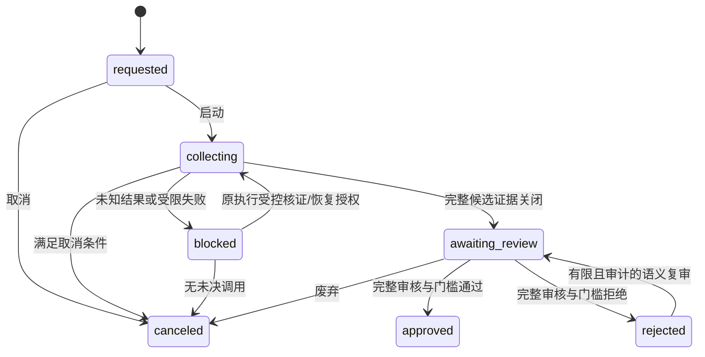

# 评测候选、门槛与审核设计

本文回答固定评测怎样运行、技术成功和内容质量怎样分开、何时允许审核，以及如何处理 unknown、取消、废弃和复审。核对基线：`c977cb9`，2026-10-06；实际模型与人工结论须另存绑定原 Run 的证据。

## 结论与问题

评测 Run 固定十一项资产、案例/候选槽位、执行模式和接受规则。每个候选先生成，再获得独立语义回执；原调用证据完整关闭后才能提交双角色人工审核并重新计算最终门槛。模型完成、候选完成、审核批准和业务发布是不同完成点。

重复生成不能用来挑走低质量结果，失败恢复不能覆盖原回执，未知调用不能当失败自动重发。这样才能让同一版本的评测结果具有可审计的分母、质量依据和责任人。

## 概念与冻结身份

| 对象 | 规则 |
| --- | --- |
| 评测 Run | 组织范围、请求者、版本与状态、十一项 EvidenceReleaseIdentity、Manifest、原策略字节与执行模式 |
| Slot | `(case_id, ordinal)` 唯一候选槽位；当前支持计划为 7 × 5，另有独立预检 |
| GenerationCompletion | 一次生成执行的状态、输入/输出指纹、Route、供应商回执及调用数 |
| Candidate | 某槽位被接受的规范生成输出；不能用质量原因任意换候选 |
| SemanticCompletion | 绑定同一候选输出指纹的裁判回执、分数及断言 |
| Checkpoint | 执行准备/外发、owner、invocation 和租约；旧串行 Run 与 candidate_v2 使用各自冻结模式 |
| 人工审核 | 每候选两个不同审核人，角色 `assessment_semantics`、`safety_product`，原因、时间和结论 |
| FinalReview | 完整证据与门槛重新计算后的批准或拒绝审计，不直接发布 |

资产引用只有全部匹配原字节，才构成 Run 的固定条件。评测输入构造版本不是 Session workflow_version：三主题评测使用 `qs-published-snapshot-v3`，正式报告仍来自 `qs-report-snapshot/v2`。二者不能混用或重新贴标。

## 状态与链路

先启动并完成预检，再领取可执行槽位，保存准备和外发证据，调用生成模型并先持久化响应，再校验/投影候选。语义调用按原候选字节和原裁判资产运行，响应同样先落库。完整候选和语义证据、恢复记录、调用预算、时间顺序与关闭转移验证通过后进入 awaiting_review。

每个执行历史只能有冻结策略允许的次数；失败和 unknown 仍占已外发预算。已有响应的投影重放不再次调用供应商；已外发而响应未知的执行进入 result_unknown，须绑定准确 execution_id 核证后才能授权替代。语义失败只恢复语义执行，不能重新生成候选。

## 并发与事务

执行模式由创建时冻结，`serial_v1` 和 `candidate_v2` 是有限兼容路径。candidate_v2 将 Run 计划拆成候选槽位，允许独立生成/语义工作并发；每个槽位的租约、invocation 与预算仍由数据库原子领取及比较处理。进程内并发和 provider 容量控制限制外发数量，不能替代数据库所有权或完整证据校验。

领取、标记外发、保存响应、投影候选和最终结算采用各自短事务；供应商调用位于事务外。先保存原响应再投影，使响应已收到但投影前崩溃时可以离线恢复。Run/槽位/检查点版本约束防止失去租约的 worker 结算，失败计数不能被另一个 worker 的补偿覆盖。

原 frozen suite 与策略固定计划；新并发设置不能改变旧 Run 的执行模式。本文只定义业务完整性；具体领取、容量与故障窗口以执行实现为准。

## 门槛与质量

G1/G2 的前置校验负责原身份、完整清单、预检与冻结执行证据/预算、调用恢复授权及关闭历史。G3–G5 在这个前提上区分技术执行、候选质量和人工责任，不能只凭一个布尔质量结果批准。

| 层次 | 检查内容 | 不能证明 |
| --- | --- | --- |
| 结构与确定性 | Schema、数量/顺序、引用存在、维度层级、场景类型、来源与报告绑定 | 不证明自然语言忠实或有新信息 |
| G3 执行/完成 | 按冻结接受规则核对技术执行率或候选完整完成 | 不证明内容可发布 |
| G4 质量 | 案例断言稳定性、硬断言、五项语义评分的单项下限及整体均值 | 不替代人工双角色判断 |
| G5 人工责任 | 完整双角色签名、不同审核人、任何拒绝均阻断 | 不由合成测试签名证明真实批准 |

语义评分字段为 faithfulness、cross_dimension_quality、suggestion_actionability、audience_clarity、concision。三主题场景把 cross_dimension_quality 定义为三主题解释质量，不能沿用旧“至少两轴”的语义目标；原量表与旧 MBTI 目标保留。

新 Run 冻结 `candidate-completion/v1` 接受补充规则：候选完整完成率要求 1.0，技术执行率、首轮成功率和恢复次数作为观测。G1/G2、预算、未决调用拒绝、G4 质量和 G5 人工责任保持。旧 Run 保持原门槛计算，只有显式且审计的规则采用才改变这一补充规则；不能回写原政策资产或历史结果。

## 取消、废弃与有限复审

取消分为持久意图与终态。collecting/blocked 在有活跃候选槽、dispatching 检查点或未决 unknown 时，可以保存 `cancel_requested` 并增加版本，停止新派发而不直接变为 canceled；已外发调用继续按原回执规则排空，unknown 不因取消而获得重发授权。

`finish_cancellation` 只在没有活跃 Claim、没有检查点且未决 unknown 为零后，复用原审计取消规则形成 canceled。可以立即结束的 requested/collecting/blocked/awaiting_review 仍需满足领域终态资格；awaiting_review 的终止必须明确为废弃，原因码为 operator_discarded，其他取消为 operator_canceled。取消保留历史证据，不承诺撤回已经外发的供应商调用。

语义矛盾复核只支持原裁判 `forbidden_claims_absent` 断言的证据绑定审核：原语义执行及输出指纹、失败断言序号、原 detail、候选真实摘录与原因全部保留。有效双角色审核可形成受控裁定，不能改写模型原回执或任意豁免质量失败。

复审最多三轮，仅适用于 rejected、门槛 v2、G3/G5 已通过而 G4 只因指定语义硬断言失败的 Run。重新核证原门槛后圈定受影响候选；原完整审核轮次入历史，未受影响签名保持，受影响候选需要复审之后的新签名。不能用复审重跑模型、替换候选或放开低评分/结构失败；关闭时间和历史门槛均保留。

## 失败与选择代价

unknown 的原记录不能被“现在计数为零”掩盖，关闭时逐条核对原 unknown 与授权、替代执行、时间和预算。语义契约恢复是独立、受限、审计的决策；技术失败不会自动成为成功候选。完整双签尚未完成时不能 Finalize，即使其他门槛已经失败也应保持待完成审核。

保存每次回执及原策略比只保存最终评分耗费更多存储，但保留分母、可复算门槛与故障解释。固定候选和双角色审核使质量决策更可信，代价是审核工作量；candidate_v2 提高吞吐，代价是槽位领取、响应投影、关闭检查和容量控制更复杂。有限复审处理特定裁判误判，代价是必须保留审核轮次而不能直接编辑旧签名。

## 实现依据与 Verify

源码：[计划和恢复规则](../../../src/qs_ai/domain/evaluation/actions.py)、[完整关闭验证](../../../src/qs_ai/domain/evaluation/closure.py)、[门槛计算](../../../src/qs_ai/domain/evaluation/quality_gates.py)、[接受规则](../../../src/qs_ai/domain/evaluation/acceptance.py)、[人工审核](../../../src/qs_ai/domain/evaluation/review.py)、[复审](../../../src/qs_ai/domain/evaluation/reopening.py)、[取消终态规则](../../../src/qs_ai/domain/evaluation/cancellation.py)、[取消意图与排空事务](../../../src/qs_ai/infrastructure/persistence/mysql/evaluation_cancellation.py)、[候选领取](../../../src/qs_ai/infrastructure/persistence/mysql/evaluation_slot_claims.py)、[响应回执](../../../src/qs_ai/infrastructure/persistence/mysql/evaluation_response_receipts.py)。

验证：[关闭证据](../../../tests/test_evaluation_closure.py)、[质量](../../../tests/test_quality_gates.py)、[接受补充规则](../../../tests/test_candidate_completion_gates.py)、[人工审核](../../../tests/test_evaluation_review.py)、[取消终态](../../../tests/test_evaluation_cancellation.py)、[取消意图与排空集成](../../../tests/integration/test_evaluation_cancellation.py)、[原响应恢复集成](../../../tests/integration/test_evaluation_completions.py)。维护时验证：unknown 不自动二次调用；语义恢复不换候选；同一候选两人两角色；分数下限与均值独立；接受规则不回写旧 Run；复审条件和三轮上限；取消不丢证据。合成生成/裁判/签名只能证明机制，不能证明生产质量、真实人工审核、部署或业务发布。
