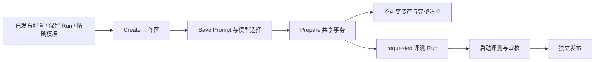

# 方案、资产与原子准备设计

本文回答编辑什么、冻结什么、Prepare 为什么必须原子，以及哪些规则防止未经评测的配置直接生效。核对基线：`c977cb9`，2026-10-06；模板安装和部署状态需按环境另行核证。

## 结论与问题

Solution 是组织内可编辑工作区，资产是不可变的执行事实；Prepare 一次提交 Prompt 冻结、模型 Route、派生 Profile、Suite、待启动评测 Run 以及命令回执。准备成功只代表配置可评测，尚未调用模型、审核或发布。

将编辑与执行分开，是为了允许反复试验而保护已经评测和接单的字节。若依次调用多个公开注册接口，进程故障会留下半套资产或工作区显示已准备却没有评测 Run；共享事务的内部操作消除这一不一致窗口。

## 概念与关系

| 对象 | 所有权与内容 | 生效边界 |
| --- | --- | --- |
| Solution | 组织范围、标题、原因、revision、Prompt 草稿、生成/裁判模型选择及来源 | 可编辑，不是已发布配置 |
| PromptDraft | 编辑内容、CAS revision、来源与命令历史 | 冻结前不能作为执行资产 |
| PromptAsset | 固定模板/version、源指纹、包正文与包摘要 | 只证明身份和字节完整 |
| AI ProfileAsset | selector、场景、输入输出版本及生成规则 | 注册不批准、不激活 |
| RouteAsset | 生成或语义用途的 provider/model/参数和固定绑定 | 凭证与 endpoint 由宿主网关持有 |
| SchemaAsset | 固定输入、生成输出或语义输出契约 | 结构有效不证明业务内容正确 |
| Suite | 案例、预检、重复计划、断言及输入构造与来源 | 派生保留场景与原契约 |
| GenerationManifest | Profile/Prompt/生成 Route/输入 Schema/输出 Schema 五项的身份、版本、指纹、正文摘要 | 是生成资产清单，不是质量批准 |
| EvidenceReleaseIdentity | 上述生成资产，加 Suite、语义 Prompt/Schema/Route、执行策略与门槛策略，共十一项固定引用 | 是评测完整身份，不是审核结论 |

两个清单用途不同：Manifest 用于绑定生成字节，ReleaseIdentity 绑定完整评测条件。Prompt 的来源指纹与包 SHA256 不同，源指纹相同不能掩盖包正文变化。资产 `(identity, version)` 不可用新内容覆盖；已准备方案不能继续 Save，应从固定来源另建方案。

## 来源与不变量

Create 必须且只能选择 `publication_id`、`source_run_id`、`template_ref` 之一。前两种读取保留的数据库证据；模板只能选择两个精确安装的全局 MBTI 根引用，见 [模板契约](02-MBTI模板与方案来源契约.md)。数据库错误不能伪装成空模板列表。

命令使用 command_id 和原因，正文包含可信组织与操作者范围。相同身份和正文重放返回原回执，正文或范围变化冲突；回执按组织及操作者隔离。Save/Prepare 同时检查 Solution revision 和关联草稿 revision，外部直接编辑关联 Prompt 会导致冲突。

Save 可以选同场景 Suite 和兼容语义 Prompt，但不能藉此改变来源 selector、Profile schema、scene、执行策略、门槛策略或语义输出契约。MBTI 派生还保留完整参考包；旧场景不能重新贴标三主题。AI Profile 与 IAM Profile 是不同概念。

生成与裁判模型分别按部署的允许模型/能力核验。Route v2 绑定 model_key、catalog_revision、binding_id/revision、adapter_contract；不能从 model 名推断这些身份，也不能把 v2 损坏记录解成 v1。模板与资产不保存运行凭证。

## 正常编辑与准备链路

1. Create 读取并验证完整固定来源，建立原 Prompt 的组织内草稿，保存 source_release、来源审核投影和模型参数；`prepared` 为 null。
2. Save 持锁读取工作区及草稿，检查 revision，核验参数、同场景评测资产，更新草稿及工作区，保存命令回执。
3. Prepare 再核验模型能力，在同一个数据库事务内冻结草稿；登记生成和语义 Route；从原 Profile 派生新版本；从原 Suite 派生案例资产；重新读取并验证完整资产及策略。
4. 以工作区确定性 Run 身份创建 `requested` 评测，保存计划及十一项 ReleaseIdentity，设置 prepared、增加 revision、保存回执并提交。
5. Run 是否启动由后续评测命令控制；业务发布由经批准的 Run 和独立发布命令控制。

当前支持的套件保留七个生成案例、每个五候选及一个预检。具体调用预算以原冻结执行策略为准，候选数不是失败重试总次数。

## 事务与失败

`MySQLSolutions.apply` 拥有事务和提交；内部 `prepare_assets`、冻结、注册及创建 Run 共用其 AsyncSession。内部函数不能提前提交，宿主负责连接、事务及生命周期。准备任一步失败，包括响应尺寸或最终资产验证失败，整个事务回滚，不留下部分准备状态。并发重复命令依赖唯一约束，回滚后读取原回执；不能自动用新 revision 覆盖冲突。

资产缺失、摘要损坏、非法跨场景派生或模型能力不可用明确失败；不能读取初始化文件、猜摘要或选择 latest。暂时数据库不可用需要按原 command_id 核对结果，不能换 ID 重建不确定的命令。

## 选择、代价与限制

完整来源继承和有限编辑参数保持审核可比较，代价是不能在一次 Save 中任意改变 Scene/Schema/门槛；这种变化需要新的根契约及兼容验证。共享 Prepare 事务比多 RPC 拼装更可靠，但需要维护内部函数的借用事务边界。不可变资产利于审计和恢复，代价是资产保留与引用审计。

准备、注册和模板安装不证明语义质量。模板代码存在不证明某个环境已安装；环境已安装也不证明已审核或生效。当前治理不提供通用知识库，也不允许普通编辑修改 MBTI 根参考材料。

## 实现依据与验证

源码：[方案命令](../../../src/qs_ai/application/governance/solutions.py)、[模型编辑约束](../../../src/qs_ai/application/governance/solution_models.py)、[工作区持久化](../../../src/qs_ai/infrastructure/persistence/mysql/solutions.py)、[来源与原子准备](../../../src/qs_ai/infrastructure/persistence/mysql/solution_assets.py)、[生成清单](../../../src/qs_ai/domain/governance/manifest.py)、[十一项评测身份](../../../src/qs_ai/domain/evaluation/identity.py)。

验证：[参数与来源约束](../../../tests/test_solutions.py)、[工作区事务](../../../tests/integration/test_solutions.py)、[MBTI 场景与回执](../../../tests/integration/test_mbti_solutions.py)、[模板](../../../src/qs_ai/infrastructure/persistence/mysql/solution_templates.py)。维护时必须核验：Prepare 无模型外发/发布；失败原子回滚；同 ID 不同正文冲突；不同组织不能读取工作区/回执；套件不能改变场景；旧命令缺省字段不改变原存储正文；已准备资产不可再编辑。
