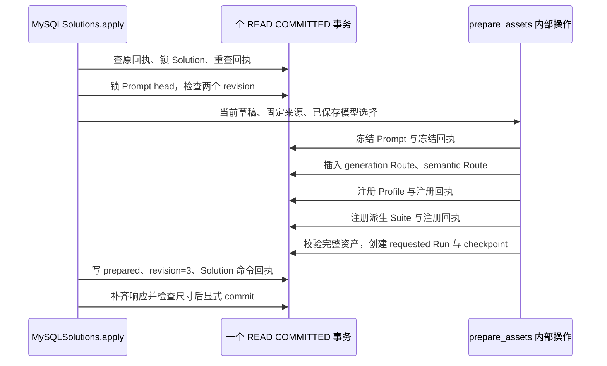

# 方案、资产与原子准备设计

Solution 把一次配置迭代分成两段：先保存可修改的 Prompt 和模型选择，再用 Prepare 把它们登记成不可覆盖的资产版本，并创建一个 `requested` 评测 Run。Prepare 的提交点只接受这套评测输入；模型调用、人工审核和发布随后各自推进。

本文围绕“从保留的评测来源改进表达，把生成输出上限改为 4000，再准备新评测”说明真实读写。核对基线：`4e6b12c`，2026-10-06。示例身份用于解释计算规则，不代表环境中已有这批记录。模板来源的安装与场景约束见 [MBTI 模板与方案来源契约](02-MBTI模板与方案来源契约.md)，后续启动和发布见 [治理链与执行链](../../00-总览/03-治理链与执行链.md)。

## 从哪里开始一次迭代

治理入口是 `SolutionManagement.Create/Save/Prepare`。入口先核验 QS workload，再将 QS 提供的 `organization_id` 和 `operator_user_id` 构成 `DraftScope`；AI 没有在这个接口里把普通用户自报的身份转成管理权限。写入请求包含 `solution_id` 和 `command_json`，每条命令都必须有非零 UUID `command_id`、非空 `reason`。原因最多 1000 UTF-8 字节，不能包含 `<`、`>` 或 NUL；标题最多 100 字符。

Create 必须且只能指定一种固定来源：

| 输入 | 实际读取 | 可以继承什么、不能据此推出什么 |
| --- | --- | --- |
| `publication_id` | 保留的 Publication 及其 `evidence.release` | 不要求该 Publication 仍是当前 active；继承原配置，不把原批准转成新方案的批准 |
| `source_run_id` | 当前组织的 Run，校验存储的 Suite 和固定 Release | 来源不要求已批准；`source_reviews` 是旧 Run 的审核投影，供编辑参考 |
| `template_ref` | 精确的 `{id, version, fingerprint}`，解析已安装的模板根 | 不支持 `latest`、按名称猜版本或读取初始化文件补缺；安装规则见下一篇 |

三条路径最终都取得完整 `source_release`，校验生成资产，并读取来源 Suite 的契约绑定。Publication 的读取不是按调用组织筛选的，但后续 Suite、语义 Prompt 仍要满足全局或当前组织的可见性；这不等于任意组织可以复制另一组织的私有资产。资产缺失、固定指纹或正文校验失败就终止 Create。

实现入口：[治理 gRPC](../../../src/qs_ai/transport/grpc/solutions.py)、[命令与编辑字段](../../../src/qs_ai/application/governance/solutions.py)、[来源解析 `source_release`](../../../src/qs_ai/infrastructure/persistence/mysql/solution_assets.py)。

## Create 固定来源，Save 修改一份工作区

设组织 `1` 的操作者 `42` 创建方案：

```text
solution_id   = 04db6a67-3979-4c8e-b6ee-f504e2181e27
draft_id      = dfea439a-1dbc-5cee-ba89-ad0afe866a21
target_version= solution-04db6a67-3979-4c8e-b6ee-f504e2181e27
```

`draft_id = uuid5(solution_id, "prompt")`。Create 从 Manifest 指向的原 Prompt 包复制四个可编辑字段：`SystemMessage`、`TaskTemplate`、`DataPreamble`、`AllowedPlaceholders`，建立 PromptDraft revision `1`；随后保存 Solution revision `1`。新版本名由方案身份决定，与编辑次数无关，原资产版本的正文不会被覆盖。

工作区返回值包含以下实际状态：

```json
{
  "schema_version": "qs-ai-solution/v1",
  "organization_id": 1,
  "revision": 1,
  "draft_revision": 1,
  "target_version": "solution-04db6a67-3979-4c8e-b6ee-f504e2181e27",
  "prepared": null
}
```

这里省略了身份、内容及固定引用。完整状态保留 `source_release`、`evaluation_assets`、当前模型选择和来源审核投影；读取时再用保留的草稿 revision 和原资产补出 `content`、`original_content`、`original_models`、原策略及所选语义 Prompt。它不是从当前最新 Prompt 拼出一个似乎相同的页面。

Save 是完整提交编辑值，以下是字段范围，不是局部补丁接口：

| 可修改字段 | 保存时的约束 |
| --- | --- |
| `title`、`reason` | 写入当前工作区状态；每次命令仍有独立原因和回执 |
| `content.system_message/task_template/data_preamble/allowed_placeholders` | 文本无 NUL，总 JSON 至多 131072 字节；声明数组至多 64 项，每项至多 128 字符 |
| `generation`、`semantic` | 各自选择 model、`max_output_tokens`、`timeout_milliseconds`、`reasoning_effort`；两种用途分别核验 |
| `evaluation_suite` | 精确 Suite 引用；必须保持来源 Profile 的 schema、scene、selector，并保持原执行策略、门槛策略和语义输出 Schema |
| `semantic_prompt` 与 `semantic_owner_organization_id` | 精确引用及可见的所有者，须兼容固定语义输出契约；所有者非零时必须显式指定 Prompt |

省略可选 Suite 时沿用之前选择；显式选择另一兼容 Suite 时默认采用该 Suite 绑定的语义 Prompt，显式 `semantic_prompt` 可以覆盖这一默认。Save 没有开放 selector、输入输出 Schema、Profile eligibility、MBTI 参考材料或门槛策略的任意编辑字段。

本例保持两种模型身份及其他字段，向生成选择提交 `max_output_tokens=4000`，改写表达指令，使用 `expected_revision=1`。成功后 Solution revision 是 `2`，关联 PromptDraft revision 也是 `2`，`prepared` 仍为 null。即使只调整模型参数，当前 Save 实现也会保存一份新的 PromptDraft revision；这两个 revision 不是相互替代的编号。

保存未完成的文字是允许的。例如 `task_template="{{unknown}}"` 可以成为草稿，Prepare 时才因未支持或未声明的占位符被拒绝。冻结还要求三段消息均非空，SystemMessage 和 DataPreamble 不含动态占位符，TaskTemplate 的每个占位符都有唯一、运行时支持的声明，且无残缺花括号。保存、语法冻结和内容质量是三个独立判断。

实现：[创建、补齐与 Save](../../../src/qs_ai/infrastructure/persistence/mysql/solutions.py)、[草稿内容与 revision](../../../src/qs_ai/domain/governance/prompt_draft.py)、[占位符冻结校验](../../../src/qs_ai/application/governance/prompt_freeze.py)。

## 两次 revision 检查保护哪些冲突

Save 和 Prepare 先锁 `solution_revisions` 中当前组织的方案行，再锁该方案关联的 `prompt_drafts` head。检查顺序是：

1. 锁定方案后再次读取原 `command_id` 回执，处理等待锁期间已完成的同命令。
2. 要求 Solution `revision == expected_revision` 且 `prepared` 为空。
3. 要求 PromptDraft head 的当前 revision 等于 Solution 保存的 `draft_revision`。
4. Save 的内部 `apply_draft` 再以当前草稿 revision 写入不可变 revision 快照，并用旧 revision 条件更新 head；更新行数必须为一。

因此存在两类不同冲突：

| 场景 | 结果与恢复方式 |
| --- | --- |
| 两位编辑者都读到 Solution revision `1`，分别用不同命令 Save | 先获得锁者提交 revision `2`；后者看到 expected `1` 已过期，返回冲突。重新读取后由编辑者决定如何合并 |
| Solution 仍为 revision `1`、`draft_revision=1`，但有人通过独立草稿接口把 Prompt head 改成 `2` | Prepare 报 `Linked Prompt was edited outside this workspace`；即使 Solution 的 expected revision 仍正确也不能悄悄采用草稿 `2` |

原命令的精确重放会在这些检查之前返回原回执。系统不会自动提高 expected revision，也不会用最新草稿掩盖关联状态不一致。组织内其他操作者可以读取方案当前状态，但命令回执只对原组织和原操作者可见；例如 `DraftScope(1,43)` 可以 Get 此方案，不能读取 `42` 的命令回执，组织 `2` 则不能 Get 此方案。

实现：[方案锁与命令回执](../../../src/qs_ai/infrastructure/persistence/mysql/solutions.py)、[草稿 head、revision 快照与 CAS](../../../src/qs_ai/infrastructure/persistence/mysql/prompt_drafts.py)。

## Prepare 的事务内究竟写入什么

本例以新 Prepare 命令提交 `expected_revision=2`、`reason="完整评测"`。`MySQLSolutions.apply` 打开自有 `EventSession`，在执行查询前设置 `READ COMMITTED`。这个隔离级别让取得锁后重查的回执可以看到刚提交的同命令。它再核验当前部署允许的模型选择，之后将**同一个 AsyncSession**传给所有内部准备函数。



具体写入顺序有实际依赖：

1. **Prompt。** `apply_freeze` 重查原冻结回执及草稿 head，确认该草稿未冻结、revision 未变、源资产完整引用未变；把草稿正文、源引用、revision 快照 SHA 和 validator 版本写进原生 Prompt 的 `Origin`，登记 Prompt 资产和冻结回执。
2. **两条 Route。** 从固定来源 Route 派生已保存参数，分别插入生成、语义 Route。资产保留来源的逻辑 route 身份，但使用 `solution-{solution_id}-generation/semantic` 新 revision，并记录 `qs-ai:solution:{solution_id}` 和 `qs:org/1/user/42` 来源与操作者。
3. **Profile。** 复制原定义，将 version 改为 `target_version`，更新 `generation_policy` 的 Prompt 身份/版本和生成 Route；注册时再检查源资产及不可改变的场景契约，并建立五项 GenerationManifest。
4. **Suite。** 从已选择的固定 Suite 派生同身份的新版本，绑定刚注册的 Profile、Prompt、生成 Route，以及固定的语义 Prompt；保存 Suite 字节、来源和契约绑定。案例、重复计划及断言义务不会因为换一个版本号而丢失。
5. **Run。** 重新验证完整 Release 的资产和契约，再调用 `create_run`，插入 Run、冻结预算策略、checkpoint version `1`。初始状态为 `requested`，预检与候选槽为 `pending`；不会在这里调模型或调度执行。
6. **Solution 与回执。** 保存 `prepared.plan/run_id/release/manifest/prepared_at/steps`，增加方案 revision；补齐返回值且确认不超过 1048576 字节之后，才提交整个事务。

锁顺序是 Solution 行在前、Prompt head 在后；`apply_freeze` 会在同 Session 中再次读取该 head。Profile、Route、Suite 的注册依靠固定引用校验和资产身份/版本唯一约束，不存在一个覆盖全部资产的全局锁。不能把“同一次 Prepare”解读成靠进程互斥锁阻止所有治理操作。

这条治理 RPC 的最终提交由 `MySQLSolutions.apply` 负责。`apply_draft`、`apply_freeze`、内部 `register_profile/register_suite`、`create_run` 都使用传入 Session，不单独提交；公开的草稿、冻结、注册适配器则各自可以拥有事务，不能把这些公开包装器逐个调用来拼 Prepare。它也不是 MQ receiver 借用事务的接单路径：同 REQUEST 作用域并不保证同事务；借用规则及 Session 清理见 [Dishka 作用域与资源所有权](../../01-运行时/02-Dishka作用域与资源所有权.md)。

实现：[准备总步骤](../../../src/qs_ai/infrastructure/persistence/mysql/solution_assets.py)、[Prompt 原生资产与冻结回执](../../../src/qs_ai/infrastructure/persistence/mysql/prompt_freezes.py)、[Profile 注册](../../../src/qs_ai/infrastructure/persistence/mysql/profile_registrations.py)、[Suite 注册](../../../src/qs_ai/infrastructure/persistence/mysql/evaluation_suites.py)、[Run 初始快照](../../../src/qs_ai/infrastructure/persistence/mysql/evaluation_runs.py)。

## 新版本与复用引用怎样传递

稳定身份来自方案或外部命令，不是每执行一个步骤就随机生成一次：

| 对象或子命令 | 生成规则 | 本例作用 |
| --- | --- | --- |
| PromptDraft | `uuid5(solution_id, "prompt")` | 固定为 `dfea439a-1dbc-5cee-ba89-ad0afe866a21` |
| Prompt、Profile、Suite 的目标版本 | `solution-{solution_id}` | 同一迭代版本，身份分别继承各自来源 |
| 创建／保存草稿的子命令 | `uuid5(command_id, "prompt-create"/"prompt-save")` | 各外部命令有可核对的草稿回执 |
| 冻结／Profile／Suite 子命令 | `uuid5(prepare_command_id, "freeze"/"profile"/"suite")` | 准备步骤的独立回执与来源审计 |
| 评测 Run | `uuid5(solution_id, "evaluation")` | 固定为 `30ad3de9-28c1-559d-b76e-d6a832dddacc` |

Prepare 创建新的 Prompt、两条 Route、Profile、Suite 资产版本。输入 Schema、生成输出 Schema、执行策略、门槛策略、语义输出 Schema 沿用固定引用；语义 Prompt 用 Save 选定的固定引用，本次 Prepare 不再复制它。即使两条 Route 的模型参数完全未改，也登记本方案的 Route revision，而不是悄悄绑定来源的 latest。

结果中的 GenerationManifest 固定 Profile、Prompt、生成 Route、输入 Schema、生成输出 Schema 五项，每项包含身份、版本、指纹和正文 SHA256。`prepared.release` 在这些生成引用之外再固定 Suite、语义 Prompt/Schema/Route、执行策略和门槛策略，共十一项。原生 Prompt 的 fingerprint 绑定 Origin 与正文，`package_sha256` 校验完整包字节；两者各有校验用途，不能相互替代。

当前基线计划是七个生成案例，每个五候选，共 35 个槽和一个预检。`prepared.plan` 从本次冻结策略计算，并携带 `max_generation_invocations/max_semantic_invocations`；基线两项上限各为 70。35 是候选槽数，不能当作包括失败重试的调用预算。Run 同时保留 Suite、策略、语义 Prompt/Schema 原文及 acceptance rule，后续执行不再从 Solution 的可编辑状态拼输入。

完成本例后 Solution revision 是 `3`，`draft_revision` 仍为 `2`，`prepared.run_id` 指向上述新 Run。新的 Save 或 Prepare 会因已经 prepared 而冲突；要继续改内容，应从固定来源另建方案。原 Prepare 命令仍可重放。资产注册与 requested 状态没有改变发布指针，Participant 也不会因为 Prepare 成功就采用新版本。

实现：[五项 Manifest](../../../src/qs_ai/domain/governance/manifest.py)、[十一项 Release 身份](../../../src/qs_ai/domain/evaluation/identity.py)、[派生 Suite 与案例校验](../../../src/qs_ai/infrastructure/qs_server/evaluation_suite.py)。

## 模型能力检查与历史回执的区别

Save 和 Prepare 都要核验模型选择，防止“上次能编辑，现在仍默认可执行”。基础字段限制是输出 token `1..12000`、超时 `1000..180000` 毫秒，以及支持的 reasoning effort；实际部署和模型能力可以更窄。

未提交 `model_key` 的 v1 编辑分支只允许部署 `governance_models` 中的模型和已支持的 DeepSeek responses 适配器，不接受 endpoint、凭证或独立 temperature。显式提交 `model_key`、`catalog_revision` 且启用 v2 写入时，可以从 v1 来源派生为 Route v2；由当前目录核验 verified 状态、generation/semantic 用途、binding 和参数能力，provider 与绑定也由目录决定。目录 revision 过期返回 `model_capability_changed`；模型名相同不能替代 model_key 和绑定身份。`thinking/temperature/top_p` 仅在该目录条目验证支持时可用，从 v2 来源省略这些身份不能降成 v1。

Prepare 把 v2 的 `binding_id/revision`、provider/protocol、adapter contract 和参数写进固定 Route；API key 和 endpoint 由部署配置持有。GetModels 返回经过隐藏敏感字段的目录及可用性，编辑请求不能替换连接目标。

回执重放先于当前模型选择核验。因此准备完成后移除某个目录条目，仍可以读取、重放当时的 Prepare 回执；历史字节不会被新部署重写。这不承诺新 Start 一定获准，启动时还要按当前可执行模型策略核验。相关边界由 [模型选择](../../../src/qs_ai/application/governance/solution_models.py)、[目录与绑定](../../../src/qs_ai/model_configuration.py) 和独立启动路径共同实现。

## 失败后怎样知道命令有没有完成

每次成功写入都在 `solution_commands` 保存规范化请求 JSON、原状态回执 JSON 和 SHA256。规范化请求包含组织、操作者、solution_id、命令类型和完整命令正文。相同 ID 的重放要求范围与正文相同；服务端时间重新生成不会把重放变成新编辑。

| 观察到的情况 | 持久化行为与后续动作 |
| --- | --- |
| commit 成功，gRPC 响应丢失 | 原操作者以 `GetReceipt(command_id)` 核对，或重发原 solution_id、原命令正文；返回原回执，不重复保存或准备 |
| 同 ID 改 title、reason、expected revision 或内容 | 冲突，不把 ID 当作可反复使用的按钮名称 |
| 等待锁期间另一请求已提交同命令 | 取得锁后重查回执，返回原结果；唯一约束竞争发生时，失败事务退出后用新 Session 查原回执 |
| Prepare 在 Profile 注册后、Suite 注册前异常 | 本次未提交的冻结、Route、Profile 等随自有事务回滚；Solution 保持原 revision、prepared 为空，修复故障后可重发原 Prepare |
| 已有目标资产、资产损坏或完整 Release 验证失败 | 明确失败，不覆盖资产，不按 latest 替换固定引用；没有原命令回执的唯一冲突仍是冲突 |
| 数据库或未知异常使调用方无法判断结果 | gRPC 返回 `UNAVAILABLE`，提示按原 command 核对；换新 ID 会制造新的意图，不能用于确定旧结果 |

重放返回的是当时的状态，例如原 Save 的 revision `2`，不是后来 Prepare 的 revision `3`。`hydrate` 会读取回执绑定的历史草稿 revision，并复核来源和所选契约；若保留证据缺失或损坏，读取也会失败，不能退回当前值掩盖证据问题。新增可选字段时，旧命令省略 `template_ref` 或未使用的 v2、评测选项仍保持原存储请求的字节约定，避免升级后误判同 ID 不同正文。

gRPC 将 revision/资产冲突映射为 `ABORTED`，格式或配置校验失败映射为 `INVALID_ARGUMENT`，不可见对象或回执为 `NOT_FOUND`。这些都不表示评测质量失败；已开始的 Run 如何失败和恢复属于下一阶段。

## 验证证据与维护入口

以下测试是实现契约的入口，不能直接证明某个环境已经安装模板、完成模型评测、获得人工批准或已发布：

| 测试入口 | 实际覆盖范围 |
| --- | --- |
| [test_solutions.py](../../../tests/test_solutions.py) | 参数映射改变新 Route 指纹且不改来源；非法字段、限制、来源互斥、精确模板引用 |
| [test_native_prompts.py](../../../tests/test_native_prompts.py) | 草稿能保存的非法语法无法冻结；允许占位符与运行时渲染一致；原生 Origin 与正文防篡改 |
| [test_native_evaluation_suite.py](../../../tests/test_native_evaluation_suite.py) | 派生保留槽与断言义务；即使重算外层 hash，损坏案例、Manifest 或契约仍被拒绝 |
| [test_model_selection_v2.py](../../../tests/test_model_selection_v2.py) | 目录 revision、用途、参数、绑定冻结与敏感配置隐藏；不通过模型名猜身份 |
| [integration/test_solutions.py](../../../tests/integration/test_solutions.py) | 真实 MySQL 的并发 Save、失返回重放与范围隔离；4000 token 进入固定 Route 及请求；准备后拒绝编辑、外部草稿编辑冲突 |
| 同一集成文件的 `test_preparation_failure_rolls_back_all_steps_and_can_retry` | 在 Profile 注册后注入失败，直接检查方案 revision、Prompt 冻结及 Profile 无残留，再用原命令成功重试；没有逐表列举所有残留断言 |
| [integration/test_mbti_solutions.py](../../../tests/integration/test_mbti_solutions.py) | 模板克隆及场景兼容、无初始化文件回退；模拟模型下的冻结资产推进，不能当作真实模型质量验收 |
| [integration/test_solution_grpc.py](../../../tests/integration/test_solution_grpc.py) | 隔离 MySQL 与 TLS gRPC 的真实装配、QS workload 边界和跨连接回执；不包含真实人工批准 |

修改本模块时，优先核对三个点：内部注册是否仍共用调用方 Session 且不提前提交；新可选字段是否保持旧请求的回执字节约定；派生后是否仍以完整固定引用重验资产。源码存在这些分支、测试覆盖这些分支和环境实际执行成功，是不同层次的证据。
