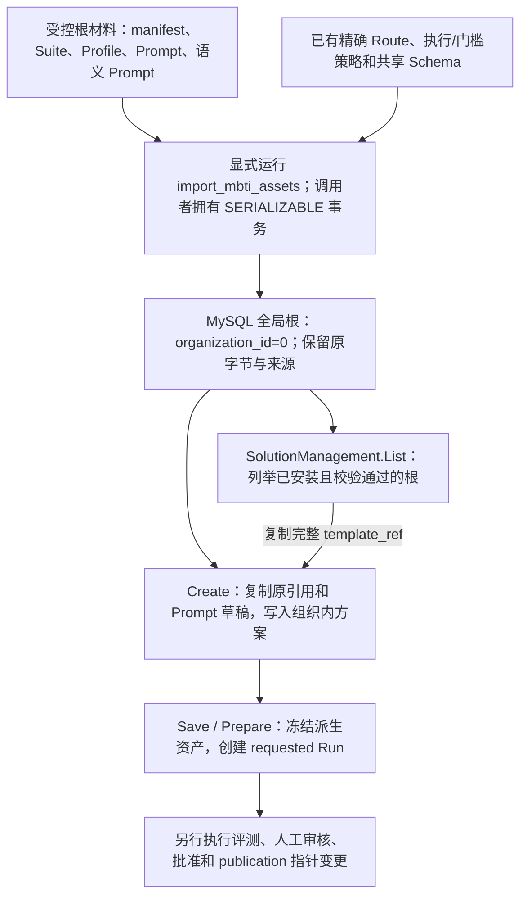

# MBTI 模板与方案来源契约

MBTI 模板提供一个可以克隆、修改和重新评测的固定起点。它在 MySQL 中保存精确的原始配置和依赖，由受控初始化命令显式安装；查询模板、创建方案和准备 Run 都不会安装缺失资产，也不会开放参与者解读。一个环境可以同时有两个模板，却只有一个 MBTI selector 发布槽。模板目录、方案来源和当前开放配置因此需要分别读取。

本文核对 qs-ai `766b2aa` 和 qs-server `2ccc2de`，日期为 2026-10-06。它解释来源选择、字节继承和场景边界；编辑与原子准备见 [方案资产与原子准备设计](01-方案资产与原子准备设计.md)，发布槽变更见 [发布证据与生效指针设计](../publication/01-发布证据与生效指针设计.md)。某环境是否已安装、真实质量是否已审核和当前发布是否已启用，需要另行读取对应证据。

## 从材料到可克隆模板，再到新方案

模板的安装入口与在线治理入口拥有不同的权限和副作用。完整关系如下：



例如，组织 912 的管理员要试验三主题 MBTI 文案：先从目录取得 `three-topic-v1` 的完整引用，再为新的 `solution_id` 提交 Create。服务端创建该组织的方案及 Prompt 草稿，保存根的 11 项 release 引用，初始 `revision=1`、`prepared=null`。随后修改文案、准备新 Run，评测和审核针对新 Run 进行。过程中根 `three-topic-v1` 的内容和另一组织的工作区均不随编辑改变。

这条路径解决了“首版没有已有 publication 可以克隆”的问题。它没有绕过发布门槛：测试中仅安装根而不发布时，参与者可用性查询返回 `unavailable / publication_missing`；生成入口持久记录 `configuration_unavailable`，后台也不会取得可执行 claim。

## 两个根的精确身份与同一个发布槽

`template_release` 只接受 `MBTI_ROOT` 或 `MBTI_THEMES_ROOT` 的完整三元组，连指纹也必须一致。它们是 `organization_id=0` 的受控全局初始化根，组织内派生 Suite 不是模板目录中的第三类根。字符串 `latest`、猜测版本或相同 id/version 下的另一指纹都不代表有效模板。

| 根 | `template_ref.id` | `template_ref.version` | Suite 原字节 SHA-256 |
| --- | --- | --- | --- |
| MBTI 单次解读首版 | `participant-mbti-single` | `v1` | `3353f945b75346b869c638a1034356ac602ea7f049cb0d2a6e55262538b9cacd` |
| MBTI 三主题单次解读首版 | `participant-mbti-single` | `three-topic-v1` | `027fbe31e18e08786390920dfc1233e76e7a54ac68198385f6391c8634ce2a4b` |

引用中的 `fingerprint` 字段要在上述十六进制串前加 `sha256:`。这里的版本是资产身份的一部分，不是可以替换的展示标签。

| 契约 | 单次首版 `v1` | 三主题 `three-topic-v1` |
| --- | --- | --- |
| Suite / Profile / 生成 Prompt | `participant-mbti-single / v1` | `participant-mbti-single / three-topic-v1` |
| 语义 Prompt | `mbti-single-semantic-evaluator / v1` | `mbti-single-semantic-evaluator / three-topic-v1` |
| 场景 | `mbti-single-assessment/v1` | `mbti-single-assessment/v2` |
| 模型输入 | `ai-explanation-input/v2` | `ai-explanation-input/v3` |
| 模型输出 | `ai-explanation-output/v1` | `ai-explanation-output/v2` |
| 持久 Artifact | `qs-ai-artifact/v1` | `qs-ai-artifact/v2` |

三主题 Profile 还嵌入有限参考材料，决定按本次四轴类型选择哪 12 条材料；其材料内容随根字节冻结。两类输入事实和输出义务见 [MBTI 报告事实与版本契约](../interpretation/02-MBTI报告事实与版本契约.md)及 [MBTI 三主题与参考材料契约](../interpretation/03-MBTI三主题与参考材料契约.md)。这里不能把保存文案等同于修改参考材料。

两个根都采用以下完整 selector：

```json
{
  "audience": "participant",
  "model_kind": "typology",
  "decision_kind": "pole_composition",
  "model_code": "MBTI_OEJTS",
  "model_version": "v64-report-202608-v1"
}
```

`ReleaseSelector.key()` 对这五个字段生成 key，场景版本不在其中。因此，从三主题方案评测并发布的新配置占用的仍是单次首版的同一个槽，发布时需要该槽当前的 version 和 active id。它会影响之后的新准入；已经接受并冻结旧 publication/manifest 的 Session 继续使用自己的旧配置。不能用“新场景版本”推断多了一个独立在线开关，也不能用当前指针变更重写已接受请求。

## 模板目录只列举已安装且完整的根

既有 `SolutionManagement.List` 返回 `schema_version=qs-ai-solutions/v1`，其中 `items` 是当前组织的方案，`templates` 是全局模板来源。模板按 `v1`、`three-topic-v1` 的顺序检查，不需要新增工作区或模板 RPC。

每个 entry 有 `name`、完整 `template_ref`、`scene_contract_version`、`selector`，并固定返回：

```json
{
  "published": false,
  "reason": "requires_evaluation_review_and_publication"
}
```

这两个字段说明模板 entry 只能作为来源。目录没有查询 publication pointer，即使这个 selector 已有一个通过审核的派生 publication，模板 entry 仍返回 `published=false`。在线开放状态应读取发布和准入结果。

目录先按全局根 id/version 查询 Suite 行：未找到某一根就省略该项；两项都没有时 `templates=[]`。找到行以后才读完整根和依赖；指纹不符、Suite 合同损坏或依赖缺失会使查询明确失败，不能伪装成“尚未安装”。数据库异常同样不等价于空目录。

在线读取只使用 MySQL 中的原始 `definition_json`、Markdown 和合同绑定；它不会调用 `load_mbti_root()` / `load_mbti_themes_root()` 从部署文件补齐资产，也不会改选另一个根。目录代码和 Create 都通过 [solution_templates.py](../../../src/qs_ai/infrastructure/persistence/mysql/solution_templates.py) 执行这一规则。

## 初始化如何证明“这就是这个根”

根材料是 qs-ai 自主编写的配置与评测材料，manifest 标记 `source_kind=qs-ai-authored-not-qs-export`。它们不代表从 QS 导出的真实报告，更不带人工批准状态。单次材料在 [mbti](../../../integrations/qs_server/evaluation/mbti/)，三主题材料在 [mbti-themes](../../../integrations/qs_server/evaluation/mbti-themes/)。

安装使用独立维护命令，下面只展示参数契约，不表示本次文档修改执行了安装：

```sh
python -m qs_ai.bootstrap.import_mbti_assets \
  --root three-topic-v1 \
  --source-commit <40-character-lowercase-git-sha> \
  --imported-by <initializer-identity>
```

`--root` 只接受 `v1` 或 `three-topic-v1`，省略时保持旧行为选择 `v1`。初始化需要数据库和精确的既有执行策略、门槛策略、语义输出 Schema、生成与裁判 Route；它不会新建或替换 Route，不改变额度，也不创建解读 Session、评测 Run、审核或 publication pointer。

原字节验证分两层，缺一不可：

1. `mbti_assets.py` 固定每个根的 manifest 摘要，manifest 再固定精确文件集合及每个文件 SHA-256。Prompt Markdown 的三个 text 块还必须分别等于 Prompt package 的 SystemMessage、TaskTemplate、DataPreamble；Prompt 来源的 GitBlobSHA 也由原 Markdown 字节核对。三主题 reference 文件必须与 Profile 内嵌材料相符。
2. Suite 的 `FrozenContractRef` 对原 Suite JSON 字节取摘要，Suite 的 `template.release` 再绑定其他十项引用。在线组装 `EvidenceReleaseIdentity` 共含 Suite、Profile、生成 Prompt、输入/输出 Schema、生成 Route、语义 Prompt/输出 Schema/Route、执行策略和门槛策略。资产读取与 `validate_release_assets` 核验这些引用、原内容和相互关系；JSON 内容相同但字节换行变化，也不能冒充原指纹。

因此，不是“Suite 名称存在就可克隆”。例如已有三主题 Suite 行，随后把其生成 Prompt 的 fingerprint 改成零值，目录和 Create 都会失败；服务端不会采用新内容，也不会复制一份损坏来源的方案。修改根正文要采用新的受控身份与相应代码/契约更新，不能覆盖原 id/version 来“修复”。

初始化在一个调用者拥有的 `SERIALIZABLE` 事务里按主键读取、比较和插入；最终完整 release 校验通过以后才 commit。现有内容逐字段一致则不写，内容不同则拒绝：普通资产检查抛 `AssetConflict`，既有 Suite 不一致抛 `ValueError`，都不会覆盖。晚期依赖或校验失败会回滚本次新增的整组资产。单次根复用已有输出 v1 Schema；三主题还插入自己的输出 v2 Schema。

首次插入记录 `source_ref=qs-ai:<source_commit>:mbti-root:<manifest_sha256>` 和 `imported_by`。同内容再次安装，即使换了 source commit 或操作者，已有行仍保留首次来源；测试分别覆盖单次首次插入 5 行和三主题 6 行、重复安装 0 行。这些数字不包含既有共享依赖，也不是已批准的数量。

来源记录还有明确的证明上限：命令只校验 commit 为 40 位小写十六进制串、初始化者为合规非空字符串，不向 IAM 核实这个初始化者，也不查询 Git 证明 commit 的存在。在线读取全局 Suite 要求非空来源字段和正确的初始化记录形态，并验证固定内容；它不把一个字符串当成人员授权证明。执行初始化的权限与运行环境控制由维护操作负责。详细操作前置条件见 [MBTI 管理与验收](../../04-接口与运维/08-MBTI管理与验收.md)。

## Create 的三个来源相同在哪里，不同在哪里

Create 必须在 `template_ref`、`publication_id`、`source_run_id` 中恰选一个。三者都需要非零 `command_id`、`solution_id`、合法 title/reason 和 QS 委托的组织/操作者；不存在按 title、当前指针或 latest 自动选源的分支。

| 来源 | 服务端实际读取 | 访问与状态前提 | `source` / `source_reviews` |
| --- | --- | --- | --- |
| `template_ref` | 两个 allowlist 根之一及完整固定依赖 | 根已安装且校验通过；调用组织为正数，全局根可作为来源 | 保存完整 `template_ref`；publication/run id 为 null；reviews 为空 |
| `publication_id` | 按 id 读取保留的 publication 记录及其 evidence.release | 不要求该记录目前 active；来源解析本身没有“publication 所属组织等于调用组织”检查，但来源 Suite 合同和语义 owner 仍须满足调用组织可见性 | 保存 publication id；run id 为 null；reviews 为空，不复制批准为新方案的批准 |
| `source_run_id` | 当前组织的 Run 创建快照、冻结 Suite/release 和读视图 | Run 必须属于调用组织；Create 不要求 Run 已 approved | 保存 run id；publication id 为 null；复制该 Run 当前 `reviews_json` 作为来源上下文 |

工作区始终属于调用组织，不能据 publication 来源没有当前 active 前置，就推断任意组织的私有 Suite/语义 Prompt 都能克隆。`read_suite_contracts` 限制 Suite 位于全局或当前组织，并校验 semantic owner；后续加载私有 Suite 的派生 lineage 也按当前组织核验。具体读取链见 [solution_assets.py](../../../src/qs_ai/infrastructure/persistence/mysql/solution_assets.py)、[suite_contracts.py](../../../src/qs_ai/infrastructure/persistence/mysql/suite_contracts.py)及 [evaluation_suites.py](../../../src/qs_ai/infrastructure/persistence/mysql/evaluation_suites.py)。

源 Run 的 reviews 是历史参考，不会变成新 Run 的审核结果。publication 已有的批准也是对原固定 release 的批准。只要编辑并准备了新 release，就需要它自己的评测和批准证据。

三类创建都把精确来源存入 `source_release`，生成 `target_version=solution-<solution_id>`，以 `uuid5(solution_id,"prompt")` 创建派生草稿，保存其 revision。新方案从原 Route 初始化生成/裁判模型参数；响应中的 `original_content`、`original_models` 和 `policy` 用于比较来源与当前编辑。原 Profile 有 `scene_contract_version` 时，它同时进入方案状态与列表项；较旧且无该字段的来源不会凭空补一个场景。

创建三主题的命令正文例如：

```json
{
  "command_id": "00000000-0000-4000-8000-000000000101",
  "title": "MBTI 三主题文案试验",
  "reason": "从固定三主题根克隆，重新评测后再审核",
  "template_ref": {
    "id": "participant-mbti-single",
    "version": "three-topic-v1",
    "fingerprint": "sha256:027fbe31e18e08786390920dfc1233e76e7a54ac68198385f6391c8634ce2a4b"
  }
}
```

`solution_id` 位于 REST 路径或 gRPC 外层，组织和操作者也在可信外层；示例正文不允许自行声明它们。实际客户端应复制目录返回的完整引用，而不是根据展示名拼接。在同一正文再加一个 `publication_id`，即使该 publication 存在，也会因来源多选而拒绝。

## Save 与 Prepare 保留哪些内容

来源固定后，Save 可以修改允许的 Prompt 内容和生成/裁判模型选择，还可以显式选择当前组织可见的兼容 Suite/语义 Prompt。它没有“修改根 Profile”或“换场景”的编辑参数。

选择另一个 Suite 时，服务端逐项比较来源与所选 Suite 的 `profile_fixture.schema_version`、`scene_contract_version`、`selector`；执行策略、门槛策略和语义输出 Schema 必须仍等于原 release，语义 Prompt 及 owner 也需要精确校验。于是：

- `v1` 方案不能通过 Save 改选 `three-topic-v1`，因为其场景版本不同，即使二者 selector 一样。
- MBTI 方案不能改选量表 Suite；同场景派生 Suite 可以作为兼容编辑选项，却不能拿它的引用绕过 Create 的根 allowlist。
- 三主题方案不能在保存文案时替换参考材料、四轴事实契约或输入/输出版本。

Prepare 复制原 Profile JSON，仅更新派生 version、生成 Prompt id/version 和生成 Route；selector、场景、输入/输出 Schema、参考材料等随来源保留。它注册派生 Suite 和两条派生 Route，形成新的 11 项 release，创建 `uuid5(solution_id,"evaluation")` 的 `requested` Run。两个根当前均有七组生成 case × 五候选和一个预检；这些是冻结 Suite/策略的计划，不是 Create 已经发出的模型请求数。

准备使用已保存内容及 CAS/原命令回执，并在同一事务内完成。它不启动 Run、不生成模型结果、不写审核或发布。双 revision、外部草稿编辑冲突、Prepare 全部回滚与回执恢复在 [方案资产与原子准备设计](01-方案资产与原子准备设计.md)中说明。

## 失败案例与兼容边界

下面是 SolutionManagement 的现行错误映射；初始化命令是另一入口，不能把它的 exit code 当成 gRPC 状态。

| 场景 | 可观察结果 | 正确解释与后续动作 |
| --- | --- | --- |
| 三类来源零选或多选、引用字段缺失、重复 JSON 字段 | `INVALID_ARGUMENT` | 正文不合法；没有可自动补全的来源 |
| 结构合法但填 `latest`、未知版本或非 allowlist 指纹；有效但不存在的 publication/同组织 Run | `NOT_FOUND` | 引用不属于允许模板，或记录不可见/不存在 |
| 精确已知根尚未安装 | List 省略该项；直接 Create 返回 `INVALID_ARGUMENT` | `load_registered_suite` 抛 ValueError；在线入口不会补种根。这与未知模板的 NOT_FOUND 不同 |
| 根行存在但 Prompt、Suite 或 Schema 字节/指纹损坏 | List 或 Create 返回 `INVALID_ARGUMENT` | 固定配置校验失败；没有文件或另一根回退；检查受控安装和原资产证据 |
| 方案跨组织读取、另一操作者读取原命令回执 | `NOT_FOUND` | 工作区按组织隔离，命令回执还绑定原操作者；同组织其他有权限操作者可以读方案 |
| 过期 revision、复用 command_id 改正文、派生资产冲突 | `ABORTED` | 需读当前状态；不能覆写已有固定内容 |
| 模型能力已变更 | `ABORTED / model_capability_changed` | 按当前能力重新审阅选择，原快照不随目录变化重写 |
| 非 QS 可信工作负载 | `PERMISSION_DENIED` | 委托入口未成立，不进入存储写入 |
| 意外数据库/服务异常，或客户端在写入后失去响应 | 服务端可能返回 `UNAVAILABLE`，客户端可能超时 | 结果不确定；按原 command_id 查回执，再决定是否原样重放 |

初始化冲突则由 CLI 输出 `import=failed` 和错误类型并退出 1。它不会覆盖一条已有同名但不同内容的资产，也不能靠再次安装抹去冲突。成功输出 `activated=false`；重复同内容成功不刷新首次 provenance。

旧 Create 的 publication/run 请求没有 `template_ref`。存储请求正文在该字段为 None 时仍省略它，使原命令摘要及原回执可继续匹配；新增模板入口没有向旧命令补一个 null 并改变请求身份。相同 scope、solution_id、command_id 和正文重放读取原回执；同 id 改 title/reason/来源会冲突，即使方案后来已有更新。不要因为超时换一个 command_id 再创建第二份来源不明的方案。

## QS 管理员权限如何到达 AI

在线请求从 qs-server 的 `/internal/v2/interpretation/ai-workflow/solutions` 进入。读目录、方案、模型能力及命令回执要求 `CapabilityAuditInterpretation`；Create/Save/Prepare 要求 `CapabilityOrgAdmin`。QS 的路由中间件读取 IAM 授权快照，`SolutionAdministration` 在用例层再检查相同 capability，handler 从受保护请求上下文取得 organization/operator，交给 mTLS gRPC 客户端。正文中的模板引用只选择来源，不能授予写权限。

AI 端先检查 TLS auth_context 为 ssl，且客户端 common name 精确为 `qs-apiserver.svc`，再读取 QS 委托的正数组织/操作者和命令正文。这里信任的是 QS 已做的人类管理授权；AI 不重新向 IAM 查询该用户是否 OrgAdmin。浏览器持有用户 token 不足以直连这个工作负载入口。跨服务授权完整边界见 [治理接口与可信委托](../../04-接口与运维/03-治理接口与可信委托.md)。

这个委托链也不能用于解释初始化脚本的 `imported_by` 参数：脚本是维护入口，在线管理员 capability 和工作负载证书并未被该参数携带。两者要分别保存可审计的授权与运行记录。

## 采用这一来源规则的代价与验证

精确根目录让首版创建不依赖已有 publication，也让不同操作者克隆相同字节时有可比较的起点。代价是新根需要显式材料、固定引用、受控安装和对应验证；任意上传 Suite 或按 latest 读取文件都不具备这些约束。使用原 id/version 覆盖内容会使历史来源无法复核，因此实现选择失败并要求新的固定身份。

保留来源场景让重新评测聚焦文案和允许的模型选择。代价是单次首版升级三主题必须新建方案；发布又共用原 selector 槽，需要按当前指针确认影响范围。参考材料结构、散列和语义义务能追溯，并不自动证明材料支持每一句生成解释；真实模型内容和人工审核仍是下一层证据。

| 需要证明的行为 | 现有测试入口与关键断言 |
| --- | --- |
| 来源精确且互斥 | [test_solutions.py](../../../tests/test_solutions.py)：`test_template_source_is_exact_and_exclusive`；未知字段和不支持模型参数也不能进入编辑 |
| 固定材料与版本 | [test_mbti_root_assets.py](../../../tests/test_mbti_root_assets.py) 和 [test_mbti_themes_root.py](../../../tests/test_mbti_themes_root.py)：改变原文件字节即拒绝；三主题保留旧根字节、原计划和预算，16 种类型各选 12 条材料 |
| 初始化原子性与首次来源 | [test_mbti_initialization.py](../../../tests/integration/test_mbti_initialization.py)：重复不改 provenance；冲突不覆盖；晚期失败回滚所有新增；两根共存且不产生批准/发布 |
| 缺失或损坏不会自动安装 | [test_mbti_solutions.py](../../../tests/integration/test_mbti_solutions.py)：`test_absent_template_is_not_initialized_implicitly`、`test_template_damaged_prompt_cannot_adopt_new_content`；运行时文件 loader 被禁止后仍可从 DB 创建/准备 |
| 来源与场景继承 | 同上：`test_existing_mbti_solution_cannot_switch_to_scale_suite`、`test_profile_registration_cannot_convert_mbti_source_to_scale`；原资产不因编辑改变 |
| 旧命令、组织/操作者、CAS 与回执 | [test_solutions.py（集成）](../../../tests/integration/test_solutions.py)：旧 Create 存储正文没有 template_ref；同组织可读方案，别的组织不可读，别的操作者不可读原回执；并发 Save 不能覆盖 |
| 在线委托入口 | [test_solution_grpc.py](../../../tests/integration/test_solution_grpc.py)：真实测试 mTLS + MySQL；非 QS 证书和非法正文不写；Go 授权代理能恢复持久回执，audit-only 身份不能写 |
| 安装、准备、执行与发布的区别 | [test_mbti_solutions.py](../../../tests/integration/test_mbti_solutions.py)：根安装本身不能准入；两根均可通过既有链路执行合成评测，并在指针暂停后保留已接受 Session 的原 publication |

集成测试要求显式配置隔离 MySQL；interop 用例还需要相应 Go 测试运行环境。完整评测/发布链使用合成生成、裁判和审核数据，证明固定配置、事务与恢复契约，包括响应回执已提交后恢复投影而不二次发送；不能替代真实 70 次模型响应的内容质量、真实人工批准或生产发布记录。

主要源码入口：[根身份和 Suite 解码](../../../src/qs_ai/infrastructure/qs_server/evaluation_suite.py)、[原始材料校验](../../../src/qs_ai/infrastructure/qs_server/mbti_assets.py)、[显式安装事务](../../../src/qs_ai/bootstrap/import_mbti_assets.py)、[目录与原 release](../../../src/qs_ai/infrastructure/persistence/mysql/solution_templates.py)、[Create/回执/来源字段](../../../src/qs_ai/infrastructure/persistence/mysql/solutions.py)、[继承与派生](../../../src/qs_ai/infrastructure/persistence/mysql/solution_assets.py)、[入口错误映射](../../../src/qs_ai/transport/grpc/solutions.py)、[工作负载身份](../../../src/qs_ai/transport/grpc/identity.py)、[selector 槽身份](../../../src/qs_ai/domain/governance/publication.py)。

QS 端核对入口：[路由 capability](https://github.com/FangcunMount/qs-server/blob/2ccc2de44bbd45e26d29e7e130da518cc32426f0/internal/apiserver/transport/rest/routes_interpretation.go)、[用例二次授权](https://github.com/FangcunMount/qs-server/blob/2ccc2de44bbd45e26d29e7e130da518cc32426f0/internal/apiserver/application/aibridge/solutions.go)、[可信 scope 与正文转发](https://github.com/FangcunMount/qs-server/blob/2ccc2de44bbd45e26d29e7e130da518cc32426f0/internal/apiserver/transport/rest/handler/ai_workflow_solutions.go)。

## 探索版的独立初始化根

`participant-mbti-exploration-single@three-topic-r17-v1` 是单独注册的未发布模板，来源为已发布基础版 r17 的固定消息、模型路线及语义规则；来源证明和摘要位于 `integrations/qs_server/evaluation/mbti-exploration/source-proof-v1.json`。初始化包不包含个人报告、答卷或候选正文。其 Prompt 的三段消息不改措辞，Profile 仅绑定探索版固定模型及 input/v4，参考正文与安全边界沿用原版本。七组案例是按探索版轴契约构造的合成输入，保留五候选、预检和原断言；不得复用 r17 候选审核作为探索版批准。

使用 `python -m qs_ai.bootstrap.import_mbti_assets --root exploration-r17-v1 --source-commit <40位提交> --imported-by <运维身份>` 原子初始化。共享 Schema、执行与门槛策略，以及来源证明中的两条精确模型路线必须预先存在；缺失或摘要不同即明确失败，不创建替代路线或读取当前默认值。重复导入保持历史来源不变。该命令不创建 Run、不批准、不发布，也不开放参与者流量。

方案目录增量返回原冻结 Profile 的 `selector`；不改写历史方案状态或命令回执。探索版通过同一个方案工作台独立创建、准备、评测和审核，基础版三主题 input/v3 与旧单次 input/v2 的原字节及指纹继续保留。
