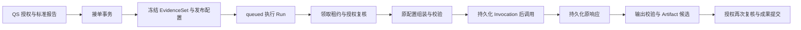

# 解读、冻结输入与成果设计

本文回答报告事实如何进入 AI、生成使用什么版本、成果如何证明来自本次报告，以及失败后哪些工作可以恢复。核对基线：`c977cb9`，2026-10-06；只描述源码已实现的契约，不推断任一环境当前开放状态。

## 结论与问题

qs-ai 通过 MQ 接收 QS 授权代理提供的持久标准报告投影，在接单事务内冻结证据与当时适用发布，再由后台执行验证、调用并构建不可变成果。统一运行入口的原 gRPC Start/Change 已拒绝执行；能力预检仍使用受信 gRPC。运行恢复采用原请求和已保存回执，既有请求不会跟随新发布改版本。

这是为了解决三个问题：报告或配置变化不能使同一请求产生不可追溯结果；模型响应与本地提交之间有崩溃窗口；资源访问权可能在接单后撤销。冻结输入解决前者，持久回执与调用身份处理第二个，执行前及接受成果前的 QS 授权复核处理第三个。

## 概念和责任

| 对象 | 表达的事实 | 不承担的责任 |
| --- | --- | --- |
| Session | Actor、Testee、测评集合、目标、当前状态与版本 | 不生产测评结果，不代表永久授权 |
| 执行 Run | Session 本次排队和执行的身份；重试形成新身份 | 与治理评测 Run 是不同对象 |
| EvidenceSet | 绑定 Session 的报告投影及指纹 | 不含可自动续期的访问许可 |
| FrozenGeneration | 原组装输入、Prompt 消息、Profile 策略、Route、完整 Schema、发布身份 | 不序列化供应商凭证和地址 |
| Invocation / ModelCall | 一次外发模型调用、原请求、外发状态和响应 | 缺少响应不能证明未发出 |
| Artifact | 本次报告、输入、Profile、Prompt、Route、调用和校验版本绑定的成果 | 不把推断转为 QS 测量事实 |

Actor 的组织与主体、报告归属和来源由可信 QS 入口传入。标准报告是唯一测评事实来源；AI 不能从原答案重算分数、方向或强度，也不能根据用户填入的模型/报告信息覆盖服务端事实。AI Profile 是解释策略资产，与 IAM Profile 无关。

当前标准报告生成只支持单测评、单标准报告。通用 Session 模型保留问答等状态，但不能据模型字段推断当前标准报告入口开放多报告或交互问答业务。

## 不变量

- EvidenceItem 的测评集合、Testee、report_id、source_version 与 Session 一致，Fact 引用唯一；报告生成要求恰好一个 `standard_report` Fact。
- EvidenceSet 的 Session 绑定和原字节指纹成立。报告内容的 report/outcome 身份与外层来源身份再次核对。
- 量表与人格采用不同有限策略，快照 v2 标签只选择解码路径，不能单独证明合法、已发布或可接单。
- 组装输入的完整规范 JSON 保存 source/Profile 元数据；供应商 payload 只投影业务 context/facts，三主题另含明确 reference_material。
- 模型请求在外发前持久化。已保存响应只能匹配原 invocation 和 model；恢复不能读取最新发布或重新取报告事实。
- Artifact 重建时再次从原 EvidenceSet 组装并比对输入，原响应必须有有效调用与供应商请求身份。确定性和安全校验通过后才生成成果候选。
- 引用存在、结构合法和关键词安全检查均不能证明解释忠实、具有信息增益或建议适用；治理评测与人工审核仍须独立承担这些判断。

## 正常链路与状态

正常状态为 `created → queued → running → completed`。执行拒绝或依赖失败可进入 `blocked`；取消进入 `cancelled`。特定参与者重试要求原 blocked Session 和准确旧 Run，产生新 Run，不能替换旧执行证据。

外部 request_id 必须为规范 UUID，幂等范围是 QS external-start 的全局请求域，Actor 或正文变化也构成冲突。同请求重放返回原接单回执；发布后重放先前拒绝不会自动变成接受。

## 事务与失败窗口

接单保存请求绑定、Session、EvidenceSet、冻结配置、排队任务和回执，并一次提交。资产不可用或输入不合法的可持久拒绝转换为 blocked Session 与拒绝 Run，通过既有状态出站路径通知 QS；不创建模型工作。容量拒绝同样保留可重放结果。

执行领取与结算分别属于数据库短事务；模型调用期间不会持有接单事务。`ExecuteNext` 维持租约并在执行前和结果接受前查询 QS 授权；撤权生成 `access_revoked` 失败。读取冻结事实不替代当前授权。

| 失败窗口 | 当前处理 | 禁止的推断 |
| --- | --- | --- |
| 请求/资产校验失败 | 接单拒绝或执行失败，保存安全原因 | 不能回落文件、latest 或其他场景 |
| 外发前准备失败 | 按已记录的状态处理 | 不能把局部错误当作完成 |
| 已记录外发但响应未保存 | `provider_result_unknown`，保留调用事实 | 不能自动再次调用模型 |
| 原响应已保存，成果未提交 | 从原 FrozenGeneration + ModelResponse 恢复校验与成果 | 不能改用当前配置 |
| 租约续约失效或进程取消 | 停止当前工作；后续依据持久状态恢复 | 不能因内存任务取消而认定供应商未执行 |
| 成果提交前访问权撤销 | 拒绝接受结果 | 冻结事实不授予读取成果权限 |

同一 Run/Invocation 使用确定性 Artifact 身份，重建不会产生另一份业务成果。三主题 Artifact 额外保存原选取参考正文与摘要，来源不能由模型伪造。状态出站、Broker 确认和 QS 业务接收属于独立边界；Artifact 完成不等于 QS 已接受或参与者已看到。

## 设计选择与代价

选择冻结输入与配置，而非执行时查询最新值，可以重建历史执行并保护审核过的版本；代价是存储和契约兼容成本，需要保留旧解码器及资产。使用调用回执而非无条件重试减少重复计费与重复结果，但 unknown 需要受控核证，牺牲部分自动恢复速度。两次授权检查增加 QS 依赖，却允许接单后撤权生效。

LangGraph 承载运行步骤，业务数据库仍拥有 Session、EvidenceSet、租约、模型回执和成果的持久事实。图执行成功不会自动完成业务结算或消息业务确认。

## 限制与验证

这份设计证明代码边界；当前模型内容质量、生效发布、生产授权与恢复、QS 接收和设备展示均需各自证据。场景与版本细节见 [MBTI 事实契约](02-MBTI报告事实与版本契约.md)、[三主题参考契约](03-MBTI三主题与参考材料契约.md)、[量表兼容](05-量表兼容与回执重建.md)。

实现依据：[Session/EvidenceSet](../../../src/qs_ai/domain/interpretation/model.py)、[外部接单](../../../src/qs_ai/application/interpretation/service.py)、[MQ 受理](../../../src/qs_ai/infrastructure/workflow_transport/mq_receiver.py)、[报告绑定与组装](../../../src/qs_ai/application/interpretation/preparation.py)、[生成回执](../../../src/qs_ai/application/execution/generation.py)、[授权与租约](../../../src/qs_ai/application/execution/worker.py)、[成果构造](../../../src/qs_ai/application/execution/artifact.py)、[输出校验](../../../src/qs_ai/application/interpretation/output.py)。

验证入口：[输入组装](../../../tests/test_input_assembly.py)、[缺失冻结证据](../../../tests/test_worker_frozen_evidence.py)、[MBTI 回执兼容](../../../tests/test_mbti_runtime.py)、[生成集成](../../../tests/integration/test_generation.py)。维护时检查：缺失事实不会读取新报告；原响应恢复不会第二次调用；跨报告输入不能构建成果；发布变化不改原输入；授权撤销可拒绝成果；结构校验和语义质量证据分别报告。
