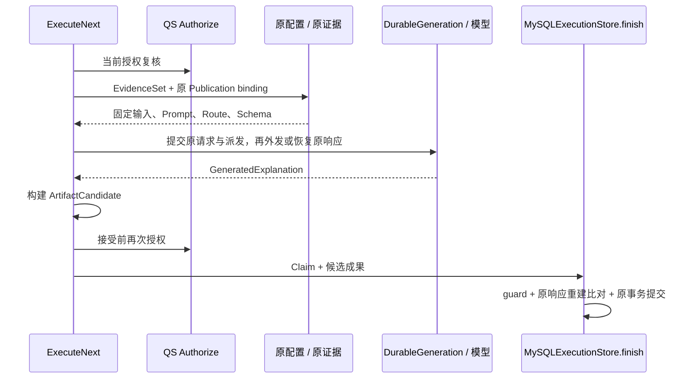

# 解读、冻结输入与成果设计

qs-ai 接受的是 QS 已经确定的标准报告事实。它在接单时保存原证据与适用 Publication，之后据这两个固定来源生成解读；执行前与接受成果前仍要回查当前访问权。**报告事实和生成配置被冻结，访问权持续有效性没有被冻结。** 正式成果还必须与持久原模型响应一致，图运行成功不能直接变成 completed。

本文沿测试中的受测者 `7`、测评 `42`、标准报告 `99`、`source_version=standard-v1:101` 解释这个设计。它是合成量表样例，不是生产业务证据。源码核对基线为 `766b2aa`；MBTI 的事实和参考材料差异由后续场景文档细化。

## 先看这次请求最终需要证明什么

假设 QS 发出 `request_id=11111111-1111-4111-8111-111111111111`，请求为报告 99 生成参与者解读。AI 成功处理后应能从成果反向回答四个问题：

| 问题 | 持久关联 |
| --- | --- |
| 解释谁的哪份报告 | Actor、Testee、Assessment、Report、source_version，Session 与 EvidenceSet |
| 用哪套生成规则 | 接单时的 Publication、生成 Manifest，以及 Profile/Prompt/Route/Schema 固定身份与字节 |
| 来自哪一次外部调用 | Run、Invocation、provider request ID、原冻结请求和持久响应 |
| 按什么规则接受 | 输入/内容指纹、输出和安全 validator version，当前 Claim 与授权复核 |

这些对象的 ID 不互换。QS request ID 是原业务请求；Run 是 AI 的一次执行；Invocation 是一次模型派发；Artifact ID 是这次被接受的成果。AI Profile 是生成策略资产，IAM Profile 是人的身份档案，二者没有同一性。

[ArtifactCandidate](../../../src/qs_ai/domain/interpretation/artifact.py) 的字段记录以上关联。它本身是待接受的值对象；只有存储接受事务完成，才形成持久 Artifact 和 completed 状态。QS 对原事件返回 STORED 是此后的交付完成点。

## 接单先固定身份、事实和配置

### 可信来源与请求重放

QS 负责前端登录、Testee/Assessment 关系和标准报告产生；AI 的入站适配验证服务/消息来源和正文，再调用 `InterpretationService.start_external`。统一服务的旧 gRPC Start/Change 已拒绝执行，实际接单走受保护 MQ，详见 [跨服务边界](../../00-总览/01-系统定位与跨服务边界.md)。

`start_external` 要求规范 UUID request ID；组织、Testee、Assessment 为有效的无前导零十进制外部 ID，组织/Testee/Assessment 范围小于 `2**64`。subject 非空且不超过 128 字符，goal 非空且最多 2000 字符；通用输入允许 1–10 个不重复测评，但当前发布报告生成只支持恰好一个测评和一个标准报告。

幂等 scope 固定为 `fingerprint(["qs-server", "external-start-v1"])`，不按 Actor 分开。请求摘要包含 Actor、Testee、Assessment 列表、goal 和完整 EvidenceItem。相同 request ID 与相同正文返回原回执；换 Actor、换报告或改事实继续使用该 ID，都构成冲突。它与传输层 command ID/Inbox 去重是两个层次，不能只靠消费者内存缓存代替。

### EvidenceSet 保留什么

本例 EvidenceItem 的身份可以写成：

```json
{
  "assessment_id": "42",
  "testee_id": "7",
  "report_id": "99",
  "source_version": "standard-v1:101",
  "facts": [{"ref": "standard_report", "value": "<QS 原快照 JSON 字符串>"}]
}
```

`value` 是保存的原字符串；此处占位符不是有效请求正文。`EvidenceSet.fingerprint` 对完整 items 的规范 JSON 求 SHA256，包含这个字符串。只要原快照字符串变化，即使 JSON 语义看起来一样，也会改变这层证据摘要。

[EvidenceSet.validate](../../../src/qs_ai/domain/interpretation/model.py) 检查证据覆盖全部 Assessment、Testee 一致、报告/来源非空、Fact ref 非空且唯一。它没有单独证明快照里的内容身份、输入适用性或发布资格；这些检查继续在 `report_selector / bind_configuration / prepare_report_input` 中完成。

外层 item 表明报告 99 来自 `standard-v1:101`，组装后还要求快照内 `source.report_id=99`，且 `content_schema_version + ":" + outcome_id` 等于该 source_version。即使重新算了 EvidenceSet 哈希，把外层改成报告 100 或结果 102，仍会因内外来源不同而拒绝。指纹不是业务归属检查的替代品。

### 接单事务的提交点

`start_external` 创建 Session 与新 Run，queue 将初始 version 1 推到 2；保存原 request 映射、EvidenceSet，随后绑定配置并 enqueue Job。`bind_configuration` 在同一事务中：

1. 从原报告导出 selector，查询候选指针并解析适用 Publication。
2. 重读发布的生成资产，校验其与发布证据 Manifest 一致；检查 Suite 输入构造与输入/输出 Schema 组合。
3. 核对 v2 生成模型准入，按原 Profile/Prompt 组装输入并运行发布输入 Schema 校验。
4. 保存 `publication_id / publication_sha256 / pointer_version / selector_query / evidence_set_id / evidence_fingerprint`。

MQ receiver 将上述业务写入、Inbox 决定、首回执和初始状态事件放在它拥有的原根事务中共同提交。内层 UOW 的 commit 是借用事务校验；receiver 才完成根提交。接单本身不调用模型，也不在这里再次同步查询 QS 授权。

若输入不合法、配置不可用或参与者日容量不足，应用可形成可重放的 blocked 拒绝 Run，不创建可执行 Job。某些拒绝已经保存 EvidenceSet 或配置，某些在绑定之前就失败；排障要查看具体接受记录，不能把所有 blocked 都认为有配置。没有配置的原拒绝不会在以后发布时自动变成接受，也不满足复用原配置的 ParticipantRetry 条件。

## 正式输入保留审计元数据，供应商看到有限投影

`published_workflow_version` 只依据单个 standard_report Fact 中的快照标签选有限解码器：v2 选 `qs-published-snapshot-v2`，其它进入 v1 路径；它不证明标签内的内容合法。`prepare_report_input` 继续要求：

- Session 使用 QS snapshot，EvidenceSet 的 id、Session 绑定和原 items 摘要一致。
- 恰好一个 EvidenceItem，其中恰好一个 `standard_report` Fact。
- Session workflow 与 Profile 的量表/MBTI policy 一致，快照通过对应组装和来源核对。

组装得到两份关联但用途不同的 JSON：

| 值 | 用途和内容 |
| --- | --- |
| `canonical_json` | 完整规范输入，保留 source、Profile 元数据及内容；由冻结输入 Schema 校验，计算 input fingerprint，供审计和接受重建 |
| `provider_payload` | 送入 Prompt 的有限 `context / facts`；三主题另含 `reference_material`。不把全部存储元数据直接混入生成任务 |

量表路径保留 QS 的分数、等级、结论、维度描述和标准建议，按固定 Profile 选择维度与可选常模等内容。AI 不用原作答重算分数、等级或人格方向。MBTI 单篇与三主题走专用 policy；通用参考属于解释材料，不能标成受测者的实测事实。

供应商 payload 不携带全部审计字段，不意味着输入可以换绑。Artifact 接受使用 canonical 输入及其来源再次核验。具体版本组合见 [MBTI 事实契约](02-MBTI报告事实与版本契约.md)、[三主题契约](03-MBTI三主题与参考材料契约.md) 和 [量表兼容](05-量表兼容与回执重建.md)。

## 执行读原绑定，不跟随当前发布



`MySQLExecutionConfigurations.get` 读取 Session 的原 binding，核对证据 ID/摘要和 selector query；读取绑定 Publication 并比 publication SHA；查询接单时 pointer_version 的变更审计，证明那个版本实际指向该发布，再编译固定资产。它不查询当前 active 来替换绑定。

例如接单使用 Publication P1、pointer version 7，执行前运营发布 P2、指针变成 8。这次请求继续使用 P1。若 P1 的资产或原审计缺失，应失败为 `configuration_invalid`，不能从 P2、文件或“latest”补值。新业务请求才重新选择当前发布。

Worker 在读取冻结证据前调用 QS Authorize，Workflow 返回后、存储接受前再次调用。QS 仍拥有 Testee 到当前 IAM ProfileLink 与 Assessment 归属核对；输入冻结只保护重建，不授予永久访问权。

## 原模型调用怎样跨越外部 I/O 与数据库提交

正式报告图只有 `prepare → generate → validate`，不为每位参与者再跑治理评测的多个候选、语义裁判或双人审核。LangGraph 不承担另一份业务持久 checkpoint。

`FrozenGeneration` 固定 PreparedExplanation、Route、完整输出 Schema、publication ID 与 manifest fingerprint。端点和凭证由 ModelGateway 持有，不编码进这份请求。DurableGeneration 的恢复由存储记录决定：

| 原 ModelCall | 当前行为 |
| --- | --- |
| 没有记录 | 先提交原 Invocation、冻结 request 与 `dispatched`，再执行外部调用；检查进程容量，并沿用准入/领取路径固定的持久预算 |
| `response_received`，响应记录完整 | 解码原请求和响应，核对 Invocation/model，返回原响应，不再次调用供应商 |
| `dispatched` 或 `unknown`，没有确定响应 | 报 `provider_result_unknown`，不猜测未发送 |
| `failed`，有固定 failure_code | 重放原明确失败，不重新外发 |
| 请求/响应缺失或不能解码 | `model_call_record_invalid`；固定配置不一致则 `model_call_configuration_mismatch` |

模型返回与响应入库之间仍可能中断。取消、失租或响应提交失败会留下 dispatched；这保守地表示可能已经调用过。技术循环下一次运行不等于新调用授权。需要新调用的受控 Retry 另创建新 Run，保留原 Session、证据和接受配置，见 [执行恢复](../../03-基础设施/execution-recovery/README.md)。

## Artifact 为什么需要构建一次、接受时再重建一次

[build_artifact](../../../src/qs_ai/application/execution/artifact.py) 先从冻结 provider context 取得 locale/focus，再用原 Session/EvidenceSet/policy 重组输入，要求新组装值等于 FrozenGeneration 中的 AssembledInput。然后核对非空 Invocation、provider request ID 和 model，运行输出 parser、确定性规则及安全规则。

合格候选的身份为：

```text
uuid5(NAMESPACE_URL, "qs-ai:artifact:{run_id}:{invocation_id}")
```

同一原 Run/Invocation 的本地重建得到同一 ID。content fingerprint 是内容 JSON 字节的 SHA256；input、Profile、Prompt 和 Route 各保留自己的摘要，不能用任意一个摘要代替全部关联。三主题 `qs-ai-artifact/v2` 还把原选定参考正文及其指纹放在模型内容之外，来源来自冻结输入 policy，不能由模型返回的 URL 冒充。

`finish` 并不只相信 Workflow 给出的候选。它重新打开短事务，核对 Session/Run/版本/fence/租约；读取原 EvidenceSet 与该 Run 的 ModelCall，要求 call 已 `response_received`，关联及内容摘要一致。对于正式发布路径，它进一步：

1. 校验原接单配置，并从发布生成配置重建预期 FrozenGeneration，要求等于持久 request。
2. 解码持久原响应，用当前有效 Claim 和原输入再次 `build_artifact`。
3. 比较整份候选是否等于重建值，而非只比 content hash。
4. 检查完整候选 payload UTF-8 JSON 不超过 131072 bytes。
5. 原事务插入 Artifact，完成 Session/Run、Job，释放租约与容量，并保存待投递状态事件；全部成功才 commit。

“Workflow 返回一篇 JSON”无法绕过这个接受点。问题或失败结果不能同时带 Artifact；没有 Artifact 的普通结果不会制造 completed，而会 blocked。已取消、被新 Run 替代或 fence 失效的旧 worker 也不能接受迟到成果。

输出的 schema、合法引用、禁止措辞检查有有限覆盖。它们不能证明自然语言的所有忠实性和建议适用性，更不能把 AI 推断升级成 QS 测量事实。配置的质量证据来自独立治理评测；真实参与者文本仍需要实际内容验收。

## 用三个故障例子判断下一步

| 例子 | 持久事实 | 正确处理 |
| --- | --- | --- |
| 供应商已经返回，本地响应 commit 失败 | 可能只剩 dispatched，原供应商请求已发生 | 停留未知结果边界，核证原调用；不能因数据库故障自动重发 |
| 原响应已保存，成果事务的 Outbox 写入失败 | 原调用可恢复，Artifact/completed/事件这笔事务整体回滚 | 原 Job 若仍符合领取预算/guard，复用原响应重建接受，不调第二次模型 |
| 模型返回后原 ProfileLink 失效 | 原响应可以已保存，接受前授权失败 | `access_revoked`，Job结算为blocked，不保存正式成果；QS依赖不可用另为 `dependency_unavailable` |

Worker 的 RuleViolation 统一映射为 `evidence_invalid`；ReportWorkflow 则保留 `report_not_applicable / report_input_invalid / prompt_invalid`、确定输出错误和 provider failure 类别。存储提交异常继续抛出，由技术 loop 退避，不伪装成一份已接受业务拒绝。

“可以从原响应恢复”有前提：Job 仍可执行、attempt 未耗尽、当前 Session/Run 与 Claim 合法、原证据/配置/响应完整，并且授权复核通过。它不是对任何 blocked Session 的自动恢复承诺。

## 成果形成以后，谁拥有读取和交付决定

Artifact 与 AI completed 的原提交产生状态/成果事件，Relay 传输原事件，QS 校验关联、内容契约并保存业务投影。只有匹配原 `event_id / event_kind / event_body_sha256 / aggregate_key` 的 STORED ACK，才确认这一事件的业务交付。Broker PUB 确认不能代替它。

QS 事件接收没有共享 AI 的 active Run，也不另执行一次 CurrentAccess；参与者之后读取 QS 投影时，仍由读取入口校验当前资源权限。原事件已存储不意味着旧主体永久有读取权。跨服务证据与授权顺序见 [系统边界](../../00-总览/01-系统定位与跨服务边界.md)。

## 代码与测试怎么查证

| 需要证明的事实 | 实现入口 | 测试证据及范围 |
| --- | --- | --- |
| 原请求全局重放，拒绝在新发布后仍保持 | [service.py](../../../src/qs_ai/application/interpretation/service.py)、[事务 UOW](../../../src/qs_ai/infrastructure/persistence/mysql/interpretation.py) | [MQ 接单集成](../../../tests/integration/test_mq_admission.py)、[发布与原绑定](../../../tests/test_publication.py)；原事务需隔离数据库验证 |
| 外层报告关联与原字节摘要都需核对 | [preparation.py](../../../src/qs_ai/application/interpretation/preparation.py)、[EvidenceSet](../../../src/qs_ai/domain/interpretation/model.py) | [test_input_binding.py](../../../tests/test_input_binding.py)：重算摘要仍无法换报告/来源，多报告和未知Fact拒绝 |
| 接单固定发布，恢复重查原资产/审计，不用最新 | [execution_configurations.py](../../../src/qs_ai/infrastructure/persistence/mysql/execution_configurations.py) | [test_publication.py](../../../tests/test_publication.py) 保护不可变 Publication/Manifest 值对象和指针移动；持久 binding 恢复由 [test_execution_configurations.py](../../../tests/integration/test_execution_configurations.py) 在隔离数据库验证 |
| 缺少冻结证据不能去QS读取新报告，授权失效不能接受 | [worker.py](../../../src/qs_ai/application/execution/worker.py) | [test_worker_frozen_evidence.py](../../../tests/test_worker_frozen_evidence.py) 使用替身检查不读取新事实；完整当前授权规则见 [test_qs_access.py](../../../tests/test_qs_access.py) 与上游 QS 实现 |
| 同一原响应只构建同一成果，错误身份/输入/输出不能通过 | [artifact.py](../../../src/qs_ai/application/execution/artifact.py)、[输出校验](../../../src/qs_ai/application/interpretation/output.py) | [test_artifact.py](../../../tests/test_artifact.py) 的重建、篡改和安全分支；不证明供应商自然语言质量 |
| 成果、completed与事件共同提交，取消拒绝迟到成果 | [execution.finish](../../../src/qs_ai/infrastructure/persistence/mysql/execution.py)、[result_outbox](../../../src/qs_ai/infrastructure/persistence/mysql/result_outbox.py) | [test_artifact_acceptance.py](../../../tests/integration/test_artifact_acceptance.py)：原子提交、Outbox故障回滚、取消后迟到成果拒绝 |
| 派发/响应故障不重复调用 | [DurableGeneration](../../../src/qs_ai/application/execution/generation.py)、[报告图](../../../src/qs_ai/infrastructure/workflows/report.py) | [生成集成测试](../../../tests/integration/test_generation.py) 验证取消、commit故障与进程退出，需要可销毁 MySQL |

上述测试分别保护本地规则和真实存储边界。部署版本、供应商调用实际情况、QS STORED、参与者展示和业务内容验收需要另外绑定原请求证据；不能用某个层面的通过替其它层面作结论。
