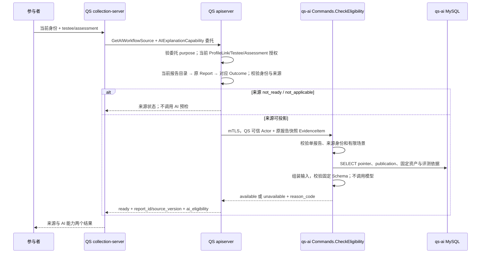

# 报告 AI 能力预检契约

报告可读和 AI 解读可用是两次判断。QS 先确认当前参与者访问权，并找到可追溯的标准报告及其 Outcome；qs-ai 再检查当前适用 publication、固定资产和报告输入。预检通过只说明这次只读查询满足配置与输入契约，不预留额度，也不创建任务。实际接单仍须重新检查并持久接受或拒绝。

例如，受试者 7 的测评 42 已有标准报告 123456，用户能正常阅读，但 MBTI 模板只完成安装、尚无 publication。来源查询仍返回 `status=ready` 和原 report/source 身份，同时返回 `ai_eligibility.status=unavailable`、`reason_code=publication_missing`。它没有把报告改成失败，也没有创建一项等待模板发布后自动运行的 AI 工作。

本文核对 qs-ai `4e6b12c` 和 qs-server `2ccc2de`，日期为 2026-10-06。报告冻结输入见 [解读冻结输入与成果设计](01-解读冻结输入与成果设计.md)，参与者接单与消息边界见 [QS 接入与消息契约](../../04-接口与运维/02-QS接入与消息契约.md)。本篇负责只读预检及其与实际 Start 的区别；当前部署和页面展示仍需各自的环境证据。

## 一次查询跨过哪些边界

现有参与者 URL 是 QS collection-server 的 `GET /api/v1/assessments/{id}/ai-workflows/source?testee_id=...`。它不让浏览器直接提交快照给 qs-ai。



图中的 `AIExplanationCapability` 是 QS 委托的 purpose，不是一个新 AI RPC。AI 端实际方法是 `qsai.workflow.v1.Commands.CheckEligibility(EligibilityQuery) → EligibilityStatus`，机器契约在 [workflow.proto](../../../integrations/workflow/proto/workflow.proto)。

QS apiserver 的 `workflowActor` 验证委托绑定的 purpose、受试者和身份，再由 `CurrentAccess.ResolveParticipantActor` 根据 QS Testee 取得组织：显式传入的组织必须匹配，不能被换成别的组织。当前 active ProfileLink 及该 Testee 对 Assessment 的访问必须成立。`Participant.Source` 在取报告前还调用 `AuthorizeOwnAssessment`。权限撤销或授权依赖失败时，不会继续查询 AI 配置。

qs-ai 要求 TLS auth_context 为 ssl，且客户端 common name 精确为 `qs-apiserver.svc`；这一步发生在打开 REQUEST scope 之前。随后信任 QS 对这份快照的人类授权，自己校验 Actor 与证据结构，不重新向 IAM 查参与者权限。证书证明调用者是 QS 工作负载，不能单独证明浏览器用户有权阅读某报告。

## QS 的 ready、not_ready 与 not_applicable

QS 的 `reportsource.Resolver` 先按 Assessment 查询当前标准报告目录，再按目录指定 id 读取原 Report 和 Report.OutcomeID 指向的 Outcome。它不会扫描同测评的其他报告来补当前来源。报告身份、Testee、Assessment、Org 和模型身份必须相互一致；缺行或身份漂移是来源错误。

| 来源层结果 | 真实条件或例子 | 是否调用 CheckEligibility |
| --- | --- | --- |
| `not_ready` | 当前目录没有已选定的标准报告 | 否；没有 report_id/source_version |
| `not_applicable` | 报告可读，但属非标准类型、旧 builder/content provenance；或 MBTI 不是固定模型版本、旧内容缺四轴 pole_facts | 否；不把旧叙述补成新快照，也不返回来源身份 |
| `ready` | 当前原 Report 与对应 Outcome 可一致投影 | 是；即使 AI 最后 unavailable，仍返回原 report_id/source_version |
| 服务/一致性错误 | 目录指定的 Report 不存在、Outcome 丢失、组织/模型错配，或查询依赖失败 | 明确错误；不能换报告、默认 not_applicable 或猜一个 AI 原因 |

`not_applicable` 不表示报告不可阅读，也不表示当前 AI publication 被暂停。它表示 QS 无法以受支持的来源契约投影当前报告。比如历史 MBTI 报告只保存类型叙述、没有冻结 pole_facts，原报告可以按历史能力读取；不能根据这段叙述、最新模型定义或默认阈值补成可生成的 AI 输入。

可投影来源形成一个 `EvidenceItem`：Assessment/Testee/report_id 使用字符串 ID，`source_version=<content_schema_version>:<outcome_id>`，facts 恰有一项 `ref=standard_report`，value 为完整版本化 JSON。量表采用 `qs-report-snapshot/v1`；固定 MBTI 使用 `qs-report-snapshot/v2`。其中模型身份来自提交 Outcome，展示事实来自已冻结 Report；可见维度及建议过滤保留原 suggestion source_index。字段所有权见 [标准报告事实快照](../../../integrations/qs_server/report-snapshot.md)。

这与“报告 ID 存在就支持 AI”不同。QS 查当前报告、AI 校验输入都禁止拿另一来源替换：历史报告、最新模型、客户自报的原 JSON 和未绑定 provenance 的旧展示 RPC 不能悄悄成为生成事实。

## AI 预检的实际校验顺序

`eligibility_source` 首先检查 Actor 组织/subject、外部 ID 和请求基本结构；合法但多测评的查询返回 `unsupported_scene`。它构造临时 Session/EvidenceSet 值对象用于复用输入校验，临时 id 为 `eligibility` / `eligibility-evidence`；这些对象不写入数据库，没有 active Run。

证据必须与 Testee、Assessment 匹配，且是一个标准报告事实。快照内 source.report_id 要等于外层 report_id，content_schema_version/outcome_id 组合要等于 source_version；JSON 重复字段也不能接受。场景只允许 `scale/score_range` 或 `typology/pole_composition`，人格场景还必须是 `MBTI_OEJTS / v64-report-202608-v1` 和快照 v2。完整 MBTI decoder 进一步核对四轴事实，不把模型标签合法当成输入完整。

通过这些检查后，`MySQLEligibilityReader.check` 才打开数据库 Session，执行以下读取：

1. 根据报告 selector 查候选 pointer，并用 `load_pointer` 校验其原记录和发布证据。
2. 从适用 active pointer 中选 publication；无适用发布时区分“没有候选槽”与“已有槽但无 active”。
3. `compile_configuration` 读取该 publication 评测 Run 所属组织的 Suite，核验 Suite manifest、原 Profile 与 GenerationManifest，读取固定 Prompt、Route、输入/输出 Schema。评测采用的输入构造版本也必须匹配；不能用新 Schema 解读旧发布。
4. 对 Route v2 核验当前目录 revision、verified 状态、generation 用途、enabled binding，以及固定模型/binding/adapter/参数是否匹配。
5. 使用这份报告和固定 Profile/Prompt 组装输入，执行输入业务校验及原 Schema 校验；全通过才返回 available。

这条链中没有模型网关或任务创建依赖。v2 的“绑定可用”是本地目录和 binding 契约成立，不证明实际 API key 已配置、网络可达、供应商余额足够或本次模型会成功；预检没有发一个探测模型请求来验证这些事项。

实现入口：[瞬时来源检查](../../../src/qs_ai/application/interpretation/eligibility.py)、[只读查询](../../../src/qs_ai/infrastructure/persistence/mysql/eligibility.py)、[原发布配置编译](../../../src/qs_ai/infrastructure/persistence/mysql/execution_configurations.py)。

## 量表宽匹配与 MBTI 精确匹配

量表按原 selector 的三种候选查找，取 active 候选中 specificity 最高的一项：

```text
participant / scale / score_range / model_code / model_version
participant / scale / score_range / model_code / null
participant / scale / score_range / null       / null
```

因此一个支持通用量表的已发布配置可以匹配尚无专属配置的模型；有专属 active 配置则使用专属项。特别地，专属槽已暂停但通用槽仍 active 时，解析仍可能得到通用发布并返回 available。`publication_paused` 不是“看见任意暂停槽就否决”，而是候选槽存在、但没有适用 active publication。固定资产损坏则明确返回 asset_invalid，不能靠选择低 specificity 配置掩盖损坏。

MBTI 的候选只有一项：

```text
participant / typology / pole_composition / MBTI_OEJTS / v64-report-202608-v1
```

它不去掉版本，不采用量表的通用槽，也不转用另一个 MBTI 版本。量表已开放而这个精确 MBTI 槽缺失时，报告 ready 仍返回 `publication_missing`。单次与三主题 MBTI 的根场景版本不同、selector 却相同；预检根据当前 publication 的固定 Profile 编译输入 v2 或 v3，不由页面任选一种根。模板目录里的安装状态不会进入此次发布选择，细节见 [MBTI 模板与方案来源契约](../governance/02-MBTI模板与方案来源契约.md)。

选择规则由 [ReleaseSelector 与 resolve_publication](../../../src/qs_ai/domain/governance/publication.py) 和 [报告 selector](../../../src/qs_ai/application/interpretation/selection.py) 共同实现。

## 能力原因码和传输错误是两层结果

AI 返回的 status 只有 `available` / `unavailable`。QS 的 `not_ready` / `not_applicable` 属于上一层来源状态；AI 也没有名为 `config_invalid` 的原因码，固定配置校验问题使用 `asset_invalid`。

| AI 结果 | 可观察的条件 | 对当前报告意味着什么 |
| --- | --- | --- |
| `available`，reason 为空 | 当前适用发布、固定资产和本次输入通过 | 可以展示当前能力，但还没有提交生成 |
| `unavailable / unsupported_scene` | 合法多报告查询，或非支持的 kind/decision_kind | 该输入场景不属于现行解读范围 |
| `unavailable / unsupported_model_version` | 人格场景模型 code/version 不是固定 MBTI 组合 | 不采用新版本或量表配置补齐 |
| `unavailable / source_incomplete` | 证据缺失或 Assessment 集合不匹配、缺标准事实、JSON 不合法、快照/完整组装输入不符合契约 | 报告展示事实未必足够做本次模型输入 |
| `unavailable / source_conflict` | 外层证据与 Testee 不同，或内外 report_id/source_version 不一致 | 当前提交来源需要核对；不换另一报告 |
| `unavailable / publication_missing` | 所有候选 selector key 均无 pointer | 有报告/已安装模板也不代表已开放 |
| `unavailable / publication_paused` | 有候选 pointer，却没有适用 active publication | 本次新准入无可用发布；不判断历史成果失效 |
| `unavailable / asset_invalid` | pointer/publication 证据、固定资产、输入构造版本或 v2 目录绑定校验失败 | 已有发布记录不能独自证明配置可执行 |

非法 Actor/基本请求返回 gRPC `INVALID_ARGUMENT / Invalid eligibility query`；非可信工作负载或访问拒绝返回 `PERMISSION_DENIED`。数据库、依赖和其他未归类异常返回 `UNAVAILABLE / Eligibility temporarily unavailable`。它们不是一个成功返回的 unavailable 原因码。

QS 的 AI 客户端设置 5 秒 deadline，校验 available 必须无 reason，unavailable 必须属于固定白名单；不接受新未知 status/reason 或携带额外 reason 的 available。PermissionDenied 映射访问拒绝，其余 RPC 错误、nil/非法响应映射依赖不可用。QS 不把超时改成 publication_missing，也不在预检错误中要求用户拿 command_id 重放，因为这次读取没有创建命令。

返回值只有安全状态和原因，异常细节、报告原文、Prompt 或模型参数不进入响应。AI 无跨请求缓存，QS 本次查询结果也不是可跨权限变化使用的授权证明。

## 页面看到的两个结果，以及 Start 的变化窗口

前述“报告已就绪但未发布”的查询结果可以是：

```json
{
  "status": "ready",
  "report_id": "123456",
  "source_version": "standard-v2:123455",
  "ai_eligibility": {
    "status": "unavailable",
    "reason_code": "publication_missing"
  }
}
```

ready、原 report_id/source_version 与 ai_eligibility 应分别传递。没有预检字段、查询超时和 unavailable 都不能被页面自行解释为“允许提交 MBTI”。本篇给出消费者契约；实际页面是否按契约展示，需要客户端版本和真实展示证据。

预检不读取当前参与者额度，也不检查 QS `IntakeClosed` 开关，不预留执行容量。即使刚取得 available，下列变化仍可能发生：

| 查询之后的变化 | 实际接单或执行如何判断 |
| --- | --- |
| 当前 ProfileLink 或 Assessment 访问被撤销 | QS Request 再次核对当前访问；Worker 执行时也需当前授权，旧预检不能代替它 |
| 当前报告被另一个 report_id 替换 | QS 新请求要求页面提交的 report_id 等于当前选中报告，否则报来源冲突；不会静默换源 |
| publication 暂停/替换，或配置变为不可执行 | AI 接单事务重读 pointer 和完整配置；确定拒绝持久保留原结果 |
| 额度耗尽，或 QS intake 关闭 | 预检无 reservation；真实接单按该阶段的开关、配额规则接受或拒绝 |
| 供应商网络或调用失败 | 后台执行阶段按原固定配置处理；available 不代表模型成功或成果质量 |

当前执行命令从 MQ 进入 `InterpretationService.start_external`，旧 `Commands.Start` / Change RPC 返回 `FAILED_PRECONDITION` 要求 MQ 接单。AI 用原 request_id 预留幂等记录、建立 Session/证据、重验并绑定 publication 与 pointer version，再入队并提交；预检的临时对象不会转成它的 Session。

无发布、输入不合法或确定的配置错误会成为可重放的持久拒绝，没有 Job 或模型调用；原因分别落到 `configuration_unavailable`、`admission_input_invalid`、`admission_configuration_invalid`，容量拒绝另有本阶段原因。数据库/提交不确定故障仍抛出，不能伪造确定拒绝。状态、幂等回执和恢复见 [解读冻结输入与成果设计](01-解读冻结输入与成果设计.md)。

已接受 Session 之后读取的是绑定的原 publication/manifest，并复核原证据和资产，不用今天的预检或指针去升级它。指针暂停后，历史成果仍通过当前用户授权和原请求范围读取；已经被拒绝的同 request_id 重放也不会因指针恢复而变成接受。一个纯预检查询可以重新查最新能力，一条真实业务命令则必须先对账自己的原结果。

## 只读查询与历史 probe 的证明范围

`MySQLEligibilityReader` 使用自有读取 Session，只有 SELECT，无 `FOR UPDATE`、显式 commit、quota reservation、命令回执、Outbox 事件或发布写入。输入组装和 JSON Schema 校验只在内存中运行。测试以 SQL guard 检查每条语句均为 SELECT 且无行锁；不以“调用名字是 Check”推断无副作用。

仓库还保留两个不同用途的 probe：`ParticipantReportProbe` 调旧展示报告 RPC，仅验证传输及报告 assessment 身份，返回协议缺少可用于新证据绑定的完整 report provenance；源码明确它不是 EvidenceSource。`bootstrap.grpc_probe` 调退役 Change 入口检查 TLS/workload 与预期拒绝状态。两者都不能证明这个报告有 active publication、预检 available 或真实 MQ Start 已接单。源材料应继续使用原冻结事实，不能将历史 probe 成功升级为新准入证据。

采用只读且不缓存的预检，让报告 readiness 与 AI 开放状态可分辨，又避免查看页面产生任务和费用。代价是查询成本与查询到提交之间的变化窗口；实现接受这个窗口，并在实际接单重新验证和冻结，不能靠长期缓存 available 或先创建空 Job 消除它。

## 验证入口

| 证据入口 | 能证明的范围 |
| --- | --- |
| [test_eligibility.py](../../../tests/test_eligibility.py) | 量表/MBTI 来源绑定、有限模型版本、重复字段与身份冲突；Reader 异常映射、不可信工作负载不进入 scope |
| [test_grpc_eligibility.py](../../../tests/test_grpc_eligibility.py) | 真实测试 mTLS 证书与方法；无 DB 时完整输入返回 UNAVAILABLE，而不完整输入可先返回 source_incomplete |
| [integration/test_eligibility.py](../../../tests/integration/test_eligibility.py) | 隔离 MySQL 的 SELECT/no-lock guard；available、暂停、损坏发布三种结果不同；MBTI 不采用通用量表 publication |
| [integration/test_eligibility_go.py](../../../tests/integration/test_eligibility_go.py) | QS Go 客户端 → mTLS → 实际 MySQL 预检；原量表 available、MBTI missing、非 QS 证书拒绝，需隔离 QS checkout 和 Go |
| [test_admission_rejection.py](../../../tests/test_admission_rejection.py) | 真接单的确定拒绝可提交/重放且零 Job；不确定依赖失败不提交假拒绝 |
| [integration/test_execution_configurations.py](../../../tests/integration/test_execution_configurations.py) | 指针暂停/替换不改已接受绑定；新准入拒绝与原 request 重放；固定输入/资产不合法不发送模型 |
| [test_grpc_report_probe.py](../../../tests/test_grpc_report_probe.py)、[test_grpc_probe.py](../../../tests/test_grpc_probe.py) | 历史 probe 的传输、错误映射及拒绝行为，不覆盖新业务预检或真实质量 |

QS 的对应测试按其 `2ccc2de` 基线回查：[reportsource/resolver_test.go](https://github.com/FangcunMount/qs-server/blob/2ccc2de44bbd45e26d29e7e130da518cc32426f0/internal/apiserver/application/interpretation/reportsource/resolver_test.go)、[participant_source_test.go](https://github.com/FangcunMount/qs-server/blob/2ccc2de44bbd45e26d29e7e130da518cc32426f0/internal/apiserver/application/aibridge/participant_source_test.go)、[snapshot_mbti_test.go](https://github.com/FangcunMount/qs-server/blob/2ccc2de44bbd45e26d29e7e130da518cc32426f0/internal/apiserver/application/aibridge/snapshot_mbti_test.go)。它们核验当前授权先行、ready 与能力分离、临时故障不伪装原因、旧来源不猜事实；不能证明生产用户/报告、真实模型结果或页面已验收。

主要源码：[RPC 身份与错误映射](../../../src/qs_ai/transport/grpc/commands.py)、[源值对象校验](../../../src/qs_ai/application/interpretation/eligibility.py)、[MySQL 预检](../../../src/qs_ai/infrastructure/persistence/mysql/eligibility.py)、[真实接单](../../../src/qs_ai/application/interpretation/service.py)、[接单失败分类](../../../src/qs_ai/infrastructure/persistence/mysql/interpretation.py)、[固定配置绑定与重读](../../../src/qs_ai/infrastructure/persistence/mysql/execution_configurations.py)、[退役执行 RPC 拒绝](../../../src/qs_ai/transport/grpc/mq_cutover.py)。

跨服务事实入口：[QS 当前授权](https://github.com/FangcunMount/qs-server/blob/2ccc2de44bbd45e26d29e7e130da518cc32426f0/internal/apiserver/application/aibridge/access.go)、[当前来源选择](https://github.com/FangcunMount/qs-server/blob/2ccc2de44bbd45e26d29e7e130da518cc32426f0/internal/apiserver/application/interpretation/reportsource/resolver.go)、[来源与 AI 结果组合](https://github.com/FangcunMount/qs-server/blob/2ccc2de44bbd45e26d29e7e130da518cc32426f0/internal/apiserver/application/aibridge/participant_source.go)、[委托 purpose 与 gRPC 响应](https://github.com/FangcunMount/qs-server/blob/2ccc2de44bbd45e26d29e7e130da518cc32426f0/internal/apiserver/transport/grpc/service/participant_ai_explanation.go)、[QS 五秒 AI 查询](https://github.com/FangcunMount/qs-server/blob/2ccc2de44bbd45e26d29e7e130da518cc32426f0/internal/apiserver/infra/aibridge/eligibility.go)。
