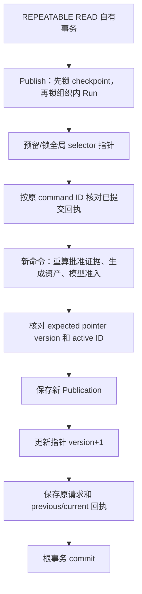

# 发布证据与生效指针设计

一次批准评测回答“这套固定配置有什么质量证据”，发布指针回答“之后的新请求采用哪套配置”。**qs-ai 保存不可变 Publication，再在同一事务中移动全局 selector 指针；已接受请求继续绑定原发布。** 批准、发布、部署与某个成果的 QS STORED 是不同完成点。

本文按 `766b2aa` 的业务源码核对，以 P1 首次发布、P2 替换、停用和回退 P1 为例。P1/P2 是示意名称，不是可提交的 UUID，也不表示某个环境已生效。可信操作入口见 [治理链](../../00-总览/03-治理链与执行链.md)，质量门槛见 [评测设计](../evaluation/01-评测候选门槛与审核设计.md)。

## 一次发布需要保留四种记录

| 记录 | 保存的事实 | 为什么不能省略 |
| --- | --- | --- |
| `configuration_publications` | publication ID、固定证据完整 JSON 及 SHA256、selector/Run/version/原组织索引 | 不能只保留“当前 P2”而丢掉 P1 原配置和批准依据 |
| `configuration_publication_pointers` | selector 的全局 key、递增 version、active ID、changed_at | 新请求选择入口；不表示历史请求现在用什么 |
| `configuration_publication_changes` | command ID、原可信 scope/正文、完整 previous/current 回执、该 selector 的新 version | 证明一次移动的操作者、原因、确认事实和原结果；用于丢失返回后的核对 |
| `execution_configurations` | Session 接单时的 publication ID/SHA、pointer version/query、EvidenceSet ID/摘要 | 使一次执行恢复仍能重建原配置，不改用当前指针 |

PublicationEvidence 包含原 Profile、五项 GenerationManifest、完整十一项 ReleaseIdentity、Run ID/最终 version、FinalReview 和已评测 Manifest 摘要。发布人的 audit 与评测最终审核的 audit 分别保存，不能用一次“发布确认”替代此前的审核责任。

Publication 是不可变值；指针和变更回执是可审计的选择历史。源码的读路径也会核对原内容摘要和索引，不能只因为某行 UUID 存在就当作合法发布。

## Selector 决定影响范围，组织只决定治理身份

ReleaseSelector 的五个字段为：

```json
{
  "audience": "participant",
  "model_kind": "typology",
  "decision_kind": "pole_composition",
  "model_code": "MBTI_OEJTS",
  "model_version": "v64-report-202608-v1"
}
```

selector key 是这五个字段规范 JSON 的 SHA256。它不包含 organization、solution_id、scene_contract_version 或 Publication ID。组织 912 创建的 Solution 和评测属于该组织；它获准发布到这个 selector 后，指针对匹配该场景的新业务请求全局生效，并非组织 912 的独立开关。

量表只支持 `participant / scale / score_range`，接单按如下候选顺序选择：

| 查询报告的模型 | 可查槽位 | 优先级 |
| --- | --- | --- |
| code=C、version=V | code=C、version=V | specificity 2，最具体 |
| 同一报告 | code=C、version=null | specificity 1 |
| 同一报告 | code=null、version=null | specificity 0，通用量表 |

`resolve_publication` 只考虑 active 且 matches 的槽位，取最高 specificity；同级出现多个候选则明确冲突，不能靠列表顺序选择。持久表每个 selector key 唯一，也不会允许 model_version 存在而 model_code 为空。

停用 code=C/version=V 的精确量表槽位，如果较宽槽位还有 active，之后请求仍可回落到它。**停用一个量表槽位不等于关闭所有量表解读。**

MBTI 支持上述基础版组合和精确探索版 `(participant, typology, pole_composition, MBTI_FC_93, v55-report-202608-v1)`。各自的 admission_candidates 只有自身，没有人格通配、跨模型继承或量表回落。基础版单篇与三主题的 Profile、Schema、Suite 和 scene contract 不同，但共享基础版 selector 槽位；探索版使用独立槽位，必须独立评测、审核和发布。预检如何表达 missing/paused 见 [能力预检](../interpretation/04-报告AI能力预检契约.md)。

## 批准 Run 怎样再次成为可发布证据

客户端提交 `run_id / run_version / release_fingerprint`，不提交一份可被直接信任的 `approved=true`、分数表或任意资产数组。Publish 的服务端核证分为三层。

### 1. 核对原最终决定与完整评测历史

`verified_final_snapshot` 要求持久状态为 approved/rejected，并存在结构一致的 gate_result。最终 Run version 必须等于记录中的 `source_version+1`；finalized_at、status、最后一条 transition 必须一致。

它在原 finalized_at 上把进度还原为终审前的 awaiting_review 视图，重新加载冻结的 Suite/策略、候选、调用、恢复及审核历史，重算 gate preview 和 final_record，再与原记录逐项比较。不是只看数据库中的 approved 字符串。Publication 额外要求五个门槛全部通过。

终审前存在审核更正时，复算同时核证原签名与更正链，并使用有效决定；更正不会独立形成发布依据。首次持久化更正后，代码回滚必须选择支持 CorrectReview 审计投影的版本，否则旧代码可能只读取原签名。不能通过删除更正记录恢复兼容。

这个快照核验不代表逐项重新读取十一份资产表正文；它核对完整 release 身份与冻结评测文档、历史。后续生成资产重读和模型准入是另外两层，不宜合写成“全部十一项资产每次都重新读过”。

### 2. 重读五项生成资产，与实际评测的 Manifest 相等

`publication_evidence` 从 Run 定义读取完整 ReleaseIdentity，要求客户端确认的 release fingerprint 完全相等；`generation_snapshot` 重读 Profile、Prompt、生成 Route、输入 Schema 和输出 Schema，要求原冻结 Manifest 的规范 JSON 与摘要都等于此次重建值。

PublicationEvidence 又核验生成五项引用对应完整 release 的字段、Profile 正文 SHA、Profile fingerprint 与 generation_policy 指向的 Prompt/Route/Schema 一致。Schema 的完整 release ref 使用 `identity/version` 形式，不能只比一个短 version。

Prompt 的来源指纹与 package 原字节 SHA 也不是同一字段。即使来源指纹不变，改动包正文仍会改变 Manifest 的 content_sha256，不能把改后的 Prompt 贴到原批准 Run 上发布。

### 3. 复核当前生成和裁判模型准入

`check_editable_models` 从 release 读取生成 Route 和语义 Route。v2 按当前 catalog、binding 和 generation/semantic 角色能力核验；v1 中 `solution-*` 派生 revision 检查当前允许模型，保留的 baseline v1 路线维持原准入契约。固定资产存在不代表新的治理路线现在仍满足准入配置。Publish/rollback 不调用模型，也不验证供应商余额或真实自然语言质量。

disable 不经过上述质量重算和模型准入：停止当前坏配置不应以它仍能通过审核为前提。但指针和原审计本身的完整性仍要可读，disable 不是修复已损坏数据库记录的万能入口。

## 原子发布的锁序和提交点

[MySQLPublications.apply](../../../src/qs_ai/infrastructure/persistence/mysql/publications.py) 拥有自有事务，`apply_publication(db,...)` 只操作调用方传入的 Session，返回值本身不提交。实际步骤如下：



终审/发布共享 checkpoint/Run writer 锁，后锁 selector，证据一致性读在必要锁建立后进行。这样另一个事务仍在 Finalize 时，Publish 会等待实际决定，再核证对应 version，不会凭先前读到的预览抢先生效。

缺失 selector 先预留 `version=0` 的行，再 `FOR UPDATE`。新发布、指针和变更回执共同提交；证据、CAS、约束或记录保存失败，预留行也回滚，不留下一个被失败尝试污染的“已安装槽位”。MySQL 唯一键还约束 `(selector_key, version)` 的变更历史及全局 command ID。

rollback 会先锁保留的目标 Publication，取得它记录的原评测组织，再锁其 checkpoint/Run 和目标 selector。它不会把操作者当前 organization 当成目标 Run 的原组织，也不接受客户端替换目标的 Run 或资产字节。disable 不需要锁某个评测 Run，只锁对应 selector 并核验原指针。

## 用 P1/P2 走一遍四次移动

| 操作前 | 明确确认的事实 | 操作后 | 哪些请求受影响 |
| --- | --- | --- | --- |
| 初始 version 0、active=null | Publish 批准 Run R1；expected_version=0、expected_active_id=null | version 1、active=P1，新 Publication P1 | 后续新接单开始用 P1 |
| version 1、active=P1 | Publish 批准 Run R2；expected_version=1、expected_active_id=P1 | version 2、active=P2，新 Publication P2 | 后续新接单用 P2；原绑定 P1 继续 P1 |
| version 2、active=P2 | Move target=null；expected_version=2、expected_active_id=P2 | version 3、active=null，原 P1/P2 保留 | MBTI 新接单无可选发布；量表仍须看宽槽位 |
| version 3、active=null | Move target=P1；expected_version=3、expected_active_id=null，重新核证 P1 | version 4、active=P1，未新造 P1 | 后续新接单重新用 P1；旧请求不换绑 |

这里 Run version、Solution revision、pointer version 是不同序列。Finalize 增加 Run checkpoint version；Publish 不因此把 Run version 改成 pointer version。回退也不是将指针版本倒退回 1，而是形成 version 4 的新审计。

每个写命令还要求非零 UUID command ID、非空 reason 和 `confirm=true`。PublicationScope 的 org/operator 来自可信 QS 委托，actor 为 `user:<operator>`；审计时间来自服务端。理由最多 1000 UTF-8 bytes、不含 `< >`，显式确认和两个 expected 字段用于表明操作者看到了哪些当前事实。

若两个人都读到 version 1/P1，一个先发布 P2，另一个仍携旧 expected 发布 P3，则第二个冲突。服务不会刷新 expected 后自动覆盖 P2。需要先重新读取 P2 的影响再作新的明确决定。

不能对已为空的 active 再 disable；不能 rollback 到当前 active；rollback 只使用实际保留的同 selector Publication。它保留 P1 原发布 audit，同时新增本次回退 audit，二者不可互相覆盖。

## 返回丢失后，查询原回执而不是补发新决定

原 command ID 与包含 scope 的 request_json 共同绑定操作。同 ID、同正文、同 scope 可以返回原 PublicationReceipt；更改 reason、expected、target、Run 或 org/operator 后仍用旧 ID，会冲突。原回执表达当时 previous/current，不等于现在仍是那个 current。

例如 P1 的发布返回丢失，之后别人已停用到 version 2。读取第一次命令的回执仍能证明它曾把 version 0 移为 1；当前 Get 则返回 version 2/null。不能拿旧回执显示的 P1 当成当前生效事实。

重发 Publish 仍先锁定并校验原 Run；rollback 还先读取保留目标及其原 Run，之后才检查原 command 回执。disable 不受该 Run 前置约束。因此它不是无条件跳过 Run 存在性/version 约束的恢复入口；结果未知时优先用只读 GetReceipt 核对，不重走这些写入准备。

`get_receipt` 按 command ID 加原 organization/operator 查询，另一操作者不能读取这份私有命令回执；全局管理目录和 selector 历史则是另一种被治理权限保护的查询。历史分页按精确 selector/version，limit 最多 20；读取不存在的槽位不会创建预留行。

记录读路径会重建 previous/current、核对原请求、索引、actor、reason、version 和目标，并从保留 Publication 校验 SHA。当前指针 version>0 还必须具有同 version 的已提交变更审计。摘要不符、审计缺失或目标不一致都明确失败，不能为了页面可用而跳过。

跨 selector 并发复用 command ID 可能在唯一键上冲突。adapter 会先回滚输掉的事务，再用新只读 Session 查询已接受命令；只有 request_json 精确相同才返回原回执。这不是自动重试新的发布或修改 CAS。

## 指针移动为什么不改变原请求

原 Session 的 binding 保存 publication SHA 和 pointer audit version；执行时重新读原 Publication，核对那次历史变更确实指向它，再编译原生成资产。后来的 Publish/disable/rollback 不更新这些 binding，不替换 FrozenGeneration，也不撤回外部已发送的请求。

停用后，新 MBTI 请求可能被持久拒绝为 `configuration_unavailable`；以后回退 P1 不会修改这个原拒绝，原 request 重放仍是拒绝。原请求没有接受配置时，也不能通过 ParticipantRetry 采用后来出现的 P1，应由 QS 发起新的业务 request ID。

原绑定 P1 的 queued/running 请求则继续按 P1 执行，仍受当前授权、租约、预算与原资产完整性检查。若 P1 资产损坏，已接受请求会失败，不能用 active P2 临时补值。发布和回退需要保留原资产/解码器/审核记录，是这套设计的存储与兼容成本。

## 代码与测试怎么查证

| 要核对的规则 | 实现入口 | 现有测试及实际范围 |
| --- | --- | --- |
| selector有限支持、量表优先级/停用回落、全局指针与CAS | [publication.py](../../../src/qs_ai/domain/governance/publication.py) | [test_publication.py](../../../tests/test_publication.py)：值对象、选择、四种移动序列和旧绑定；不驱动MySQL事务 |
| 明确身份/确认、固定发布证据与原audit编码 | [命令模型](../../../src/qs_ai/application/governance/publication.py)、[codec](../../../src/qs_ai/application/governance/publication_codec.py) | [test_publication_records.py](../../../tests/test_publication_records.py)：完整证据往返、非规范/损坏证据拒绝 |
| 终审重新核证、五项Manifest原字节与模型准入 | [publication_evidence](../../../src/qs_ai/infrastructure/persistence/mysql/publication_evidence.py)、[evaluation_finalization](../../../src/qs_ai/infrastructure/persistence/mysql/evaluation_finalization.py)、[editable_model_policy](../../../src/qs_ai/infrastructure/persistence/mysql/editable_model_policy.py) | [test_publications.py](../../../tests/integration/test_publications.py)：未批准/篡改证据拒绝；disable不要求坏质量仍通过，rollback重新核证。该文件没有直接覆盖发布端模型撤销；模型准入函数以源码核对为据，启动侧另有 [test_solutions.py](../../../tests/integration/test_solutions.py) 和 [test_evaluation_start.py](../../../tests/integration/test_evaluation_start.py) 的策略验证，不能外推为发布端该分支已测 |
| lock与同事务提交，并发首次发布和重复命令 | [publications.py](../../../src/qs_ai/infrastructure/persistence/mysql/publications.py) | 同一 [MySQL集成测试](../../../tests/integration/test_publications.py)：未提交无残留、等待终审、两个已批准Run争同selector、旧CAS和命令复用冲突 |
| 指针、原请求回执、历史完整性与scope | [publication_records](../../../src/qs_ai/infrastructure/persistence/mysql/publication_records.py)、[publication_history](../../../src/qs_ai/infrastructure/persistence/mysql/publication_history.py) | 上述集成测试的完整历史分页、精确版本、损坏记录/索引拒绝、原操作者回执隔离 |
| 可信mTLS委托和跨语言字段契约 | [gRPC publication](../../../src/qs_ai/transport/grpc/publication.py) | [单元映射](../../../tests/test_grpc_publication.py)、[Go/mTLS集成](../../../tests/integration/test_publication_grpc.py)；后者需要本地监听器、隔离MySQL与Go探针 |
| 原接单绑定、旧发布执行与新请求选择 | [execution_configurations](../../../src/qs_ai/infrastructure/persistence/mysql/execution_configurations.py) | [test_execution_configurations.py](../../../tests/integration/test_execution_configurations.py)：绑定/资产一致性；正式成果规则见 [解读设计](../interpretation/01-解读冻结输入与成果设计.md) |

这些测试证明规则与相应事务分支。发布成功只能证明那次数据库配置选择已提交；真实供应商质量、部署健康、QS成果接收、当前参与者授权与设备展示，需要绑定环境和原请求证据另行验收。
