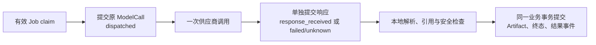

# 执行所有权、调用回执与恢复

Worker 退出后，恢复程序先判断数据库已经承诺了什么，再决定能继续哪一步。已经提交发送标记、没有保存响应，意味着供应商可能执行过，自动恢复只能保留未知；已经保存原响应、尚未提交成果，才可以在新的所有权下重做本地验证和接受。进程退出、HTTP 超时和日志里没有结果，都不足以证明模型没有执行。

本文讲解读生成、评测执行和消息交接的恢复机制。现场取证与操作顺序见 [排障与受控恢复](../../04-接口与运维/06-排障与受控恢复.md)，语义契约维护命令见 [语义契约故障恢复](../../04-接口与运维/07-语义契约故障恢复.md)。恢复完成不等于内容合格、评测获准发布或 QS 已接收。

## 先分清恢复对象和原执行身份

三个恢复对象分别有自己的持久身份和提交边界。不能拿另一个对象的成功状态填补本对象的证据缺口。

| 对象 | 恢复必须核对的原身份与事实 | 可以续做的本地工作 |
| --- | --- | --- |
| 参与者解读 | Session / active_run_id / Session version、Job、Lease fence；按 run_id 唯一的 ModelCall；原 request_json / response_json | 在有效 claim 下重建同一 Artifact，再提交业务终态 |
| 评测步骤 | 组织 / Run version、原冻结 release 与策略；case / slot / candidate、execution_id / invocation_id / ordinal；checkpoint 或 slot claim、dispatch 与 completion | 释放未发送准备，或据原回执提交原执行的完成证据 |
| 结果事件 | producer / destination / message_id、原 body hash、首次保存的 wire、投递阶段与 QS 业务 ACK | 重投同一消息、等待或接受原消息的业务回执 |

`invocation_id` 是一次供应商调用的本地身份；评测 `execution_id` 还把它绑定到步骤、候选和执行序号。它们能约束本地账本与回执，不代表供应商提供了幂等调用或结果查询。Session 的 Job attempt、评测执行 ordinal、消息 attempts 也各自计数，不能相互补充预算。

[ReportWorkflow](../../../src/qs_ai/infrastructure/workflows/report.py) 的图是 `prepare → generate → validate`，通过 `graph.compile()` 构造，未配置独立 checkpointer；评测图也由业务存储保存执行位置。恢复不读取上次图的内存状态，依据是业务表中的所有权、原输入、发送账本和回执。有关选择见 [业务持久状态与 LangGraph 编排](../../05-决策记录/02-业务持久状态与LangGraph编排.md)。

## 解读：接手 Job 不等于获准再调用模型

[`MySQLExecutionStore.claim`](../../../src/qs_ai/infrastructure/persistence/mysql/execution.py) 选择到期 queued Job 或租约到期的 leased Job，按 Session → Job → Lease 加锁，要求 Job 仍属于当前 active Run，Session 为 queued/running，原 Lease 已到期。取得业务容量后增加 fence、Job attempt 和 Session 版本，提交新的 claim。每轮候选查询最多 20 个 Job，Session/Job 锁使用 SKIP LOCKED，查询结果只是候选，锁内校验才确定所有权。

同一 Job 最多领取三次；已达到三次的下一轮领取将 Session/Run 阻塞为 `attempts_exhausted`、Job 置 dead、推进 fence 并释放业务容量。这个上限限制进程反复崩溃，**不是允许模型调用三次**。同一 Run 的 ModelCall 是否已有发送记录，要在稍后的生成步骤另行核对。

[`ExecuteNext`](../../../src/qs_ai/application/execution/worker.py) 每 TTL/3 续租，执行前核对当前参与者访问权，读取原 EvidenceSet；成果接受前再次授权。heartbeat 出错会取消本地 work 并等待清理，无法撤销已经发生的供应商调用。`_guard` 同时检查 Session 状态、active Run、Session version、Job 状态/fence 和未到期 Lease；响应保存与最终接受还在提交前再检查 Lease。生成租约以数据库 UTC 时间判断，旧所有者的晚到结果不能凭旧 claim 写入。

[`DurableGeneration`](../../../src/qs_ai/application/execution/generation.py) 的正常链路有三个分别提交的节点：

首次调用先等待本地模型容量，再由 `begin_model_call` 在有效 claim 下保存 invocation、原冻结请求与 `dispatched`。**只有本次真正创建 ModelCall 的调用者可以发送一次**；创建事务未成功就不会进入网关。返回响应时核对原 invocation 和原 Route model，随后 `record_model_response` 单独保存响应或已分类失败。取消、失去租约或响应保存事务失败，会留下原 dispatched 标记。

恢复遇到已有 ModelCall 时不需要再取得模型容量，也没有再次进入网关的分支：

| 已保存状态 | 恢复动作 | 禁止推断 |
| --- | --- | --- |
| response_received，原 response_json 可解码且身份吻合 | 复用原响应，继续本地校验与 Artifact 构造 | 不能用另一模型、当前 Prompt 或当前参考包替换原输入 |
| dispatched / unknown | 产生 `provider_result_unknown`，按业务失败阻塞 | 不能把“没有回执”解释成没有发送或免费重发 |
| failed，存在 failure_code | 复用原失败 | `retryable=True` 不使同一次持久调用自动重发 |
| 请求/响应无法解码，或状态组合不合法 | `model_call_record_invalid` 等失败；不制造新调用 | 不能删记录让恢复程序把它当首次调用 |

例如 A 已提交 dispatched，发送前被终止；B 接手时，与“A 已发送、响应丢失”没有可区别的持久事实，因此也保留 unknown。这是当前机制为避免未经授权重复收费而接受的活性代价。若供应商今后提供可验证的查询或幂等能力，仍需实现并验证对应协议，当前代码不会自动核证原供应商执行。

## 原响应怎样安全重建成果

“重建”使用已接受的原配置和原字节链，不重新生成内容。ModelCall.request_json 编码原 FrozenGeneration，包括 Profile/策略、规范输入、provider payload、Prompt 消息、Route、Schema 及发布身份；ModelCall.response_json 编码适配器返回的 ModelResponse，包括原调用/请求/模型身份、raw_output、validation_output、归一化信息和用量。它们是结构化持久记录，不能当作 HTTP 抓包；endpoint 与凭证归网关，不进入冻结请求。

[`build_artifact`](../../../src/qs_ai/application/execution/artifact.py) 用原 EvidenceSet 重组输入，要求结果等于原 frozen assembled input，再解析原 validation_output、校验引用与安全规则。Artifact ID 由原 run_id 与 invocation_id 确定，content fingerprint 对校验后实际 content_json 字节计算；三主题参考区从原冻结 Profile 选择，不读取当前网页或当前资料。Codec 和执行配置核对会拒绝输入、资料或身份漂移。

最终 [`finish`](../../../src/qs_ai/infrastructure/persistence/mysql/execution.py) 在新 claim 下再次读取原 ModelCall 与 EvidenceSet。已发布配置路径重新验证接受配置，用原 request/response 构造期望 Artifact，要求候选完全相等，并检查完整 Artifact 不超过 128 KiB。随后在同一事务写 Artifact、Session complete、Run/Job 状态、Lease 释放、业务容量释放和结果事件；成果表对 Session 与 Run 各唯一。中间失败回滚，不允许只写 complete 而缺成果或事件。

因此，响应已保存而成果未提交的退出可以安全恢复；新 claim 的 fence 不要求等于原发送 fence，但原 invocation 和响应内容必须一致。反过来，旧发送者要追加响应时仍须满足当前 claim/fence，不能把一个晚到响应“补进”已失去所有权的调用。当前授权失效可转为 `access_revoked`；原已接受配置缺失或不一致也会拒绝，恢复不会绑定新 active publication。

### 参与者业务重试是显式的新 Run

[`RetryParticipant`](../../../src/qs_ai/application/execution/retry.py) 与 [`participant_retries.retry`](../../../src/qs_ai/infrastructure/persistence/mysql/participant_retries.py) 要求原 Session/Run blocked、Job 已 done/dead 或不存在、已有接受配置、当前版本和原 Run 匹配，并重新核对原参与者当前访问权。命令包含稳定 command_id、原因、confirm、`expected_provider_invocations=1`；原调用 dispatched/unknown 时还必须显式接受未知结果风险。

通过后创建新 Run/Job、保留旧调用与失败，继承原 frozen request 和接受配置，并保存重试审计与幂等 Receipt。配额拒绝会回滚，不会先换 active Run 再补预算。原准入拒绝没有接受配置，不能通过 Retry 偷绑后来发布。重复命令返回原 Receipt，但仍重新核对当前访问权。

这条命令允许一次新调用，与接手旧 Job 的恢复不同；也不等于下面的评测 unknown resolution。现行执行写命令通过 MQ 准入，兼容 `ParticipantManagement/Retry` gRPC 入口直接拒绝，见 [MQExecutionCutover](../../../src/qs_ai/transport/grpc/mq_cutover.py)。

## 评测：准备、发送、响应与完成分开判定

[`EvaluationWorker.once`](../../../src/qs_ai/infrastructure/persistence/mysql/evaluation_worker.py) 先尝试旧串行 checkpoint 恢复，再尝试 candidate claim 恢复，再完成取消排空，最后才挑可继续的 collecting Run。扫描使用有界 keyset cursor；默认串行批次和 candidate 批次均为 64。cursor 只是进程内扫描优化，重启后重新扫描，不能作为执行权限或修复记录。每个恢复事务都重新核对原版本、身份和精确观测到的到期时间，不能用扫描时看到的过期行直接覆盖续租后的状态。

| 中断时的持久事实 | serial_v1 | candidate_v2 |
| --- | --- | --- |
| prepared，且查不到原 execution 的 dispatch ledger | [`recover_expired`](../../../src/qs_ai/infrastructure/persistence/mysql/evaluation_recovery.py) 清 checkpoint、推进版本，保存 expired_preparation_released 审计 | [`recover_candidate`](../../../src/qs_ai/infrastructure/persistence/mysql/evaluation_candidate_recovery.py) 释放精确 slot claim、推进协调版本 |
| prepared，却已有原 dispatch | 拒绝这种不一致，不能清除发送证据 | 同样拒绝；不能当作未花预算准备 |
| dispatching，未接受 completion | 没有独立响应回执层；按原执行写 result_unknown completion，provider_call_count=1 | 先读取原 invocation 的独立 response receipt；没有则按原执行写 result_unknown |
| dispatching，独立 response receipt 已提交 | 不适用；响应只有完成事务接受后才成为持久 completion 证据 | 按原 response 或 failure 和原 finished_at 执行 finish_step，recovery_at 单独记录，不再调用供应商 |

旧串行模式在“响应已返回内存、完成事务尚未提交”时，不能享受 candidate 模式的回执恢复保证。两者都先有发送资格后做外部 I/O，但只有 candidate 路径把回执与候选/Run 投影分别提交。

candidate 的 slot claim 包含原 owner、claim version、case/slot、execution、invocation 与期限。[`save_response`](../../../src/qs_ai/infrastructure/persistence/mysql/evaluation_response_receipts.py) 核对精确 claim、原 dispatch 和未过期所有权，保存响应摘要；相同证据重复保存可接受，不同证据冲突，过期 owner 不能新建回执。恢复读取的回执也必须绑定原 execution 和 claim version。

完成接受会释放原 claim，并根据所有原 dispatch/completion 和剩余 claims 重投影进度。已有其他候选在发送中时，它们仍可提交自己的证据；若原 unknown 或失败按策略形成阻塞，后来的成功不能覆盖该依据。只有 claims 排空，才判定最终进入 blocked 或 awaiting_review。评测失败、unknown 与成功发送都消耗各自冻结执行预算；当前根策略的生成每槽/语义每候选上限均为两次，各阶段整轮均为 70 次。这不是 Job 的三次领取或 Outbox 的八次投递预算，业务门槛见 [评测设计](../../02-业务模块/evaluation/01-评测候选门槛与审核设计.md)。

评测的明确失败可以依据原冻结策略中的阶段/错误白名单、retryable、failure disposition 和目标/整轮余量，规划新的受限执行；原失败仍保留，新的调用使用新 ordinal 与身份。这与解读 DurableGeneration 复用同一 Run 的 failed 不再发送不同。unknown 不会获得自动重试资格，下面的人工授权和语义契约例外分别补充自己的证据。

## unknown 的两种受控处置

unknown 表示一次原 dispatch 已结束为无法确认结果，不能通过改 status、删除 invocation 或补造成功回执消失。处理前必须核证本地原执行：组织和 Run 身份、冻结 release/策略、原 dispatch、原 completion、既有 resolution 及实际未解决数量；这里没有供应商侧自动查询步骤。

[`list_unknowns`](../../../src/qs_ai/infrastructure/persistence/mysql/evaluation_unknowns.py) 要求 expected_version 匹配、无活动串行 checkpoint 和 candidate claims，才提供可据以操作的原执行清单。它可以展示已 canceled Run 的未知历史，但修改入口只接受 blocked Run。`replacement_allowed` 是据原 dispatch 数量计算的余量提示，不是单独授权。

[`accept_resolution`](../../../src/qs_ai/infrastructure/persistence/mysql/evaluation_resolution.py) 锁原 checkpoint/Run、核对组织、CAS、checkpoint 为空，candidate 模式还显式核对 active claims 排空；从原账本重建未知与历史，再接受一次针对原 execution_id 的审计决定。既有执行、回执和失败不会被修改。

| 决定 | 持久动作和随后行为 | 不证明什么 |
| --- | --- | --- |
| authorize_replacement | 追加原 execution 的授权记录；尚有其他 unknown 则保持 blocked，全解决后可回 collecting。后续规划为同一目标的新 ordinal、execution/invocation | 原调用没执行、没收费，或新调用已取得全轮预算/容量 |
| cancel_run | 记录决定并终止本轮，保留原未知及剩余未知计数；有 cancel_requested 且仍有其他 unknown 时拒绝提前完成取消 | 原调用被撤销，或所有未知已经核实 |

两种决定都要求确认重复调用和费用风险、原因、操作者与时间；同一 execution 不能重复授权。替代决定直接检查原目标 ordinal 尚有余量；Run 级发送预算、下步规划和容量准入仍须经过后续检查。[`MySQLEvaluationManagement.resolve`](../../../src/qs_ai/infrastructure/persistence/mysql/evaluation_management.py) 还核对 actor 等于受信管理 scope，恢复为 collecting 时重新准入。即使授权记录合法，也不能绕过整轮限制继续收费调用。

实际公开接口是受信 QS 委托的 `EvaluationManagement/ListUnknownExecutions` 与 `ResolveUnknown`，见 [evaluation.py](../../../src/qs_ai/transport/grpc/evaluation.py)。它们与执行 Start/Cancel 的 MQ 准入路径不同。业务管理员权限由 QS 入口核验，AI 的 mTLS 工作负载和 scope 校验不能被当作普通客户端直连许可。

## 语义契约修复：已有明确失败才有这个例外

另一种常见阻塞是裁判已返回，解析发现 decisions 遗漏、重复或与 assertions 清单不对应，完成证据为 `semantic_decision_contract_invalid`。这里有原响应和明确失败，既不是 unknown，也不是文案质量没通过。受控修复只允许重评原候选，不重新生成文案。

[`authorize_contract_recovery`](../../../src/qs_ai/infrastructure/persistence/mysql/evaluation_contract_recovery.py) 在调用者拥有的事务内核对：

1. 组织、expected_version、原 checkpoint 为空、冻结 release fingerprint 一致；当前最后阻塞为 `semantic_recovery_not_allowed`，证据正指向该执行。
2. 原 semantic completion 为可语义重试的上述明确失败，非 result_unknown，存在 receipt 与 normalized_output；候选 ID、候选输出摘要、失败裁判输出摘要和完成时间都匹配。
3. 所有 unknown 已受控解决；目标尚无后续语义执行，候选与整轮预算有余量。
4. 用完整原证据加本次授权重投影，下一步必须恰是同一候选、ordinal+1、`semantic_contract_recovery_approved`。

接受只追加 ContractRecovery 与状态迁移，保留原策略、候选和失败字节。下一次语义调用增加固定版本及摘要的 `RECOVERY_INSTRUCTION`，要求全部断言恰判一次且如实标 failed；它没有要求裁判提高分数或通过。第二次仍失败不能据此扩成第三次。

这个函数没有公开治理 RPC，也不自行 commit；受信部署主机命令 [`bootstrap.recover_semantic_contract`](../../../src/qs_ai/bootstrap/recover_semantic_contract.py) 调用它。默认执行完整校验后回滚预览；apply 还要求策略例外/费用确认和预览的原失败输出摘要，才提交授权。它不是管理员页面上的通用“继续”按钮。

candidate 的正常完成流程在 claims 排空后才形成可恢复的 blocked 状态。该函数本身检查原 checkpoint 和原证据，**没有另行调用 active_claims 作独立排空检查**；不能把它扩展成任意活动 Run 的维修接口，或照搬 unknown resolve 的显式 claim 检查结论。操作前提与预览/apply 流程见 [专项恢复说明](../../04-接口与运维/07-语义契约故障恢复.md)。

## 取消先停新发送，再排空原所有权

业务取消和取消本地 asyncio task 是两件事。[`cancel`](../../../src/qs_ai/infrastructure/persistence/mysql/evaluation_cancellation.py) 与 dispatch 竞争同一 Run/checkpoint CAS。存在 candidate active claims（包括 prepared）、串行 dispatching checkpoint 或未解决 unknown 时，只保存 `cancel_requested` 意图，推进版本，保留原状态、checkpoint 和 claims；这时不能用 discard 跳过排空。

意图提交后，普通 worker 与领取/发送路径停止新的 dispatch，已发出的调用仍可留下原响应和完成证据；进程中断则由到期恢复据证据释放或结束 claim。串行 prepared 且没有发送证据可以直接取消，其原准备 checkpoint 保留为取消审计。awaiting_review 的主动废弃必须明确 discard，不能混成停止正在执行的调用。

[`finish_cancellation`](../../../src/qs_ai/infrastructure/persistence/mysql/evaluation_cancellation.py) 只有在原 checkpoint 为空、active claims 为空、未解决 unknown 为零时，才复用原取消操作者和原因写最终 canceled。比如取消时三次调用在途，其中两次返回、一次进程失去回执：前两次接受原证据，后一次到期记 unknown，取消仍待排空。人工替代授权可以解决这条 unknown 的阻塞，但原 cancel_requested 不会消失；worker 随后完成取消，不因此发送替代调用。

关闭进程取消 task 不会自动持久化 cancel_requested，HTTP 超时也不代表业务取消成功。已过期所有权不能靠清表“排空”；必须保留原 dispatch、完成/unknown 和审计。进程层 drain 的时间预算与资源关闭见 [生命周期与优雅关闭](../../01-运行时/04-生命周期与优雅关闭.md)。

## 结果已完成时，恢复对象转为原消息

Artifact 与业务终态提交后，如果 QS 页面还看不到结果，先核对原状态事件的交接，不能重开生成来“补发结果”。[`stage_state`](../../../src/qs_ai/infrastructure/persistence/mysql/result_outbox.py) 在同一业务事务保存 Session version 对应的原 StateEvent，重复版本保留首次事件；启用 MQ 时再由 [`StateEventRecorder`](../../../src/qs_ai/infrastructure/workflow_transport/state_events.py) 在原事务保存首次 wire，并移交投递所有权。移交不等于 delivered，也不会重封装已拥有的消息或重置历史预算。

[`MQRelay.step`](../../../src/qs_ai/infrastructure/workflow_transport/mq_relay.py) 每次读取最多 20 条可投递记录，重发原 wire。Broker confirmed 只进入等待业务回执；未确认或等待期届满可以继续按原身份重投，达到八次投递预算则 held，拒绝也 held。收费模型调用的 unknown 不能自动再发，而消息在原 Inbox 幂等协议下重投同一 wire，二者适用前提不同。

[`MessagingStore.confirm_event`](../../../src/qs_ai/infrastructure/persistence/mysql/messaging.py) 接受受信 QS 的 STORED ACK 前，核对原 event ID/kind、aggregate key、body hash 与 requires_receipt；正常解读路径同事务保存的原结果源行被读取到时，还核对原 legacy StateEvent 和 MQ ownership并同时置 delivered；函数没有单独拒绝缺源行的情况，消息 confirmed 本身不能证明源行完整。通过原业务确认事务后才可认定正常结果 delivered。Publisher 正常关闭、PUB OK 或 Relay 当前无错，都不能证明这条业务回执已经提交。历史移交、held 处置与退役协议见 [可靠消息](../messaging/README.md)。

## 场景判断与验证入口

| 场景 | 必须看到的依据 | 可采取的机制动作 | 禁止的捷径 |
| --- | --- | --- | --- |
| 生成进程退出 | 原 Job/Lease 到期、当前 Session/Run 和 ModelCall | 新 claim；无 ModelCall 可首次准备，有原响应可重建，无回执保留 unknown | 按退出码或无日志判定没调用 |
| 原生成 response 已提交，成果事务失败 | 原 request/response、EvidenceSet、接受配置仍可验证 | 新所有权下本地重建相同 Artifact | 换新 active 配置、另生成一份“等价”内容 |
| candidate 评测投影失败 | 精确过期 claim 与原独立 receipt | 原 finish_step，不另发模型 | 把别的候选/ordinal 响应贴入本执行 |
| serial dispatch 中断 | 原到期 checkpoint 与 dispatch | 原执行 result_unknown + 审计 | 假定内存里曾返回就可恢复成功 |
| blocked unknown | 原账本、清空活动所有权、当前 CAS 和操作者确认 | 显式替代授权或终止本轮 | 直接改 collecting / 删除未知执行 |
| semantic 契约失败 | 原明确失败、候选/裁判双方摘要、精确阻塞、剩余预算 | 受控维护事务授权同候选下一次语义执行 | 修失败 JSON 成 passed，或用它处理 unknown |
| cancel_requested 尚未完成 | 原 claims/checkpoint、未解决数量、原取消意图 | 接受/恢复在途证据，排空后完成取消 | 以本地 task 已取消证明调用被撤销 |
| AI complete，QS 尚不可见 | 原事件/wire、消息 stage、原 QS ACK | 恢复同一消息交接 | 重跑生成、把 Broker 确认当 QS 接收 |

现有测试把这些窗口分别固定，不能把纯领域回归当成数据库锁、进程终止或部署验收：

| 测试 | 可以直接核验的行为 |
| --- | --- |
| [test_report_graph](../../../tests/test_report_graph.py) | unknown 不在图内重试、取消不继续构造成果、并发图状态隔离 |
| [test_generation](../../../tests/integration/test_generation.py) | 原响应复用、retryable 失败不重发、dispatch 后取消、响应提交失败、子进程终止不同窗口、原回执绕过模型容量等待 |
| [test_participant_retries](../../../tests/integration/test_participant_retries.py) | 新 Run 保留原请求/关联、未知风险确认、幂等回执、配额回滚、当前撤权和 CAS 拒绝 |
| [串行 recovery](../../../tests/integration/test_evaluation_recovery.py)、[candidate execution](../../../tests/integration/test_evaluation_candidate_execution.py) | 无发送准备释放、精确过期保护、原回执零额外调用恢复、无回执 unknown、并发完成与取消意图保持 |
| [unknown 领域](../../../tests/test_evaluation_resolution.py)、[数据库 resolution](../../../tests/integration/test_evaluation_resolution.py) | 两类决定、原未知不可变、目标预算、组织/CAS、重复或错误执行拒绝 |
| [契约恢复领域](../../../tests/test_semantic_contract_recovery.py)、[数据库契约恢复](../../../tests/integration/test_semantic_contract_recovery.py) | 精确原失败与摘要、固定修复授权、原策略保留、禁止 unknown 冒充失败和第三次执行 |
| [取消领域](../../../tests/test_evaluation_cancellation.py)、[数据库取消](../../../tests/integration/test_evaluation_cancellation.py) | 取消/废弃区分、发送竞争、排空与原准备审计；并发 claims 另见 candidate execution |
| [test_mq_admission](../../../tests/integration/test_mq_admission.py) | 业务/Inbox/状态原子回滚、首次 wire 保留、旧事件交接不置 delivered、仅原业务 ACK 结算 |

恢复依赖数据库证据可读且完整、当前授权/接受配置可验证，以及相应 worker 开关、容量和生命周期条件。具体运行参数见 [后台执行与调度](../../01-运行时/03-后台执行与调度.md)；故障取证时应保留原身份、字节和版本，再按上表选择动作。

最终审核保存失败时，`evaluation.finalization.failed` 复用结构化诊断，仅记录任务编号、错误类型、代码位置和耗时，不记录审核理由或异常正文。外部错误分类与事务、回执、重试规则保持不变；诊断日志不能代替已批准状态或发布回执。
