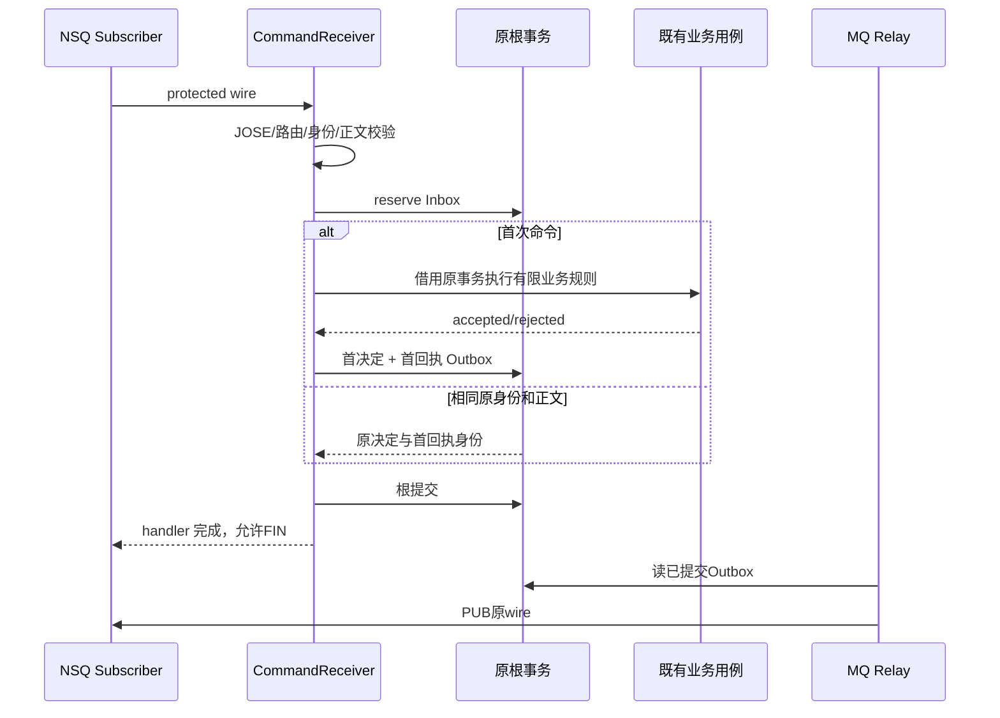

# 消息接单、Outbox 与业务确认

## 本文回答

MQ 命令什么时候受理，业务状态如何变成可靠消息，重复与技术失败如何处理，以及 QS 的接收确认在哪一层完成。

## 结论

当前统一服务强制使用 NSQ 消息链路。命令接单把业务效果、Inbox 与首回执 Outbox 放进 receiver 的原根事务；状态变化把业务投影与事件 Outbox 放进原业务事务。嵌入式 Relay 只负责传输已提交消息，Broker 确认不等于 QS 业务接收。原业务确认语义保留，消息 SDK 不拥有业务池、事务和进程生命周期。

## 消息角色

| 方向与 topic | 消息 | 接收方完成点 |
|---|---|---|
| QS → AI，`qs.ai.commands.v1` | Start、Change、ParticipantRetry、EvaluationStart/Cancel | durable accepted/rejected/held 决定与首回执已提交 |
| AI → QS，`qs.ai.events.v1` | CommandReceipt、InterpretationState、EvaluationState | QS 原业务落库后产生 EventAcknowledgement |
| QS → AI，`qs.ai.acks.v1` | STORED 或 TECHNICALLY_HELD | 对原 event ID/kind/body hash 的确认或技术保留已提交 |

具体字段以 [`messaging.proto`](../../../integrations/workflow/proto/messaging.proto) 为准；接口读者入口见 [接口与运维](../../04-接口与运维/README.md)。

## 命令主链与幂等

接单不等候模型。Inbox 去重先于业务 CAS 和重新冻结；原命令重复不能因为后来发布恢复或会话变化变成不同决定。同一原身份携带不同 body/hash 是冲突，进入隔离，不能覆盖首记录。

业务层可在 savepoint 内撤销确定性拒绝前的局部写入，receiver 仍可提交原 Inbox 与拒绝回执。网络、数据库或未知错误逃逸；receiver 记录持久技术预算后交给订阅重投，达到本地逻辑预算后 durable held。物理 NSQ attempts 和 failure wire 不能单独制造业务拒绝或耗尽可信逻辑预算。

## 状态事件和原事务

解读先产生 `result_outbox` 原事件，再由 `StateEventRecorder` 在同一事务写消息 Outbox 并标记 `mq_owned`。评测在提交前刷新受影响 Run 的状态投影、version 和 event sequence。重复 stage 保留首 wire，不能重加密后覆盖原始记录。

历史结果不会在普通 Relay 自动接管；受控 handoff 必须锁定精确原记录、核对原身份与投递预算，并在同一事务改变归属。已经 delivered 或 mq_owned 的记录不复活，已有 attempts/available_at 不重置。

## 传输和最终确认

Relay 每轮读最多 20 条待发记录，串行 PUB。Broker confirmed 标记 published/等待回执；Rejected 转 held；Unknown 按有界退避重试原 wire；达到 8 次预算转 held。扫描发生在自有短事务，外部 PUB 不持有业务事务。进程内 gate 拒绝重叠扫描，Publisher 生命周期由宿主管理。

AI 收到可信 QS STORED 后，锁原解读 `result_outbox`（如适用）再锁消息 Outbox，校验 event ID、kind、aggregate 和 body hash。确认消息与原结果的 delivered 标志在同一根事务完成，重复 ACK 保留首次确认时间。TECHNICALLY_HELD 只把消息技术保留；不能冒充 QS 已接收。

| 状态/动作 | 能证明什么 | 不能证明什么 |
|---|---|---|
| accepted command receipt | AI 已持久接单 | 模型已完成 |
| NSQ FIN | 此次订阅处理已完成 | QS 已接受 AI 成果 |
| Broker PUB confirmed | Broker 接收消息 | 消费者已处理、业务已落库 |
| AI Artifact completed | AI 已接受有效成果 | QS 已展示或业务验收 |
| QS STORED | QS 原接收流程已持久确认 | 人工/真实用户已验收 |

## 保护与大载荷

消息以固定 producer/destination/topic/ID 与 `rm-secure-v1` 元数据绑定 JOSE 保护上下文；可信签名、公私钥角色、kid 和 P-256 配置预检发生在订阅前。正文 <= 32 KiB 采用 inline，否则使用原载荷引用，并在首次 seal 前确定形式。wire 及失败交接预算有界，业务大小限制继续适用。

引用只从预配置 QS mTLS endpoint 读取，不跟随消息携带 URL。读取结果重新比较原 reference、长度、hash 和组织身份。载荷读取不可用是技术 Unknown；无效或身份不符载荷隔离。ACK 不允许载荷引用。

## 选择、代价与限制

原事务 Outbox 解决本地数据库与消息意图的原子写入；重复投递依靠 Inbox、首 wire 与业务确认处理，仍是可重复传输，不是全链路 exactly-once。保护、存储和回执增加运维复杂度，held 与 quarantine 需要受控诊断和处置。

更换 Broker 可以复用责任边界，但不能消除原事务与业务接收点。把 Outbox 移到独立中央库会重引入跨库原子性缺口；用 Broker 事务替代需要可验证的业务事务状态查询与单独方案。

## 实现与验证

- 装配与调度：[`messaging.py`](../../../src/qs_ai/bootstrap/messaging.py)、[`mq_relay.py`](../../../src/qs_ai/infrastructure/workflow_transport/mq_relay.py)。
- 接单、存储与状态：[`mq_receiver.py`](../../../src/qs_ai/infrastructure/workflow_transport/mq_receiver.py)、[`command_admission.py`](../../../src/qs_ai/infrastructure/workflow_transport/command_admission.py)、[`messaging.py`](../../../src/qs_ai/infrastructure/persistence/mysql/messaging.py)、[`state_events.py`](../../../src/qs_ai/infrastructure/workflow_transport/state_events.py)。
- 保护与载荷：[`messaging.py`](../../../src/qs_ai/infrastructure/workflow_transport/messaging.py)、[`payloads.py`](../../../src/qs_ai/infrastructure/workflow_transport/payloads.py)。
- 单元：[`test_mq_contract.py`](../../../tests/test_mq_contract.py)、[`test_mq_failure.py`](../../../tests/test_mq_failure.py)、[`test_messaging_runtime.py`](../../../tests/test_messaging_runtime.py)。
- MySQL/NSQ 集成：[`test_mq_admission.py`](../../../tests/integration/test_mq_admission.py)、[`test_mq_storage.py`](../../../tests/integration/test_mq_storage.py)、[`test_mq_legacy_handoff.py`](../../../tests/integration/test_mq_legacy_handoff.py)。真实环境确认、原载荷读取与业务投影需要独立验收。
