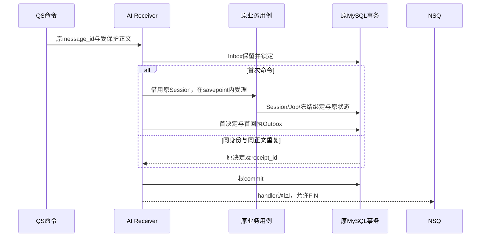

# 消息接单、Outbox 与业务确认

qs-ai 通过消息受理命令，把可见状态和成果作为持久事件交给 QS。一次本地提交证明“业务效果与待发消息同时存在”；NSQ PUB 成功证明 Broker 接收；QS 对原事件返回 `STORED` 才证明其接收事务完成。这三个完成点分别有记录，不能合并成一个“发送成功”。

本文以一次 Start 产生 Session、最终形成 Artifact 并交付 QS 为主线。核对基线：qs-ai `d9c3155`，QS `2ccc2de44`，2026-10-06。qs-ai 固定依赖 `fangcun-reliable-messaging[nsq]==0.2.0a2`；SDK 机制核对该发布标签的源码，测试、部署与真实业务接收仍是独立证据。

## 当前服务怎样装配这条链路

统一入口 `bootstrap.server.serve()` 要求 `messaging.enabled=true`；缺少时直接启动失败。配置模型的默认值仍为 false，意味着调用方必须显式绑定 NSQ、JOSE 密钥和 QS mTLS 载荷端点，不会自动启用开发传输。旧 `bootstrap.integration` 入口已经退役，当前没有并行运行的 gRPC 结果扫描器。

`MessagingRuntime.create()` 取得应用的 `Database`，创建一个使用该池的 `Transactions`，先在只读一致快照中检查必需的技术观测表及类别，再安装 `database.state_events`。随后装配命令 receiver、两个订阅器、Publisher、载荷端点及一个 MQRelay。资源由宿主生命周期启动和关闭：

| 资源或参数 | 实际所有者与限制 |
| --- | --- |
| MySQL engine/pool | APP 的 Database；SDK 和 MessagingRuntime 使用原池，运行时关闭不 dispose 该池 |
| NSQD 地址 | `messaging.nsqd` 显式提供 TCP 地址到 HTTP origin 的映射，最多 8 个；Relay 固定选择第一个配置地址，未实现轮换发往其他 Broker 的策略 |
| QS 载荷通道 | MessagingRuntime 自己创建并关闭到 `grpc.access_address` 的 mTLS channel；它与 EvidenceSource 的 QS 通道各自拥有生命周期 |
| 订阅和 Publisher | 所有 Publisher 就绪后才启动业务订阅；失败交接订阅先于业务消息。退出时先排空业务处理，再停止 Publisher，避免排空阶段失去回执及 failure handoff 通道 |
| Relay 调度 | 复用统一服务的后台循环；`concurrency` 强制为 1，MQRelay 的进程内 gate 拒绝同一扫描器重叠执行，没有独立守护进程或分布式领取租约 |

SDK 不替宿主创建表、迁移、连接池或接单事务。`bind(db)` 要求已存在且仍活跃的原 SQLAlchemy 根事务及相同 savepoint 身份，并验证真实 MySQL driver 为非 autocommit；不能因为 ORM 标记为“事务中”就接受另一个隐式提交边界。作用域和借用规则见 [资源所有权设计](../../01-运行时/02-Dishka作用域与资源所有权.md)。

## 一次 Start 在什么时候算持久受理

消息方向及固定主题为：

| 方向 | Topic / 消息 | 接收方必须提交的结果 |
| --- | --- | --- |
| QS → AI | `qs.ai.commands.v1`：Start、Change、ParticipantRetry、EvaluationStart、EvaluationCancel | 原命令 Inbox、accepted/rejected/held 决定和首 CommandReceipt；成功受理时还包括原业务效果及对应状态消息 |
| AI → QS | `qs.ai.events.v1`：CommandReceipt、InterpretationState、EvaluationState | 原事件 Inbox、接收投影或技术保留决定、首 EventAcknowledgement Outbox |
| QS → AI | `qs.ai.acks.v1`：EventAcknowledgement | 原事件确认或 held；解读事件的 STORED 还要同步原 `result_outbox.delivered` |

`CommandReceiver.receive_command()` 先验证保护上下文，获取并核对原正文，然后建立根事务。`reserve_command()` 用 `(producer, message_id)` 插入 processing 保留，并锁原 Inbox；只有首次保留者进入业务 admission。

接单不等候模型。`WorkflowCommandAdmission` 在局部 savepoint 内调用原业务用例，把 `Transactions.borrowed(db)` 传进去；它的 `commit()` 只校验原事务，不提交或关闭根。确定性权限、资源、规则或版本拒绝撤销局部写入，并恢复评测事件标记集合，receiver 仍可提交 Inbox 与拒绝回执。数据库、网络和未知错误逃逸，整个根回滚，不把它们伪装为业务拒绝。

例如第一次 Start 因 `configuration_unavailable` 被拒绝，随后管理员完成发布：相同原命令重投仍返回原决定，不重新读取当前发布来改变结果。第一次已接受但 NSQ FIN 丢失也一样：Inbox 去重在业务 CAS 和再次冻结之前，不会再创建一个 Job。真正的 ParticipantRetry 必须作为另一条业务命令经过原资格校验；运输层重投不会获得这个权限。

## 原身份、正文指纹和首 wire 分别保护什么

业务重复按逻辑身份判断，NSQ 自己的物理 delivery ID、attempts 及新的加密字节都不能代替它。

| 记录 | 身份与冲突校验 |
| --- | --- |
| `ai_messaging_inbox` | 主键 `(producer, message_id)`；原 `body_sha256`、body 字节、kind、aggregate_key 都必须一致，保存首 `receipt_id`；同 ID 换正文进入 quarantine |
| `ai_messaging_outbox` | 主键 `(producer, destination, message_id)`；保存原 body、body_sha256、first wire、wire_sha256、topic/kind/组织、aggregate_key/sequence、stage、attempts 及时间 |
| `result_outbox` | 原解读 `event_id` 主键，`(session_id, version)` 唯一；保存原 StateEvent JSON、delivered、mq_owned 和历史投递元数据 |
| CommandReceipt | 回执有自己的 event ID；正文携带原 `command_id` 和 `command_body_sha256`，envelope 的 `correlation_command_id` 必须等于原命令 ID |
| EventAcknowledgement | ACK envelope 有自己的 ID；正文的 `event_id/event_kind/event_body_sha256` 指向被确认的原 AI 事件，而不是把 ACK 自己当作成果事件 |

`body_sha256` 是 64 位十六进制 SHA-256，覆盖确定性序列化后的原 `MessagingBody` protobuf 字节。`wire_sha256` 覆盖包含保护封装的实际运输字节。JOSE 重新加密同一正文可以得到不同 wire，所以两者不等价；重复 stage 只核对原业务身份和正文，保留首次持久 wire，不把刚 seal 的新 wire 覆盖进去。

旧结果移交时还使用 `payload_json_sha256` 作为 MySQL JSON 源快照的审核摘要。它既不是 protobuf body hash，也不是 wire hash；不能拿一种指纹去确认另一种记录。

## 状态事件怎样与原业务一起提交

外部解读 Session 保存状态时，`stage_state(db, session)` 在原 Session 事务里构造 StateEvent。completed 状态必须已有持久 Artifact，事件中的 `artifact_json` 来自该原成果；缺少成果则拒绝完成写入。

`result_outbox` 的重复插入保留首次 event ID。状态 recorder 随后读取这一原记录，用它生成 `INTERPRETATION_STATE`，同事务写 `ai_messaging_outbox` 并设置 `mq_owned=true`。重复保存同一 Session/version 不更换 UUID、body 或 first wire，不增加模型调用。这个表仍是解读的原结果证据源，当前实际扫描与 PUB 由消息 Outbox 承担；SDK 中保留的 `MySQLPendingOutbox` 适配器没有接入当前 qs-ai 运行路径。

评测状态通过另一入口进入同一提交边界：`changed_evaluation()` 把变更的 Run ID 放入 Session 的 `evaluation_events` 集合。宿主 `EventSession.commit()` 在真正 commit **之前**调用 `StateEventRecorder.flush()`，读取已完成的 Run 进度与检查点版本，写 EvaluationState 和 sequence，再提交业务及消息；flush 失败则没有成功根提交。

评测 event ID 为 `uuid5(UUID(run_id), "state:{version}")`，`event_sequence` 在记录的新版本上递增，同版本重复保留 sequence。事件只含 Run/组织、version/sequence、status、release 指纹，是持久状态投影，不传活跃检查点或执行指令。当前 AI 事件统一 `ordered=false`，因此消息可能乱序到达；QS 用原 Session 版本或 Run event_sequence 控制投影推进，Broker 不负责替业务排序。

## Relay 的每一步与三个不同的预算

当前 MQRelay 每轮取最多 20 条 `staged/awaiting_receipt` 且到期的记录，按 available_at/message_id 排序，串行发送保存的原 wire。扫描在自己的短读事务中完成；外部 PUB 不持有业务事务，结算另开宿主短事务锁定原消息及 body hash。

| PUB 或确认结果 | 持久变化 | 后续处理 |
| --- | --- | --- |
| `CONFIRMED + BROKER` | 调用 `published()`，写 published_at；AI 事件要求业务回执，stage 变 `awaiting_receipt`、attempts+1 | 默认等待 30 秒，未收到业务 ACK 则再次发送原 wire |
| Unknown | attempts+1，保留原 stage，available_at 延后，error_code=`publish_unknown` | 退避 `min(60, 2^min(原attempts+1,6))` 秒；不能推断 Broker 没接收 |
| 明确 Rejected | stage=`held`、error_code=`publish_rejected` | 不再自动 PUB |
| 扫描到 attempts ≥ 8 | stage=`held`、error_code=`delivery_budget_exhausted` | 不发第九次；保留原记录等待受控处理 |
| 精确可信 STORED | stage=`confirmed`、confirmed_at | 完成原事件业务确认；晚到 PUB 结算不能把它退回等待状态 |

持久 stage 中没有名为 published 的状态；`published()` 是函数，业务确认前的状态是 `awaiting_receipt`。成功 PUB 也占用 AI 事件的投递次数：连续 8 次 Broker OK 却没有业务 ACK，仍会停止自动发送。held 停止自动 PUB，但之后精确可信的 STORED 仍可完成原确认；TECHNICALLY_HELD 则不能覆盖已 confirmed 的事实。

需要分别看待三类次数：

- **Outbox attempts**：当前 AI 事件外发及等待业务确认的预算，PUB 成功或 unknown 都推进。历史结果移交继承已有 attempts 和 available_at。
- **本地逻辑技术预算**：经过 JOSE 和正文核验的同一命令发生技术失败，admission 根回滚后，在另一个短事务把 `(logical_producer, logical_message_id, logical_body_sha256)` 的失败记到账；达到 8 次才允许持久 HELD 决定。
- **NSQ 物理 attempts**：订阅重投和 failure handoff 的运输计数。伪造高次数或重新生成 failure wrapper 都不能直接消耗本地逻辑预算，也不能产生业务拒绝。

SDK 订阅在 handler 返回之后才 FIN；处理异常会 REQ，Task 取消不 FIN。到物理阈值后先把原受保护消息交给预配置 failure topic/channel，Broker 确认交接才结束原 delivery。failed handler 从 wrapper 恢复原 wire 并重新认证，绝不再次调用 admission；只有本地已经记满的逻辑预算可形成 HELD。quarantine 或失败账本写不成功就继续传播错误，不能先 FIN 再期望补记。

进程内 gate 和单个宿主调度器提供当前单进程扫描约束；pending 查询没有分布式 claim/fencing。部署第二个独立 Relay 不能据此推断已经取得排他传输所有权。

## QS STORED 在两边各自落下什么

QS 的 [`MessagingEventReceiver`](https://github.com/FangcunMount/qs-server/blob/2ccc2de44bbd45e26d29e7e130da518cc32426f0/internal/apiserver/infra/mysql/aibridge/messaging_receiver.go) 创建接收根事务；[`ReceiveEvent`](https://github.com/FangcunMount/qs-server/blob/2ccc2de44bbd45e26d29e7e130da518cc32426f0/internal/apiserver/infra/mysql/aibridge/messaging.go) 在同一事务保留原 Inbox、调用业务接收投影，再生成并保存最终 ACK Outbox。解读成果还校验原请求的 Actor、Testee、Session 和 Artifact 的 Assessment/Report/source_version，不能仅因消息解密成功就接受另一份报告。

同一事件重复到达时，QS 在业务投影之前识别首 Inbox，复用并重新准备发送原 ACK，不重做业务效果。较旧状态已被更高版本替代，也可作为合法原事件完成幂等接收；STORED 不表示页面当前一定展示这一版，更不表示用户验收。

AI 收到 ACK 后再建自己的根事务。若是 INTERPRETATION_STATE，按与移交一致的顺序先锁原 `result_outbox`，再锁消息 Outbox，核对 event ID、kind、aggregate_key 与原 body hash；正常解读stage已在同一事务保留两层记录；读取到原源行时，STORED 还核对其 `mq_owned`、原 Session/version 和完整 StateEvent 正文，正确时同时设置消息 confirmed 和原结果 delivered。该函数没有把“缺少 legacy 源行”另设为拒绝条件，不能以消息 confirmed 单独证明源行完整。任一步失败，本次变化一起回滚。

重复 STORED 核对身份后保留第一次 confirmed_at/delivered_at。TECHNICALLY_HELD 只设置消息 held，原结果不变成 delivered。failed ACK 只记录技术隔离，不能制造 STORED。可靠消息 SDK 的 `Confirmation.BROKER` 与 `Confirmation.DURABLE_ACCEPTANCE` 也是不同确认类型，不能把 Publisher 返回值传给原业务接收回调充当持久确认。

## 四个故障窗口决定下一步

| 中断位置 | 已留下的事实 | 恢复动作 |
| --- | --- | --- |
| AI 业务写入后，首回执/状态 Outbox 写失败 | 根回滚，Inbox 与局部业务效果都没有成功接受 | 原命令可运输重投，再受理；不保存假的 accepted |
| 根 commit 成功，NSQ FIN 或命令回执丢失 | 原 Inbox、业务效果及首回执都存在 | 相同命令复用首决定；Relay 重发原回执 wire |
| PUB 已到 Broker，但进程在 Outbox 结算前消失 | 消息仍待发，是否收到运输确认未知 | 下次发送原 wire，QS 用原 Inbox 去重；不重新运行模型 |
| QS 接收及 ACK Outbox 已提交，但 ACK 未到 AI | QS 原业务效果存在，AI 仍 awaiting_receipt | AI 重发原事件，QS 复用原 ACK；直到 AI 原确认事务成功 |

消息传输 unknown 描述 PUB/接收结果不确定，可以在有界预算内重发同一已提交事件。模型 `provider_result_unknown` 描述供应商原调用的结果不确定，禁止据此自动二次调用；前者的重投不能成为后者的替代授权，详见 [解读执行边界](../../02-业务模块/interpretation/01-解读冻结输入与成果设计.md)及 [评测恢复](../../02-业务模块/evaluation/01-评测候选门槛与审核设计.md)。

## 保护和大正文仍绑定同一原消息

`MessagingEnvelope` 固定 `qs-ai-messaging/v1`，保护上下文同时绑定 producer、destination、实际 topic、message_id 和 `secure_profile=rm-secure-v1`。订阅前读取并验证 EC/P-256 JOSE 密钥、公私钥角色及 kid；TLS 端点与消息保护身份共同限制调用方，但不代替业务正文核验。

正文不超过 32 KiB 时 inline，更大时在首次 seal 之前选择 `MessagePayloadReference`，没有先加密再临时换载荷的路径。数据库 body 上限为 MEDIUMBLOB 的 `16 MiB-1`，wire 上限 262144 字节，并预留 failure handoff 编码余量；单项业务命令及 Artifact 的原大小限制仍适用。

reference 只有 producer/destination/message_id/hash/length/organization，没有 URL。AI 的 `PayloadResolver` 只从预配置的 QS mTLS stub 读取，最长 5 秒；返回的 reference、长度、原 hash 与正文组织必须一致。QS 读取 AI 事件大正文时也按准确原 Outbox reference 授权。ACK 必须 inline，不能夹带任意载荷访问指令。

载荷读取超时或存储不可用传播为技术 Unknown，允许运输 REQ；内容、组织或引用不符则隔离。观测计数只是安装以后记下的技术事实，不是完整历史、业务成功率或额外重试权限。

## 配置与旧结果移交的实际约束

运行配置必须提供 `messaging.enabled/nsqd/signing_key_file/decrypt_key_files/qs_signer_files/qs_recipient_key_file/max_in_flight`，以及 `grpc.access_address`、CA 和客户端证书。配置模型允许 max_in_flight 1–32，当前部署绑定生成器只接受 1，并要求显式 `binding_revision`、TCP 与同源 HTTP endpoint，以及 `/run/qs-ai-jose/` 下按角色和 kid 匹配的密钥文件。

统一服务使用 `delivery.idle_seconds/max_backoff_seconds/shutdown_seconds` 调度 Relay；保留字段 `delivery.batch_size/max_retry_seconds` 没有传入当前 MQRelay。实际每轮 20、外发 8 次、回执等待 30 秒和重投上限 60 秒来自当前实现，不能通过修改那两个旧字段宣称已经改变消息规则。

迁移 `0037_workflow_messaging` 创建 Inbox/Outbox/quarantine/evaluation_sequences 并增加 mq_owned，`0038_messaging_observations` 提供启动必需的技术观测；运行时不安装或修复 schema。服务启动比对镜像迁移 head，0037 downgrade 明确拒绝删除已持有的消息证据；回滚需要兼容这些记录的镜像，不能恢复旧 gRPC 扫描器与 MQ 同时发送。

普通 Relay 不扫描或接管历史未移交的 `result_outbox`。受控 `messaging_handoff` 只处理显式选择的 1–20 个原 event ID：

1. dry-run 读取原库及 schema head、源 Session/version/JSON 摘要、attempts、available_at、创建时间、归属和 first wire，生成审核 manifest/digest，不 PUB。
2. apply 要求该 manifest/digest 和“所有领取者停止且准入关闭”的明确声明；逐条在短事务内锁源记录，再锁消息 Outbox，核对原快照与数据库头。
3. 使用原 event ID、原时间、原投递预算保存 first wire 和 mq_owned；已有 delivered 或 mq_owned 不复活，已有 wire 不重 seal，attempts ≥ 8 的原记录直接继承 held。

apply 是逐条提交，不是整批一个事务。第一条已提交而第二条源快照变化时，结果必须保留 partial；commit 返回失败则报告该条 commit_unknown，不能断言没移交，也不能用重置预算来“修复”。这个维护入口改变原消息的传输归属，不创建任务、不改 frozen configuration、不调用模型。

## 代码与测试怎样查证

| 机制 | 当前源码 | 测试边界 |
| --- | --- | --- |
| 原事务接单、首回执和重复 | [receiver](../../../src/qs_ai/infrastructure/workflow_transport/mq_receiver.py)、[admission](../../../src/qs_ai/infrastructure/workflow_transport/command_admission.py)、[宿主表及确认](../../../src/qs_ai/infrastructure/persistence/mysql/messaging.py) | [存储集成](../../../tests/integration/test_mq_storage.py)、[真实业务 admission 集成](../../../tests/integration/test_mq_admission.py)：拒绝/技术失败回滚、重复先于 CAS、logical budget、原业务 ACK 原子性 |
| 状态与原结果 | [stage_state](../../../src/qs_ai/infrastructure/persistence/mysql/result_outbox.py)、[recorder](../../../src/qs_ai/infrastructure/workflow_transport/state_events.py)、[EventSession](../../../src/qs_ai/infrastructure/persistence/mysql/database.py) | [原结果集成](../../../tests/integration/test_result_outbox.py)、[MQ 成果集成](../../../tests/integration/test_m7_delivery.py)、[评测 worker 事件集成](../../../tests/integration/test_mq_worker_events.py)：原 Artifact/first wire、事件序列、无额外模型调用 |
| PUB、等待回执与 gate | [MQRelay](../../../src/qs_ai/infrastructure/workflow_transport/mq_relay.py)、[SDK durable](https://github.com/FangcunMount/reliable-messaging/blob/8633ba585b5a1c8f95fb16b19469fbd0097611c7/python/src/reliable_messaging/durable.py)、[SDK NSQ](https://github.com/FangcunMount/reliable-messaging/blob/8633ba585b5a1c8f95fb16b19469fbd0097611c7/python/src/reliable_messaging/nsq.py) | [存储集成的 Relay 用例](../../../tests/integration/test_mq_storage.py)、[运行时单元](../../../tests/test_messaging_runtime.py)：Broker OK 仍等待业务 ACK、重发原 wire、8 次停止、Publisher 先启后停；NSQ 真实拓扑另见 [拓扑集成](../../../tests/integration/test_mq_topology.py) |
| 保护与载荷 | [保护契约](../../../src/qs_ai/infrastructure/workflow_transport/messaging.py)、[载荷解析](../../../src/qs_ai/infrastructure/workflow_transport/payloads.py)、[协议](../../../integrations/workflow/proto/messaging.proto) | [契约单元](../../../tests/test_mq_contract.py)、[失败交接单元](../../../tests/test_mq_failure.py)、存储集成：错 topic/key/kind、原大载荷、精确 ACK；Go/Python 互操作需要其显式环境 |
| 所有权、启动和迁移 | [运行时装配](../../../src/qs_ai/bootstrap/messaging.py)、[统一入口](../../../src/qs_ai/bootstrap/server.py)、[SDK 原事务校验](https://github.com/FangcunMount/reliable-messaging/blob/8633ba585b5a1c8f95fb16b19469fbd0097611c7/python/src/reliable_messaging/sqlalchemy.py)、[维护移交](../../../src/qs_ai/maintenance/legacy_results.py) | [旧入口退役](../../../tests/test_legacy_delivery_retirement.py)、[部署约束](../../../tests/test_mq_deployment.py)、[单记录移交集成](../../../tests/integration/test_mq_legacy_handoff.py)、[维护工具集成](../../../tests/integration/test_mq_handoff_tool.py)：原池保留、预算/首 wire 不改、源漂移拒绝、部分提交和进程中断 |

[ai-messaging CI](../../../.github/workflows/ai-messaging.yml) 与 [M7 perimeter CI](../../../.github/workflows/m7-messaging.yml) 分别覆盖存储、传输及原成果边界，必需验收报告拒绝 skip/空报告。文件里有测试入口不表示当前环境已运行；合成模型、假传输和一次性数据库也不证明线上 Broker 持久性或某个真实报告已经被 QS 接受。实际交付要保留原 event ID/hash、两侧接收记录、STORED 及运行版本，技术连通和人工业务验收继续分开。
