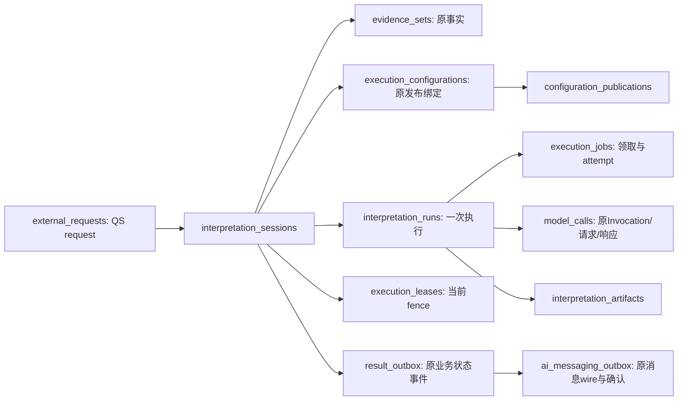

# 持久化、事务与迁移

MySQL 保存 qs-ai 可以恢复和审计的业务事实：原请求、固定输入和配置、调用证据、成果、评测、审核及消息。**数据库池负责连接复用，Session 负责一段事务，业务宿主决定何时接受；外部模型和 Broker 的不确定性不会因为本地事务原子而消失。**

本文按 `766b2aa` 的业务源码核对，以一条 MQ Start 和它之后的成果接受解释记录与提交。表名来自当前声明，迁移来自仓库脚本；它们不证明某个环境已经安装。资源装配见 [Dishka 作用域](../../01-运行时/02-Dishka作用域与资源所有权.md)，场景规则见 [业务模块](../../02-业务模块/README.md)。

## 找一条请求，应该沿哪些记录查

这是事实关系图，不是所有边都有数据库外键。Session 的 active_run_id、evidence_set_id 等仍由应用与存储 guard 核验；找到某个 UUID 的行，不足以证明它属于当前 Run 或主体。

主要唯一约束有实际业务含义：

| 表与键 | 数据库直接保护什么 | 仍需应用检查什么 |
| --- | --- | --- |
| `external_requests.request_id` 主键，session_id 唯一 | 原 QS request 只映射一个 Session | 原请求的 Actor/报告/正文摘要和权限 |
| `evidence_sets.session_id` 唯一 | 每 Session 一份原证据集合 | items 覆盖、Testee、内外来源与原字节摘要 |
| `execution_jobs.run_id` 唯一 | 每 Run 一个 Job | 当前active Run、Job状态、attempt/租约/fence |
| `model_calls.run_id` 主键，invocation_id 唯一 | 每执行Run一条原模型调用记录 | request/response身份、固定配置、模型状态与未知结果 |
| `interpretation_artifacts.session_id`、run_id 各唯一 | 每Session及Run最多一份持久成果 | Artifact须从持久原响应重建并整候选相等 |
| `idempotency_requests(scope_hash,key)` 联合主键 | 同scope/key有唯一预留与回执 | request_hash相同才是重放，不同即冲突 |
| `result_outbox(session_id,version)` 唯一 | 每业务状态版本的原事件不能重复构造 | MQ归属、事件正文/关联与QS业务ACK |

Retry 可以为同一 Session 新建 Run，但没有获得第二份已完成 Artifact 的入口。传输重投复用原 request/command/event；不能因为有唯一键就随意换一个新 ID 绕过业务重放规则。

## 治理记录不是同一种“版本表”

[业务 schema](../../../src/qs_ai/infrastructure/persistence/mysql/schema.py) 同时包含可编辑状态、不可变修订和执行进度，需要分别理解：

| 记录群 | 当前存储方式 | 读写责任 |
| --- | --- | --- |
| Prompt草稿 | `prompt_drafts` 当前head；`prompt_draft_revisions` 保存不可变snapshot/SHA与原命令 | head CAS与历史字节核验；冻结引用具体revision |
| Solution工作区 | `solution_revisions` 每solution_id一条当前state；`solution_commands` 保存各命令回执 | 名称含revisions，但不是每revision新增一行；历史依赖原回执与草稿快照 |
| 原生资产 | Profile/Prompt/Route/Schema 的身份+版本联合主键，正文及fingerprint/来源 | 注册新版本，拒绝同身份覆盖；正文hash、Origin和引用一致性另由读取器核验 |
| 评测 | `evaluation_runs` 固定definition与progress；`evaluation_checkpoints` CAS；dispatch/completion/slot claim/response receipt | 计划、预算、调用和审核历史分别核证；不是只存最终分数 |
| 发布 | Publication不可变内容；pointer当前version；changes原命令+previous/current | checkpoint/Run后锁selector；发布、指针和审计同事务 |
| 业务容量 | participant/evaluation admission locks与reservations；quota versions/pointers | 组织锁跨进程串行化准入，保留原预算日/配额快照；不是进程Provider token |

审核记录/审核轮次等部分证据位于 Run progress JSON 内；SQL表名不能覆盖全部语义。JSON正文也不因存入数据库就天然可信，读取器重算摘要、身份和历史。完整字段及外键以源码和迁移为准。

## 一套应用池，许多独立事务

RuntimeProvider 创建 APP Database。engine 开启 `pool_pre_ping` 和 `hide_parameters=True`；默认 pool_size=5、max_overflow=5、pool_timeout=3秒、connect_timeout=3秒。模型客户端等待期间不持有接单或完成事务，但领取、续租、读取、响应及接受仍各自竞争这个池。

`Transactions.open()` 每次建立新的 EventSession，`expire_on_commit=False`；REQUEST 内复用 Transactions，不复用这份 Session。open 不隐式 begin 或 commit，首次 SQL 可以 autobegin；退出始终尝试 rollback，再关闭 Session。正常上下文返回不表示接受了写入，显式commit成功后的事实也不会被退出rollback撤销。

`expire_on_commit=False` 仅影响提交后对象属性的过期行为，不延长事务、不让同一对象代表之后的当前状态。不能把仍能读到的旧版本对象当成当前写权。

不同路径明确采用自己的隔离与锁，不存在一个通用“全部SQL都自动原子”的设置：

| 路径 | 具体所有者与机制 |
| --- | --- |
| 普通生成存储操作 | 每次新Session；begin_model_call与finish显式REPEATABLE READ，claim/renew/响应保存/证据读取沿连接默认隔离；写入靠Session→Job→Lease锁序、SKIP LOCKED领取及版本/fence/有效期guard |
| Solution Save/Prepare | 自有READ COMMITTED事务，先Solution后Prompt head；等锁后重新查原命令回执，同Session登记整套准备资产 |
| 发布/回退 | 自有REPEATABLE READ，必要时先目标Publication，再checkpoint→Run→selector；之后建立一致证据读与CAS |
| MQ接单 | receiver创建原root，业务admission在savepoint内借用同Session；最后receiver根提交 |
| 根资产初始化 | CLI创建SERIALIZABLE事务，精确读取比较/插入，最后完整release核验通过再commit |

因此，不能在已有SQL读取触发autobegin后随意再begin；不能把公开的几个自有事务adapter串起来冒充一次Prepare。需要多步原子时，明确传递同一个Session或UOW及最终提交所有者。

## MQ Start 的原事务如何接受成功或拒绝

一条合法Start被receiver验证后，事务内预留Inbox，保存原业务请求、Session/Run、EvidenceSet、发布绑定、Job、状态事件和首回执。业务UOW通过BorrowedTransactions操作原Session：其commit只核对原活动root身份，不提前提交；receiver验证原root未被替换后才显式提交。

savepoint撤销确定拒绝的局部写入，保留root中的Inbox预留，随后可提交REJECTED回执。某些准入拒绝本来就保存blocked业务记录；它们与“根事务技术失败”要分开：

| 情况 | 提交什么 | 原消息再来时 |
| --- | --- | --- |
| Start接受 | 业务、Inbox、原状态/首回执共同提交 | 返回原决定，不新建Session/Run |
| 确定业务拒绝 | 局部不接受写入撤销，原拒绝/回执可持久；准入规则定义的blocked记录按原路径保留 | 返回原拒绝，后来发布不改变它 |
| 首回执或状态事件写入失败 | 原root整体回滚 | 可按原身份重投；技术尝试记录属于另一个受限失败处理事务 |
| 业务adapter擅自commit/root替换 | 借用校验发现破坏 | 不能靠事后检查回滚已经提交的数据；需要保留宿主协议防止这个窗口 |

不能先commit业务，再换Session补Inbox或消息。BorrowedTransactions不创建、关闭原Session，也不回滚/关闭宿主池。详细接单与wire恢复见 [可靠消息](../messaging/README.md)。

## 状态事件在原提交之前形成

参与者 `MySQLUnitOfWork.save` 调用 `stage_state`，保存原result_outbox并经安装的StateEventRecorder在同Session中形成MQ记录。评测变更则用 `changed_evaluation` 标记Session.info中的Run集合；EventSession.commit在root提交前调用recorder.flush，写原状态快照、事件序号和Outbox。

recorder失败时，根提交不能继续；rollback清掉evaluation_events标记，避免下次提交带出旧事件。模型响应、评测candidate_v2独立response receipt和业务最终成果不因这个flush变成同一次大事务；它们保持自己的实际提交边界。

正式成果接受时，Artifact、Session/Run completed、Job done、租约/容量释放和状态事件在一个短事务共同接受。模型HTTP早已在事务外；若这个完成事务失败，原模型响应仍可以存在，后续按原记录恢复而不是重新调用。执行恢复见 [恢复设计](../execution-recovery/README.md)。

## 业务Outbox与消息存储共库，声明却有两个metadata

[MessagingStore](../../../src/qs_ai/infrastructure/persistence/mysql/messaging.py) 用独立 `sa.MetaData()` 声明 `ai_messaging_outbox / inbox / quarantine` 等，技术observations另复制到该metadata。导入模块不建表、不打开连接，也不把这些表混入业务Base.metadata。

这种声明隔离不是跨库部署。MessagingRuntime借用APP Database，store方法用SDK `bind(db)`验证调用者原活动事务；原业务和消息共同提交。将Outbox迁到中央数据库会重新引入跨库接受窗口，不能仅更换连接字符串就保留当前保证。

迁移环境的target_metadata来自业务schema；MQ独立表由 [0037](../../../migrations/versions/0037_workflow_messaging.py) 和 [0038](../../../migrations/versions/0038_messaging_observations.py) 的显式DDL安装，不应只依赖业务metadata autogenerate发现它们。

## UTC与安装起点：缺少历史不会被补成已知

生成Job/租约的到期判断使用数据库UTC时间，领取与结算还检查当前fence/版本。评测领域操作接受显式带时区时间，具体执行和恢复记录绑定它们观察到的expiry，不能只靠进程时钟宣称持有权。

[0035](../../../migrations/versions/0035_runtime_utc_timestamps.py) 新增 Session的created_at_utc/updated_at_utc及ModelCall的created_at_utc，均允许NULL，没有回填或改写历史created_at。历史database-local时间不能无证据转成UTC；诊断新记录与旧字段要分别解释。

0038安装八类消息技术观测，以安装时 `UTC_TIMESTAMP(6)` 为recording_since、recorded_count=0。它没有重建安装前重复命令或载荷失败历史。缺行/缺表不是“这类失败次数为零”，统一服务的recording前置检查会拒绝启动，详见 [启动装配](../../01-运行时/01-单进程架构与启动装配.md)。

## 迁移是另一条显式资源生命周期

[Alembic环境](../../../migrations/env.py) 从Settings取得数据库URL，缺失就拒绝；在线迁移新建它自己拥有的NullPool engine，用连接run_sync执行迁移，finally dispose。这个维护进程的engine不属于正式APP池，也不应借用正在运行的业务Session。

正式服务只比较数据库Alembic heads与镜像脚本heads，一致才进入执行装配；它不运行upgrade、不补表。脚本序列当前包括0035 UTC、0036候选槽与回执、0037 MQ归属及消息、0038观测；环境状态仍需部署流程实际核对。

0035、0037、0038的downgrade明确拒绝删除证据。回滚代码应选择与新schema兼容的镜像，不把 `alembic downgrade` 当作普通回退动作。备份、升级与兼容镜像的实际检查由 [部署迁移](../../04-接口与运维/05-部署迁移与兼容回滚.md) 维护；本次文档工作没有运行迁移或改变数据。

诊断清理只删到期runtime_milestones，不清除调用、成果、审核或消息。没有业务证据的自动清理机制，不能因为某Job已完成或某发布已停用就手动删依赖资产。

## 代码和验证范围

| 要核对的事实 | 现有入口与证明范围 |
| --- | --- |
| 新Session/显式commit/借用原root | [database.py](../../../src/qs_ai/infrastructure/persistence/mysql/database.py)、[interpretation.py](../../../src/qs_ai/infrastructure/persistence/mysql/interpretation.py)；原子接单需 [test_mq_admission.py](../../../tests/integration/test_mq_admission.py) 的真实MySQL故障注入 |
| 共池但不共Session、连接失效后继续 | [test_shared_runtime_pool.py](../../../tests/integration/test_shared_runtime_pool.py)：100份不同Session、模拟五种职责、连接归还和池上限；没有启动五种真实listener或模型负载 |
| 原资产/Manifest/绑定与调用重建 | [test_execution_configurations.py](../../../tests/integration/test_execution_configurations.py)、[test_evaluation_manifest_freeze.py](../../../tests/integration/test_evaluation_manifest_freeze.py)；不证明自然语言质量 |
| Artifact与状态/事件回滚和迟到写拒绝 | [test_artifact_acceptance.py](../../../tests/integration/test_artifact_acceptance.py)，实现 [execution.py](../../../src/qs_ai/infrastructure/persistence/mysql/execution.py)、[result_outbox.py](../../../src/qs_ai/infrastructure/persistence/mysql/result_outbox.py) |
| Prepare/发布锁序与并发、原命令重放 | [test_solutions.py](../../../tests/integration/test_solutions.py)、[test_publications.py](../../../tests/integration/test_publications.py)；有限事务竞争，不等于线上吞吐验收 |
| 消息表不自动安装、观测安装与历史未知 | [messaging.py](../../../src/qs_ai/infrastructure/persistence/mysql/messaging.py)、[messaging_observations.py](../../../src/qs_ai/infrastructure/persistence/mysql/messaging_observations.py)、0037/0038脚本；运行时要求原池的schema预检 |

这些存储集成测试需要可销毁MySQL及相应消息依赖，收集成功或skip不算通过。源码、迁移脚本和本地纯规则测试不能代替某环境heads、真实事务恢复和原成果STORED的证据。
