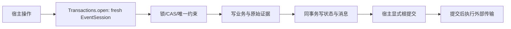

# 持久化、事务与迁移

## 本文回答

哪些记录构成业务事实，事务由谁完成，以及冻结资产、执行证据和消息如何保持一致。

## 结论

MySQL 保存会话、冻结事实、执行证据、治理资产及发布状态；应用用例决定状态变化，存储适配器落实锁、CAS、唯一键和提交。`Database` 只拥有池，`Transactions` 为每个操作建立 Session，业务宿主显式提交。消息记录借用同一根事务，迁移工具拥有 schema 生命周期。

## 记录分组与责任

| 记录组 | 代表表 | 保护的事实 |
|---|---|---|
| 解读聚合 | `interpretation_sessions`、`evidence_sets`、`interpretation_runs` | 会话状态、归属、固定证据与当前 Run |
| 执行 | `execution_jobs`、`execution_leases`、`model_calls`、`interpretation_artifacts` | 工作所有权、单次调用回执与不可伪造的成果关联 |
| 治理资产 | Profile/Prompt/Route/Schema assets、draft revisions、solution revisions | 可编辑版本与不可变发布资产之间的区别 |
| 评测 | evaluation Runs/checkpoints/dispatches/slot claims/response receipts/completions | 冻结评测定义、调用账本、候选与审核证据 |
| 发布 | publications、publication pointers、changes、execution configurations | 发布证据、生效选择器、变更历史与请求绑定快照 |
| 额度与诊断 | reservations、quota versions/pointers、runtime milestones | 业务额度占用、版本化策略和有期限诊断 |
| 消息 | `result_outbox`、`ai_messaging_*` | 原始业务事件、消息身份、首 wire、接单和业务确认 |

字段、唯一约束和外键以 [`schema.py`](../../../src/qs_ai/infrastructure/persistence/mysql/schema.py) 及 [`messaging.py`](../../../src/qs_ai/infrastructure/persistence/mysql/messaging.py) 为准。本表只建立职责地图，完整业务关系见 [业务模块](../../02-业务模块/README.md)。

## 正常事务链

`Transactions.open` 退出时兜底 rollback，不会因为上下文正常结束而隐式接受未提交内容。`expire_on_commit=False` 让已提交对象仍可读；它不延长原事务，也不意味着对象可跨操作复用。engine 采用 `pool_pre_ping`、有界池与超时，隐藏 SQL 参数。

MQ 接单先开 receiver 根事务，再执行业务规则。业务适配器通过 `BorrowedTransactions` 使用同一根事务；其 commit 不实际提交。确定性拒绝可在 savepoint 内撤销局部写入，首拒绝回执仍由根事务持久化。技术错误则让整个接单回滚，不被转换成业务拒绝。

评测变更在 `db.info` 标记需要发送的 Run；`EventSession.commit` 在根 commit 前调用 recorder 写状态快照和 Outbox。回滚清理临时标记，避免下一次提交误带旧事件。

## 关键不变量

- 所有外部接单操作都应从组织和资源身份定位记录，重复身份与冲突身份分别处理；不能仅以存在某个 UUID 推断访问权。
- 冻结记录和执行配置保留原版本与指纹；后续发布指针变化不能改写既有请求的资产绑定。
- claim、heartbeat、响应接受、Artifact 接受都重新验证业务版本与执行所有权。行被找到不代表旧 worker 仍可写入。
- 新状态与待发送消息在同一事务完成。事务内不能为了可靠消息适配器新建独立池或提前提交业务。
- SQLAlchemy 读取可能已 autobegin；借用模式要求原活动事务保持不变，不另建或替换根事务。

## 失败窗口与时间

事务提交前崩溃，未接受内容回滚；提交后崩溃，持久状态可重读；模型 I/O 和 Broker PUB 的不确定性分别由 [执行恢复](../execution-recovery/README.md) 和 [消息](../messaging/README.md) 处理。数据库原子性不消除外部调用的 unknown。

执行租约与 Job 到期判断使用数据库 UTC 时间，避免 worker 时钟差导致错误领取。评测领域操作接收显式带时区时间；数据库 UTC 字段的兼容变化见 [`0035_runtime_utc_timestamps.py`](../../../migrations/versions/0035_runtime_utc_timestamps.py)。不能仅按字段名推断旧历史字段已经包含正确时区。

## Schema 演进、选择与限制

Alembic [`migrations/versions`](../../../migrations/versions) 是安装与演进入口。启动只核对 heads，不做自动升级；消息表声明使用独立 metadata，导入模块不建表、不打开连接。新观察能力记录安装起点，不补造此前缺失历史。

MySQL 行锁与CAS把业务、额度和消息的原子性放到一个数据库边界，代价是适配器需要一致锁顺序、合适索引与连接预算。把 Outbox 搬到中央数据库会重新引入跨库双写；采用事件存储或独立执行引擎需要重新设计权威事实与投影，而不能仅迁移表。

本仓定义 schema 不证明任意环境已经升级；混合版本部署、备份、迁移与回退由 [接口与运维](../../04-接口与运维/README.md) 说明，并要求环境绑定的证据。

## 实现与验证

- 事务：[`database.py`](../../../src/qs_ai/infrastructure/persistence/mysql/database.py)、[`interpretation.py`](../../../src/qs_ai/infrastructure/persistence/mysql/interpretation.py)。
- 执行与发布绑定：[`execution.py`](../../../src/qs_ai/infrastructure/persistence/mysql/execution.py)、[`execution_configurations.py`](../../../src/qs_ai/infrastructure/persistence/mysql/execution_configurations.py)。
- 测试：[`test_shared_runtime_pool.py`](../../../tests/integration/test_shared_runtime_pool.py)、[`test_mq_admission.py`](../../../tests/integration/test_mq_admission.py)、[`test_execution_configurations.py`](../../../tests/integration/test_execution_configurations.py)、[`test_evaluation_manifest_freeze.py`](../../../tests/integration/test_evaluation_manifest_freeze.py)。集成测试需要可销毁 MySQL，不能使用生产库。
