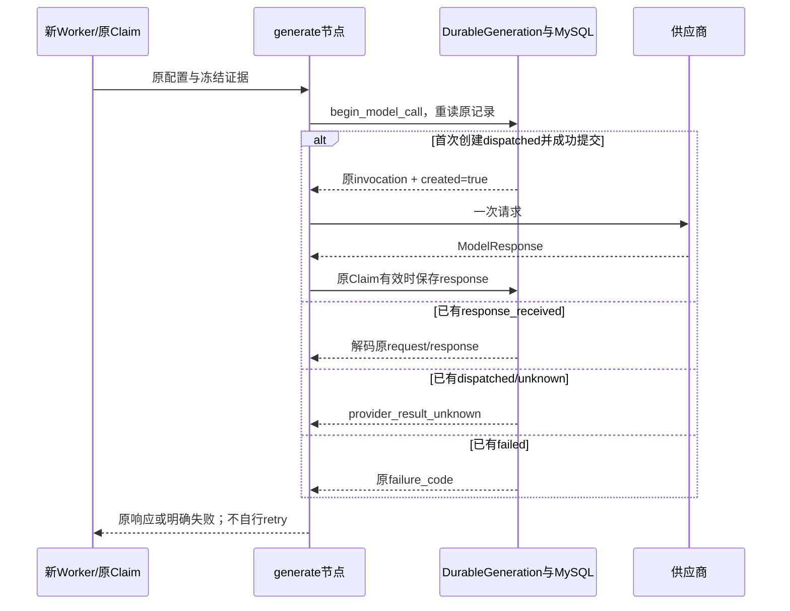

# 业务持久状态与 LangGraph 编排

当前LangGraph负责一次attempt内的阶段组织，MySQL负责接单、发送资格、原回执、执行所有权和业务接受。两种图均未配置独立checkpointer，也没有图内retry policy。重入图能复用原持久响应，原因是durable layer核对原记录，不能把“图恢复”解释成允许再次发送收费模型请求。

本文按 `766b2aa` 未变业务源码记录现行选择，日期为2026-10-06；理由根据实现约束分析，不声称还原首次采用LangGraph的历史动机。实际恢复状态见 [执行恢复](../03-基础设施/execution-recovery/README.md)。

## 一个模型节点牵涉的事实比图状态多

以生成图为例，generate节点调用供应商前先提交原FrozenGeneration及dispatched标记。若标记刚提交、进程在真正send前结束，与“已send、供应商已执行但响应丢失”没有可区分的本地事实。下一次图调用不能因为generate节点没有返回就再次发送。

同样，validate节点返回ArtifactCandidate也只是本地候选。最终接受还需检查当前用户授权、Session/Run/Job/fence、原发布绑定、原EvidenceSet、持久request/response及重建成果完全相等，并把Artifact、终态和结果事件同事务提交。图的state字典不包含或不能独立决定所有这些条件。

评测更有两种持久模式：serial_v1的一条checkpoint和candidate_v2的多槽claim/独立receipt。图每次只推进一次生成或语义尝试；跨槽依赖、阶段预算、原候选不可替换、unknown授权和人工门槛由原持久证据决定，不归图编排器猜测。

## 两种图目前确切负责哪些阶段

| 图 | 节点及本地结果 | 原事务边界 |
| --- | --- | --- |
| [ReportWorkflow](../../src/qs_ai/infrastructure/workflows/report.py) | prepare组装原输入/Prompt；generate得到GeneratedExplanation；validate构造ArtifactCandidate | DurableGeneration提交发送资格与响应；ExecuteNext最后单独核权并调用store.finish |
| [evaluation.execute_step](../../src/qs_ai/infrastructure/workflows/evaluation.py) | prepare_dispatch取得原执行/容量/dispatch；invoke_model返回响应或分类失败；commit_receipt接受完成投影 | 准备先提交再外部I/O；candidate先单独保存response receipt，再finish_step；serial完成一次事务保存 |

图使用新的invocation state：ReportWorkflow给ainvoke传入这次claim/evidence，节点返回部分更新；evaluation每次execute_step创建StateGraph，闭包持有本次token/heartbeat。它们不把不同候选的response写到一个共享可变字典。共同资产与gateway对象可以共享，执行state与所有权仍隔离。

ReportWorkflow只把NotApplicable、InvalidInput/Prompt/Output及ProviderFailure转换成明确业务failure_code；存储异常、失租和取消向worker传播。ProviderFailure.result_unknown优先变为provider_result_unknown。图不会吞掉存储失败并再走generate来补一份结果。

评测invoke只捕获ProviderFailure作阶段分类；完成/数据库/取消异常仍传播。candidate有30秒heartbeat，模型返回后检查已结束heartbeat异常并保存原receipt，不能声称heartbeat失败立即中断远端调用。finally结束heartbeat并归还本地token，不替代原claim/Run终态；serial没有该候选续租机制。

两种graph调用及模型ainvoke都禁用LangSmith tracing，网关callbacks为空。图框架环境开关不能使报告正文自动进入云追踪；本地operation日志只保留安全阶段/身份。具体日志口径见 [观测](../03-基础设施/observability/README.md)。

## 原持久状态怎样控制图重入

[DurableGeneration](../../src/qs_ai/application/execution/generation.py) 只有created=true才进gateway。已有response恢复不等待模型token，不查询当前资料、不更换binding，不用“图节点未完成”授权再发；原Codec/配置比较失败也不删除记录重新创建。

这让图可以从prepare重新计算，而不重复外部效果，代价是需要原冻结输入和资产持续可验证。若某份历史输入无法按其原契约重建，必须阻断并取证，不能让checkpointer或者最新版Profile替换它。

candidate评测的独立response receipt让“供应商响应已持久保存，Run投影提交失败”可本地恢复；serial没有该独立阶段，因此原dispatch失去可读completion后仍可能unknown。不能因两者用了相同三节点图就宣称有相同崩溃保障。

## 为什么不把图 checkpoint 作为另一权威账本

| 可选方案 | 可提供的便利 | 与本业务的关系 |
| --- | --- | --- |
| 直接async顺序调用 | 阶段少时控制流简洁 | 仍需全部durable发送、回执、CAS和原消息事务；不是可靠性替代方案 |
| 当前无checkpointer的图 | 阶段显式、易核对prepare/invoke/commit，重入委托原账本 | 不持久化图内state，所有恢复资格仍来自原业务数据库 |
| 独立持久图checkpoint | 可以承载长期挂起、分支和图自身恢复 | 与Session版本、lease/fence、dispatch/receipt、Outbox形成第二套提交/恢复状态，需要协调 |

例如图checkpoint记录“invoke已结束”，但业务receipt提交失败，另一个worker已因原dispatch过期写unknown。以图记录直接接受模型输出会绕过原所有权；以业务状态直接重跑节点又可能忽略图的“已结束”。即使两套都放MySQL，使用不同Session提交也不自动成为同一事务。

独立checkpointer也不能证明供应商没有执行，或让不支持幂等/查询的模型协议获得exactly-once。不能把增加框架组件当作解决这些业务窗口的证据。

## 哪些新需求值得重新选择

若流程出现跨天挂起、多轮分支、人工中断点或需要保留中间图state，应先列出权威状态表和每次提交次序，再决定是否引入checkpointer。必须回答：旧worker失权由谁决定；图恢复与原CAS冲突怎样处理；响应在哪一层首次持久；取消意图与unknown怎样排空；原消息如何随业务终态原子提交。

新设计应以进程退出、事务失败、晚到响应、重复节点和混合版本为验收样例；不能仅演示“图从断点继续”就宣称业务恢复安全。当前scope不涉及替换编排框架，源码没有为多轮会话实现这些新协议。

## 验证依据

[test_report_graph](../../tests/test_report_graph.py) 检查unknown不在图内重试、取消不继续构造成果与并发state隔离；[test_generation集成](../../tests/integration/test_generation.py) 检查发送/响应提交窗口、原响应重用和跨进程退出；[candidate执行集成](../../tests/integration/test_evaluation_candidate_execution.py) 检查原receipt恢复、并发完成和失权；[串行恢复集成](../../tests/integration/test_evaluation_recovery.py) 固定其不同边界。

纯图测试不证明数据库事务和真实供应商调用，集成测试中的fake gateway也不证明实际收费、内容质量或部署。恢复结论须绑定原执行身份与实际持久事实。
