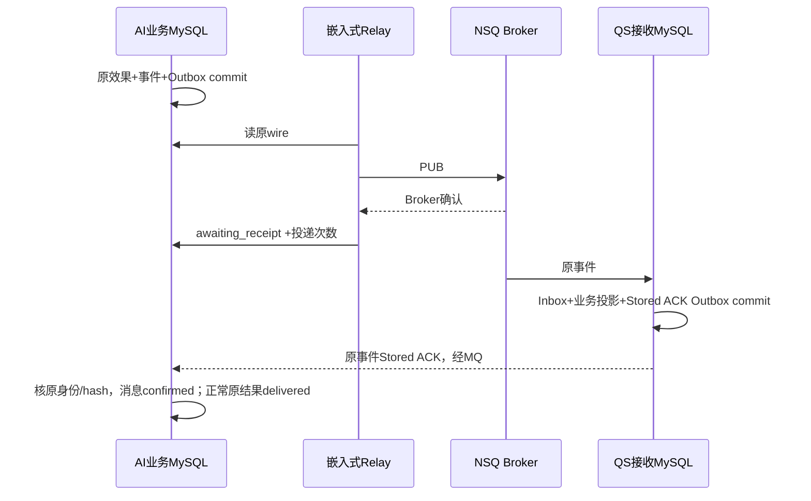

# 原事务消息与业务确认

当前接单与事件使用业务所在MySQL的Inbox/Outbox，消息SDK借用宿主根事务和连接池。嵌入式NSQ Relay传输已提交的原wire，QS原业务接收事务生成Stored ACK，AI再结算自己的消息确认。选择保护的是**原业务效果与消息意图的一次本地提交、原身份幂等和业务确认边界**，不宣称网络只投递一次或Broker确认等于业务完成。

本文按 `766b2aa` 未变业务源码及可靠消息SDK `python/v0.2.0a2` 记录，日期为2026-10-06。理由根据当前约束归纳，不把独立Relay、中央Outbox或Broker事务消息追认为已采用方案。真实实现见 [可靠消息设计](../03-基础设施/messaging/README.md)。

## 一条命令需要哪些同时成立的事实

假设QS已持久提交Start命令。AI受理后要保存原Inbox首决定、报告EvidenceSet、Session/Run、固定Publication绑定、Job及首回执/状态事件。如果业务已成功而Outbox缺失，QS可能永久无法对账；如果先发accepted再回滚，QS会观察到一个不存在的任务。将这些步骤分成“先commit业务，再PUB”不能消除窗口。

当前 [CommandReceiver](../../src/qs_ai/infrastructure/workflow_transport/mq_receiver.py) 开接收根事务，先按原逻辑身份预留Inbox，业务admission借同Session的savepoint执行。确定业务拒绝撤销局部效果后仍提交首拒绝回执；技术不确定错误使根回滚，不伪造确定拒绝。只有根commit成功，handler返回后NSQ才可FIN。

重复原身份且正文一致时读首决定，在业务CAS和再次冻结之前停止重复效果。同ID换正文不是“新请求”，而是身份冲突隔离。运输层新delivery ID或重新加密也不能使相同命令再次创建Job。

## 事件必须在业务 commit 之前形成

[stage_state](../../src/qs_ai/infrastructure/persistence/mysql/result_outbox.py) 在解读状态事务内保存原StateEvent；completed必须已有原Artifact。同Session/version重复保留首event_id，再在同事务写消息Outbox、首body/wire及mq_owned。两层记录职责不同：result_outbox保存原解读事件证据，ai_messaging_outbox保存现行传输状态/预算；当前服务没有旧gRPC结果扫描器。

评测用Session中的变更Run集合标记待投影，[EventSession.commit](../../src/qs_ai/infrastructure/persistence/mysql/database.py) 在最终提交之前flush状态消息。flush失败阻止根成功提交；不是先提交再异步补事件。事件ID/sequence绑定原Run版本，QS按版本或sequence推进投影，当前ordered=false不依赖Broker保持业务顺序。

borrowed.commit只核对原活动root，不提交、回滚或关闭宿主Session。SDK的TransactionAppender校验借用root，接收宿主最后commit；共享池不意味着SDK有权开启第二根事务或dispose连接池。每个短操作结束释放连接，外部PUB不在业务事务中进行。

## Broker确认与Stored之间还有两笔事务

Broker确认只证明一次传输结果。QS要完成自己的原接收事务，Stored还要送到AI并成功结算，才结束原事件确认。正常解读路径读取到原结果源行时，AI同时核证该行与原消息并置delivered；函数没有额外把“源行缺失”设为拒绝条件，不能单看消息confirmed推断完整结果源证据。

若QS已Stored但ACK未到AI，Relay重发同一原wire，QS先读原Inbox复用首ACK，不重做业务效果。PUB到达后AI结算失败也可重发。这种重复是协议允许的恢复路径，不是重新执行生成或替换成果。

## 同一套机制接受哪些代价

| 窗口 | 当前选择怎样保留事实 | 代价/边界 |
| --- | --- | --- |
| 根业务或首回执写失败 | 同根回滚，原命令可重投 | 技术故障不是持久accepted/rejected |
| 根提交后FIN/首回执丢失 | Inbox保留首决定，消息Outbox重发 | 需要原逻辑身份和字节持续可读 |
| PUB已发但结算未知 | 重发首wire，消费者原Inbox去重 | 可能重复传输；不保证只收费一次运输成本 |
| Broker成功但业务ACK缺失 | awaiting_receipt继续有界重投 | 成功PUB也计attempt；8次后held，并非无限保证最终交付 |
| 逻辑处理持续技术失败 | 根回滚后另记本地逻辑预算，满8次可held | NSQ物理attempt不能单独制造业务拒绝或消耗可信预算 |
| 历史result移交 | 按显式原ID与manifest逐条锁源→消息，继承时间/预算/首wire | 可部分成功、commit_unknown；普通Relay不自动接管旧记录 |

消息传输Unknown能在Inbox协议下重投**同一个已提交事件**。供应商provider_result_unknown不能自动再次发起收费模型调用；授权新执行须另走原业务恢复规则。这两种预算和风险不能合并为一个retry开关。

原wire持续保留、JOSE密钥/kid轮换、精确mTLS大载荷读取、quarantine/held及维护移交都增加运维复杂度。它们没有把可靠性变成一个SDK函数调用，也没有免除宿主对原事务和资源寿命的责任。

## 为什么当前不采用其他提交边界

| 可选方案 | 它提供什么 | 不能直接继承当前保证的原因 |
| --- | --- | --- |
| 当前本地原事务Inbox/Outbox | 业务与首消息意图同库同事务，原身份可有界重投 | 仍需Relay/业务ACK/held处置与现场交付证据 |
| 业务commit后直接PUB | 少一层持久传输记录 | commit成功后进程退出会丢消息；先PUB则可能暴露回滚效果 |
| 中央独立Outbox数据库 | 便于集中存储和投递运维 | 业务库→中央库写入成为跨库双写，原同根原子性不再成立 |
| 更换普通Broker适配器 | 可改变运输能力与部署体验 | 不解决业务数据库与消息意图双写，也不提供原QSStored证明 |
| Broker事务消息 | 可建立另一发送/状态回查模型 | 必须定义业务事务状态查询、Unknown与历史兼容，不是替换Publisher就完成 |

独立Relay进程可以读取业务库原Outbox，Outbox不必搬到中央库；但仍要设计扫描claim/fencing或明确重复容忍、连接与生命周期。目前MQRelay只有进程内gate，不能将第二实例部署解释成已有分布式排他发送。

## 什么情况下需要重新决策

只有实际传输负荷、隔离或运维需求要求时，才重新评估Relay角色/Broker。新方案须给出原业务提交、运输确认、消费者提交和业务ACK四个节点的明确状态表，并验证：原ID同正文重投、同ID换正文隔离、PUB/ACK丢失、源漂移拒绝、历史预算不重置、混合版本读写和进程关闭。

若采用Broker事务消息，还要明确每种回查的业务状态和unknown处理，不许凭回查超时决定未提交。若改变SDK适配器，保持Outcome/Confirmation的语义区分和首wire/原业务ACK，不让Confirmed默认变成Stored。

重新决策不应删除原Inbox、调用回执、结果或发布证据。清理和移交有各自审计范围，不能以“切新Broker”复活delivered或重新授权模型。

## 决策的验证依据

[MQ admission集成](../../tests/integration/test_mq_admission.py) 固定同根回滚、首决定重放与原Stored确认；[存储集成](../../tests/integration/test_mq_storage.py) 固定body/wire、ACK与Relay预算；[历史handoff集成](../../tests/integration/test_mq_legacy_handoff.py) 固定源记录、时间及预算继承；[messaging runtime单元](../../tests/test_messaging_runtime.py) 固定池借用和组件顺序；[旧投递退役](../../tests/test_legacy_delivery_retirement.py) 防止重开第二扫描路径。

这些测试分别需要合成输入、SDK extras、隔离MySQL或真实测试NSQ，不能凭文件存在或替身成功宣布生产交付。真实结论要绑定原event/body hash、QS原接收记录、Stored及AI原确认记录；用户看到结果、内容质量和业务验收还需自己的证据。
