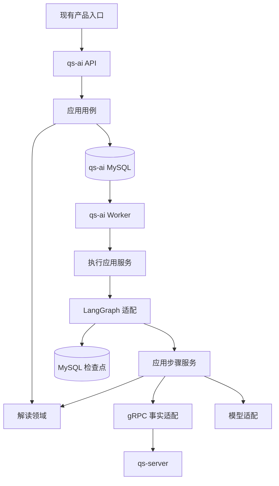

# qs-ai 项目设计


最新责任边界见 [迁移决定](migration-boundary.md)：首版从 QS 业务入口发起，qs-ai 持有 AI 生命周期并可靠回传；早期直接用户入口/认证代理假设不再作为本批实现方向。
状态：设计基线，2026-09-11。M5 已移除 LangGraph 运行样板与独立会话 HTTP；以下框架和多轮产品设计不作为现行实现，最新范围见 [退役清单](m5-retirement.md)。本文描述目标架构；P0 已完成分层与 DI，P1 已有会话/执行骨架。当前实现见 [P1 验证记录](p1-verification.md)，实施顺序见 [路线图](roadmap.md)。

## 结论

qs-ai 是独立的 AI 解读与交互服务，采用 DDD、六边形架构和 Dishka 依赖注入。Python 是实现语言；FastAPI 提供入站 HTTP 适配，LangGraph 提供持久化流程执行，MySQL 保存业务与执行数据。一个仓库构建 API 和 Worker 两种进程，第一阶段不拆更多微服务。

设计面向熟悉 Go/PHP/JavaScript/TypeScript 的工程师，沿用领域、应用用例、端口、适配器、组合根这些概念。Python 特有实现只在影响边界或生命周期时展开。

## 产品与系统边界

| 能力 | 定位 |
| --- | --- |
| 单报告综合解读 | 基础场景及新旧系统校准入口 |
| 同类多次测评关联 | 时间变化、观察者差异和可比较性分析 |
| 多类型测评综合 | 按发布的适用范围组织互补、冲突和不足证据 |
| 解读前主动提问 | 围绕影响解读的信息缺口补充有限问答 |
| 会话记忆 | 同一解读过程跨请求、跨进程继续 |
| 跨会话记忆 | 后续有来源、时间和可见范围的背景复用 |

AI 不能重新计分、改写标准等级或覆盖标准报告。既有 AI 成果只可作为带来源的推断材料，不能升格为测评事实。原始答案、临床诊断、开放互联网检索不在首版范围。

| 系统 | 权威数据与责任 |
| --- | --- |
| 现有身份系统 | 身份认证和服务身份信任 |
| qs-server | Testee、监护关系、测评、标准报告及其访问授权 |
| qs-ai | 解读会话、补充问答、证据快照、成果、受控记忆及执行记录 |
| 模型提供商 | 生成候选内容，不决定权限和业务状态 |

qs-ai 通过 gRPC 读取已授权事实，禁止直接读取 qs-server 数据库。共享云 MySQL 实例时仍使用独立数据库和账号。qs-ai 不新增注册、登录、Testee 或监护关系管理。

## 系统结构



图中为运行调用关系。源码依赖面向领域及应用端口；应用服务不导入具体 Graph、ORM 或远程 SDK。

## 分层与目标目录

以下为目标目录；P1 已有 interpretation 和 execution 子模块；memory、模型与其他扩展仍是规划。

```text
src/qs_ai/
  domain/
    interpretation/       会话、证据、提问、成果与业务策略
    memory/               后续跨会话记忆模块
  application/
    interpretation/
      commands/           创建会话、开始解读、提交回答、取消
      queries/            会话、进度、成果查询
      steps/              证据准备、缺口判断、候选生成、成果接受
      ports/              事实读取、模型生成、仓储、事务接口
    execution/            调度、预算、版本与恢复用例
    memory/               后续记忆管理用例
  transport/
    http/                 身份提取、HTTP DTO 和错误映射
    worker/               任务消费入口
  infrastructure/
    persistence/mysql/    ORM、仓储、查询与 Unit of Work
    qs_server/            gRPC 客户端与事实防腐层
    models/               Provider 适配及响应规范化
    workflows/langgraph/  图编译、状态映射、中断及检查点
    jobs/                 任务领取、租约与心跳
    observability/        日志、指标和链路
  bootstrap/
    providers/            Dishka 模块注册
    container.py          根容器
    api.py                API 生命周期与装配
    worker.py             Worker 生命周期与装配
  main.py                 保留现有工厂入口的兼容转发
```

| 层 | 允许依赖 | 禁止依赖 |
| --- | --- | --- |
| domain | 标准库、同上下文领域类型 | FastAPI、Dishka、SQLAlchemy、LangChain、LangGraph、gRPC |
| application | domain、应用端口/DTO | transport、bootstrap、具体 infrastructure、框架状态类型 |
| transport | 应用用例/DTO、入站框架 | ORM、SQL、Provider SDK、直接构造仓储 |
| infrastructure | 领域/应用接口、具体 SDK | transport、bootstrap |
| bootstrap | 装配需要的各层 | 业务判断和业务事务逻辑 |

HTTP DTO、领域对象、ORM 模型、protobuf 消息、Graph State 分开定义，边界处映射。领域对象用普通类/dataclass；应用端口用 Protocol。Unit of Work 和聚合仓储端口归应用层，领域不自行持久化。查询可以通过只读查询端口返回 DTO，不强制加载聚合。

## Dishka 自动装配

显式注册模块和接口绑定，按类型解析构造依赖。业务类不添加 DI 装饰器、不访问全局容器。Provider 位于 bootstrap；不做全包扫描自动注册。构造参数变化由容器解析，接口实现选择仍明确声明。[官方 Provider 机制](https://dishka.readthedocs.io/en/stable/provider/provide.html)

| Provider | 对象 |
| --- | --- |
| RuntimeProvider | Settings、时钟、ID 生成器 |
| PersistenceProvider | Engine、UoW 工厂、仓储/查询实现 |
| IntegrationProvider | gRPC Channel、模型客户端、事实/生成端口 |
| InterpretationProvider | 领域策略及应用用例 |
| ExecutionProvider | 工作流执行器、任务存储、预算与恢复服务 |

上表是目标 Provider 划分。P0 实际注册 RuntimeProvider（Settings/Database）、PersistenceProvider（探测端口/事务工厂）、OperationsProvider（健康用例）；P1 已新增 InterpretationProvider，注册 UoW、任务存储、会话服务和执行用例；真实身份/证据/工作流的默认实现明确返回不可用。后续随业务模块扩展。

API 和 Worker 复用注册定义，各自创建进程容器。HTTP 集成解析用例；Worker 显式为每次尝试进入操作作用域。

| 生命周期 | 对象与约束 |
| --- | --- |
| APP | 配置、Engine、当前事件循环内的 gRPC Channel、可安全复用的模型客户端 |
| REQUEST（操作范围） | HTTP 请求或 Worker 尝试的 ActorContext、用例、UoW 工厂 |
| 显式事务块 | 每次新建 AsyncSession/UoW；应用明确 commit，异常 rollback 并 close |
| 持久化会话 | 数据库记录，不是 DI Scope，不持有连接 |

数据库事务不覆盖模型调用或整个 Graph 执行。并行步骤不能共享 AsyncSession；共用工厂、各开短事务。SSE 不能延长事务。APP 对象不得捕获 REQUEST 对象；编译图不捕获回答者上下文或 Session。需要操作级服务时使用操作级图适配器，不能把服务对象写入检查点。

容器启用依赖图校验；测试缺失绑定、循环、作用域、异常释放及替身覆盖。只有组合根和入站集成可解析容器。参考 [Dishka Scope](https://dishka.readthedocs.io/en/stable/advanced/scopes.html)、[SQLAlchemy 并发约束](https://docs.sqlalchemy.org/en/20/orm/extensions/asyncio.html)。

## LangGraph 边界

应用声明 WorkflowExecutor 端口，LangGraph 实现 start/resume 和检查点。节点调用应用步骤服务，只承担路由、状态转换和中断适配；权限、比较规则、引用校验、成果接受留在应用/领域层。

State 只保留可序列化的业务/步骤结果引用和恢复信息；原始快照按需读取，不在每个检查点重复复制。Token、API Key、数据库对象、SDK 客户端不进入 State。

session.status 决定用户可做什么；run/job 决定尝试与调度；checkpoint 决定执行位置。三者通过 run_id、session_version、workflow_version 关联，详细协议见 [运行设计](runtime.md)。

## 技术决定与取舍

| 决定 | 理由与代价 |
| --- | --- |
| Python + FastAPI | 面向 API/异步工作，不重复用户系统 |
| DDD + 六边形 | 用边界、领域规则及测试继承工程经验 |
| Dishka | 自动解析和作用域管理；API/Worker 基础集成已验证 |
| LangGraph | 复用流程执行；业务幂等和外部副作用仍需治理 |
| MySQL + SQLAlchemy/asyncmy + Alembic | 复用云资源和经验；社区检查点适配需锁定版本 |
| MySQL 任务表 | 减少初期设施；实现租约、预算和恢复 |
| 核心 Prompt + 模型适配 | 统一业务标准，具体模型通过评测发布 |
| 后置向量库和更多服务 | 首版按主体/时间/来源查询；实际需求触发扩展 |

精确依赖以 uv.lock 为准。Dishka 已锁定为 1.10.1。云 MySQL 版本、容量和连接预算未验证。

## 骨架迁移

保留 `qs_ai.main:create_app` 与健康检查行为；拆出 HTTP、资源探测和 bootstrap。数据库迁入 infrastructure，更新 Alembic 导入但不重写迁移历史。先用健康查询端口验证 Dishka，再建设业务用例。离线 clarification_demo 保留为测试探针，不当作领域实现。

详细设计：[领域与数据](domain-data.md)、[执行与恢复](runtime.md)、[接口与模型](contracts.md)、[实施计划](roadmap.md)。
