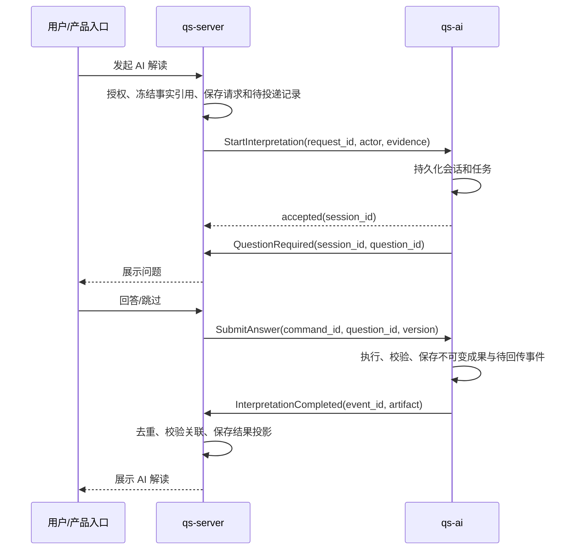

# AI 解读迁移与系统责任边界

状态：2026-09-11 根据用户补充修订的迁移决定，跨服务命令与状态回传已完成本地联调，见 [第 1 批验证](batch1-verification.md)；真实业务授权、事实及正式成果接入待完成。优先级高于早期“qs-ai 直接承接用户入口”的假设。已有 P1 Python 会话与任务骨架继续使用。

## 核心决定

qs-server 负责业务发起、业务权限与事实、接收并展示结果；qs-ai 负责完整 AI 解读生命周期。测评计分和标准报告继续由 qs-server 负责。“AI 测评”在此指其后的 AI 解读，不迁移计分规则或让模型修改标准结论。

首版沿用现有产品入口：客户端→现有 collection-server/qs-server 业务入口→qs-ai。qs-ai 接收经可信服务身份认证的内部命令，不再要求 qs-server 替独立 Python 用户入口提供 AuthenticateActor RPC。未来独立 AI 用户入口若需要，直接接现有 IAM，另行形成契约。

## 能力归属

| 能力 | 目标归属 | qs-server 保留内容 |
| --- | --- | --- |
| Testee、关系授权、测评、标准计分/报告 | qs-server 与现有 IAM | 继续为权威来源 |
| 发起解读与业务请求幂等 | qs-server | 用户权限、业务请求号、AI session_id 关联和可靠投递 |
| 多报告关联与补充信息判断 | qs-ai | 提供授权事实，不做 AI 推理 |
| 问题、回答、上下文、长期记忆 | qs-ai | 产品路由转交问题/回答，按权限展示 |
| 模型/Prompt/Profile/release、路由与生成策略 | qs-ai | 管理入口可代理，不保留第二套配置权威 |
| AI Run/Job、租约、重试、取消、恢复、预算 | qs-ai | 只重投未确认的跨服务消息，不重启模型步骤 |
| 结构/事实引用校验、语义评测、质量发布 | qs-ai | 校验接收契约及业务关联，不重复执行 AI 质量流程 |
| AI Artifact 正式成果与版本 | qs-ai | 结果副本或查询引用，用于展示与业务消费 |
| 历史旧成果与在途旧任务 | 迁移期间原引擎 | 根据 engine_version 路由，直到归档/排空 |

AI 状态权威只有 qs-ai；qs-server 的状态是按事件更新的业务投影，不再维护第二套 Generation/Run 执行状态机。AI 服务内部的查询幂等与数据库约束仍保留，不因上游也有投递幂等而删掉。

## 新主链路

没有信息缺口时不提问；失败/取消也有明确状态事件。客户端退出后仍由 qs-ai 的持久任务继续执行。

## qs-server 不能省略的协作责任

1. **事实与权限**：发起时授权并提供不可变 report_id/outcome_id/版本/受众范围；长任务执行期间和结果展示时支持按持久主体重新检查当前授权。不能把“发起时允许”当作永久许可。
2. **交互转交**：主动提问需要转交问题、回答和取消命令；问题与会话状态的权威仍在 qs-ai。
3. **可靠接收**：验证回传服务身份、消息去重、请求/会话/主体/版本关联及结果格式，可靠落库并确认。接收失败不能让 qs-ai 重新生成内容。

事实可随初始命令推送，后续扩展证据或授权复核可走受控只读 RPC。不会因为新主链路是推送，就删掉 qs-server 的数据与授权责任。qs-ai 不直连 qs-server 数据库，不保存用户短期 access token。

## 双向契约的最小要求

| 方向 | 契约 | 不变量 |
| --- | --- | --- |
| QS→AI | StartInterpretation | 稳定 request_id；主体由可信业务入口确定；显式事实版本；相同键不同内容冲突 |
| QS→AI | SubmitAnswer / Cancel | 稳定 command_id、当前 question_id、expected_version；重放不重复接受 |
| AI→QS | TaskAccepted / QuestionRequired / Completed / Failed / Cancelled | event_id、session_id、request_id、单调 session_version；持久化后重传 |
| QS↔AI | GetSession / GetArtifact / 对账 | 回传丢失可补齐；不因轮询触发生成 |
| AI→QS | RecheckAccess / ReadEvidence | 专用服务身份、持久主体、用途及精确资源；当前权限可拒绝 |

消息传输按至少一次设计：发起端与回传端各自有 outbox，接收端有去重回执。旧事件不能覆盖新投影；终态不能被迟到的 running/question 事件倒退。QS 接收完成事件须绑定原任务与证据，不把旧事实生成的成果挂到新报告下。结果原件归 AI；QS 保存副本不改变其权威归属。

身份与 ACL 应按各方向配置独立服务身份；不复用旧 collection-server/worker 证书冒充调用者。具体协议与鉴权实现待下一批代码固化，不因本文出现名称就宣称 RPC 已存在。

## 现有代码如何迁出

本轮只读核对源：qs-server 独立工作区基于 16afc904。主要责任链已确认：

- application/interpretation/aiexplanation/participant：当前 Capability/Request/Get 入口。目标改为业务网关及新旧引擎路由，不再装配模型生成。
- application/interpretation/aiexplanation/execution、recovery、persistence：执行、恢复和成果提交。迁移为 qs-ai 用例、工作流与仓储。
- application/interpretation/aiexplanation/prompt、input、validation：AI 输入、Prompt 与输出校验迁入 qs-ai；其中标准报告/Outcome 读取与授权留在 QS，形成中立事实接口。
- application/interpretation/aiexplanation/evaluation、governance、administration 及对应领域/存储：AI 评测、发布和治理迁入 qs-ai；旧管理页面先代理，避免两边同时修改同一发布配置。
- domain/interpretation/aiexplanation 的 Generation/Run/Profile/Artifact/Evaluation：职责迁移，结合新 Session/EvidenceSet 模型重构；不逐行翻译 Go 类。
- worker 的 AIExplanationAutomationClient、AI 解读/评测事件处理：新任务切换为投递到 qs-ai；旧任务排空后退役旧执行 RPC。
- domain/interpretation/report、标准报告构建与 EvaluationOutcome：留在 qs-server，不能与 aiexplanation 一起删除。

可保留的迁移资产：脱敏评测样例、输出 Schema、Prompt 版本、失败分类和质量规则。旧运行记录/成果保留来源标识，不能直接改名为新 Session 后伪装成新契约数据。

## 调整后的落地批次

本轮任务和验收以 [M1–M5 替代里程碑](migration-milestones.md) 为准。下列早期批次是背景记录；主动提问、多报告和长期记忆新增建设不阻塞现有能力替代。

1. **接口闭环**：先固化 Start/Answer/Cancel 与状态/结果回传，复用 Python P1 会话/任务骨架；用合成输入验证可靠投递、重复回传、乱序与取消。
2. **真实事实与授权**：把标准事实组装和授权复核作为 QS 的业务适配；为两端配置独立身份，做 Go/Python 契约联调。此次未完成的认证代理草案已撤下。
3. **旧 AI 单报告迁入**：迁移默认模型路线、核心 Prompt、结构/引用校验及发布配置；同样样例离线对照。新请求按 engine_version 明确选择一侧，禁止双生成。
4. **产品交互与治理迁入**：主动提问、多报告、记忆和管理入口；AI 内部状态/配置只写 qs-ai。
5. **旧引擎退役**：确认在途任务排空、历史查询可用、结果对账及回滚路线后，删除 QS 的旧 AI Provider/调度/评测实现和相应权限。

迁移期间“旧代码还在”不代表两套长期维护。新引擎满足真实单报告与交付验收前，不停掉旧生产能力；灰度只切新请求，回滚也不把新会话送给不兼容的旧引擎。

## 配置发布与回退的迁入边界

2026-09-13 核对 QS `2c26389c0b7b27e04da1300462636b5422a4f804` 的治理服务、Profile 领域及 Mongo 仓储后确认：发布要求 draft Profile、approved 的完整评测和匹配的 release，同一 specificity 的相同 selector 不允许两个 published Profile；读取按 model_code/model_version 的特异程度由高到低选取。停用较具体的版本后会回落到剩余通用版本。当前 Profile 查询不按机构过滤；这是共享配置目录，不能在迁移中无声改变为每机构独立配置。管理权限仍来自 QS，发布使用的评测 Run 必须在操作人的合法机构范围内。

新实现保留这些选择语义，并将不可变配置、发布记录、当前指针及每次变更审计分开。发布/替换必须明确确认当前指针版本和原 publication_id；回退引用历史 publication，不重新创建或改写旧配置。回退产生新的指针版本及审计，不能减小版本号。新请求解析生效指针，在接受任务的事务中冻结 publication_id、manifest、原始资产版本与摘要；在途任务和恢复执行按已冻结版本读取，不查询 latest。发布绑定执行路径现已实现，受默认关闭的 generation.use_publications 控制；旧会话仍按迁移基线处理，生产尚未切换。

发布事务的必须条件：

- 先锁定合法机构内的评测 Run/checkpoint，再锁定共享 selector 的唯一指针；一致性读取在两个锁均取得后开始，避免等待中的旧快照；重新验证 approved 最终记录、全部历史轮次、G1–G5 和完整资产，不能只读取布尔 passed。
- 同一事务接受不可变 publication、指针 CAS 和 command_id 去重审计。相同命令不同内容冲突，确认丢失后回读/重放不能产生第二次生效。回退目标必须来自已存储且同 selector 的历史发布，不能接受调用者拼装的目标对象。
- 新建评测冻结 GenerationManifest 原文和摘要，覆盖 Prompt 包字节摘要及 route revision。来源 Prompt fingerprint 与导出包字节摘要不同，二者都必须保留。缺少该证据的旧 Run 可继续回读，但不能通过补写一个当前 manifest 冒充已评测的配置；须形成新的完整评测。
- 生成发送前和最终发布前均比对冻结清单与所用资产；发布时资产读取必须属于一致快照，不能由多个独立仓储事务拼成混合版本。
- 新草稿/评测仍需遵守冻结 suite 的案例和 Profile/Prompt 绑定；现有 suite 是迁移基线。后续编辑新 Prompt 版本时要建立新的 suite 身份与可追溯案例绑定，不能覆盖旧套件或跳过门槛。

当前已实现发布选择、指针变更规则、新 Run 清单冻结，以及 `0017_configuration_publications` 的三表事务：`configuration_publications` 保留完整不可变发布证据，`configuration_publication_pointers` 对每个共享 selector 维护唯一版本，`configuration_publication_changes` 记录原确认命令及回执。MySQL 适配器复用评测锁和 G1–G5 历史重验，在同一 REPEATABLE READ 快照中解析全部生成资产；发生异常或取消时三个记录全部回滚。

同一 command_id 的相同作用域及内容返回原回执，服务端重试时间不改变原审计；不同内容或操作者冲突。回执读取会重建前后指针并核对原确认命令、作用域、评测/回退目标和审计。回退重新验证历史 publication 的原机构评测与资产，保留原发布审计；共享目录的治理授权仍由 QS 决定。停用不要求已生效配置再次通过质量门槛，但仍要求指针、发布记录和操作历史自洽。

AI 端五个管理 RPC（Publish/Rollback/Disable/Get/GetReceipt）和依赖注入已实现，注册受默认关闭的治理开关控制。GetReceipt 使用原机构、操作者和命令 ID 只读对账；不自动重复写入或调用模型。内部 mTLS 身份、显式确认及版本/范围校验已有测试。QS PR #93 已提供 Go 客户端、受当前 OrgAdmin/解读审计权限保护的五个 REST 入口及 DI 装配；跨语言发布、回退及原命令回执查询已在隔离 MySQL 验证，两端精确提交已通过 CI，AI #48 与 QS #93 已合并；主分支 CI/部署继续独立跟踪。

执行解析与在途冻结已有实现及隔离验证；草稿编辑/新套件以及旧写路径退役仍待完成。该入口尚未接入真实生产管理和生成流量，不构成发布权限或 M3 验收；实际生效仍受 M1/M2 先行验收和生产开关约束。

### 执行端接入与剩余验收

`InterpretationService.start_external` 在同一 UnitOfWork 保存 QS 推送的 EvidenceSet、会话、任务、request_id、接受回执和可选发布配置绑定。新版本工作流按原 publication 构造，旧会话继续使用迁移基线；发送记录和成果接受均检查原绑定。当前实现及后续验收沿以下路径核对：

1. 从可信 QS 冻结报告解析测评编码/版本，按既有 selector specificity 选择 publication；不接受用户传入任意配置或由目标文本决定路线。
2. 在任务接受的同一事务中记录 publication_id、selector 指针版本、原发布清单和证据/会话绑定。先检查原 request_id 回执，重复请求返回原绑定，不重新选择最新配置。无适用发布或资产损坏必须明确失败，不能悄悄使用当前 YAML 配置。
3. 执行和恢复按接受时的 publication 与五项不可变资产构造工作流，逐项检查摘要；后续指针停用、替换或回退不改写此绑定。部署地址/凭据继续由私有配置提供，不进入持久配置正文。
4. 首次发送、已有调用回执恢复与成果接受共同绑定该配置及原证据；保留现有取消、授权复核、租约隔离和未知结果不可自动重发的语义。已接受旧会话不得临时绑定最新 publication；须保留显式迁移基线或阻止不兼容启动。
5. 验证接受后发布替换、同键重放、并发发布、停用回落、进程恢复、资产内容变化、无可用配置及旧会话兼容分支。生产流量切换仍等待 M1/M2 验收，禁止把这些隔离验证当成管理页面或模型质量验收。

这一批不同时修改 QS 业务入口协议或删除旧生成/管理路径；是否需要新增协议字段须由已冻结事实中实际缺失的信息决定，不能凭空增加一份测评元数据权威。

新增 `0018_execution_configurations`、版本化空引用数组修正和操作说明见 [运行说明](runtime.md#发布配置绑定执行)。现有隔离替换测试发布的是同一批准 Run 的另一份 publication，证明指针不会重绑任务，不能证明修改 Prompt/路线后的完整管理闭环；新输入构造版本现已通过独立派生套件绑定并要求新 Run，旧批准不能升级复用；任意新草稿/套件编辑及真实质量评测仍需完成。

### Prompt 草稿的编辑边界

新增独立的 Prompt 草稿及修订历史，不把不可变 PromptAssets 改成可覆盖仓储。创建从确切源包复制，后续编辑只追加草稿快照；头指针、修订正文与命令回执原子提交，机构隔离和操作者审计独立于共享发布目录。草稿可保存未完成文本，因此保存结果不能作为 validate 或 approved。四个内部草稿 RPC 已接到默认关闭的治理入口，尚需 QS 授权代理/管理页面及“校验→固化原生资产→新套件评测→批准发布”的后续链路。完整接口边界见 [运行说明](runtime.md#prompt-草稿与修订历史)。
