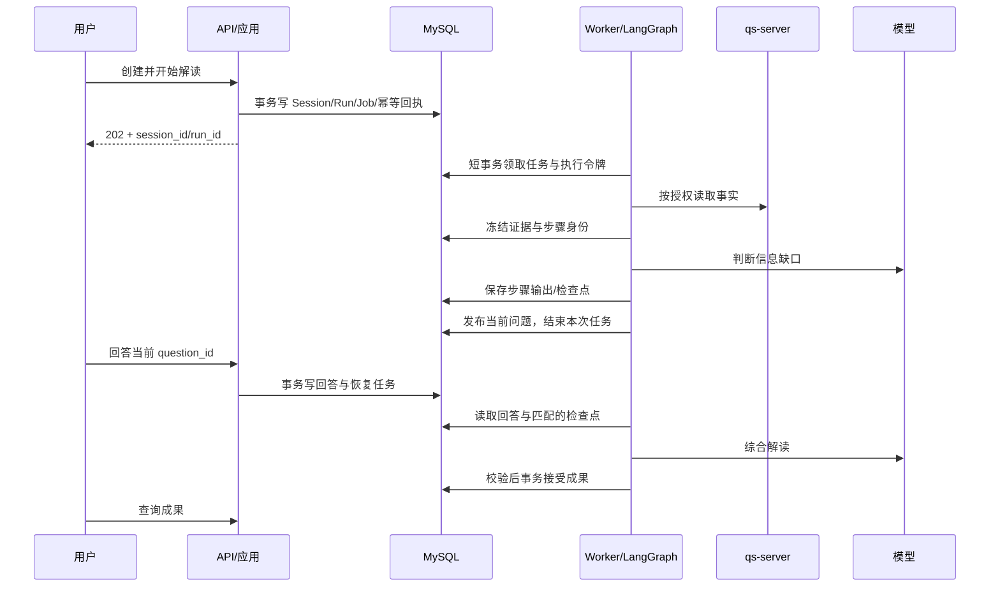

# 执行、恢复与资源生命周期

状态：P1 已实现任务、心跳、幂等和会话状态骨架，离线测试验证恢复；正常流程中的真实授权、模型、正式成果仍为设计。详见 [P1 证据](p1-verification.md)。

## 正常执行



没有信息缺口可直接综合。每轮最多一个待回答问题；问题含 gap_code、提问原因和可跳过标识。达到发布策略的轮次/预算上限时停止追问，生成明确限制的结果，或因证据不足进入 blocked，不能无限循环。

## 执行记录与任务

Run 状态为 queued/running/awaiting_answer/succeeded/failed/result_unknown/cancelled。一个 Run 表示一次开始/恢复尝试；Job 为该尝试的投递记录，状态 queued/leased/done/dead。明确未产生外部不确定性的调度重试可更新同一个 Job；重新执行失败业务步骤创建新 Run，记录 parent_run_id，保留旧失败。

P1 任务领取用短事务、按 Session→Job→Lease 的顺序加锁，并用 SKIP LOCKED 避免等待已占用行；候选扫描当前有界为 20 条。一次进程运行至多领取一个任务。普通运行租约默认 30 秒、每 1/3 TTL 续租；这是本地骨架默认值，不是生产负载调优结果。崩溃接管最多 3 次，超限进入 blocked/attempts_exhausted；业务依赖不可用直接 blocked，受控重试接口尚待实现。实际云版本必须验证。领取后提交事务、开始心跳，模型调用不持有行锁。available_at 表达退避。租约长度需大于心跳间隔，并为调度抖动留余量；具体数值在负载测试后冻结。

每次有效领取递增 fence_token。所有业务写入验证 active_run_id、session_version、fence_token；过期 Worker 的结果只能记为未接受回执，不能覆盖当前状态或成果。取消递增 Session 版本并撤销推进权；外部调用不一定能取消，仍记用量，但不能发布迟到成果。

## 外部调用与幂等

每个逻辑步骤生成稳定 step_operation_id，由 session_id、evidence_set 指纹、已接受回答版本、步骤/轮次及 release_id 派生；它跨 Worker 重投递和恢复保持稳定。调用尝试 Invocation 独立编号，不能仅靠新 run_id 去重。

发送前记录 request_fingerprint 和 prepared 状态；即将调用时记录 dispatching，收到回执后 recorded。已记录的有效步骤结果按 operation_id 复用，不重新调用。不同模型/Prompt/输入变更必须形成新操作身份。

网络超时可能已由提供商完成：标记 result_unknown。只有提供商支持且经验证的请求幂等或回执查询才自动对账；否则进入受控恢复，不能盲目补发。SDK 隐式重试需统一关闭或纳入预算/调用身份管理。

步骤回执与调用尝试保存在 [数据模型](domain-data.md) 中的 step_results/model_invocations。候选有效性不因“重试”而放宽。应用预算在发送前原子预留，并在回执后结算；并发调用不能各自读取余额后超额发送。预算预留需有持久化身份并支持对账，不能仅用进程内计数。

## 检查点与业务记录协调

LangGraph 中断恢复会重新执行所在节点，不能把中断前的模型调用或数据库写入当作只执行一次。节点必须先查稳定步骤回执；详见 [官方中断语义](https://docs.langchain.com/oss/python/langgraph/interrupts)。

检查点和业务表不是一个天然事务。采用“步骤结果先落库、检查点推进、业务状态后发布”的可对账协议：

1. 问题内容以 operation_id 幂等存为内部步骤结果；不立即对用户发布。
2. Graph 中断完成并返回后，取得可恢复 checkpoint 身份。
3. 在短事务中记录 checkpoint_ref，发布 question_id，把 Session 改为 awaiting_answer 并结束 Job。
4. 回答用事务写入业务记录和恢复 Job；Worker 从业务记录取答案，不信任客户端传入恢复游标。
5. 最终候选先持久化；应用校验后，以唯一约束和 CAS 接受 Artifact。即使框架再执行完成步骤，也只能返回已接受成果。

| 崩溃窗口 | 恢复规则 |
| --- | --- |
| 业务任务已提交，客户端未收到 202 | 相同幂等键查询/返回原任务 |
| 步骤输出已保存，checkpoint 未推进 | 复用 operation_id 的输出后继续 |
| checkpoint 已暂停，问题未公开 | 恢复器读取匹配检查点与步骤回执，幂等发布 |
| 回答已提交，Worker 未恢复 | Job 仍持久存在，重新领取 |
| 模型已发送，回执未记录 | result_unknown，先对账 |
| Artifact 已接受，任务确认丢失 | 返回已有 Artifact，幂等结束任务 |
| 租约过期后旧 Worker 写回 | fence/version 拒绝，不推进状态 |

**检查点自身也需要防旧 Worker 覆写。** 不能只给业务表加 fence。首版要求持久化适配层支持：检查点写入时校验有效令牌，或使用每尝试隔离的 checkpoint 命名空间并只发布有效引用。选定具体实现前必须验证适配包的能力；仅在写前读一次租约存在竞态，不算验收通过。P0 已选择同事务行锁校验方案：`FencedMySQLSaver` 将 thread_id/fence/数据库时间校验包在 checkpoint 写入事务内，提交前再校验过期；接管更新同一行，旧写不得提交。P0 的独立技术探针只提供领取与释放；P1 Job Store 已在同事务更新 Job 与 checkpoint lease，并提供续租、取消及业务提交令牌检查。所有运行写入必须经此适配器，基础 AsyncMySaver 仅用于管理迁移和测试清理；它不能替代资源授权。云 MySQL 未验证前，仍禁止据此宣称并发接管已可上线。

## 版本

Session 冻结 workflow_version；Run 冻结 release_id、模型路线、Prompt/Schema 版本与证据指纹。新版本默认只服务新会话；旧会话路由旧执行版本，或通过显式迁移/终止策略处理。不能在恢复时静默使用新图。

保留旧版本容器/执行代码直到旧会话排空或按保留策略终止。LangGraph 包升级、checkpoint 包升级、流程节点重命名分别验证。社区 MySQL 适配支持范围以锁定版本为准，基础验证不外推到所有 MySQL 版本。[适配包说明](https://github.com/tjni/langgraph-checkpoint-mysql)

## 资源与授权

API 的 ActorContext 在认证适配后构建；Worker 从持久化主体引用重新取得当前授权，不把短期 access token 存进任务或 checkpoint。访问身份系统/qs-server 的具体委托协议是 P1 联调项。授权服务不可用时阻断新的读取与成果访问，不能把缓存视为永久授权。

HTTP/Worker 使用同一 Dishka 注册定义。每次操作独立作用域，每次事务新 Session，退出释放。模型调用时不占用事务；等待用户时没有活跃 Worker/连接。并行图步骤有独立 UoW。APP Channel/Client 在对应事件循环创建/关闭。

## 容量、观测与交付

首版限制每组织/主体活跃任务、每会话提问轮次、每步骤输出 token、总调用预算与总执行时限。阈值为发布配置，P2 实测确定，不能写成无限默认值。SSE 如加入只传安全进度/已发布问题，未校验的正式解读内容不提前作为成果展示；轮询始终可恢复状态。

关联字段：trace_id、session_id、run_id、operation_id、invocation_id、job_id、release_id。日志默认不包含原始问答、报告、密钥和 Authorization；受控证据库保留必要回执。指标：队列等待、执行耗时、模型用量、unknown 比例、校验失败、问题完成率、恢复失败、过期租约、连接池使用。高基数字段用于日志，不作为无限指标标签。

API/Worker 同镜像不同入口独立扩容。部署：兼容性检查→备份/迁移→部署 Worker/API→基础健康→合成业务验收→逐步开量。回滚依赖兼容 schema 和旧图，不能对有数据的迁移盲目 downgrade。云 MySQL 备份恢复和删除重放在上线前演练。

关联阅读：[领域与表](domain-data.md)、[接口](contracts.md)、[发布计划](roadmap.md)。

## 导入既有 Profile 资产（不发布）

迁移 `0007_profile_assets` 增加不可变定义库。配置已有 MySQL 环境变量并完成迁移后，可使用：

```sh
uv run python -m qs_ai.bootstrap.import_profiles --imported-by <操作人标识>
```

该维护命令只导入仓库已固定的 `published-profile-baseline.json`，使用既有严格解析器校验定义、版本与原指纹，并记录原 QS SHA 和操作人。它没有接收任意 HTTP 上传或绕过管理权限的新入口。导入按版本持久化，失败后可重跑：完全一致的版本不重复写入，同版本异内容拒绝，不覆盖首次导入审计。多个版本中途失败时，先前成功的导入会保留，重跑可继续对账。

`activated: false` 表示只完成资产保留，不能当作评测批准或运行发布。当前 GenerationProvider 继续使用冻结包；发布状态、评测证据门槛、原子激活与管理转发仍在后续批次。数据库升级后使用匹配迁移头的镜像，不将旧迁移头镜像当成自动回退方案。本轮不自动执行生产导入或删除旧资产。
