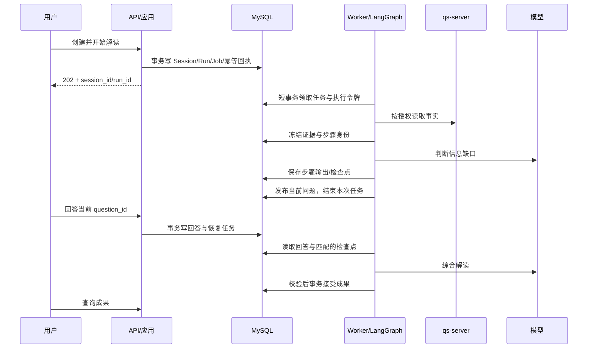

# 执行、恢复与资源生命周期

状态：P1 已实现任务、心跳、幂等和会话状态骨架，离线测试验证恢复；正常流程中的真实授权、模型、正式成果仍为设计。详见 [P1 证据](p1-verification.md)。

## 正常执行



没有信息缺口可直接综合。每轮最多一个待回答问题；问题含 gap_code、提问原因和可跳过标识。达到发布策略的轮次/预算上限时停止追问，生成明确限制的结果，或因证据不足进入 blocked，不能无限循环。

## 执行记录与任务

Run 状态为 queued/running/awaiting_answer/succeeded/failed/result_unknown/cancelled。一个 Run 表示一次开始/恢复尝试；Job 为该尝试的投递记录，状态 queued/leased/done/dead。明确未产生外部不确定性的调度重试可更新同一个 Job；重新执行失败业务步骤创建新 Run，记录 parent_run_id，保留旧失败。

P1 任务领取用短事务、按 Session→Job→Lease 的顺序加锁，并用 SKIP LOCKED 避免等待已占用行；候选扫描当前有界为 20 条。一次进程运行至多领取一个任务。普通运行租约默认 30 秒、每 1/3 TTL 续租；这是本地骨架默认值，不是生产负载调优结果。崩溃接管最多 3 次，超限进入 blocked/attempts_exhausted；业务依赖不可用直接 blocked，受控重试接口尚待实现。实际云版本必须验证。领取后提交事务、开始心跳，模型调用不持有行锁。available_at 表达退避。租约长度需大于心跳间隔，并为调度抖动留余量；具体数值在负载测试后冻结。

每次有效领取递增 fence_token。所有业务写入验证 active_run_id、session_version、fence_token；过期 Worker 的结果只能记为未接受回执，不能覆盖当前状态或成果。取消递增 Session 版本并撤销推进权；外部调用不一定能取消，仍记用量，但不能发布迟到成果。

## 外部调用与幂等

每个逻辑步骤生成稳定 step_operation_id，由 session_id、evidence_set 指纹、已接受回答版本、步骤/轮次及 release_id 派生；它跨 Worker 重投递和恢复保持稳定。调用尝试 Invocation 独立编号，不能仅靠新 run_id 去重。

发送前记录 request_fingerprint 和 prepared 状态；即将调用时记录 dispatching，收到回执后 recorded。已记录的有效步骤结果按 operation_id 复用，不重新调用。不同模型/Prompt/输入变更必须形成新操作身份。

网络超时可能已由提供商完成：标记 result_unknown。只有提供商支持且经验证的请求幂等或回执查询才自动对账；否则进入受控恢复，不能盲目补发。SDK 隐式重试需统一关闭或纳入预算/调用身份管理。

步骤回执与调用尝试保存在 [数据模型](domain-data.md) 中的 step_results/model_invocations。候选有效性不因“重试”而放宽。应用预算在发送前原子预留，并在回执后结算；并发调用不能各自读取余额后超额发送。预算预留需有持久化身份并支持对账，不能仅用进程内计数。

## 检查点与业务记录协调

LangGraph 中断恢复会重新执行所在节点，不能把中断前的模型调用或数据库写入当作只执行一次。节点必须先查稳定步骤回执；详见 [官方中断语义](https://docs.langchain.com/oss/python/langgraph/interrupts)。

检查点和业务表不是一个天然事务。采用“步骤结果先落库、检查点推进、业务状态后发布”的可对账协议：

1. 问题内容以 operation_id 幂等存为内部步骤结果；不立即对用户发布。
2. Graph 中断完成并返回后，取得可恢复 checkpoint 身份。
3. 在短事务中记录 checkpoint_ref，发布 question_id，把 Session 改为 awaiting_answer 并结束 Job。
4. 回答用事务写入业务记录和恢复 Job；Worker 从业务记录取答案，不信任客户端传入恢复游标。
5. 最终候选先持久化；应用校验后，以唯一约束和 CAS 接受 Artifact。即使框架再执行完成步骤，也只能返回已接受成果。

| 崩溃窗口 | 恢复规则 |
| --- | --- |
| 业务任务已提交，客户端未收到 202 | 相同幂等键查询/返回原任务 |
| 步骤输出已保存，checkpoint 未推进 | 复用 operation_id 的输出后继续 |
| checkpoint 已暂停，问题未公开 | 恢复器读取匹配检查点与步骤回执，幂等发布 |
| 回答已提交，Worker 未恢复 | Job 仍持久存在，重新领取 |
| 模型已发送，回执未记录 | result_unknown，先对账 |
| Artifact 已接受，任务确认丢失 | 返回已有 Artifact，幂等结束任务 |
| 租约过期后旧 Worker 写回 | fence/version 拒绝，不推进状态 |

**检查点自身也需要防旧 Worker 覆写。** 不能只给业务表加 fence。首版要求持久化适配层支持：检查点写入时校验有效令牌，或使用每尝试隔离的 checkpoint 命名空间并只发布有效引用。选定具体实现前必须验证适配包的能力；仅在写前读一次租约存在竞态，不算验收通过。P0 已选择同事务行锁校验方案：`FencedMySQLSaver` 将 thread_id/fence/数据库时间校验包在 checkpoint 写入事务内，提交前再校验过期；接管更新同一行，旧写不得提交。P0 的独立技术探针只提供领取与释放；P1 Job Store 已在同事务更新 Job 与 checkpoint lease，并提供续租、取消及业务提交令牌检查。所有运行写入必须经此适配器，基础 AsyncMySaver 仅用于管理迁移和测试清理；它不能替代资源授权。云 MySQL 未验证前，仍禁止据此宣称并发接管已可上线。

## 版本

Session 冻结 workflow_version；Run 冻结 release_id、模型路线、Prompt/Schema 版本与证据指纹。新版本默认只服务新会话；旧会话路由旧执行版本，或通过显式迁移/终止策略处理。不能在恢复时静默使用新图。

保留旧版本容器/执行代码直到旧会话排空或按保留策略终止。LangGraph 包升级、checkpoint 包升级、流程节点重命名分别验证。社区 MySQL 适配支持范围以锁定版本为准，基础验证不外推到所有 MySQL 版本。[适配包说明](https://github.com/tjni/langgraph-checkpoint-mysql)

## 资源与授权

API 的 ActorContext 在认证适配后构建；Worker 从持久化主体引用重新取得当前授权，不把短期 access token 存进任务或 checkpoint。访问身份系统/qs-server 的具体委托协议是 P1 联调项。授权服务不可用时阻断新的读取与成果访问，不能把缓存视为永久授权。

HTTP/Worker 使用同一 Dishka 注册定义。每次操作独立作用域，每次事务新 Session，退出释放。模型调用时不占用事务；等待用户时没有活跃 Worker/连接。并行图步骤有独立 UoW。APP Channel/Client 在对应事件循环创建/关闭。

## 容量、观测与交付

首版限制每组织/主体活跃任务、每会话提问轮次、每步骤输出 token、总调用预算与总执行时限。阈值为发布配置，P2 实测确定，不能写成无限默认值。SSE 如加入只传安全进度/已发布问题，未校验的正式解读内容不提前作为成果展示；轮询始终可恢复状态。

关联字段：trace_id、session_id、run_id、operation_id、invocation_id、job_id、release_id。日志默认不包含原始问答、报告、密钥和 Authorization；受控证据库保留必要回执。指标：队列等待、执行耗时、模型用量、unknown 比例、校验失败、问题完成率、恢复失败、过期租约、连接池使用。高基数字段用于日志，不作为无限指标标签。

API/Worker 同镜像不同入口独立扩容。部署：兼容性检查→备份/迁移→部署 Worker/API→基础健康→合成业务验收→逐步开量。回滚依赖兼容 schema 和旧图，不能对有数据的迁移盲目 downgrade。云 MySQL 备份恢复和删除重放在上线前演练。

关联阅读：[领域与表](domain-data.md)、[接口](contracts.md)、[发布计划](roadmap.md)。

## 导入既有 Profile 资产（不发布）

迁移 `0007_profile_assets` 增加不可变定义库。配置已有 MySQL 环境变量并完成迁移后，可使用：

```sh
uv run python -m qs_ai.bootstrap.import_profiles --imported-by <操作人标识>
```

该维护命令只导入仓库已固定的 `published-profile-baseline.json`，使用既有严格解析器校验定义、版本与原指纹，并记录原 QS SHA 和操作人。它没有接收任意 HTTP 上传或绕过管理权限的新入口。导入按版本持久化，失败后可重跑：完全一致的版本不重复写入，同版本异内容拒绝，不覆盖首次导入审计。多个版本中途失败时，先前成功的导入会保留，重跑可继续对账。

`activated: false` 表示只完成资产保留，不能当作评测批准或运行发布。当前 GenerationProvider 继续使用冻结包；发布状态、评测证据门槛、原子激活与管理转发仍在后续批次。数据库升级后使用匹配迁移头的镜像，不将旧迁移头镜像当成自动回退方案。本轮不自动执行生产导入或删除旧资产。

## 导入既有 Prompt 资产（不发布）

迁移 `0008_prompt_assets` 增加不可变 Prompt 包存储。完成迁移并配置数据库后执行：

```sh
uv run python -m qs_ai.bootstrap.import_prompts --imported-by <操作人标识>
```

命令只导入已校验 manifest 的 v1–v6 固定包；原 Prompt fingerprint、GitBlobSHA 和导出 JSON 字节全部保留，另外保存 package_sha256。原指纹并不是导出 JSON 的 SHA-256，不能相互替换。相同 ID/version 的完全相同包可重复导入；异内容报冲突，不覆盖首次来源及操作人。各版本独立提交，部分导入后可重放恢复。

本地隔离 MySQL 8.4 首次导入 6 条、再次 0 条，均为 `activated: false`。生产尚未导入；运行时仍读取冻结包，后续发布流程完成后才能切换资产解析来源。此命令不提供审批、激活或删除能力。

导入后可运行只读对账：`uv run python -m qs_ai.bootstrap.audit_assets`。命令比较固定基线中 1 个 Profile、6 个 Prompt 的完整内容，并核对 Profile 的 Prompt 引用。缺失或不一致返回非零状态；不输出正文，不执行写入或激活。`matched` 只代表该固定基线相符，不代表全部生产资产、route/schema 或发布审批已验收。

## 导入模型路由资产（不发布）

迁移 `0009_route_assets` 保存 route/revision、非秘密定义、原算法指纹与首次导入审计。配置 MySQL 并完成迁移后执行 `uv run python -m qs_ai.bootstrap.import_routes --imported-by <操作人标识>`。固定 v8 首次导入 1 条、重复 0 条，同版异内容报错；不覆盖已有审计。来源标识为先前 QS 运行配置观测，不冒充数据库发布记录。

模型 endpoint 和密钥不允许进入该资产。运行时仍读取冻结包并比对配置；数据库入库不批准、不激活。路由动态发布、审批证据和与 Profile 的完整 release 绑定仍待实现。生产尚未导入 `0009`，升级需使用匹配迁移头的镜像。

路由资产加入后，`bootstrap.audit_assets` 的范围为 `fixed_profile_prompt_route_baseline`：额外比较 1 个 route/revision 的完整定义及指纹，并检查 Profile 的路由名称存在于基线。未导入路由会失败。该检查不选择运行时生效 revision，也不代替包含 revision/fingerprint 的完整发布清单和审批。

## 导入输入、输出规范（不发布）

迁移 `0010_schema_assets` 保存原规范字节、schema_id/version、SHA-256 和首次导入审计。命令为 `uv run python -m qs_ai.bootstrap.import_schemas --imported-by <操作人标识>`。两份 v1 规范从固定 QS 提交提取，先验证文件校验和及 JSON Schema，再插入不可变资产；重复导入不覆盖，同版异内容报冲突。

只读对账范围现为 `fixed_profile_prompt_route_schema_baseline`，包括 1 个 Profile、6 个 Prompt、1 个 route/revision 和 2 份规范，以及 Profile 对输入/输出规范版本的引用。隔离 MySQL 8.4 整套导入后 matched；规范首次插入 2 条、再次 0 条。matched 只证明基线内容与引用相符，不能当作 release 审批或运行验收。旧输入 null/array 契约差异与新执行版本的修正见 [输入规范](../integrations/qs_server/schemas/README.md)。2026-09-13 已完成该固定历史基线的生产导入，10 项内容及引用对账 matched，发布相关三表仍为 0、四个执行开关关闭；见[现场记录](evidence/2026-09-13-m3-fixed-baseline-import.json)。这不代表全部现网资产盘点、审批或发布完成。

## 构建生成清单（不审批、不激活）

导入所有基线资产后，可只读构建：

```sh
uv run python -m qs_ai.bootstrap.build_manifest \
  --profile-id participant-scale-score-range-default \
  --profile-version v6 --route-revision v8
```

清单绑定 Profile、Prompt、generation route、input schema、output schema 的明确版本、原指纹及内容校验和。缺失、仓库返回身份不符或未知版本失败，不回退 latest；Prompt 包校验和独立绑定，避免同原指纹不同导出内容被视为同一清单。资产 insert-only，因此各次只读查询不会遭遇内容原地替换。

这是 `qs-ai-generation-manifest/v1`，不是 QS 的完整评测 release identity；后者还需用例集、语义评测 Prompt/schema/route、执行策略及门槛策略。命令返回 `approved: false`、`activated: false`，不持久保存发布状态，也不验证已知输入兼容问题。运行时尚未切换为清单驱动。

## Prompt 评测进程（M3 增量，未部署）

`python -m qs_ai.bootstrap.evaluation` 默认只检查数据库，`--once` 推进至多一个评测步骤，`--serve` 常驻轮询。执行模式必须显式设置 `QS_AI_EVALUATION__ENABLED=true`；默认及当前生产保持关闭，不因开启报告生成自动开启评测。评测只处理已由管理入口启动的 collecting Run，不自动启动 requested Run。

循环参数集中在 `configs/default.yaml` 的 `evaluation`：并发、空闲等待、异常退避、退出排空时限和独立健康文件。模型连接复用 `generation.endpoint` 与环境变量 `QS_AI_MODEL_API_KEY`，数据库使用 `QS_AI_DATABASE_URL`；实际模型路由和输出规范来自 Run 冻结身份及已导入资产。启动检查 HTTPS 地址、非空凭据和数据库配置；每轮独立 Dishka 作用域，关闭连接后再进入下一轮。配置检查与数据库连通不能替代资产完整性和真实业务验收。

轮询先接受预检，再推进生成或语义步骤。每轮先扫描至多 64 条 collecting Run 的活动检查点，使用进程内游标跨轮次遍历并在末尾回绕。过期 prepared 经版本校验后释放，过期 dispatching 保存结果未知并阻断；恢复和新发送不在同一轮进行。任何活动检查点都不直接重发。游标不代表执行权，进程重启后重新扫描仍由数据库 CAS 防止重复接受。收到 SIGTERM/SIGINT 后停止领取、限时等待在途工作，超时取消时保留持久检查点。尚未配置生产 Compose/CI 开关，真实进程崩溃恢复验收、未知结果人工处置、管理授权、人工审核及发布门禁仍需继续建设。

### 内部评测管理接口（默认不注册）

`EvaluationManagement.Get` 返回 Run 版本、状态、未知数量与处置审计，`ResolveUnknown` 接受人工决定。候选列表和详情由 `ListCandidates` / `GetCandidate` 提供，`Review` 追加人工审核。`grpc.governance_enabled` 默认 false；在 QS 的治理转发完成并验收前保持关闭。接口只接受 mTLS 认证的 `qs-apiserver.svc` 工作负载；QS 从当前用户授权上下文检查权限，状态/候选读取复用解读审计权限，创建、启动、人工审核和未知结果处置要求 OrgAdmin，再传递组织和操作人 ID。qs-ai 校验 Run 组织、版本与持久证据，不建立自己的用户/角色库。用户不能直接向此接口声明管理员身份。

`PreviewGates` 接受 scope 和显式 expected_version，使用同一 REPEATABLE READ 快照重建 G1–G5：冻结身份与策略、预检和执行账本、恢复授权、质量指标及人工审核。仅允许没有活动执行的 awaiting_review Run；机构不可见返回 NOT_FOUND，旧版本或进行中状态返回 ABORTED。响应包含 Run 版本、发布摘要及 `qs-ai-evaluation-gate-preview/v1` JSON，时间由 AI 服务端生成，大小上限 256 KiB。它不写入最终门槛记录，不批准或发布；后续批准必须在写事务中重新计算，不能接受客户端回传的预览作为授权。QS 转发适配见 [PR #90](https://github.com/FangcunMount/qs-server/pull/90)：`GET /internal/v2/interpretation/ai-workflow/evaluations/{run_id}/gates?expected_version=N`，沿用解读审计权限；合并、部署和真实业务验收分别跟踪，默认治理开关仍保持关闭。

审计 actor 按 QS 现有 `user:<operator_user_id>` 规则生成，处置时间由服务端生成。回读只包含处置审计，不包含报告、Prompt 或模型正文。调用结果不明时先回读核对版本和决定；重复提交旧版本会冲突，不能据网络错误创建新的人工授权。既有 Get/ResolveUnknown 已有 QS 授权转发与隔离跨语言验证；真实账号、生产报告及管理闭环验收仍按 M1–M5 台账推进。

`ListUnknownExecutions` 接受同一可信 scope 和显式 `expected_version`。它在组织范围内建立 REPEATABLE READ 快照，核对冻结发布、执行策略、dispatch、终态原始证据及已处置记录，再列出尚未处置的调用。外部组织或不存在的 Run 返回 NOT_FOUND；版本变化、活动检查点尚未恢复或证据不一致不能作为操作目标。读取不提交事务、不调用模型、不修改原输出或处置历史。

返回 Run/版本/发布摘要、状态、未决数，以及每个调用的 execution_id、invocation_id、生成/语义阶段、案例与候选、执行序号、开始/结束时间和失败分类。生成未产生候选时 candidate_id 为空。每项附目标与阶段的已用调用数及冻结上限，`replacement_allowed` 仅表示该快照下预算和状态允许申请，不能代替 ResolveUnknown 的 CAS 或下一次 dispatch 的预算预留。`provider_call_count` 表示发送记录，不代表供应商确认收费或已取得结果。

最多读取冻结策略允许的 70 次生成、70 次语义调用和 140 条 dispatch；响应至多 140 条、256 KiB，不包含 Prompt、模型输出、凭据或供应商错误正文。已取消的 Run 可读取剩余未决条目，但 `can_resolve=false`，不能继续补发。本接口为增量协议，既有 Get 和 ResolveUnknown 字段保持兼容；QS 的审计代理和 Operating 入口仍需在后端部署后接通。

### 普通取消与评审废弃（M3 增量）

`EvaluationManagement.Cancel` 接受可信 QS scope、当前 `expected_version`、理由、`confirm=true` 和必须显式提供的 `discard`。requested、collecting、无未决调用的 blocked 使用 `discard=false`；awaiting_review 必须以 `discard=true` 明确放弃评审。approved、rejected、canceled 不接受取消。未知调用必须走原 `ResolveUnknown` 处置，不能使用普通取消绕过原调用核对。

取消与工作进程共用 checkpoint/Run 锁和版本 CAS：未派发的 prepared 可以取消；dispatching 必须先完成或恢复。接受后版本加一、停止后续工作，保留全部输出、调用账本、审核和复审历史；原 prepared 检查点作为审计留存，不再作为可恢复工作。取消不撤销已发送调用、不退还调用预算，也不删除历史。

`EvaluationState.cancellation_json` 为增量字段，返回 `qs-ai-evaluation-cancellation/v1`：原/新版本、来源状态、发布摘要、操作人、原因、时间和被取消的准备记录标识。回读核对原持久证据；网络结果不明时先读原任务核对回执，不能自动重发取消。旧响应缺失该字段仍兼容。本批只交付 AI 后端，QS 的 OrgAdmin 代理、Operating 操作入口及真实管理验收继续单独跟踪；不启用生产治理或模型执行。

### 最终评审事务（默认关闭）

`EvaluationManagement.Finalize` 接受同一可信 QS scope、显式 `expected_version`、有存在性检查的布尔 `expected_passed`、原因及 `confirm=true`。时间和 actor 由服务端确定；预期结果仅确认预览，不能指定批准。事务先锁定共享 checkpoint 和 scoped Run，再建立证据快照、重算 G1–G5。未收齐冻结要求的 70 条有效人工评审时不能最终拒绝；结果与确认不同或版本已变时返回 ABORTED。

接受后，在同一事务内保存 approved/rejected、完整门槛、冻结发布摘要、原版本/新版本、操作人/原因/时间及最终状态迁移，并将 checkpoint 版本精确加一。原始生成/语义输出、调用账本和审核历史保持原样。`Get` 增加可选 `finalization_json`，回读时从原始证据重算并验证最终门槛与审计一致，损坏状态不能作为审批证据。配置发布指针及旧管理退役仍待实现；最终批准也不会开启生成或发布配置。

QS 转发路径为 `POST /internal/v2/interpretation/ai-workflow/evaluations/{run_id}/finalize`，要求现有机构 OrgAdmin；只读审计权限不能执行。两端写调用不自动重试，结果未知时先回读。新增字段保持旧的非终态响应兼容。所有生产治理、生成和评测开关继续关闭，真实管理入口验收与发布仍需按 M1–M5 顺序推进。

### 语义复核重开（默认关闭）

`EvaluationManagement.ReopenReview` 接受可信 scope、当前 `expected_version`、理由及 `confirm=true`。仅允许已拒绝且 G3/G5 通过、G4 只因可双人复核的 `failed/default/forbidden_claims_absent` 失败的 Run，最多三轮。基础调用失败、分数不足、确定性失败及人工拒绝不能通过此路径重开。QS 的 `POST /internal/v2/interpretation/ai-workflow/evaluations/{run_id}/reopen-review` 复用 OrgAdmin，操作者来自受保护身份，时间由 AI 生成。

事务先锁定共享 checkpoint 与 Run，重算旧最终门槛，保存上一轮完整审核、门槛、版本和迁移边界后，移出本轮需要重新签名的候选审核，返回 awaiting_review 并加一版本。其他候选签名保持不变，原始模型输出不变，不重新调用模型。当前轮的签名不得早于重开时间；完整双职责审核后须再次 Finalize。

状态新增 `reopenings_json`（QS JSON 为 `review_reopenings`），保存至多三轮、合计不超过 2 MiB 的完整历史。读取状态、候选详情、预览和再次写入时，逐轮以原始候选/调用重算旧门槛，核对保留签名及版本/迁移边界；清空历史而遗留重开迁移也会被拒绝。旧 AI 未返回该字段时 QS 兼容为空数组。超时后先回读，不自动重试重开。该能力尚需精确提交 CI、发布及真实管理验收，不改变 M1–M5 的生产准入要求。

## 发布配置绑定执行

`generation.use_publications` 默认 `false`，控制 QS `start_external` 新请求是否绑定已发布配置；它不启用模型调用。`generation.enabled`、治理/评测开关及生产准入仍独立控制。此开关不改变已有 request_id 的接受回执，也不改变已接收会话的执行路线。

开启后，接单在同一 REPEATABLE READ 事务中解析可信标准报告的测评编码/版本，按具体版本、测评、通用选择器顺序解析发布配置。`0018_execution_configurations` 保存会话/证据摘要、publication_id、发布正文摘要、原指针版本及查询选择器，关联原不可变发布清单。缺少适用配置、资产不匹配或输入不满足规范时回滚整个接单，不能留下接受回执或静默回落 YAML。

新会话使用 `qs-published-snapshot-v1`。worker 按该绑定读取五项原始生成资产和历史发布审计，构造 Profile/Prompt/模型参数/输入输出规范；发送前和成果入库前均从持久记录复核，后者也重建已校验成果以防内容或版本替换。FrozenGeneration 保留 publication_id 和 manifest_fingerprint，恢复只能使用同一冻结请求和原调用回执。指针替换、停用或回退不影响已接受任务，未知调用结果仍不自动重发。

旧 `qs-snapshot-v1` 继续通过固定迁移基线执行，保留旧输入与持久调用恢复行为；部署回退不得运行不识别新工作流版本的旧引擎。单独关闭 use_publications 仅停止新请求绑定，已有绑定任务仍由支持该版本的 worker 处理。生产只读保留 0018 数据，迁移 downgrade 仅用于空的隔离验证库。

当前仅支持既有 participant scale/score_range、DeepSeek Responses/json_schema 路线。业务配置来自冻结资产，访问地址和凭据来自私有部署设置。接单开关仍关闭；新输入构造版本的独立套件绑定已实现，必须通过新 Run 重新评测和批准；任意案例编辑、真实管理页面/生成/回退验收尚未完成，不能将本地发布执行测试作为 M3 验收。

发布执行必须使用声明 `qs-published-snapshot-v1` 的套件批准；原 v6 Run 仍可查询和保留审计，但不能通过新接单配置检查。当前注册的派生套件及完整身份见 [评测资源](../integrations/qs_server/evaluation/README.md#发布执行输入契约套件)。实际管理客户端可创建该新 release，创建前检查规范投影，发送前再次检查；不会将旧 Run 原地改成新输入版本。

## Prompt 草稿与修订历史

`PromptDraftManagement` 的 Create、Revise、Get、GetReceipt 管理编辑修订，Freeze、GetFreezeReceipt 管理原生资产冻结。全部受默认关闭的 `grpc.governance_enabled` 控制，并要求可信 QS mTLS 身份和组织/操作者上下文。QS 仍负责每次管理授权；草稿按机构隔离，同机构获授权管理员可读取历史，命令回执仅向原机构/操作者返回。QS 草稿四项代理及冻结/冻结回执两项代理已实现，管理页面尚未接入。

Create 必须提供原不可变 Prompt 的完整身份及包摘要，并指定尚不存在的目标模板/版本。服务端从已验证原包复制内容，不接受调用者伪造源正文；来源引用保留在每个修订快照中。新的编辑内容属于原生草稿，不能继续拿源 Git blob 或 Prompt fingerprint 作为编辑后内容的身份。

Revise 必须携带正数 expected_revision、唯一 command_id、完整编辑正文和修改原因。`0019_prompt_drafts` 的 head 与 append-only 修订记录在同一事务提交，版本每次增加一；并发旧版本修改只有一份成功。相同命令和内容返回原修订，时间变化不新增修改；同键不同请求冲突。超时后按原 command_id 只读恢复；读取历史不会回退当前 head。

草稿允许尚未完成的模板文本。保存只证明编辑记录已持久化，不代表模板渲染、策略兼容、质量审核或发布通过。Freeze 只负责下述语法校验和原生资产冻结，不修改原 Prompt、发布指针或运行任务。后续仍须注册 Profile 和匹配的新套件，通过独立 Run 的完整评测批准，再进入现有发布事务；禁止绕过门槛直接生效。

迁移回退仅用于隔离测试库；生产修订记录和源资产保留。维护者可按 draft_id 与 revision 读取完整正文、源引用、command_id、操作者、时间和原因；修订正文摘要、索引及原命令审计不一致时读取失败，不返回一个看似正常的草稿。

## 原生 Prompt 冻结

QS 通过 `POST /internal/v2/interpretation/ai-workflow/prompt-drafts/{draft_id}/freeze` 发起冻结，通过 `GET /internal/v2/interpretation/ai-workflow/prompt-drafts/freeze-commands/{command_id}` 查询原回执。写操作复用 OrgAdmin，读操作复用 AuditInterpretation；组织与操作人来自认证上下文。代理限制 RPC 为 5 秒且不自动重试，确认回执的机构、操作者、命令、草稿修订及资产摘要格式；超时后查询原命令，不能推断冻结失败后新建另一命令。

Freeze 必须提供草稿 ID、expected_revision、原命令 ID 和原因。服务端在草稿 head 锁内校验三个非空正文、静态 system/data preamble、受支持且不重复的占位符声明，以及任务模板所有占位符已声明且语法完整。检查版本固定为 `qs-ai-prompt-syntax/v1`；不调用模型，也不声称临床、产品语义或 Profile 规则已经通过。

`qs-ai-prompt/v1` 原生包包含自己的内容指纹和包摘要，Origin 绑定机构、草稿 ID/修订、原始修订快照摘要、源资产完整引用及校验器版本。其 Ref 不含 GitBlobSHA，不伪造一个 QS Git 来源；旧 QS 导入包仍保留原格式、原字节和原 Git 来源。两种已验证资产都可投影为执行用 PromptPackage，原生包的 git_blob_sha 为 None。

`0020_prompt_freezes` 将冻结命令回执与 PromptAssets 插入置于同一事务。冻结后禁止修改该草稿；继续编辑须从冻结资产创建新目标版本的草稿。重复原命令返回原回执，竞争冻结或其他草稿抢占相同目标版本不会覆盖已有资产。GetFreezeReceipt 只读原命令结果，重新核对修订、原生资产、导入来源和操作人审计。编辑回执与冻结回执使用各自查询方法。

`PromptDraftManagement.GetLifecycle` 是重新打开草稿的只读状态查询，要求当前草稿 ID，不接受历史 revision 选择器。返回 `qs-ai-prompt-lifecycle/v1`、原修订快照、明确的 editable/frozen 状态；frozen 时包含冻结资产引用、修订和时间，不返回冻结人的原命令 ID 或理由。现有 Get/GetReceipt 仍返回原不可变修订，不改变旧命令回执字节。

生命周期查询在一次 REPEATABLE READ 事务内读取 head、修订、冻结回执和原生资产，重验摘要、版本及来源。其他同组织管理员可查看草稿状态，原命令回执继续限制原操作者；跨机构或缺失草稿统一 NOT_FOUND。损坏冻结记录导致查询失败，不能降级显示可编辑。查询结果是读取时快照，不授予后续写入权；并发修改或冻结仍由写命令的版本/冻结检查拒绝。请求限制 8 KiB，响应限制 260 KiB。该增量不需要数据库迁移；QS 授权代理和页面生命周期适配尚待接通。

带冻结清单的评测 Run 现从同一 MySQL 快照加载对应 Profile、Prompt 和模型路线，调用前及生成成果接受时核对清单原文、指纹与资产包摘要；语义评测复用同一准备输入，不重新加载基线 Prompt/Profile。缺失或不匹配时不得回退到文件基线。没有清单的旧 Run 仍按原注册基线执行，且不能通过现有发布门槛。

原生套件注册已支持将保留案例绑定到新 Profile/Prompt，并经新 Run 评测和发布；见下述原生评测套件。任意案例编辑、不同输入策略的案例合同和管理页面仍待完成。单独冻结一个新 Prompt 不会使它获得 approved/published 状态，也不会被生产任务选中。生产历史记录保留，迁移降级仅在可丢弃空库中验证。

## Profile 版本注册

`ProfileManagement.Register` 接收原 command_id、源 Profile 完整资产引用、新 definition_json、确切 Prompt 与生成路线完整引用以及操作原因。`GetReceipt` 按原机构/操作者查询原命令结果；二者与其他治理 RPC 一样，只在 `grpc.governance_enabled` 打开时注册，并要求可信 QS mTLS 身份。QS 注册/回执授权代理已实现，管理页面尚待接入。

配置定义沿用既有 Profile Schema，严格校验结构、枚举、范围和安全边界，拒绝未知字段及重复 JSON 字段；生成模板必须可按这些策略渲染，模型路线仍限已验证能力。新版本可以引用原 QS 导入 Prompt 或 qs-ai 原生冻结 Prompt，必须确认其指纹与包摘要。注册不调用模型，不代表质量通过、发布或当前生效；输入样例、语义质量和新套件仍须独立评测。

`0021_profile_registrations` 将不可变 Profile 与包含操作上下文、原命令和完整生成清单的回执原子提交。相同命令重放返回原回执，相同命令不同内容或目标版本已经存在均冲突，不覆盖源配置与已有审计。读取回执重新核对源 Profile、目标正文、Prompt/路线/Schema 清单及目标资产来源审计。请求最多 256 KiB，定义最多 128 KiB，回执最多 512 KiB；超时后先查询原 command_id，不新建命令猜测原操作失败。

这是有效完整配置的不可变注册入口。可保存未完成 Profile 的草稿修订、任意案例编辑、管理页面和真实“评测→批准→发布”仍未全部接通，不能因此启用新生产流量。

QS 入口为 `POST /internal/v2/interpretation/ai-workflow/profiles/register` 与 `GET /internal/v2/interpretation/ai-workflow/profiles/commands/{command_id}`。分别复用 OrgAdmin 和 AuditInterpretation 权限，组织/操作人取认证上下文；共用现有 mTLS 连接，5 秒 RPC 时限、无自动重试。代理核对回执的原命令、作用域、确切资产引用以及 Profile 定义的 Go/Python 一致规范化摘要；超时先查原命令，不推断注册失败。


### 原生评测套件

`SuiteManagement.Register` 将明确的已发布输入契约案例源 `V6_PUBLISHED` 绑定到新 Profile、Prompt 和生成路线的完整资产引用，服务器生成新的 suite_id/version/指纹。原生包 `qs-ai-suite/v1` 保存完整 Profile 定义、生成清单、案例与断言，`0022_evaluation_suites` 将包和原机构/操作者/command_id 回执同事务提交。目标版本与命令均不可覆盖；重放取回原结果，超时后调用 `GetReceipt` 查询原命令。接口仍受关闭的治理开关和可信 QS mTLS 身份保护，QS 套件授权代理已提交 PR #97，页面尚待接入。

本批保留原 7 个生成案例、每例 5 次候选、1 个无模型预检案例，以及全部确定性/语义断言和质量规则。允许新 Prompt 正文与符合既有 Schema 的 Profile；若改变 eligibility 或 input_policy，则拒绝沿用该案例合同，需要另建匹配案例。注册不接受调用方删减案例、降低断言、替换审核门槛或提供“通过”结果，不复制旧 Run 的批准。

Run 创建先核对数据库注册的套件与完整生成清单，随后冻结全部 suite_json。预检、生成输入、输出断言、语义审核、质量门槛和发布配置解析均校验同一套件身份；缺失/损坏的登记或清单不能退回旧文件基线。运行中的任务继续绑定原发布版本，已有两个文件套件及历史 Run 保持原身份和读取规则。命令上限 16 KiB、回执上限 32 KiB、套件包上限 512 KiB。

隔离集成覆盖新 Prompt 编辑/冻结、Profile 注册、套件登记、真实应用生成适配器、新 Run 审核发布和接单执行。事实、模型响应、审核与 IAM 输入仍是合成材料；这些结果不构成真实生产质量、授权或管理页面验收。


## 共享不可变资产目录

`AssetCatalog.List/Get` 为管理页面提供 Profile、Prompt、模型路线、Schema 和评测套件的版本选择与正文读取。接口继续受 `grpc.governance_enabled` 和 QS 工作负载 mTLS 保护，要求非空合法机构/操作者；QS 代理须检查当前解读审计权限。配置目录保留原 QS 的共享语义，不按机构隐藏配置；原命令回执、评测 Run 和用户事实保持各自权限边界，不在目录返回。

List 接收 kind、可选精确 identity、limit（默认 20，最多 50）及 cursor，只返回 kind、完整资产引用与下一页游标；Get 接收 kind/identity/version，返回同一引用及 definition_json。Prompt 返回完整包，指纹与包内容 SHA256 分开保存；其他定义和套件返回其原始 JSON。读取重建资产并校验正文摘要，原生套件还核对登记回执与索引一致性。目录存在不代表可执行、已批准或已发布；生效状态仍由发布指针确定。

分页按二进制 identity/version 顺序；游标绑定种类及精确筛选，不是授权令牌。数据库与内置两个案例源共同分页，版本按字典顺序而非语义版本排序。单页在一个数据库事务内读取，跨页不承诺整个目录快照；新插入且排在游标之前的版本需刷新列表才能看到，不重复已翻过的项。请求上限 8 KiB、列表 JSON 上限 128 KiB、详情 JSON 上限 4 MiB。此目录不提供修改、删除或自动选取“最新版本”。

QS 授权代理已实现，入口为 `GET /internal/v2/interpretation/ai-workflow/assets/{kind}` 与 `/assets/{kind}/detail`，详情的 identity/version 使用查询参数承载斜线和中文。读操作复用当前解读审计权限及可信机构/操作者，共用 mTLS 连接；限制 5 秒 RPC、校验页内顺序/游标及正文摘要。跨语言验证已通过，精确提交 CI、后台页面和真实权限验收仍分别跟踪，不据此切换旧页面或开启生产治理。

### 原生评测任务目录

`EvaluationManagement.List` 提供组织范围内的只读摘要，QS 必须复用当前解读审计权限后传入可信机构和操作者。请求可按现有 Run 状态筛选；limit 为 0 或省略时使用 20，其余值须为 1–100。下一页 cursor 绑定机构、状态和上页末项的创建时刻/Run ID；修改机构或状态须重新从第一页查询，cursor 不承载权限。

列表按原创建时刻和 Run ID 倒序，以 keyset 分页；时刻按原 audit 的时区换算至 UTC，不重写历史记录。摘要包含版本、状态、原创建者、Profile/Prompt 版本、发布指纹、候选/审核/未知数量与最近状态变化，不读取模型原始输出、完整套件或生成清单。目录条目不代表审核通过，也不能代替写操作的当前权限、版本和持久证据复核。遇到不一致的机构、原创建证据、时间、状态或检查点，拒绝返回错误摘要。

迁移 `0023_evaluation_catalog_index` 只为 evaluation_runs 增加机构索引，兼容现有写入；时间排序仍从原创建证据计算，M4 容量验收需覆盖实际机构记录量下的查询时延。该索引不会启用管理或模型执行。AI 接口有实现不代表 QS 代理、Operating 目录或真实管理验收已完成。
